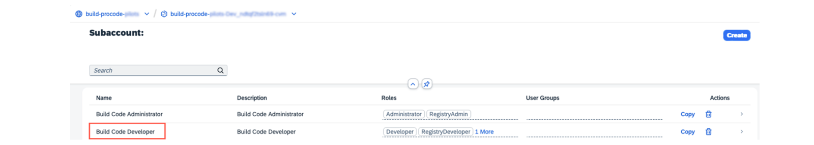

# ♠ 1 [SETTING UP SAP BUILD CODE (WITH A BOOSTER) IN SAP BTP AND CREATING A FIRST PROJECT](link)

> :exclamation: Objectifs
>
> - [ ] Set up SAP Build Code (with a Booster) in SAP BTP and create a first project

## :closed_book: SET UP A BUILD CODE

Pour SAP Build Code, un booster vous guide tout au long du processus de configuration. Les boosters proposent un ensemble d'étapes interactives guidées qui vous permettent de sélectionner, configurer et utiliser des services sur SAP BTP afin d'atteindre un objectif technique spécifique. Pour plus d'informations sur les boosters SAP BTP, consultez la [documentation](https://help.sap.com/docs/BTP/65de2977205c403bbc107264b8eccf4b/fb1b56148f834749a2bf51127421610b.html).

Prérequis : Vous devez accéder à un compte global dans le cockpit SAP BTP (voir [Obtenir un compte global](https://help.sap.com/docs/BTP/65de2977205c403bbc107264b8eccf4b/d61c2819034b48e68145c45c36acba6e.html)).

> Hint
>
> Si vous utilisez déjà SAP Business Application Studio et souhaitez effectuer une mise à niveau vers SAP Build Code, consultez : [Modification des plans de service | Portail d'aide SAP](https://help.sap.com/docs/build_code/d0d8f5bfc3d640478854e6f4e7c7584a/d501fb669447478cbcd07a0b7b7ca4c0.html)

> Note
>
> Il existe un booster pour chaque offre de service SAP Build Code : l'offre standard est destinée à une utilisation productive. Pour les tests et l'évaluation, vous pouvez utiliser l'offre gratuite ou un compte d'essai. Pour plus d'informations sur les offres de service disponibles pour SAP Build Code, consultez la section « [Offres de service](https://help.sap.com/docs/build_code/d0d8f5bfc3d640478854e6f4e7c7584a/c34837eb0d08454a9b4cb6f60dad080d.html) ».

Pour plus d'informations sur le compte d'essai, consultez la section « [Utiliser un compte d'essai](https://help.sap.com/docs/build_code/d0d8f5bfc3d640478854e6f4e7c7584a/72c48e6d438d455cbc181df66ba9af52.html) ».

Selon votre forfait standard, gratuit ou votre compte d'essai, les options disponibles peuvent varier. Si vous utilisez un compte Entreprise avec le forfait standard, vous avez accès à toutes les options. Si vous utilisez le forfait gratuit ou un compte d'essai, certaines options peuvent ne pas être disponibles. Consultez la section « [Forfaits de service](https://help.sap.com/docs/build_code/d0d8f5bfc3d640478854e6f4e7c7584a/c34837eb0d08454a9b4cb6f60dad080d.html) » pour plus d'informations sur les restrictions des comptes d'essai.

> Note
>
> Pour voir si SAP Build Code est disponible dans votre région, recherchez SAP Build Code dans le [Discovery Center](https://help.sap.com/docs/link-disclaimer?site=https%3A%2F%2Fdiscovery-center.cloud.sap%2Findex.html%23%2FserviceCatalog%2Fsap-build-code).

### BENEFITS OF USING A BOOSTER

Le booster de SAP Build Code simplifie le processus de configuration :

- Automatisation des configurations :

  - Création d'un sous-compte sur SAP BTP ;

  - Connexion au fournisseur d'identité de votre choix ;

- Vérification des prérequis :

  - Validation des ressources et autorisations disponibles ;

  - Notification des autorisations ou ressources manquantes ;

- Optimisation de la séquence de configuration :

  - Guidage pas à pas tout au long du processus de configuration ;

  - Affichage des étapes spécifiques à votre configuration ;

  - Prévention des erreurs de configuration grâce à la saisie automatique de valeurs valides ;

- Gain de temps : Réduction significative du temps de configuration ;

- Simplification de l'utilisation :

  - Simplification de la configuration, même pour les utilisateurs ayant peu de connaissances techniques ;

  - Suppression de la configuration manuelle.

En résumé, le booster pour SAP Build Code garantit une configuration rapide, fluide et sans erreur de l'environnement de développement, vous permettant de vous concentrer sur l'essentiel : le développement de vos applications.

Examinons les étapes de plus près.

1. Accédez à votre compte global dans le cockpit SAP BTP et choisissez Boosters dans le volet de navigation

   

2. Recherchez le booster « Démarrez avec SAP Build Code »

   

3. Ouvrez le booster pour voir l’aperçu, les composants et les ressources supplémentaires, puis choisissez Démarrer

   

4. Assurez-vous de respecter toutes les conditions préalables et choisissez Suivant

   

5. À l'étape Sélectionner un scénario, sélectionnez le bouton radio Créer un sous-compte, puis choisissez Suivant

   

6. À l'étape Configurer le sous-compte, définissez le nom de votre sous-compte, votre fournisseur et votre région, puis choisissez Suivant.

   

   > Note
   >
   > Assurez-vous de fournir un nom significatif pour le sous-compte.

7. Ajoutez des utilisateurs et attribuez-leur les rôles appropriés, puis choisissez Suivant

   

8. À l’étape Révision, choisissez Terminer

   

   > Note
   >
   > Le booster crée un droit d'accès au service Cloud Logging, mais ne crée pas d'instance. Une instance est automatiquement créée lors du premier déploiement d'une application.
   >
   > Le service Cloud Logging est inclus uniquement à des fins de développement dans SAP Build Code. Si vous souhaitez utiliser une version productive du service, supprimez-le de la liste dans le booster SAP Build Code et abonnez-vous séparément sans utiliser l'offre de build-code. Voir [Cloud Logging](https://help.sap.com/docs/link-disclaimer?site=https%3A%2F%2Fdiscovery-center.cloud.sap%2Findex.html%23%2FserviceCatalog%2Fcloud-logging%3Fservice_plan%3Doverall-%28large%2C-standard%2C-and-dev%29%26region%3Dall%26commercialModel%3Dcloud%26tab%3Dservice_plan).

9. Après avoir exécuté le booster, dans la fenêtre contextuelle, choisissez Accéder au Subaccount

   

### VERIFY SUBSCRIPTION

1. Dans le volet de navigation, sélectionnez Services → Instances et abonnements

   

2. Assurez-vous d'être abonné à SAP Business Application Studio et SAP Build Code

   

### VERIFY ROLE ASSIGNMENTS

1. Dans le volet de navigation, sélectionnez Sécurité → Collections de rôles

   

2. Rechercher la collection de rôles Administrateur de code de construction

   

3. Ouvrez la collection de rôles et assurez-vous de voir les utilisateurs que vous avez ajoutés dans le booster

   

4. Rechercher la Build Code Developer role collection

   

5. Ouvrez la collection de rôles et assurez-vous de voir les utilisateurs que vous avez ajoutés dans le booster

   

### OPEN THE SAP BUILD LOBBY

1. Dans le volet de navigation, sélectionnez Services → Instances et abonnements.

2. Sous Abonnements, choisissez SAP Build Code.

   

3. Ouverture du SAP Build Lobby

   

### SUMMARY

Dans cette leçon, nous avons exploré les étapes essentielles de la configuration de SAP Build Code, notamment l'utilisation du booster pour simplifier la configuration, la configuration du sous-compte, la définition des rôles pour les utilisateurs et la garantie des droits nécessaires. La session a mis l'accent sur le processus simplifié d'initialisation et de préparation de l'environnement SAP Build Code, établissant ainsi les bases solides d'un développement d'applications efficace et productif dans l'écosystème SAP.

## :closed_book: CREATE AN SAP BUILD CODE PROJECT

[Exercice](https://learning.sap.com/learning-journeys/creating-applications-and-extensions-using-sap-build-code/setting-up-sap-build-code-with-a-booster-in-sap-btp-and-creating-a-first-project)
