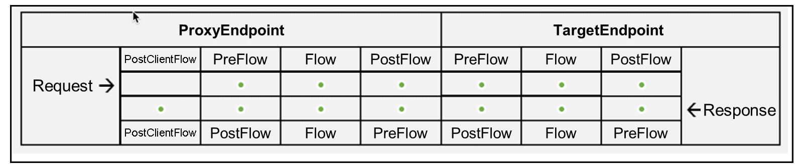
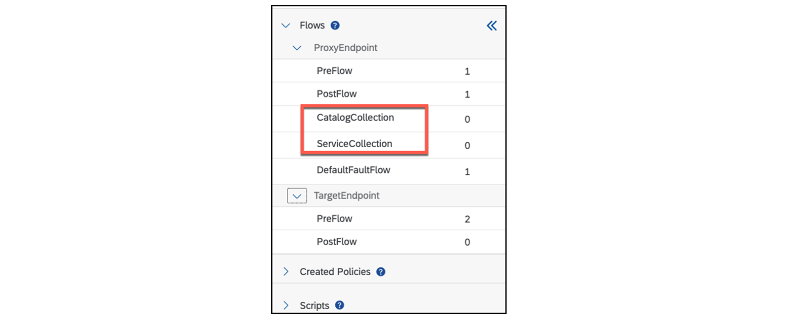
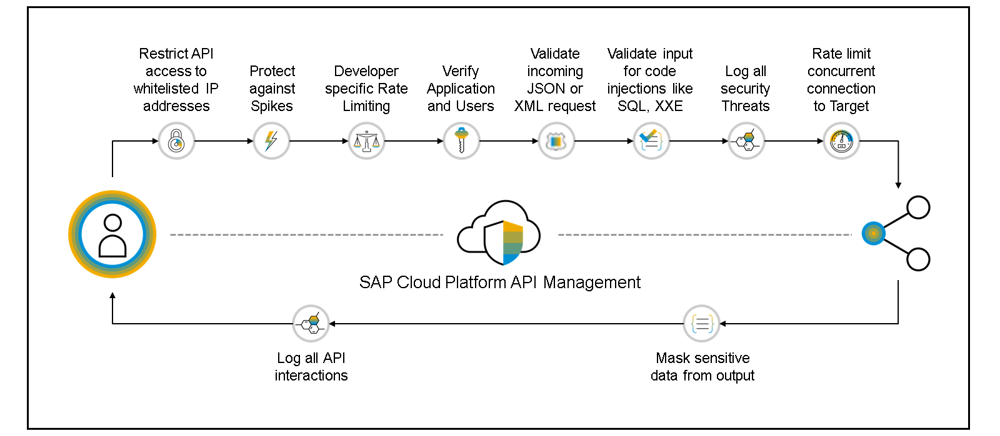
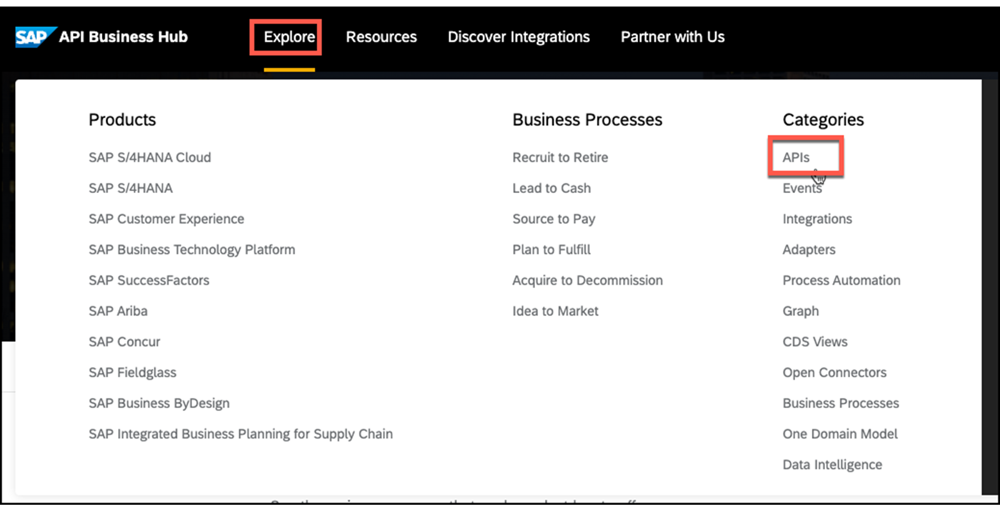
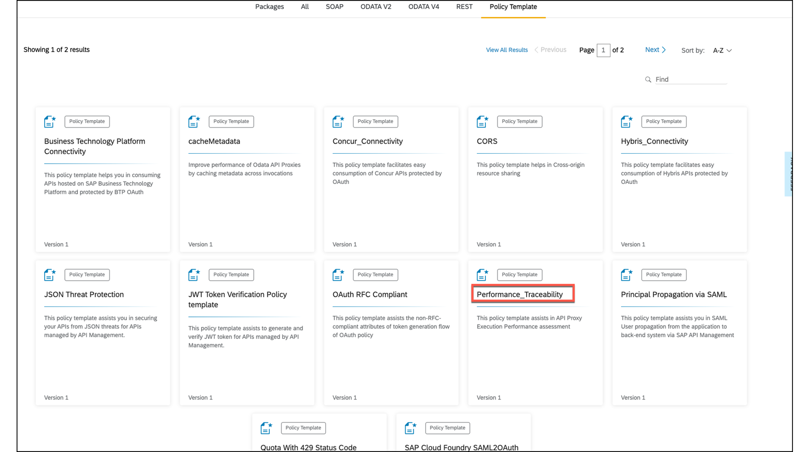
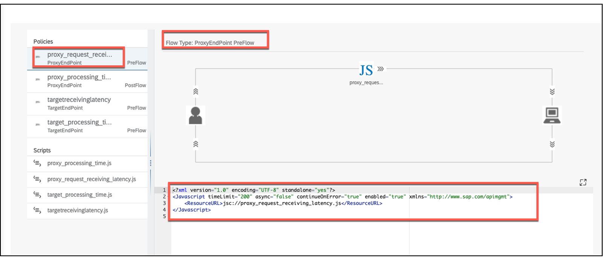
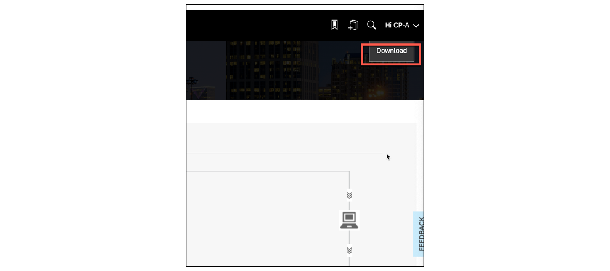
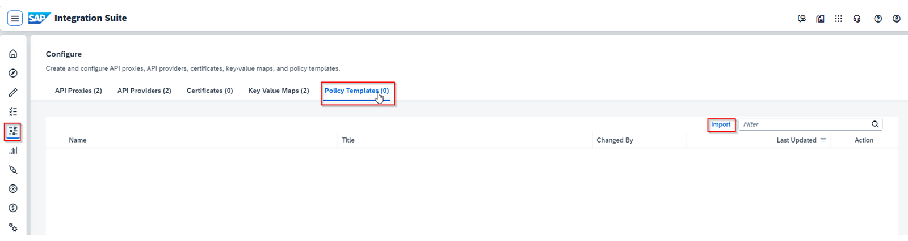
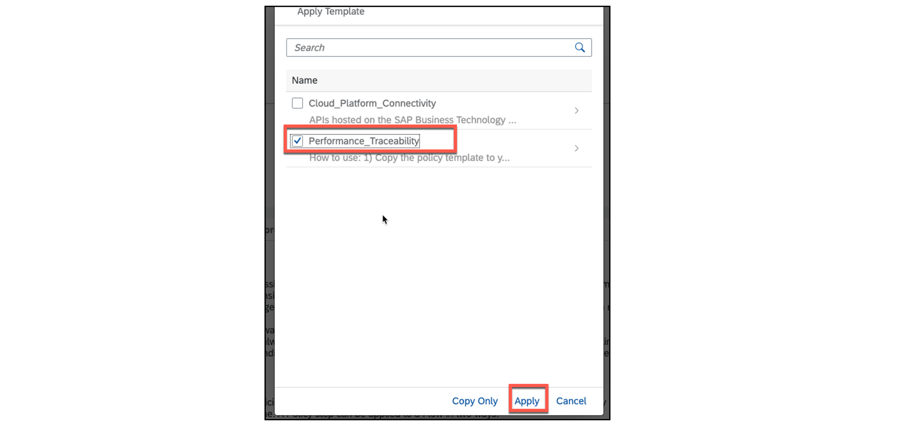
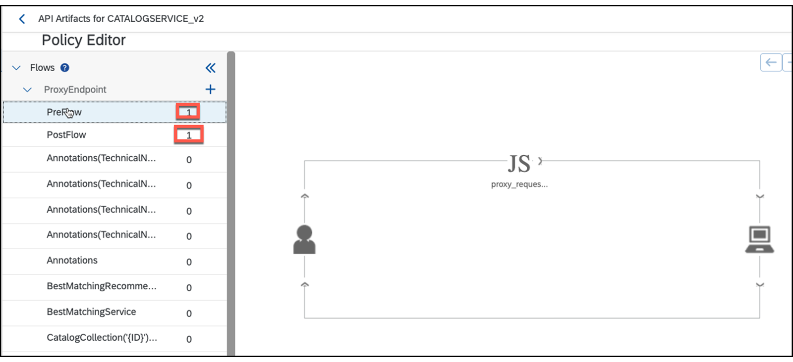

# ♠ 5 [USING POLICIES](https://learning.sap.com/learning-journeys/developing-with-sap-integration-suite/using-policies_cd5fde51-b3d2-40d3-bd71-3f2870c2b51b)

> :exclamation: Objectifs
>
> - [ ] Use policies

## USAGE OF POLICIES

## WHAT ARE POLICICES?

**SAP API Management** offre des fonctionnalités permettant de définir le **behavior** d'une [API](../☼%20UNIT%200%20-%20Lexicon/♠%20API.md) à l'aide de **Policies**.

> #### :bookmark: Policy
>
> Une **Policy** (Stratégie) est un **programme** qui exécute une **fonction spécifique** au moment de l'**exécution**. Ils offrent la flexibilité d'**ajouter** des **fonctionnalités communes** sur une [API](../☼%20UNIT%200%20-%20Lexicon/♠%20API.md) sans avoir à les coder individuellement à chaque fois.
>
> Les **Policies** fournissent des fonctionnalités pour **sécuriser** les [API](../☼%20UNIT%200%20-%20Lexicon/♠%20API.md), **contrôler le trafic** des [API](../☼%20UNIT%200%20-%20Lexicon/♠%20API.md) et **transformer les formats de message**. Vous pouvez également **personnaliser** le **behavior** d'une [API](../☼%20UNIT%200%20-%20Lexicon/♠%20API.md) en ajoutant des **scripts** et en les **attachant aux Policies**.
>
> Vous pouvez appliquer une **Policy** sur le **flux de demande ou de réponse**. Vous pouvez également **spécifier** si cela est applicable sur le **proxy endpoint**[^1] ou sur le **target endpoint**[^2].

Pour plus d’informations sur les types de **Policies** prises en charge par API Management, consultez [Policy Types](https://help.sap.com/docs/SAP_CLOUD_PLATFORM_API_MANAGEMENT/66d066d903c2473f81ec33acfe2ccdb4/c918e2803dfd4fc487e86d0875e8462c.html?locale=en-US).

### YOU CAN USE THE FOLLOWING TYPES OF POLICIES:

- _Predefined policy templates_ at **SAP Business Accelerator Hub**

- _Pre-built policies_ within the **Policy Editor**

### POLICY TYPES

Voici la liste des **pre-built policies** prises en charge par **API Management** :

- _Access Control_

- _Access Entity_

- _Assign Message_

- _Basic Authentication_

- _Extract variables_

- _Invalidate Cache_

- _JavaScript_

- _JSON to XML_

- _Key Value Map Operations_

- _Lookup Cache_

- _Message Logging Policy_

- _OAuth v2.0_

- _OAuth v2.0 GET_

- _OAuth v2.0 SET_

- _Populate Cache_

- _Python Script_

- _Quota_

- _Raise Fault_

- _Reset Quota_

- _Service Callout_

- _Spike Arrest_

- _SAML Assertion Policy_

- _SOAP Message Validation Policy_

- _Verify API Key_

- _XML to JSON_

- _XSL Transform_

- _XML Threat Protection_

- _Regular Expression Protection_

- _JSON Threat Protection_

- _Response Cache_

- _Statistics Collector Policy_

En savoir plus ici : [Types de Policies](https://help.sap.com/docs/SAP_CLOUD_PLATFORM_API_MANAGEMENT/66d066d903c2473f81ec33acfe2ccdb4/c918e2803dfd4fc487e86d0875e8462c.html?locale=en-US)

### APPLY PRE-BUILT POLICIES USING THE POLICY DESIGNER

Pour utiliser l’une des **Policies** disponibles, il faut d’abord déterminer où la **Policy** fonctionnera. Le **policy editor** propose les options suivantes dans la **request** et la **response** :

Les Policies peuvent également être utilisées pour tous les **calls** (**PostClientFlows**, **ressources**), vous ne sélectionnez alors pas de **PostClientFlow**.
Dans l'exemple suivant, il existe deux **PostClientFlows** _CatalogCollection_ et _ServiceCollection_. Les **Policies** sont utilisées pour tous les **PostClientFlows** car aucune n'a été spécialement sélectionnée.

### SECURITY - POLICIES

**SAP BTP**, **API Management** propose de nombreuses **out-of-the-box API security policies** prêtes à l'emploi basées sur l'**Open Web Application Security Project** (OWASP). Les **best practices de sécurité** des [API](../☼%20UNIT%200%20-%20Lexicon/♠%20API.md) peuvent être **personnalisées** en fonction des besoins de votre entreprise.

Il existe une série de blogs qui présente les **Policies** de sécurité de **SAP BTP**, **API Management** pour sécuriser et protéger les [API](../☼%20UNIT%200%20-%20Lexicon/♠%20API.md) d'entreprise, comme le montre la figure suivante, **SAP Cloud Platform API Management**.

Vous trouverez la série de blogs ici : SAP Cloud Platform API Management – [​​Série de blogs sur les meilleures pratiques de sécurité des API](https://blogs.sap.com/2017/08/22/sap-cloud-platform-api-management-api-security-best-practices/)

### LOGGING AND MONITORING POLICIES

La **Policy Message Logging** vous permet d'envoyer des [Messages Syslog](../☼%20UNIT%200%20-%20Lexicon/♠%20Messages%20Syslog.md) à des **third-party log management services** (services de gestion de journaux tiers), tels que **Splunk**, **SumoLogic**, **Loggly** ou des services de gestion de journaux similaires.

Un blog présentant la Message Logging Policy et **Splunk** peut être trouvé ici :
[Splunk – Partie 1 : Journalisation et surveillance SAP APIM | Blogues SAP](https://blogs.sap.com/2020/05/12/splunk-part-1-sap-apim-logging-monitoring/)

Un blog avec la Message Logging Policy et **Loggly** peut être trouvé ici :
[Partie 7 – Meilleures pratiques de sécurité des API – Consigner toutes les interactions API | Blogues SAP](https://blogs.sap.com/2017/08/21/sap-cloud-platform-api-management-log-all-api-interactions/)

### USE PREDEFINED POLICIES

Il existe des **predefined sets of policies** pour des **specific applications**. Ils peuvent être trouvés dans le **SAP Business Accelerator Hub**.

Accédez à https://api.sap.com/ : [Explore] → [API].

Sous l'onglet **Policy Template** [SAP Business Accelerator Hub](https://api.sap.com/content-type/API/apis/policytemplate), vous trouverez **20 policy templates** pour une utilisation immédiate.

### IMPORT A POLICY TEMPLATE FRON SAP BUSINESS ACCELERATOR HUB

Recherchez et trouvez le _Performance_Traceability policy template_ sur [SAP Business Accelerator Hub](https://api.sap.com/content-type/API/apis/policytemplate). Choisissez la _tile Performance_Traceability_. Vous trouverez le contenu dans le **Flow Type**.

### THE FOLLOWING IS AN EXAMPLE WITH THESE TWO ITEMS:

- *Flow Type* : ProxyEndPoint PreFlow

- _Content_ : JavaScript file

Pour télécharger les **Policies** complètes, choisissez le bouton [Download] dans le coin supérieur droit et enregistrez le fichier \*.zip localement sur votre ordinateur.

Basculez vers la vue [Develop] et choisissez l’onglet [Policy Templates].

Ensuite, importez le _stored policy template_ précédent stocké localement via le bouton [Import] .

À la fin, le modèle _Performance_Traceability_ est désormais importé dans **SAP Business Accelerator Hub**.

Pour placer le **policy template**, accédez à l'[API](../☼%20UNIT%200%20-%20Lexicon/♠%20API.md) dans laquelle vous souhaitez utiliser la **Policy**, puis accédez au **Policy Editor**. Choisissez [Edit] pour que le bouton [Policy Template] devienne actif.

Maintenant, choisissez le bouton [Apply] pour importer le **policy template**. Sélectionnez ensuite le **policy template** précédemment importé et choisissez [Apply].

Le **policy template** a été importé et inséré dans le flux correspondant.

Après la **mise à jour**, l'**enregistrement** et le **redéploiement**, le **policy template** est actif.

### SUMMARY

> **SAP API Management** offre des fonctionnalités permettant de **définir** le comportement d'une [API](../☼%20UNIT%200%20-%20Lexicon/♠%20API.md) à l'aide de **Policies**. Ces capacités peuvent être utilisées à la fois dans la **request** et dans la **response**. Il existe des **Policies** pour la transformation du **payload** et des **appels externes**, par exemple pour se connecter à l'aide d'**OAuth 2.0** et bien plus encore. En particulier, les **Policies de sécurité** sont utiles. SAP propose **federal of policies and policy templates** pour certains cas d'utilisation. Ils peuvent être facilement importés.

## ADD POLICITES FOR BASIC AUTHENTICATION AGAINST THE ES5 DEMO SYSTEM

[Exercices](https://learning.sap.com/learning-journeys/developing-with-sap-integration-suite/using-policies_cd5fde51-b3d2-40d3-bd71-3f2870c2b51b)

---

[^1]: Un Proxy Endpoint dans le contexte de SAP Cloud Platform Integration (CPI) fait référence à un point d'entrée d'API qui permet de recevoir les requêtes externes (de clients ou d'autres systèmes) et de les acheminer vers des processus d'intégration en arrière-plan. C'est essentiellement une interface d'API exposée qui agit comme un intermédiaire entre le client et les services internes ou les systèmes backend.
[^2]: Un Target Endpoint dans le contexte de SAP Cloud Platform Integration (CPI) fait référence à un point de sortie ou un point d'accès vers un service backend auquel une requête est dirigée après avoir été traitée par le Proxy Endpoint.
