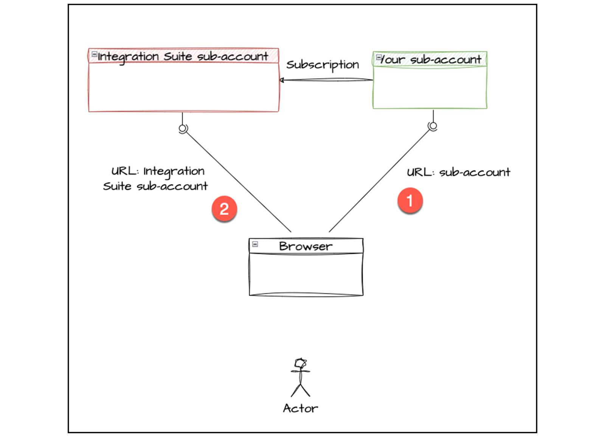
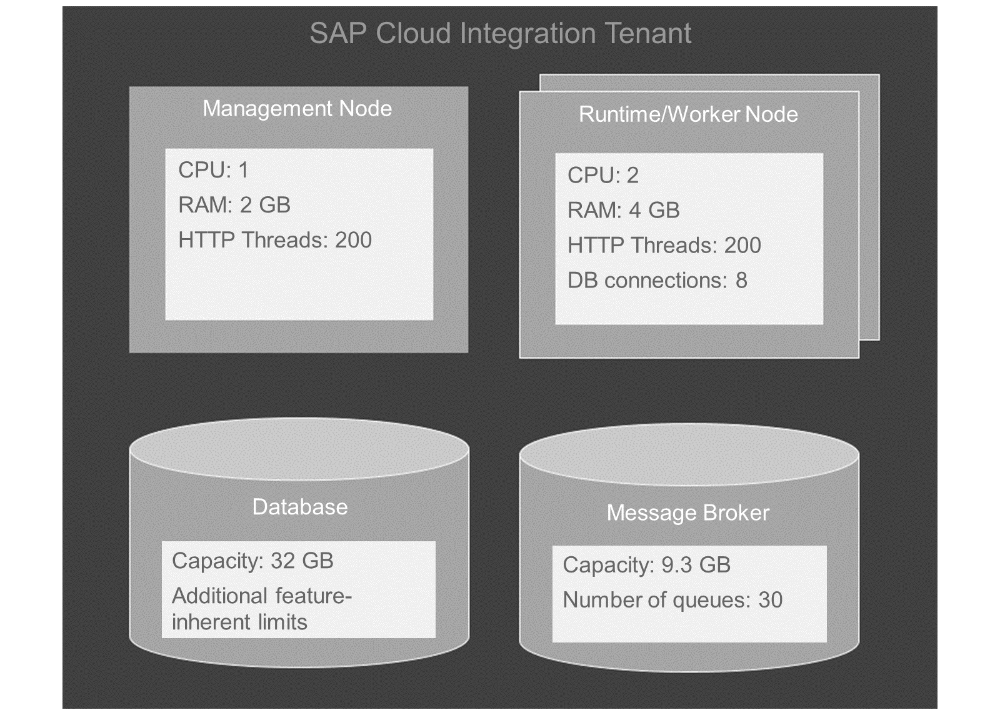
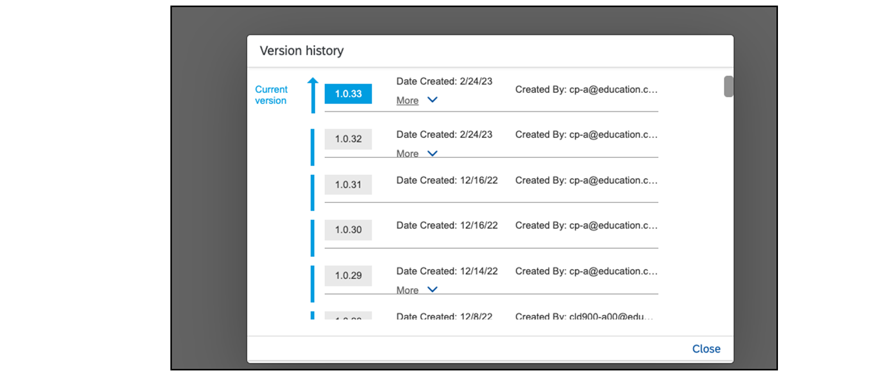
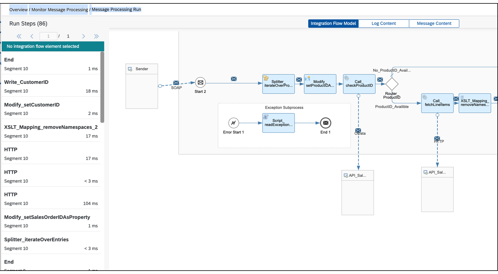
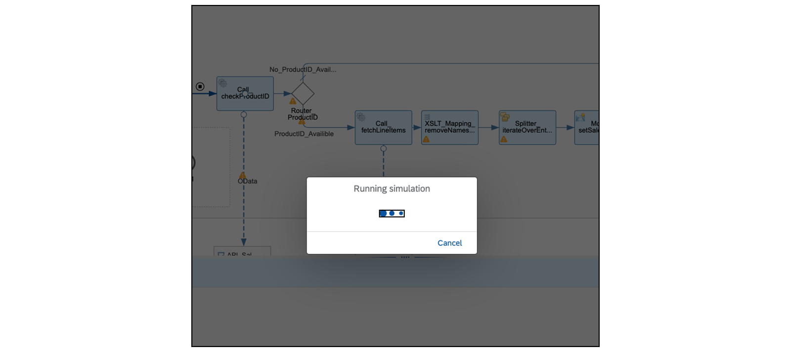
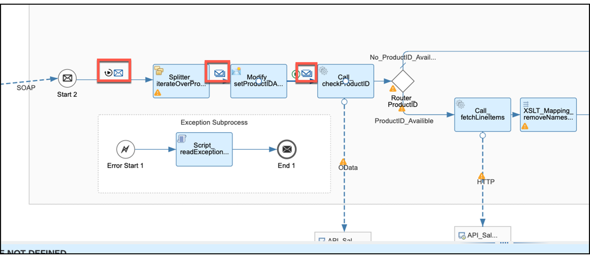

# ♠ 2 [INTRODUCING THE DEVELOPMENT CYCLE](https://learning.sap.com/learning-journeys/developing-with-sap-integration-suite/explaining-the-development-cycle_c8db2014-b9e1-4e16-9df3-cbce5688c1b6)

> :exclamation: Objectifs
>
> - [ ] Explain the development cycle

## THE DEVELOPMENT CYCLE

### DEVELOPMENT WITH CLOUD INTEGRATION

Le **Cloud integration** est un **subscription service** (abonnement), ce qui signifie que le **graphical modeling** et le **traitement des étapes du processus**, entre autres, se produisent sur le **subaccount** sur lequel vous vous êtes inscrit au **service**. Les **subaccounts** du **consumer** et du **provider** sont situés dans la même **région**, par exemple _eu10_ (Francfort), et la communication s'effectue directement via le **browser**. Par conséquent, tout le contenu affiché dans le **browser** est fourni sous forme de **HTML data stream** (flux de données HTML).

Les **URL** des différents niveaux sont fournies ci-dessous et, dans tous les cas, nous sommes situés dans la région _eu10_. L'**URL** du _Cloud integration_ commence par le **subdomain** de votre **subaccount**, suivi du **domain** spécifique et du chemin de contexte :

- _URL de vos subaccounts_ (N°1) : https://emea.cockpit.btp.cloud.sap

- _URL de la Suite d'Intégration_ (N°2) : https://.integrationsuite.cfapps.eu10-003.hana.ondemand.com/shell/home

- _URL du Cloud integration_ (n°2) : https://.integrationsuite.cfapps.eu10-003.hana.ondemand.com/shell/design

Lorsque vous travaillez, cela signifie :

- Toutes les _fonctionnalités disponibles_ sont utilisées via le **browser**.

- Le _browser_ décide de la **présentation**. C'est pourquoi SAP recommande le dernier **browser Chrome**.

- Le _browser_ définit des **délais d'attente**.

- En cas de _mauvaise connexion network_, les **délais** de réponse peuvent être plus longs.

- Vous pouvez travailler avec n'importe quel appareil à condition que l'**écran soit suffisamment grand**, qu'un **browser Chrome mis à jour soit disponible** et qu'il existe une **connexion Internet suffisante**.

Vous avez besoin au moins de la **collection de rôles PI_Integration_Developer**.

### TECHNICAL IMPLEMENTATION

Comme mentionné au début, le **core** du système est le **Camel integration framework**. SAP améliore le **Camel framework** avec un **client graphique** et diverses **fonctionnalités de sécurité**. L'implémentation complète est une **application Java** et comprend les composants suivants :

Le premier composant (n°1) est votre **browser**, qui accède à l'**implémentation** via l'**URL du Cloud integration** pour _créer_ et _gérer_ le **flux d'intégration**.

Le deuxième composant (n°2), est l'**interface graphique**.

Une fois le **flux d'intégration** créé, s'il est déployé en tant qu'**application Java** sur le **runtime** (**Cloud Foundry**, **Kyma**),

(n°4) les **messages** peuvent être transmis à l'aide du **sender component** (n°3), et reçus à l'aide du **receiver component**. (N°5).

Un **load balancer** (équilibreur de charge) (**IP5**) est connecté au **sender input** (n°3) et, fait intéressant, il ne va pas directement au **runtime**.

### RESOURCES ON A TENANT

Les ressources pour une mise en œuvre d'une **Cloud integration** sont limitées.

### DEVELOPEMENT CYCLE FOR CREATING INTEGRATION FLOW

Dans les exercices associés, nous suivons le principe de construction d'un **flux d’insertion professionnelle**.

### TO CREATE A DEVELOPEMENT CYCLE, THE FOLLOWING STEPS MUST BE CARRIED OUT IN ORDER:

- Comprenez votre _use case_.

- _Configurez_ le **subaccount SAP BTP** et **Integration Suite**.

- _Recherchez_ la _liste des API requises_ avec toutes ses _métadonnées_, telles que les informations d'identification, les en-têtes, etc.

- _Commencez_ dans le **Cloud integration** avec un _modèle vide_.

- _Modéliser_ vos _processus_.

- _Construisez_ le _flux d’intégration_ petit à petit.

- Répétez les étapes.

- Qu'est-ce qui vient ensuite ?

Voici les explications des étapes :

#### :small_red_triangle_down: **Understand your use case** :

En collaboration avec les [artefacts](../☼%20UNIT%200%20-%20Lexicon/♠%20Artefacts.md), le _use case_ est analysé en profondeur et la **SAP Integration Solution Advisory Methodology** est appliquée pour répondre à toutes les exigences.

#### :small_red_triangle_down: **Configure the SAP BTP Subaccount and the Integration Suite** :

L'étape suivante consiste à fournir aux développeurs d'intégration les relevant **role collections**, leur permettant de travailler sur la suite d'intégration appropriée. Ceci est coordonné avec les **administrateurs**.

#### :small_red_triangle_down: **Find the list of required API with all its Metada, such as credentials, headers and more** :

Si toutes les [API](../☼%20UNIT%200%20-%20Lexicon/♠%20API.md) sont répertoriées dans une **API Business Hub Enterprise**, vous avez de la chance et le travail d'obtention de l'**URL** et des paramètres nécessaires est terminé. Cependant, dans le cas contraire, vous pouvez prévoir suffisamment de temps pour **obtenir ces données** et **tester les interfaces**.

#### :small_red_triangle_down: **Start in the Cloud Integration with an empty template** :

Créez un **package** avec un **nom significatif**. Voici une proposition de conventions de nom : [Conventions de dénomination](https://help.sap.com/docs/CLOUD_INTEGRATION/368c481cd6954bdfa5d0435479fd4eaf/7c00e9bf1d0e41d99e4ba5d770e9bd4a.html?locale=en-US&q=Naming%20Conventions).

Pour commencer, sélectionnez l'[artefact](../☼%20UNIT%200%20-%20Lexicon/♠%20Artefacts.md) du **flux d'intégration** et un _modèle vide_ sera créé automatiquement. Si un **message entrant** est nécessaire, il peut être simulé à l'aide d'un **Timer event** pour démarrer et d'un **Content Modifier** pour **simuler le message**. Cette approche facilite des cycles de développement plus rapides et plus faciles.

#### :small_red_triangle_down: **Modeling your processes** :

Il peut être difficile d'établir des **critères clairs** pour le développement de processus. Parfois, un processus peut paraître simple au départ, mais il peut ensuite être décomposé en plusieurs processus individuels. Il est important de considérer que le processus devra à l’avenir être compris par le personnel spécialisé. Dans les exercices de cette formation, nous nous concentrons sur la mise en œuvre d'un processus. Cependant, il est possible d'externaliser les **API calls** (_outsource API calls_) vers des **processus distincts** avec leur propre **error handling**.

#### :small_red_triangle_down: **Build the integration FLow bit by piece** :

Il existe **différentes manières de développer des flux d'intégration** en fonction du _use case_.

Pour l’exercice pratique, il est recommandé de commencer par les **API calls**.

Une fois les connexions établies, il devient plus facile de déterminer l’**entrée** et la **sortie** requises. Contrairement à **XI** ou **PI** avec son protocole de message XI, il n'existe pas de format interne dans le **Cloud integration**. Il est donc **important de considérer les formats internes et les transformations nécessaires**.

La **section d'aide** de chaque composant du flux d'intégration peut être utilisée pour trouver les configurations appropriées. Ce processus est également démontré dans les exercices. Après avoir configuré un composant, il est essentiel de **déboguer** et de vérifier que le résultat répond à nos attentes. Généralement, il existe **deux façons de tester** notre flux d'intégration.

Ce sont :

- _Simulation des flux d'intégration_

- _Testez avec un déploiement et un débogage réels_. Cette approche est utilisée dans les exercices.

Les deux sujets sont ensuite examinés plus en détail.

#### :small_red_triangle_down: **What come next?**

La première étape consiste à **tester le processus**, et diverses **procédures de test** sont décrites en détail ultérieurement.

Une fois les **tests réussis**, le flux d'intégration est transporté vers les **subaccounts de production**. Un **monitoring continue du traitement ou de la mise en œuvre de la gestion des alertes** pour répondre aux **événements imprévus** relève de la **responsabilité des administrateurs**, et ne sera pas abordée séparément ici.

### VERSIONING OF YOUR INTEGRATION FLOWS

Il est important d'**Iterate through the steps** (de versionner périodiquement l’état de développement) pour permettre la possibilité de **reverting back** si nécessaire.

### PROCEDURE TO VERSION INTEGRATION FLOW:

- _Commencez_ par votre **editable integration flow**.

- _Choisissez_ le bouton [Save as version] en haut à droite.

- _Entrez_ un _meaningful comment_.

Cette approche est utilisée dans les exercices.

### PROCEDURE TO SWITCH TO FORMER VERSION:

- _Commencez_ par votre **package**.

- _Marquez_ votre [artefact](../☼%20UNIT%200%20-%20Lexicon/♠%20Artefacts.md) (flux d'intégration) dans la liste des [available artifacts].

- _Accédez_ à la colonne [Version].

- _Choisissez_ le version [number].

- _Choisissez_ une [former version].

- _Choisissez_ le _symbole_ pour revenir à l'ancienne version.

### DEVELOPER TEST WITH REAL DEPLOYMENT AND DEBUGGING OF YOUR INTEGRATION FLOW

Avant d'examiner l'**integration flow**, il doit être **déployé** dans le **monitoring environment**.

Le **graphical model** est converti en **Java application** et placé dans le **runtime**, permettant de démarrer l'integration flow. Si le déploiement réussit, l'integration flow s'exécutera immédiatement si un **timer event** est utilisé ou attendra un **incoming message**. Le **Cloud integration** offre un **trace log level** qui fournit un _aperçu du traitement_ de chaque _composant_ de l'integration flow.

### TO PERFORM A DEVELOPER TEST, THE FOLLOWING STEPS MUST BE CARRIED OUT IN ORDER:

- _Start_ at your _integration flow_.

- _Choose_ the [Deploy] button.

- _Choose_ a [spot] in the white space outside the **integration flow swim lane**.

- _Choose_ the [Deployment Status] in the **Integration Flow configuration area**.

- If your integration flow is _successful deployed_, you will see a [Navigate to Manage Integration Content link].

- _Choose_ this [link] to jump to [Monitor Artifacts] → [Overview] → [Manage Integration Content].

- _Change_ the **log level** to [trace].

- _Deploy again_ if you use a **timer starting event**. Otherwise, _send_ a **message** to the **endpoint**.

- If you _deploy again_, come back to [Monitor Artifacts] → [Overview] → [Manage Integration Content].

- Here, _choose_ the [Monitor Message Processing link].

- In the [new window], _choose_ [Monitor Artifacts] → [Overview] → [Monitor Message Processing]. Choose the _last message_ on the _message list_ and choose it.

- _Choose_ the [Trace link] to jump directly to [Monitor Artifacts] → [Overview] → [Monitor Message Processing] → [Message Processing Run].

- _Explore_ the _trace_ of your flow.

Cette approche est utilisée dans les exercices.

### DEVELOPER TEST WITH SIMULATIONS OF YOUR INTEGRATION FLOW AND COMPONENTS

La **simulation de parties individuelles** ou de **l'intégralité** de l'**integration flow** peut être utile pour **vérifier** si les **valeurs** sont **correctly set** (correctement définies) dans un **content modifier** (modificateur de contenu) ou si un **script** ou un **mappage** est **exécuté** comme prévu. Cependant, tous les **integration flow components ne sont pas pris en charge** (supported) pour la simulation.

Voici la _liste des composants_ de l'**integration flow** pris en charge : [Simulation d'un flux d'intégration](https://help.sap.com/docs/CLOUD_INTEGRATION/368c481cd6954bdfa5d0435479fd4eaf/2e2210b6db0c4fdb937b3a57d952f582.html?locale=en-US)

### EXAMPLE

Dans _DeDelayedDelivery_Process_, nous voulons vérifier via une simulation si le [ProductID] est correctement défini dans _Modify_setProductIDAsProperty_.

### TO PERFORM DEVELOPER TESTS WITH SIMULATIONS, THE FOLLOWING STEPS MUST BE CARRIED OUR IN ORDER:

- _Choose_ a place on the line in front of the _Splitter_iterateOverProducts component_.

- _Set_ the _starting point_ via the **context menu**.

- _Add_ the _input message_ as a _payload_ (content).

- _Choose_ the _line_ after the _Modify_setProductIDAsProperty component_.

- _Set_ the _end point_ of the simulation.

- The simulation navigation bar is now [active].

- _Start_ the simulation with the [Start] button of the [navigation bar].

- _Choose_ all _envelopes_ between the _start point_ and the _endpoint_ to explore the _results_.

- _After_ the testing, _choose_ the [Clear] button of the [navigation bar].

### SUMMARY

> Le **processus de création** d'un **integration flow** implique l'utilisation d'un **graphical editor** dans l'application du **remote Cloud integration**.
>
> Des **simulations** peuvent être effectuées sur des **parties individuelles** ou sur l'**ensemble de l'integration flow** pour **vérifier** que les **valeurs** sont **correctly set** dans les **content modifiers**, les **scripts** ou les **mappages**.
>
> Une fois l'integration flow terminé, il est **versionné** et **déployé**, ce qui entraîne la **création** et le **déploiement** d'une **application Java** dans un **runtime** (environnement d'exécution).
>
> L'**integration flow** peut ensuite être **exécuté**.
>
> Le processus de développement peut être abordé sous **forme de cycles**, dans lesquels le **placement** et la **configuration** des **composants**, le **débogage** à l'aide des **trace log level**s (niveaux de journalisation de trace) et les **tests** sont répétés jusqu'à ce que le résultat souhaité soit obtenu.

## CREATE AN INTEGRATION PACKAGE AND INTEGRATION FLOW

[Exercices](https://learning.sap.com/learning-journeys/developing-with-sap-integration-suite/explaining-the-development-cycle_c8db2014-b9e1-4e16-9df3-cbce5688c1b6)
