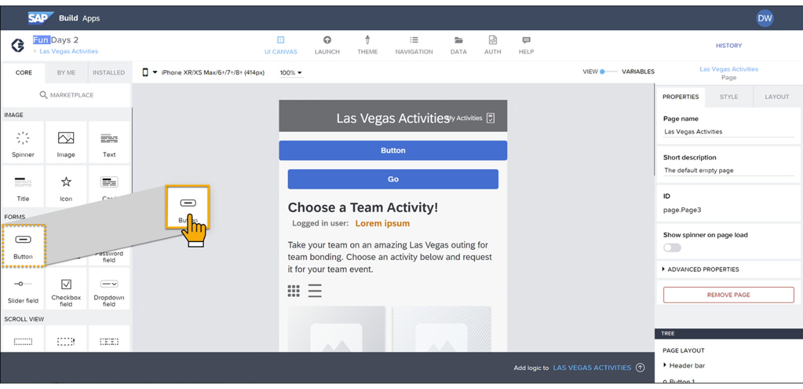

# ♠ 1 [EXPLAINING SAP BUILD APPS](https://learning.sap.com/learning-journeys/develop-apps-with-sap-build-apps-using-drag-and-drop-simplicity/explaining-sap-build-apps-_a111bd77-7cbd-49fc-a412-63f6b8d9b8b6)

> :exclamation: Objectifs
>
> - [ ] Discuss the uses for SAP Build Apps.
>
> - [ ] Describe the key features of SAP Build Apps.

## :closed_book: USES OF SAP BUILD APPS

SAP Build Apps (anciennement SAP AppGyver) est une solution de développement visuel permettant de créer des applications d'entreprise sans code. Elle vous permet de :

- Créer des applications par glisser-déposer de composants prédéfinis, puis de les configurer selon vos besoins ;

- Se connecter à toutes les formes de données back-end, telles que les services REST et OData, y compris les systèmes SAP, via un formulaire simple, puis afficher ou utiliser les données pour des calculs ;

- Créer une logique applicative, également par glisser-déposer de fonctions de flux et leur configuration. La logique vous permet d'indiquer à l'application ce qu'elle doit faire en réponse aux événements utilisateur ou applicatifs.

## :closed_book: KEY FEATURES OF SAP BUILD APPS

En plus des principales fonctionnalités de création d'applications, il existe de nombreuses fonctionnalités qui facilitent la création d'extensions SAP et d'autres applications liées à SAP :

#### :small_red_triangle_down: SAP BTP Authentication :

Vous pouvez rendre obligatoire l'authentification des utilisateurs auprès de SAP BTP avant d'utiliser l'application. Cette authentification est requise pour de nombreuses autres fonctionnalités, comme le référencement des destinations SAP BTP.

#### :small_red_triangle_down: Destinations :

Les destinations sont des connexions aux systèmes back-end, souvent des systèmes SAP, définies dans SAP BTP pour être utilisées par les services SAP BTP. SAP Build Apps connaît les destinations définies dans le cockpit SAP BTP et peut créer des ressources de données (c'est-à-dire des connexions aux systèmes back-end) basées sur ces destinations. [SAP Systems](https://help.sap.com/docs/build-apps/service-guide/sap-systems) décrit comment configurer des destinations pour SAP Build Apps.

#### :small_red_triangle_down: Déploiement sur SAP BTP :

SAP Build Apps vous permet de déployer votre application sur SAP BTP. SAP Build Apps vous permet de créer votre projet dans un fichier MTAR, un fichier d'application reconnu par l'environnement Cloud Foundry de SAP BTP, puis de l'envoyer pour déploiement dans SAP BTP.

### MORE ADVANCES FEATURES

SAP Build Apps dispose également de fonctionnalités plus sophistiquées permettant aux utilisateurs professionnels et aux développeurs plus avancés de tirer le meilleur parti de la plateforme.

<video width="640" height="360" controls>
  <source src="./RESSOURCES/Explaining_SAP_Build_Apps.mp4" type="video/mp4">
  Votre navigateur ne supporte pas la vidéo.
</video>
