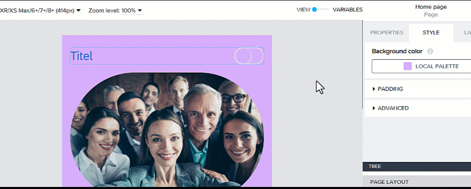
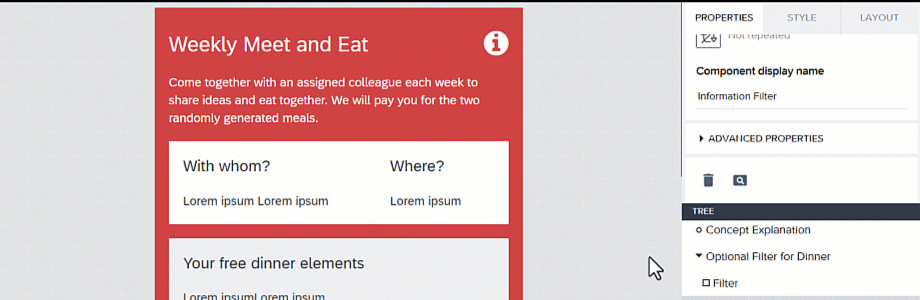

# ♠ 1 [USING PROPERTIES](https://learning.sap.com/learning-journeys/develop-apps-with-sap-build-apps-using-drag-and-drop-simplicity/using-properties_b8b8a508-77a7-4db8-b379-fb3435a0565b)

> :exclamation: Objectifs
>
> - [ ] Describe properties fundamentals and bindings.
>
> - [ ] Explain advanced properties.
>
> - [ ] Explain the repeating components function.

## :closed_book: PROPERTIES

Pour garantir que l'interface utilisateur d'une application soit adaptée à ses exigences en termes de contexte, d'apparence dynamique et de fonctionnalités, les propriétés des composants sont particulièrement avantageuses. Les paramètres des propriétés varient selon le composant choisi et permettent un ajustement facile des composants de l'interface utilisateur.

Les propriétés des composants actuellement sélectionnés s'affichent dans le panneau Propriétés à droite. La propriété par défaut est définie en fonction du composant. Pour les valeurs de propriétés statiques, vous pouvez également les ajouter directement dans le panneau Propriétés. Les propriétés des composants peuvent être liées à l'aide de la liaison placée devant la valeur d'une propriété.

## :closed_book: BINDINGS

Les composants possèdent des propriétés qui peuvent être liées à des valeurs statiques, des variables, des formules et d'autres propriétés. Cela permet d'utiliser un même composant de différentes manières et de l'adapter à vos besoins. Par exemple, si un composant texte est sélectionné, il suffit de lui attribuer un nom statique, ce qui sera la méthode par défaut. Vous pouvez également lier une variable de données à un composant d'interface utilisateur pour afficher les données.

Cependant, il existe de nombreuses autres façons de rendre le contenu dynamique. Dans ce cas, une connexion peut être utilisée, par exemple, pour afficher un texte ou un nom adapté à l'utilisateur à partir d'une variable qui lui est attribuée, ou encore l'heure et la date, etc. Les possibilités sont illimitées et sont rendues possibles par les différents types de liaisons sélectionnables dans les propriétés de chaque composant.

## :closed_book: ADVANCED PROPERTIES

Dans les Propriétés avancées, vous trouverez un champ pour le nom d'affichage du composant, ce qui vous permet de personnaliser le nom du composant dans le canevas et l'arborescence. Donner des noms personnalisés aux composants peut s'avérer très utile pour travailler avec des mises en page plus complexes et un plus grand nombre de composants.

Le paramètre de propriétés « Visible » est également très utile pour contrôler dynamiquement la visibilité des composants et du contenu dont les utilisateurs ont besoin. La propriété « Visible » peut être liée à l'aide de la liaison, ce qui permet un contrôle dynamique de la visibilité des composants.

> Note
>
> Si vous définissez la visibilité par défaut sur faux, vous devez utiliser l'arborescence pour sélectionner à nouveau le composant.

## :closed_book: REPEATING COMPONENTS

Une option importante et utile pour SAP Build Apps est la fonction Répéter avec dans les propriétés pour créer des composants automatiquement et dynamiquement avec une liaison simple.

Pour cela, vous avez besoin d'une source pour une liste d'objets. Le composant sera ensuite répété pour chaque élément de la liste. Cette fonction est fréquemment utilisée pour les composants de liste en particulier. Cependant, ce paramètre de propriété peut être appliqué à tous les composants disponibles.

## :closed_book: SET THE PROPERTIES OF THE COMPONENTS

### BUSINESS SCENARIO

Ajustez les propriétés des composants et des pages une fois les composants intégrés.

### EXERCISE OPTIONS

Pour démarrer l'exercice, sélectionnez « Démarrer l'exercice » dans la figure ci-dessous.

Une fenêtre contextuelle s'ouvre. Vous disposez des options suivantes :

- Démarrer : la simulation démarre. Suivez la simulation pour apprendre à définir les propriétés des composants.

- Ouvrir le document PDF : un PDF s'ouvre. En suivant les étapes décrites dans ce document, vous pouvez réaliser les exercices dans votre propre environnement système.

[Link Exercise](https://learnsap.enable-now.cloud.sap/pub/mmcp/index.html?show=project!PR_548133F0C06E96A3:uebung)
