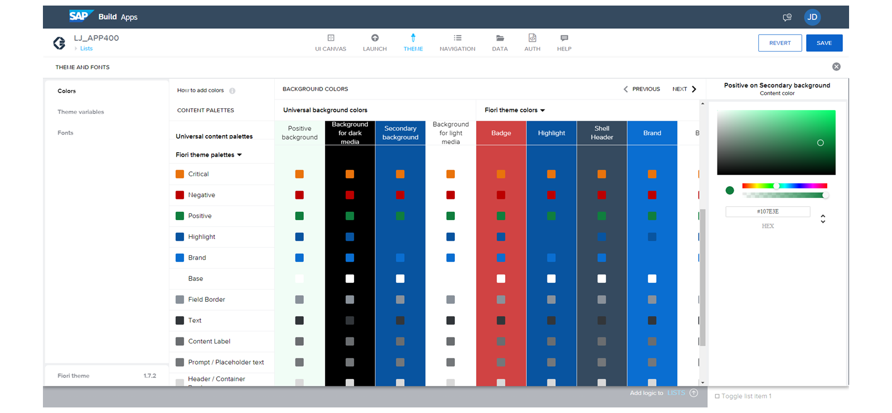
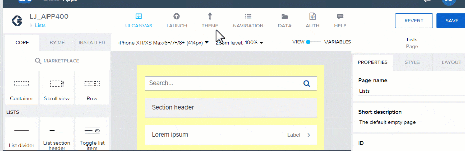
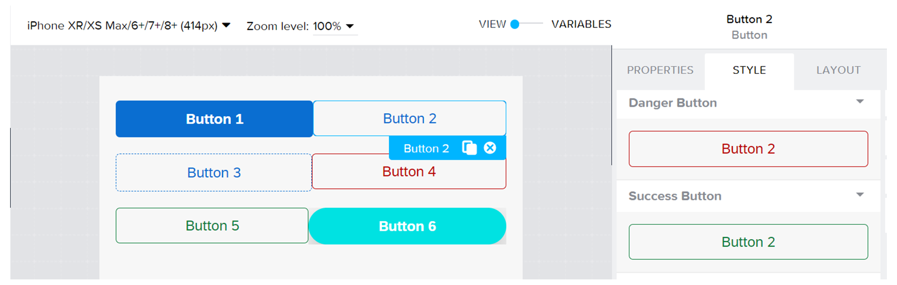
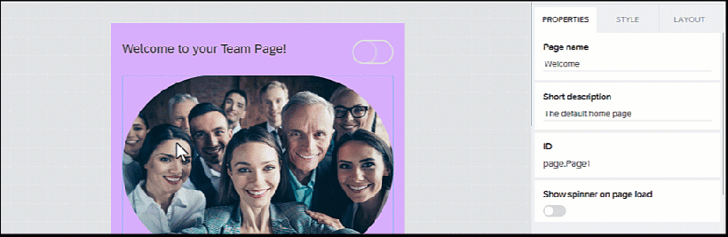

# ♠ 1 [APPLYING STYLE AND LAYOUTING](lhttps://learning.sap.com/learning-journeys/develop-apps-with-sap-build-apps-using-drag-and-drop-simplicity/applying-style-and-layouting_f9f1bab9-dd45-4972-b4cf-38102bcd500aink)

> :exclamation: Objectifs
>
> - [ ] Use themes.
>
> - [ ] Design the style in SAP Build Apps.
>
> - [ ] Perform advanced layouting.

## :closed_book: THEMES

Avec **SAP Build Apps**, vous pouvez non seulement créer rapidement des interfaces utilisateur fonctionnelles, mais aussi des applications attrayantes et conviviales, dont les **Components** individuels peuvent être adaptés visuellement aux besoins de l'utilisateur et de l'entreprise. Les thèmes jouent ici un rôle important et déterminent la conception et la gestion d'une application. De nombreuses propriétés de style sont disponibles dans le menu pour modifier l'apparence de l'application.

L'avantage des thèmes est qu'ils proposent différents styles, couleurs ou polices, avec différentes collections, pour garantir une cohérence visuelle constante. De plus, ils permettent aux développeurs de gagner du temps et de se concentrer davantage sur le développement grâce à la rapidité d'adaptation et de configuration des thèmes.

Pour peaufiner le design et modifier l'apparence de votre application, vous pouvez utiliser le theme editor. Accédez au theme editor en haut de la registration card. Vous y trouverez différentes palettes de couleurs et pourrez sélectionner une palette existante ou en créer une adaptée à vos besoins ou, par exemple, à l'identité visuelle de votre entreprise.

**SAP Build Apps** bénéficie de couleurs intelligentes. Celles-ci permettent d'optimiser l'expérience utilisateur. Après configuration de la couleur intelligente du contenu, les **Components** s'adaptent automatiquement à la couleur d'arrière-plan, par exemple lorsqu'elle passe d'un fond clair à un fond foncé.

Grâce à la theme variable, le design peut être séparé des couleurs, adaptant ainsi tous les éléments de l'application selon les paramètres choisis. Par exemple, vous pouvez configurer la taille du texte, la bordure, l'ombre, l'espacement et la police grâce aux options proposées. Vous pouvez également facilement définir de nouvelles variables de thème. L'avantage principal est que vous pouvez rendre toutes les variables dynamiques grâce à l'option de liaison.

Si vous souhaitez utiliser les thèmes par défaut, deux groupes de thèmes (Universal theme and SAP Fiori theme) sont actuellement disponibles, offrant diverses options de design pour adapter le design des applications à vos besoins.

## :closed_book: SAP BUILD APPS STYLES

Lors de l'utilisation de **Components**, il convient de distinguer leur utilisation en tant qu'élément d'interface utilisateur (avec ses propriétés) et leur acquisition (avec son style). Le style et l'apparence d'un **Component** n'affectent pas ses fonctionnalités. Il est toutefois important de définir l'ergonomie souhaitée de l'application et son comportement d'utilisation.

Dans l'exemple d'un bouton, il peut contenir une description et déclencher des actions par simple pression, mais un même bouton peut varier en couleur, forme et taille. Le design fait alors référence à l'objectif visé dans une situation donnée. Par exemple, un bouton peut s'afficher en rouge ou en vert, selon l'état d'avancement d'une commande. Cela permet d'indiquer si toutes les informations sont disponibles et si le bouton peut être sélectionné. La taille peut également indiquer s'il s'agit d'un bouton principal important pour poursuivre une action ou d'un petit bouton pour un réglage intermédiaire.

## :closed_book: STYLE CLASSES

Selon le type de **Component**, différents paramètres de style sont associés. L'accent est mis sur les classes de style. Par défaut, certaines sont déjà entièrement définies et peuvent être sélectionnées directement, comme Primaire, Secondaire, Tertiaire, Danger et Succès, ce qui permet de disposer d'un style adapté à de nombreux cas d'utilisation.

Une classe de style définit les valeurs de toutes les propriétés de style du **Component**. Par conséquent, le passage à une autre classe de style modifiera complètement l'apparence de votre **Component**.

Vous pouvez également modifier les classes de style et créer les vôtres. Cela offre l'avantage de les ajuster encore plus précisément grâce à la possibilité de définir de nombreux autres paramètres de style, que vous souhaitiez arrondir les angles du **Component**, ajouter une ombre ou ajuster la police. Les possibilités sont innombrables. Chaque paramètre présente l'avantage majeur de pouvoir introduire davantage de dynamique grâce à une liaison.

## :closed_book: BACKGROUND STYLE

Outre les **Components**, une page peut également être modifiée dans l'onglet Style. Vous pouvez ainsi rendre l'arrière-plan plus attrayant en ajustant la couleur d'arrière-plan de l'application ou en définissant la marge intérieure. Des options avancées sont également disponibles, comme la désactivation du défilement d'une page.

Au lieu de colorer l'arrière-plan, vous pouvez également sélectionner une image d'arrière-plan pour la page, parmi lesquelles choisir, par exemple, les ressources ou la reliure. Le conteneur est alors utilisé, dont la disposition peut toujours être modifiée, notamment au niveau des marges, afin d'éviter éventuellement une bordure.

## :closed_book: CUSTOMIZE THE STYLE OF THE ENTRY PAGE

### BUSINESS SCENARIO

L’étape suivante pour compléter l’interface utilisateur consiste à personnaliser les propriétés de style afin que la conception des pages, des **Components** et de la police corresponde à la fonctionnalité de l’application ainsi qu’à son apparence.

### EXERCISE OPTIONS

Pour démarrer l'exercice, sélectionnez « Démarrer l'exercice » dans la figure ci-dessous.

Une fenêtre contextuelle s'ouvre. Vous disposez des options suivantes :

- Démarrer : la simulation démarre. Suivez la simulation pour apprendre à personnaliser le style de la page d'accueil.

- Ouvrir un document PDF : un PDF s'ouvre. En suivant les étapes décrites dans ce document, vous pouvez réaliser les exercices dans votre environnement système.

Suivez la simulation pour apprendre à personnaliser le style de la page d'accueil.

[Link Exercise](https://learnsap.enable-now.cloud.sap/pub/mmcp/index.html?show=project!PR_331CE6EFA9399BAC:uebung)

[PDF](./RESSOURCES/standard_003.pdf)

## :closed_book: PAGE AND COMPONENT LAYOUT

L'onglet « Disposition » permet de configurer la disposition des **Components** et celle de la page ou du **Component** sélectionné. La disposition de la page peut être obtenue en choisissant un espace libre. Cela permet de modifier simultanément l'alignement de tous les **Components** de cette page, qui sont alors alignés à gauche, au centre ou à droite.

D'autres catégories importantes de l'onglet « Mise en page » concernent le paramétrage des **Components** (largeur, hauteur et position). Vous pouvez également manipuler votre contenu grâce à l'index Z, ce qui améliore l'expérience utilisateur. L'index Z est une propriété qui vous permet de contrôler l'ordre des éléments sur votre page. Elle consiste à attribuer à chaque élément une valeur numérique (l'index Z), puis à utiliser cette valeur pour déterminer quel élément s'affichera devant ou derrière un autre élément. Plus l'index Z est élevé, plus un élément s'affiche près de l'utilisateur.

## :closed_book: SPACE BETWEEN COMPONENTS

Lorsqu'un **Component** est sélectionné, des options supplémentaires apparaissent dans l'onglet « Disposition ». Ces options sont influencées par le concept d'espacement entre les **Components**. Au lieu d'utiliser des marges, le concept d'espacement entre **Components** a été introduit. Cet espacement détermine l'espacement entre les **Components**, agissant essentiellement comme un « espace » entre eux. Cette approche améliore considérablement le flux de travail intuitif pour l'espacement des **Components**, tout en préservant la possibilité de personnaliser chaque aspect selon les besoins. De plus, l'espacement entre les **Components** se comporte de manière cohérente, que la disposition soit verticale ou horizontale. Cette approche unifiée garantit une expérience fluide dans la gestion de l'espacement des **Components**.

## :closed_book: CUSTOMIZE THE LAYOUT OF THE ENTRY PAGE

### BUSINESS SCENARIO

La dernière étape pour personnaliser l’interface utilisateur consiste à configurer la mise en page afin que les positions et les dispositions des **Components** s’adaptent et soient conviviales.

### EXERCISE OPTIONS

Pour démarrer l'exercice, sélectionnez « Démarrer l'exercice » dans la figure ci-dessous.

Une fenêtre contextuelle s'ouvre. Vous disposez des options suivantes :

- Démarrer : la simulation démarre. Suivez la simulation pour apprendre à personnaliser la mise en page de la page d'accueil.

- Ouvrir le document PDF : un PDF s'ouvre. En suivant les étapes décrites dans ce document, vous pouvez réaliser les exercices dans votre environnement système.

[Link Exercise](https://learnsap.enable-now.cloud.sap/pub/mmcp/index.html?show=project!PR_9E9D8AD2C0CFFFAF:uebung)

[PDF](./RESSOURCES/standard_004.pdf)

## :closed_book: HOW TO CUSTOMIZE STYLE AND LAYOUT OF THE EVENT PAGE

### BUSINESS SCENARIO

Regardez la vidéo pour découvrir comment le style et la mise en page pourraient être adaptés sur la deuxième page.

[Link Exercise](https://learnsap.enable-now.cloud.sap/pub/mmcp/index.html?show=project!PR_3FF5E8D8A212D394:demo)

[PDF](./RESSOURCES/standard_005.pdf)
