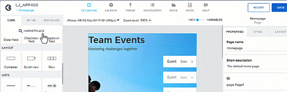

# ♠ 1 [USING MARKETPLACE AND OWN COMPONENTS](https://learning.sap.com/learning-journeys/develop-apps-with-sap-build-apps-using-drag-and-drop-simplicity/using-marketplace-and-own-components-_a0e9e75f-85d5-4a70-b377-bb088dba7bc4)

> :exclamation: Objectifs
>
> - [ ] Analyze the component marketplace.
>
> - [ ] Create own components.

## :closed_book: COMPONENT MARKETPLACE

Nous avons examiné de nombreux composants inclus par défaut dans SAP Build Apps. Ces composants couvrent la plupart des cas d'utilisation. Cependant, si vous souhaitez développer une application plus personnalisée et ajouter des composants spécifiques, vous pouvez utiliser la Marketplace des composants. SAP Build Apps, en tant que Marketplace de composants, propose plus de 500 composants glisser-déposer prédéfinis, que vous pouvez installer et utiliser rapidement, avec ou sans personnalisation.

La Place de marché des composants se trouve dans l'onglet Composants principaux, en haut à gauche, au-dessus de la Bibliothèque de composants. Elle contient non seulement de nouveaux composants constamment mis à jour, mais aussi des sections, par exemple pour les fonctions de flux et la logique abordée plus loin dans ce parcours d'apprentissage.

Les composants principaux sont également répertoriés dans la Place de marché des composants. C'est pourquoi il est judicieux d'utiliser le filtre disponible pour les exclure lors de l'exploration de nouveaux composants et obtenir une meilleure vue d'ensemble. Dans les paramètres de filtre, vous pouvez définir les options suivantes :

- Tous les composants disponibles ;

- Uniquement les composants déjà installés ;

- Composants non installés ;

- Composants propres.

La fonction de recherche optimise la recherche de nouveaux composants nécessaires à une approche de solution spécifique.

L'un des avantages de la Place de marché des composants est que vous recevez des informations décentralisées sur chaque composant. Cela s'applique à ceux qui ne sont pas installés, à ceux que vous avez déjà installés ou qui sont présents par défaut.

Pour sélectionner ou installer un nouveau composant, ou pour consulter des informations, il suffit de le sélectionner. Une boîte de dialogue s'affiche, contenant diverses informations telles que sa description, ses données de création et de mise à jour, le nom du mainteneur, le jeton et un exemple d'affichage.

Pour rendre le composant souhaité disponible :

- Sélectionnez-le simplement.

- Puis sélectionnez « Installer ».

- Le nouveau composant s'affiche alors sous l'onglet « Installés » de la bibliothèque de composants.

## :closed_book: USE COMPONENTS FROM THE MARKETPLACE

### BUSINESS SCENARIO

Explorez la Marketplace et installez un composant pour évaluer la fonction de suivi.

### EXERCISE OPTIONS

Pour démarrer l'exercice, sélectionnez « Démarrer l'exercice » dans la figure ci-dessous.

Une fenêtre contextuelle s'ouvre. Vous disposez des options suivantes :

- Démarrer : la simulation démarre. Suivez-la pour apprendre à utiliser les composants de la Marketplace.

- Ouvrir le document PDF : un PDF s'ouvre. En suivant les étapes décrites dans ce document, vous pouvez réaliser les exercices dans votre propre environnement système.

[Link Exercise](https://learnsap.enable-now.cloud.sap/pub/mmcp/index.html?show=project!PR_D1791F8097826A88:uebung)

## :closed_book: CUSTOM COMPONENTS

Les dernières leçons détaillent les composants, leurs propriétés et leurs paramètres de style, ainsi que divers autres composants ajoutés régulièrement sur la Marketplace. Dans cette section, nous allons plus loin en combinant les connaissances précédentes et en vous montrant comment créer vos propres composants. Grâce à l'éditeur de modèles de composants, vous pouvez personnaliser les composants en profondeur pour les adapter aux besoins de votre application. Vous pouvez les modifier et les combiner pour en créer de nouveaux.

SAP Build Apps offre une fonctionnalité intéressante : combiner les composants de base pour créer des composants plus sophistiqués. L'assemblage est également simple. Par exemple, vous pouvez combiner un composant image de base et un composant liste de la bibliothèque de composants pour créer un composant liste d'images réutilisable ultérieurement.

Ceci n'est qu'un aperçu des possibilités offertes par SAP Build Apps. Des éléments de composants individuels sont disponibles dans la bibliothèque de composants pour vous permettre de créer vos propres composants personnalisés.

## :closed_book: CREATE YOUR OWN COMPONENT

### BUSINESS SCENARIO

Après avoir utilisé les composants principaux et un composant de la Marketplace, vous allez créer un composant personnalisé qui mappe les données de l'historique du tracker. Une page dédiée sera utilisée à cet effet.

### EXERCISE OPTIONS

Pour démarrer l'exercice, sélectionnez « Démarrer l'exercice » dans la figure ci-dessous.

Une fenêtre contextuelle s'ouvre. Vous disposez des options suivantes :

- Démarrer : la simulation démarre. Suivez-la pour apprendre à créer vos propres composants.

- Ouvrir le document PDF : un PDF s'ouvre. En suivant les étapes décrites dans ce document, vous pouvez réaliser les exercices dans votre propre environnement système.

[Link Exercise](https://learnsap.enable-now.cloud.sap/pub/mmcp/index.html?show=project!PR_B210E762F383559B:uebung)
