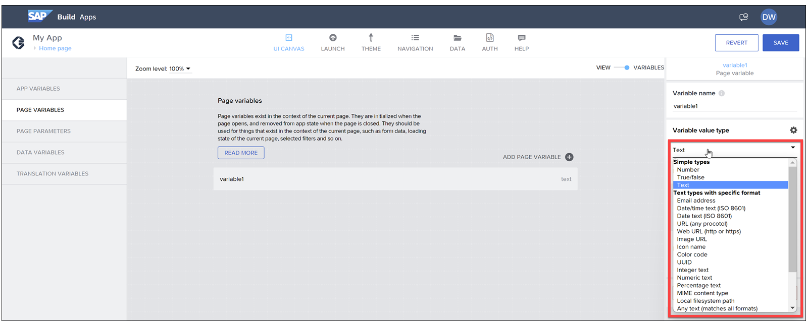
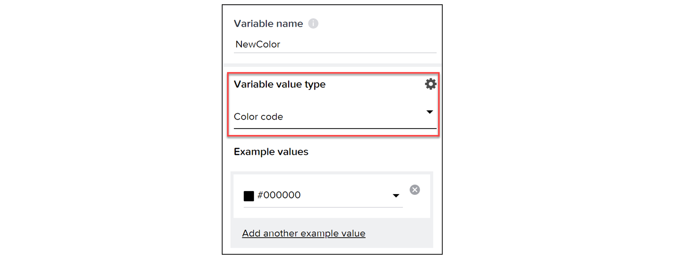
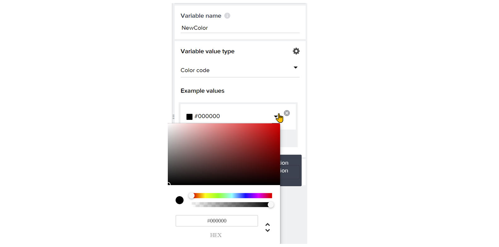
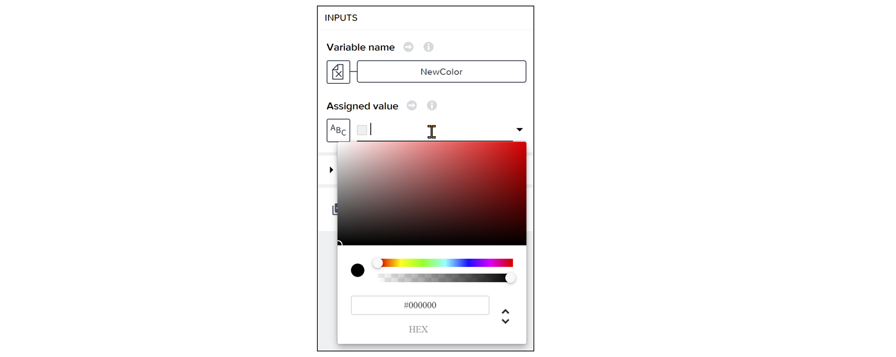
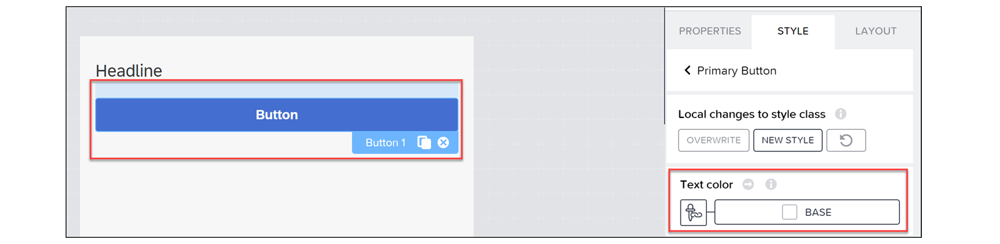
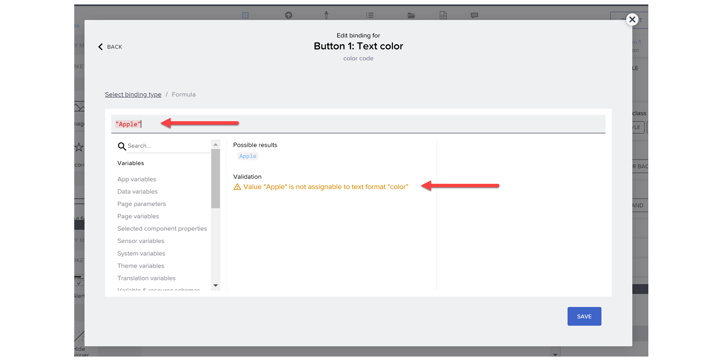

# ♠ 1 [USING DATA TYPES](https://learning.sap.com/learning-journeys/develop-apps-with-sap-build-apps-using-drag-and-drop-simplicity/using-data-types-_f3b612d5-1fbb-4c18-b743-b5b40d7bdad2)

> :exclamation: Objectifs
>
> - [ ] Define data types.
>
> - [ ] Discover different data types.
>
> - Explain the benefits of data types.

## :closed_book: DEFINITION OF DATA TYPES

Les types de données vous permettent de définir le type de données à stocker dans une variable et, par conséquent, le type de données attendu lors de la mise à jour de ses données.

Par exemple, si une variable stocke la couleur d'arrière-plan souhaitée par l'utilisateur, son type de données sera de type couleur. Une erreur se produira si vous tentez de stocker une valeur autre que couleur (par exemple, « #435647 ») dans cette variable.

Si une variable stocke le nom d'une nouvelle tâche, son type de données sera de type texte, représentant le nom de cette tâche.

Lorsque vous définissez une nouvelle variable, vous pouvez définir son type à droite.

Notez que les types de données ne sont pas uniquement utilisés pour les variables, mais également pour définir des schémas (ou types de données et organisation d'ensembles de données plus vastes) pour les ressources de données. Il existe moins de types de données disponibles pour les schémas de ressources de données.

## :closed_book: DIFFERENT DATA TYPES

Voici les types de données actuellement pris en charge, répartis en quatre groupes :

- Types simples

- Types de texte avec format spécifique

- Types de référence

- Types complexes

### EXAMPLES OF SIMPLE TYPES

| **TYPE** | **EXAMPLE** |
| -------- | ----------- |
| Number   | 123         |
| Bollean  | True        |
| String   | Tree        |

### TEXT TYPES WITH SPECIFIC FORMAT

| **TEXT TYPE**          | **SPECIFIC FORMAT**                                                                                                                                                |
| ---------------------- | ------------------------------------------------------------------------------------------------------------------------------------------------------------------ |
| Email address          | workshop@sap.com                                                                                                                                                   |
| Date/time (ISO 8601)   | 2023-05-14T07:08:05.671Z                                                                                                                                           |
| Date text (ISO 8601)   | 2023-01-01                                                                                                                                                         |
| URL                    | https://www.sap.com                                                                                                                                                |
| Web URL (http/https)   | https://www.sap.com                                                                                                                                                |
| Image URL              | https://www.sap.com                                                                                                                                                |
| Icon name              | Generally, the UI will provide a selection component to select an icon, though you can define an icon with a formula like this: {set: "fontAwesome", name: "star"} |
| Color code             | #000000                                                                                                                                                            |
| UUID                   | 4d7dfe35-9cd3-4eba-8051-4b91858abb35                                                                                                                               |
| Integer text           | 123                                                                                                                                                                |
| Numeric text           | 123.1                                                                                                                                                              |
| Percentage text        | 100%                                                                                                                                                               |
| MIME content type      | text/plain                                                                                                                                                         |
| Local file system path | Depends on device. Here’s example on Windows: blob:https://mytenant.preview.eu10.apps.build.cloud.sap/2361fe23-4817-4303-a6c5-8c69d2656df1                         |
| Any text               | Any text                                                                                                                                                           |

### REFERENCE TYPES

| **REFERENCE TYPE** | **SPECIFIC FORMAT**                                                                                                 |
| ------------------ | ------------------------------------------------------------------------------------------------------------------- |
| Icon               | This is a JSON representation of an icon, including the icon set and icon. `{"set":"fiori","name":"windows-doors"}` |

### COMPLEX TYPES

| **COMPLEX TYPE** | **SPECIFIC FORMAT**                                                                                  |
| ---------------- | ---------------------------------------------------------------------------------------------------- |
| Object           | An object is a wrapper that includes a set of properties, each of which can have a data type itself. |
| List             | A set of values (or objects) of the same data type.                                                  |
| Any value        | Any type of value                                                                                    |

## :closed_book: IMPORTANCE OF DATA TYPES

Pourquoi est-il important de définir des variables avec le bon type de données ?

Avec le type de données correct, SAP Build Apps vérifie que vous attribuez les données appropriées. En général, SAP Build Apps n'empêche pas le stockage d'une valeur non conforme au type de données, mais vous avertit en cas d'anomalie.

Par exemple, si vous avez une variable de type Nombre, vous pouvez lui attribuer « Pomme » et cette valeur s'affichera. SAP Build Apps vous avertira.

Il est possible de réinitialiser la logique des données de la variable en sélectionnant le bouton « Réinitialiser la logique des données de la variable ».

Les types de données sont particulièrement importants dans deux domaines : l'éditeur de propriétés et l'éditeur de formules.

### PROPERTY EDITOR

Lors de la définition des valeurs d'une variable, l'éditeur de propriétés propose une interface conçue pour ce type. Prenons l'exemple d'une variable de type Couleur.

Dans l'exemple de valeur, vous obtiendrez une interface utilisateur, notamment pour définir la couleur.

La même chose serait vraie si vous définissiez sa valeur dans une fonction de flux dans le canevas logique.

### FORMULA EDITOR

De même, l'éditeur de formules prend en compte le type de données et vous avertit si le résultat de la formule est conforme au type de données de la propriété actuelle.

Supposons que vous ayez un bouton et que vous souhaitiez utiliser une formule pour définir la couleur du texte du bouton.

Si la formule n'est pas conforme au type de données, l'éditeur de formules affichera un avertissement et la formule s'affichera en rouge. Notez également que l'éditeur de formules en haut indique le type de données attendu.

Notez que le bouton Enregistrer est toujours activé ; vous pouvez donc utiliser la formule. Le type de données indiquant une couleur, vous êtes prévenu, mais SAP Build Apps ne souhaite pas vous imposer de contraintes si vous souhaitez définir la variable de couleur sur une chaîne simple.
