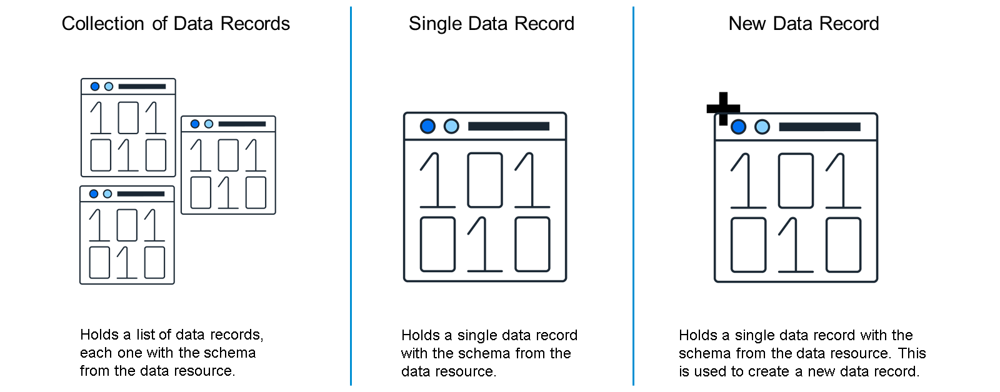

# ♠ 1 [CREATING DATA VARIABLES](https://learning.sap.com/learning-journeys/develop-apps-with-sap-build-apps-using-drag-and-drop-simplicity/creating-data-variables-_de170999-0ac9-4277-b1bd-cdcdac1e0fc7)

> :exclamation: Objectifs
>
> - [ ] Describe the various types of data variables and their uses.
>
> - [ ] Create a data variable.

## :closed_book: TYPES OF DATA VARIABLES

Les variables de données sont similaires aux autres variables, mais servent à stocker des données provenant de sources externes, telles que des systèmes SAP ou des API tierces, et permettent aux composants d'interface utilisateur d'interagir avec les données. Il est ainsi possible de créer des extensions SAP qui interagissent avec les systèmes centraux et les améliorent.

Utilisées pour récupérer et mettre à jour des enregistrements de données, elles offrent des fonctionnalités supplémentaires :

- Lorsque vous définissez une variable de données, vous devez également la définir comme un ensemble d'enregistrements du back-end, un enregistrement unique ou un enregistrement vide qui sera renseigné et ajouté au système back-end.

- Si la variable de données représente des données provenant d'un service OData, vous pouvez définir des filtres OData à utiliser lors de la récupération des données à insérer dans la variable.

- Les variables de données disposent de leur propre canevas logique, généralement pour définir comment récupérer les données. Les variables d'application et de page, ainsi que l'application elle-même, partagent un même canevas logique.

### DATA VARIABLE TYPES

Voici les types de variables de données disponibles que vous pouvez utiliser.

## :closed_book: TO CREATE A DATA VARIABLE

### BUSINESS SCENARIO

Les variables de données sont toujours basées sur une ressource de données dont le schéma est répliqué sur la variable de données. Ainsi, au lieu de définir un type de données, le type de données de la variable de données est issu de celui défini pour la ressource de données.

Regardez la vidéo pour apprendre à créer des variables de données.

[Link Video](https://learning.sap.com/learning-journeys/develop-apps-with-sap-build-apps-using-drag-and-drop-simplicity/creating-data-variables-_de170999-0ac9-4277-b1bd-cdcdac1e0fc7)

Vous avez maintenant appris à créer des variables de données.
