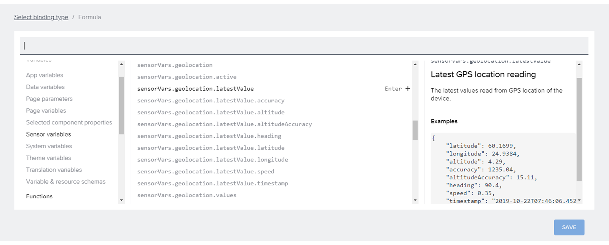
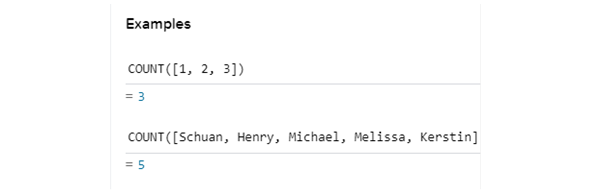
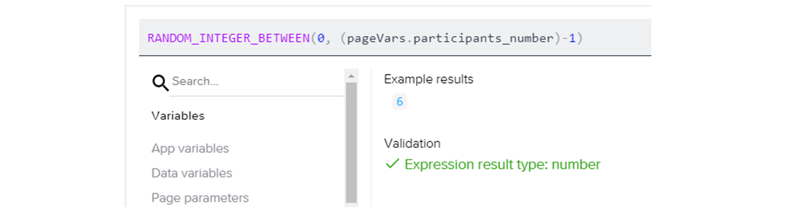
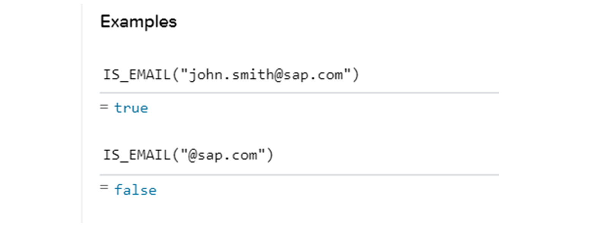

# ♠ 1 [USING FORMULA FUNCTIONS](https://learning.sap.com/learning-journeys/develop-apps-with-sap-build-apps-using-drag-and-drop-simplicity/using-formula-functions-_b565fa9d-c2c4-4061-b40d-07febf1436b3)

> :exclamation: Objectifs
>
> - [ ] Describe formular foundations and formula editor.
>
> - [ ] Calculate with formula operators.
>
> - [ ] Use formula variables and functions.

## :closed_book: FORMULA EDITOR

SAP Build Apps dispose d'un éditeur de formules, l'un des éditeurs d'algorithmes les plus puissants du marché. Mais rassurez-vous : même si le mot « algorithme » peut paraître compliqué, son utilisation a été simplifiée. SAP Build Apps combine des formules de type tableur avec une prise en charge intégrée d'un contexte applicatif complet, vous permettant de créer facilement un algorithme complexe.

Vous pouvez combiner des centaines de fonctions de transformation de données avec des données pertinentes telles que la localisation GPS, les valeurs des capteurs, les propriétés des données, etc.

Lancez la vidéo pour apprendre à utiliser l'éditeur de formules.

[Link Video](https://learning.sap.com/learning-journeys/develop-apps-with-sap-build-apps-using-drag-and-drop-simplicity/using-formula-functions-_b565fa9d-c2c4-4061-b40d-07febf1436b3)

## :closed_book: FORMULA OPERATOR

Même si SAP Build Apps ne nécessite aucun code, la connaissance des opérateurs est également indispensable ici et aide beaucoup à la conception d'applications dynamiques.

#### :small_red_triangle_down: Arithmetic operators :

Les opérateurs arithmétiques sont des symboles indiquant une opération mathématique à effectuer sur un ou plusieurs opérandes (valeurs). Les opérateurs arithmétiques les plus courants sont l'addition `(+)`, la soustraction `(-)`, la multiplication `(*)` et la division `(/)`. D'autres opérateurs arithmétiques incluent le module `(%)` et l'exponentiation `(^)`.

Par exemple, une variable pour un compteur de café ou d'eau qui commence chaque jour par la valeur 0 ou une autre valeur enregistrée dans le passé peut toujours être incrémentée de +1 lorsqu'une fonction utilisant cet opérateur d'addition (+1) est déclenchée.

Il est à noter que l'opérateur d'addition est également utilisé, par exemple, pour lier d'autres chaînes ou variables afin de créer du contenu dynamique.

#### :small_red_triangle_down: Logical operators :

Les opérateurs logiques `||`, `&&` et `!` permettent de comparer deux valeurs ou expressions. L'opérateur logique OU (`||`) renvoie vrai si l'un des opérandes est vrai. L'opérateur logique ET (`&&`) renvoie vrai uniquement si les deux opérandes sont vrais. L'opérateur logique NON (`!`) inverse le résultat d'une expression et renvoie faux si l'expression est initialement évaluée comme vraie, et inversement.

Un exemple courant d'utilisation de l'opérateur ET est lorsqu'un utilisateur doit fournir son adresse e-mail et son mot de passe corrects dans un formulaire de connexion pour accéder à l'application. L'opérateur OU (`||`) peut être utilisé, comme dans l'application d'exercice, pour planifier un dîner. Ainsi, si un participant est végétalien ou souffre d'allergies, il pourrait bénéficier d'un menu alternatif.

#### :small_red_triangle_down: Comparisons :

Les opérateurs de comparaison tels que `==`, `===`, `!=` et `!==` permettent de comparer deux valeurs. L'opérateur de double égalité (`==`) vérifie l'égalité des valeurs, tandis que l'opérateur de triple égalité (`===`) compare également le type. Les opérateurs d'inégalité (`!=` et `!==`) vérifient si les valeurs sont inégales ou non identiques. Les opérateurs `<`, `<=`, `>` et `>=` comparent si une valeur est inférieure, inférieure ou égale à une autre valeur.

Par exemple, pour vérifier si une personne a atteint un certain âge pour un événement (par exemple : 18 ; var_user>= 18) ou si son nom correspond au nom de la vérification (var_name == John). L'opérateur peut également être utilisé pour un compteur avec une valeur cible spécifique, les fonctions se répétant en boucle jusqu'à ce qu'une valeur cible soit atteinte. Selon la valeur initiale résultante (vrai, faux), une autre action peut alors être exécutée.

#### :small_red_triangle_down: Conditionals :

`<condition> ? <valeur vraie> : <valeur fausse>`

Cela montre comment utiliser les valeurs renvoyées par les opérateurs pour renvoyer ultérieurement une valeur différente selon le résultat. Les instructions conditionnelles sont un type d'instruction en programmation qui permet au programmeur de spécifier deux chemins différents pour le programme, selon qu'une condition est vraie ou fausse. La syntaxe des conditions est « `?` ». Si la condition est vraie, l'expression renvoie la valeur vraie ; si elle est fausse, elle renvoie la valeur fausse.

Par exemple : (x > 5) ? « x est supérieur à 5 » : « x n'est pas supérieur à 5 ». Dans cet exemple, si x est supérieur à 5, « x est supérieur à 5 » est renvoyé ; sinon, « x n'est pas supérieur à 5 » est renvoyé.

#### :small_red_triangle_down: Remainders :

Les restes sont les nombres restants après une division (`%`). Par exemple, si vous divisez 7 par 3, le reste est 1. Les restes permettent de déterminer si un nombre est divisible par un autre sans aucun calcul. Par exemple, pour savoir si un nombre est divisible par 5, vous pouvez vérifier le reste de la division par 5 : 0, il est divisible ; sinon, il ne l'est pas.

## :closed_book: FORMULA VARIABLES

Grâce aux formules, vous pouvez accéder à toutes les variables existantes de l'application et les modifier.

Il est toutefois important de noter que ces variables sont uniquement accessibles en lecture, et qu'aucune nouvelle variable ne peut être définie ou créée à l'aide de l'éditeur de formulaires seul. L'utilisation courante des fonctions de flux est donc particulièrement pertinente.

Outre les nombreuses variables déjà traitées, les variables de capteur, qui transmettent la valeur des capteurs de l'appareil, telles que les variables d'accéléromètre ou les variables système, comme le navigateur actuellement utilisé par Logic Flows, jouent ici un rôle important.

## :closed_book: FORMULA FUNCTIONS

Outre la gestion des opérateurs, le vaste catalogue de fonctions de formulaire offre l'avantage de fonctions prêtes à l'emploi, utilisables rapidement et de manière variée. Comme mentionné précédemment, il est utile de les parcourir dans l'éditeur de formules et de lire leurs descriptions.

Examinons quelques catégories fréquemment utilisées.

#### :small_red_triangle_down: Text Section :

La section Texte des Fonctions de Formule offre un large éventail de fonctions pour modifier, remplacer, formater, mais aussi analyser ou rechercher des textes dans l'application. Ainsi, des manipulations de texte simples aux plus complexes sont possibles.

L'exemple simple avec la fonction UpperCase() convertit un texte donné de manière à ce que toutes les lettres soient écrites en majuscules pour le mettre en valeur.

#### :small_red_triangle_down: Date :

Les fonctions du groupe Date sont utiles pour exploiter les informations de date et d'heure. Elles permettent d'afficher différentes valeurs de secondes et de les ajouter en fonction de la situation, d'un processus ou de l'utilisateur (par exemple, fuseau horaire local). Il est également possible de relier plusieurs valeurs temporelles afin de déterminer leur durée exacte ou simplement de déterminer si une période est antérieure ou postérieure à une valeur définie, ou identique à celle-ci.

Dans l'exemple présenté, la fonction NOW renvoie une valeur correspondant à l'heure à laquelle elle a été déclenchée et peut être modifiée pour n'afficher que le jour.

#### :small_red_triangle_down: List :

Compte tenu de la diversité des composants et des utilisations des listes, les fonctions de liste sont également importantes pour l'affichage du contenu d'une application dynamique. Grâce à ces fonctions, les listes peuvent être facilement triées et filtrées. Elles peuvent également être modifiées, par exemple en les divisant ou en supprimant des éléments individuels. Dans ce dernier cas, les fonctions de recherche et d'analyse sont particulièrement utiles pour déterminer la position ou le nombre d'éléments dans la liste.

Dans l'exemple de la fonction Count, les éléments d'une liste donnée sont comptés et renvoyés sous forme de valeur numérique. Cette valeur peut ensuite être transmise à une liste de participants pour des calculs ultérieurs afin de déterminer le budget ou le nombre de places libres restantes.

#### :small_red_triangle_down: Mathematical Functions :

Les fonctions mathématiques complètent les opérateurs classiques par diverses possibilités prédéfinies permettant d'effectuer des calculs mathématiques au sein de l'application. Il est ainsi possible de comparer des valeurs, de renvoyer la valeur la plus petite ou la plus grande, ou d'additionner les nombres d'un tableau. Parmi les exemples les plus fréquents, on trouve l'arrondi supérieur (round()) et inférieur (floor()) de valeurs à un nombre entier, ou le calcul du reste après une division (modulo()).

Dans l'exemple présenté, un entier est renvoyé aléatoirement, généré entre deux entiers sélectionnés, dont celui-ci. Ainsi, dans l'exemple de la liste des participants, le nombre actuel de participants (42 dans cet exemple pour pageVars.participants_number) peut être utilisé comme paramètre Max. Ainsi, avec le nombre généré aléatoirement, un participant est tiré entre 0 et 4. Remarque : Étant donné qu'un tableau sélectionne également le premier élément dans SAP Build Apps avec la valeur 0, le nombre maximal (42) a été soustrait de 1 dans cet exemple.

#### :small_red_triangle_down: Utility :

Fondamentalement, les fonctions utilitaires servent principalement à vérifier les conditions et les valeurs saisies pour la condition générale, ou, dans de nombreux cas, la condition relative au format correct. L'accent est mis sur la fonction IF, qui évalue le paramètre d'entrée comme une condition comme vrai ou faux et renvoie une valeur spécifique en fonction de cette valeur, permettant ainsi des processus dynamiques.

Dans l'exemple, la fonction IS_EMAIL permet de vérifier si l'entrée donnée correspond au format d'une adresse e-mail valide. Si c'est le cas, la valeur true est renvoyée. Dans le cas contraire, la valeur false est renvoyée. Ces sorties peuvent ensuite servir de déclencheurs pour d'autres actions, comme l'affichage d'une fenêtre contextuelle indiquant que l'adresse e-mail saisie est incorrecte et doit être vérifiée à nouveau.

