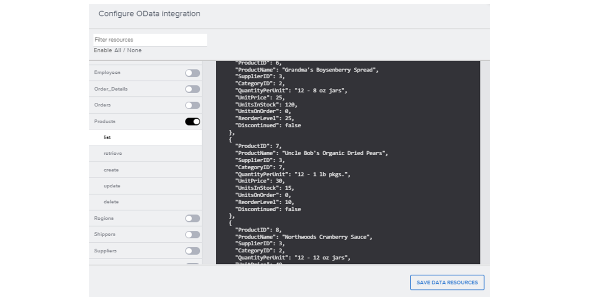

# ♠ 1 [USING ODATA RESOURCES](https://learning.sap.com/learning-journeys/develop-apps-with-sap-build-apps-using-drag-and-drop-simplicity/using-odata-resources_ea7d8938-0ccb-4696-9780-9ac6aac88795)

> :exclamation: Objectifs
>
> - [ ] Create a data resource to an OData Service.
>
> - [ ] Access the OData data resource from your app.

## :closed_book: ODATA RESOURCE

Une ressource OData est une connexion à un magasin de données utilisant le protocole OData. Comprendre OData en détail n'est pas essentiel ; nous aborderons donc les points les plus importants à connaître pour se connecter depuis SAP Build Apps.

Un service OData définit un ensemble d'entités. Ces entités représentent des éléments concrets tels que des clients, des produits, des emplacements et des employés. Comme les services OData doivent fournir des métadonnées, une fois l'URL du service fournie, SAP Build Apps connaîtra les entités, leurs champs et leurs types de données.

Chaque entité définira un ensemble de champs, chacun représentant une information la concernant. Par exemple, pour les clients, vous pourriez avoir les champs suivants :

- CustomerID

- CompanyName

- ContactName

- ContactTitle

- Address

- Ville

- Region

- PostalCode

- Country

- Téléphone

- Fax

Jusqu'à présent, nous avons défini la nature des données que nous souhaitons stocker. À terme, nous stockerons les données réelles dans notre entité de service OData. Ces données sont représentées par un ensemble de lignes, chaque ligne contenant une valeur pour chaque champ. Nous pourrions donc obtenir les données suivantes :

Plus d'informations sur OData, notamment le système fictif et l'exemple Northwind pour tester son utilisation, sont disponibles ici : https://www.odata.org/

### EXAMPLE DATA

| **CustomerID** | **CompanyName**                    | **ContactName** | **ContactTitle**     | **Address**                        |
| -------------- | ---------------------------------- | --------------- | -------------------- | ---------------------------------- |
| ALFKI          | Alfreds Futterkiste                | Maria Anders    | Sales Representative | Obere Str. 57                      |
| ANATR          | Ana Trujillo Emparedados y helados | Ana Trujillo    | Owner                | Avda. de la Constituci\u00f3n 2222 |

## :closed_book: ODATA RESOURCE CREATION

### BUSINESS SCENARIO

Cette procédure montre comment créer une ressource OData.

Notez que cette procédure est orientée vers l'exemple de service OData standard, Northwind.

### STEP

1. Créez une ressource OData.

2. Dans un nouveau projet SAP Build Apps, ouvrez l'onglet Données.

3. Accédez à Entités de données classiques SAP Build Apps → CRÉER UNE ENTITÉ DE DONNÉES → Intégration OData.

4. Pour l'URL de l'API de base, saisissez https://services.odata.org/v4/northwind/northwind.svc/, puis sélectionnez VÉRIFIER L'URL. SAP Build Apps lit alors toutes les métadonnées et affiche la liste des entités contenues dans le service.

5. Activez le bouton « Clients ». Une connexion à cette entité est alors créée. Si vous souhaitez vous connecter à d'autres entités, vous pouvez les activer/désactiver.

## :closed_book: ACCESS DATA FROM ODATA RESOURCE

### BUSINESS SCENARIO

Dans cette procédure, vous apprendrez les étapes pour le connecter ou récupérer des données.

### STEP

1. Accédez aux données depuis la ressource OData.

2. Retournez au canevas de l'interface utilisateur. Un titre et un texte devraient apparaître.

3. Choisissez le titre et, dans le panneau Propriétés, définissez le contenu sur « Clients ».

4. Choisissez « Variables ».

5. Créez une variable de données. Nous allons maintenant créer une variable de données qui stockera les données du back-end et contiendra la logique permettant de les récupérer.

6. Choisissez « Variables de données », puis « Ajouter une variable de données ».

7. Choisissez « Clients » comme ressource de données sur laquelle baser la variable de données.

8. Choisissez « Afficher » pour revenir au canevas de l'interface utilisateur.

9. Choisissez le composant texte et configurez-le pour afficher les noms des clients.

10. Dans le panneau Propriétés, choisissez l'icône sous « Répéter avec », puis sélectionnez « Données et variables », puis « Variable de données ».

11. Sélectionnez « Clients » et cliquez sur « Enregistrer ». Le composant texte s'affichera désormais quatre fois pour indiquer qu'il est répété (les quatre fois n'indiquent pas la quantité de données, mais toujours quatre fois).

12. Dans le volet Propriétés, choisissez « ABC » sous le champ « Contenu », puis sélectionnez « Élément de données en répétition ».

13. Sélectionnez « Actuel », puis « Nom de l'entreprise ».

14. Choisissez « Enregistrer ».

15. Choisissez « Enregistrer » (en haut à droite).

Exécutez l'application.

> Vous verrez la liste des clients récupérés depuis le back-end.

## :closed_book: GENERATE THE DATA OF A COLLEAGUE WITH ODATA

### BUSINESS SCENARIO

Dans cette procédure, vous apprendrez les étapes pour le connecter ou récupérer des données.

### EXERCISE OPTIONS

Pour démarrer l'exercice, sélectionnez « Démarrer l'exercice » dans la figure ci-dessous.

Une fenêtre contextuelle s'ouvre. Vous disposez des options suivantes :

- Démarrer : la simulation démarre. Suivez-la pour apprendre à créer les variables d'application et de page.

- Ouvrir le document PDF : un PDF s'ouvre. En suivant les étapes décrites dans ce document, vous pouvez réaliser les exercices dans votre propre environnement système.

[Link Exercise](https://learnsap.enable-now.cloud.sap/pub/mmcp/index.html?show=project!PR_9DCA88497E9C79C:uebung)

## :closed_book: GENERATE THE MEALS BY BUTTON LOGIC AND ODATA

### BUSINESS SCENARIO

Dans le cadre d'un événement social entre deux collègues, configurez un bouton de manière à générer deux options de restauration différentes et à les afficher l'une en fonction de l'autre. Pour ce faire, sélectionnez chaque option dans une liste via le service OData. Vous pouvez ainsi modifier la police et le texte.

### EXERCISE OPTIONS

Pour démarrer l'exercice, sélectionnez « Démarrer l'exercice » dans la figure ci-dessous.

Une fenêtre contextuelle s'ouvre. Vous disposez des options suivantes :

- Démarrer : la simulation démarre. Suivez-la pour apprendre à créer les variables d'application et de page.

- Ouvrir le document PDF : un PDF s'ouvre. En suivant les étapes décrites dans ce document, vous pouvez réaliser les exercices dans votre propre environnement système.

[Link Exercise](https://learnsap.enable-now.cloud.sap/pub/mmcp/index.html?show=project!PR_5A2A979EEB172B95:uebung)
