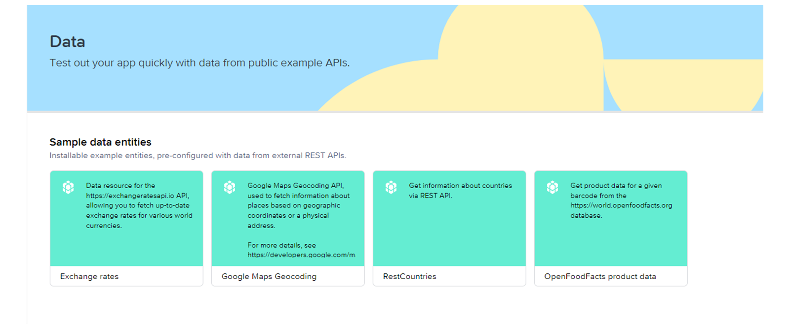

# ♠ 1 [USING MARKETPLACE DATA RESOURCES](https://learning.sap.com/learning-journeys/develop-apps-with-sap-build-apps-using-drag-and-drop-simplicity/using-marketplace-data-resources_a36ec6c0-2e29-45ee-805f-cafc253c8635)

> :exclamation: Objectifs
>
> - [ ] Find data resources in the Marketplace.
>
> - [ ] Create and share a data resource.

## :closed_book: DATA RESOURCES IN THE MARKETPLACE

SAP Build Apps fournit des exemples de ressources de données qui peuvent être utiles pour vos projets ou vous fournir des exemples de données à des fins de test.

De plus, vous pouvez avoir des données qui sont réutilisées dans de nombreux projets et souhaiter créer un moyen simple de les réutiliser au lieu de définir la ressource de données dans chaque projet.

### EXAMPLE DATA RESOURCES

1.  Ouvrez l'onglet Données.

2.  Choisissez Entités de données classiques SAP Build Apps → Créer une entité de données → Recherche Marketplace pour afficher les ressources de données prêtes à l'emploi.

3.  Sélectionnez RestCountries, puis Installer.

4.  De retour sur la zone de travail de l'interface utilisateur, choisissez Variables et créez une variable de données basée sur RestCountries.

5.  De retour sur la zone de travail de l'interface utilisateur (choisissez Affichage), sélectionnez le composant texte et procédez comme suit :

    - Définissez Répéter avec sur Données, puis Données et variables → Variable de données → RestCountries1, puis choisissez Enregistrer.

    - Définissez Contenu sur Élément de données en répétition, puis sélectionnez Actuel → Nom.

6.  Exécutez l'application et vous devriez voir une liste de pays.

## :closed_book: SHARE YOUR DATA RESOURCES

1. Utilisez la ressource de données pour les clients, comme décrit dans la section « Créer une ressource OData », ou créez-en une. Assurez-vous que la ressource de données possède une description.

2. Dans l'onglet Données, cliquez sur les trois points verticaux.

3. Sélectionnez « Publier sur la place de marché ».

4. Choisissez « PUBLIEZ NOUVEAU ».

Vous et les autres utilisateurs de votre locataire pourrez trouver cette ressource de données en recherchant son titre ou sa description.

Vous obtiendrez un GUID pour la nouvelle ressource de données sur la place de marché. Vous pourrez l'utiliser pour identifier et rechercher la ressource de manière unique. Bien entendu, vos utilisateurs pourront rechercher le composant par sa description et son nom.
