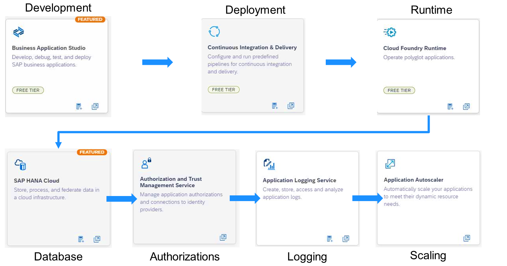
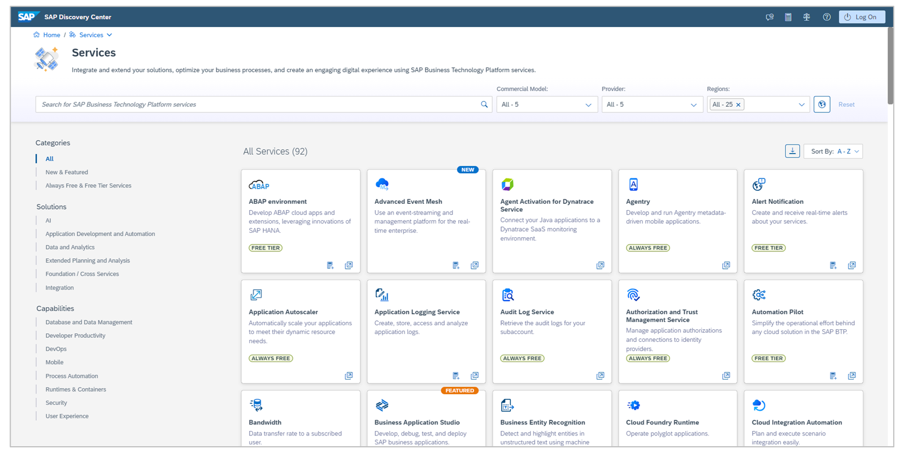
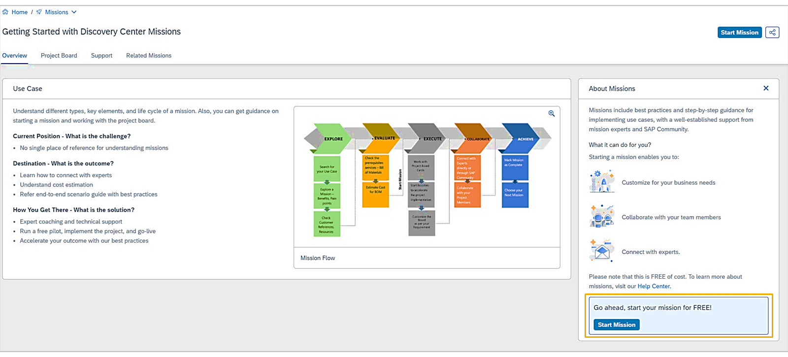

# ♠ 1 [IDENTIFYING THE SERVICES IN SAP BTP](https://learning.sap.com/learning-journeys/discover-sap-business-technology-platform/identifying-the-services-in-sap-btp_e7380661-2cbc-4339-9d3b-c954d5b9c8ed)

> :exclamation: Objectifs
>
> - [ ] Identify the services in SAP BTP.
>
> - [ ] Demonstrate the SAP Discovery Center.

## :closed_book: TITLE 2

### THE SERVICES TYPES IN SAP BTP

De nombreuses fonctionnalités de SAP BTP sont fournies sous forme de services. Certains sont toujours gratuits, tandis que d'autres sont payants. Avant de pouvoir utiliser un service, vous devez vous y abonner ou créer une instance du service sélectionné. Avant cela, vous devez vous familiariser avec les offres de service disponibles pour ce service afin de choisir celle qui convient à votre situation. Vous trouverez plus d'informations sur les offres de service existantes dans le SAP Discovery Center ou la documentation du portail d'aide SAP. Il existe deux types de services : de nombreux services sont disponibles et peuvent être utilisés pour différents cas d'utilisation. Les services peuvent être instanciés ou souscrits.

#### :small_red_triangle_down: Instance :

Une instance de service est un ensemble de fonctionnalités utilisées via des API et/ou des liaisons. Certains services nécessitent également un environnement supplémentaire, comme Cloud Foundry ou Kyma, pour fonctionner correctement. Selon le service, vous pouvez également utiliser une application graphique. Dans ce cas, un environnement supplémentaire est indispensable, car les instances de service ne disposent pas de leur propre environnement d'exécution intégré.

#### :small_red_triangle_down: Subscription :

Un abonnement à un service est autonome et fonctionne sans environnement d'exécution supplémentaire ni aucun autre service. Ces services sont généralement fournis avec une application que vous pouvez ouvrir et utiliser. Vous pouvez exploiter les fonctionnalités de cette application pour vos scénarios.

### EXAMPLE USE OF SERVICES ON SAP BTP

L'illustration « Exemple d'utilisation de services sur SAP BTP » illustre un cas d'utilisation potentiel pour certains services.

Vos développeurs doivent développer une application SAPUI5 avec le modèle de programmation d'applications SAP Cloud. Cette application doit être hébergée sur SAP BTP.

Les développeurs choisissent d'utiliser SAP Business Application Studio comme IDE. Pour le pipeline d'intégration et de livraison continues, ils utilisent le service d'intégration et de livraison continues de SAP BTP. L'application est déployée dans l'environnement Cloud Foundry de SAP BTP. Les développeurs utilisent SAP HANA Cloud pour stocker les données de l'application (base de données en tant que service).

Si vous souhaitez garantir la sécurité du fonctionnement et de l'utilisation productive de l'application grâce à la gestion des autorisations, vous souhaitez également créer des journaux et gérer la charge automatiquement.

Pour les autorisations, vos développeurs utilisent le service de gestion des autorisations et de la confiance. Pour les journaux, ils peuvent connecter l'application au service de journalisation des applications. Pour gérer les charges dynamiquement, vos développeurs peuvent créer une instance d'Application Autoscaler, la configurer avec des règles de mise à l'échelle et la lier à l'application.

En plus du cas d’utilisation de ce scénario, il existe d’autres cas d’utilisation potentiels et encore plus de services qui pourraient être utilisés.

### SAP DISCOVERY CENTER

Regardez cette démo pour en savoir plus sur SAP Discovery Center.

[Link Video](https://learning.sap.com/learning-journeys/discover-sap-business-technology-platform/identifying-the-services-in-sap-btp_e7380661-2cbc-4339-9d3b-c954d5b9c8ed)

#### :small_red_triangle_down: Key capabilities :

- Le catalogue de services propose des informations sur les services, outils, API et applications prêts à l'emploi qui vous aident à intégrer et à étendre vos solutions.

- Un catalogue de missions avec des projets prêts à l'emploi offrant un véritable soutien pour un projet de mise en œuvre.

- Des supports de formation et un accompagnement étape par étape.

- Des coachs dédiés pour vous accompagner et vous accompagner dans l'intégration avec la communauté SAP.

#### :small_red_triangle_down: Benefits :

- Support et ressources pertinents et à la demande.

- Accélération rapide de l'innovation.

- Outil en ligne en libre-service et à faible intervention.

### SAP DISCOVERY CENTER - SERVICES OVERVIEW

Dans la section Services du SAP Discovery Center, vous trouverez des informations sur tous les services proposés par SAP sur SAP BTP. Vous pouvez parcourir les services par catégorie ou utiliser la barre de recherche. Si vous avez trouvé un service qui vous intéresse, sélectionnez-le et ses détails s'afficheront.

### SAP DISCOVERY CENTER - MISSIONS ANS USE CASES

Les cas d'utilisation sont des exemples structurés qui fournissent des conseils clairs et pratiques sur la façon d'appliquer les fonctionnalités de SAP BTP pour répondre à des besoins métier concrets. À l'instar de recettes, ces cas d'utilisation fournissent un guide étape par étape, décrivant les ingrédients et les étapes nécessaires pour atteindre des résultats métier spécifiques. Testés et adaptables, ils offrent des informations exploitables issues d'entreprises ayant mis en œuvre ces solutions avec succès.

[Link Video](https://learning.sap.com/learning-journeys/discover-sap-business-technology-platform/identifying-the-services-in-sap-btp_e7380661-2cbc-4339-9d3b-c954d5b9c8ed)

Au sein du Discovery Center, les missions offrent un moyen d’explorer ces cas d’utilisation de manière structurée.

La vue détaillée d'une mission vous offre un aperçu du sujet et des apprentissages. Vous pouvez démarrer la mission gratuitement.

Dans le tableau de bord du projet, vous pouvez consulter les phases et le matériel utilisé. Pour toute question concernant la mission, vous pouvez utiliser la communauté SAP ou contacter des experts. Certaines missions disposent également d'une FAQ contenant des informations utiles.

Vous pouvez explorer ces missions et cas d'utilisation gratuitement grâce aux offres d'essai et de gratuité. L'offre d'essai gratuite vous donne accès à certains services en continu, tandis que l'offre d'essai vous offre un environnement sandbox de 90 jours pour vous familiariser avec les fonctionnalités de la plateforme.

Vous pouvez accéder au SAP Discovery Center ici : https://discovery-center.cloud.sap/

Pour plus de cas d'utilisation, veuillez consulter notre [site web dédié](https://www.sap.com/products/technology-platform/use-cases.html).

Pour plus d'informations et pour créer un compte d'essai, [cliquez ici](https://sap.com/trysapbtp).

## :closed_book: KEY TAKEWAYS OF THIS LESSON

SAP propose de nombreux services pour différents cas d'utilisation, accessibles par abonnement ou par instance. Le SAP Discovery Center propose des conseils et des informations complémentaires sur ces services. Les services SAP BTP offrent de nombreuses fonctionnalités utiles à vos projets de développement logiciel. Certains services sont accessibles via des applications graphiques, d'autres via des API.
