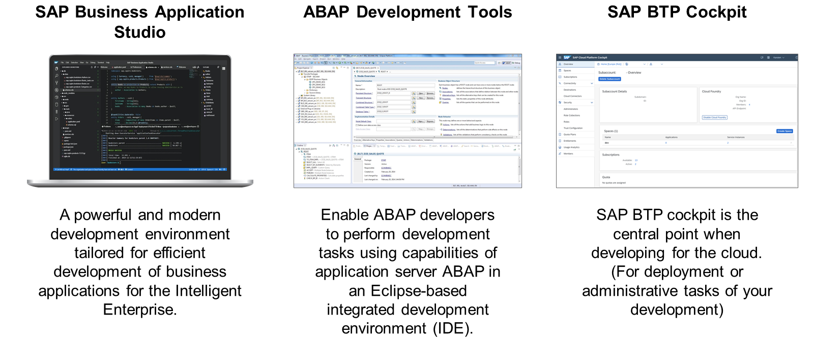
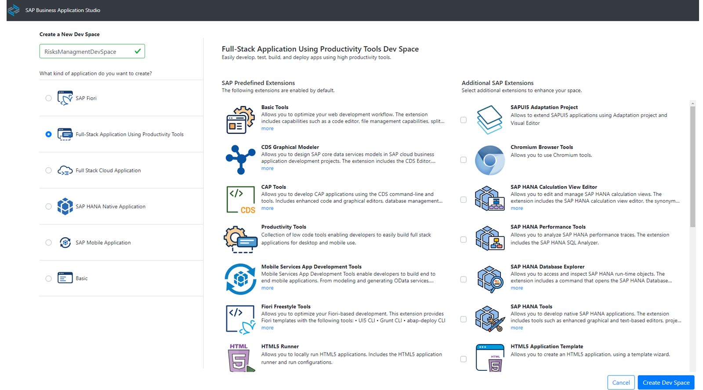
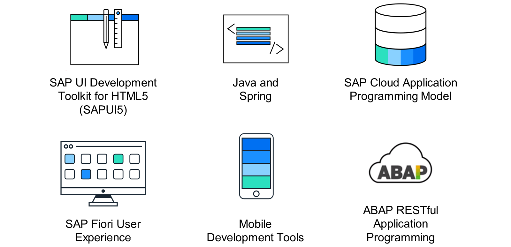
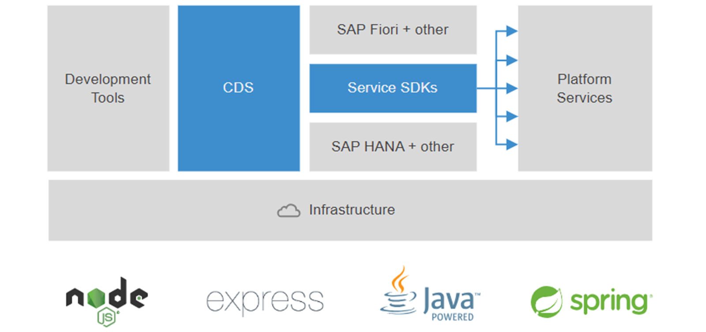
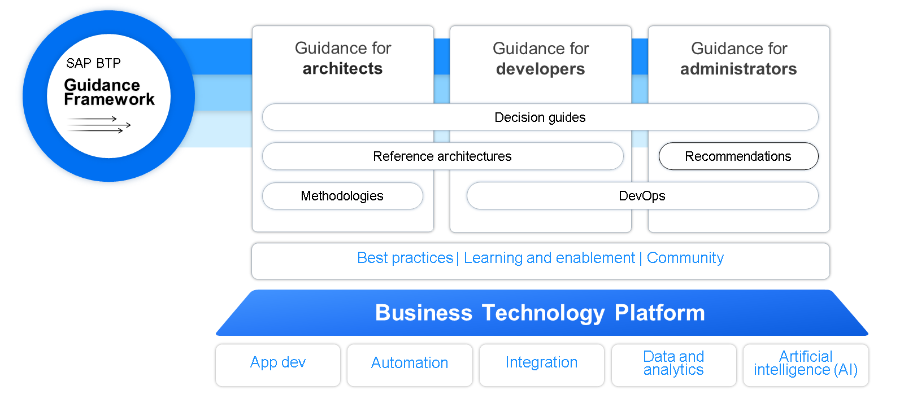

# ♠ 1 [ANALYZING DEVELOPMENT TOOLS AND FRAMEWORKS](https://learning.sap.com/learning-journeys/discover-sap-business-technology-platform/analyzing-development-tools-and-frameworks_bf8e7397-ddfa-4580-999d-7175d8edf6d9)

> :exclamation: Objectifs
>
> - [ ] Analyze development tools.
>
> - [ ] Analyze development frameworks.
>
> - [ ] Introduce the SAP BTP Guidance Framework.

## :closed_book: DEVELOPMENT TOOLS

Il existe de nombreux outils de développement logiciel, proposés par SAP et des fournisseurs tiers. Ces trois outils sont essentiels au cycle de vie du développement logiciel.

SAP Business Application Studio est le choix d'avenir de SAP. C'est un environnement de développement moderne, flexible et extensible, permettant de créer des applications pour une entreprise intelligente et durable.

ABAP Development Tools (ADT) regroupe des fonctionnalités de programmation ABAP basées sur l'IDE Eclipse. Il permet de programmer ABAP sur site et de coder ABAP pour l'environnement ABAP de SAP BTP.

Vous pouvez obtenir l'ADT [ici](https://tools.hana.ondemand.com/#abap).

Pour installer l'ADT, consultez ce [fichier](https://help.sap.com/doc/2e9cf4a457d84c7a81f33d8c3fdd9694/Cloud/en-US/inst_guide_abap_development_tools.pdf).

Le cockpit SAP BTP est l'outil de choix pour toutes les tâches administratives ou opérationnelles. Les développeurs déploient leurs applications sur SAP BTP ou utilisent les services fournis par SAP BTP au sein de leurs applications. De nombreux services sont intéressants pour le développement logiciel. Par exemple :

- SAP Business Application Studio

- SAP HANA Cloud

- Cloud Transport Management

- Feature Flags Service

- And many more

Le cockpit SAP BTP est l’un des outils les plus importants pour les administrateurs.

## :closed_book: SAP BUSINESS APPLICATION STUDIO

### OVERIEW

Lorsque votre entreprise envisage de développer des extensions d'application sur la plateforme SAP Business Technology Platform (BTP), SAP Business Application Studio (BAS) en tant que service SAP BTP sera le choix privilégié qui offre un environnement de développement moderne adapté au développement d'applications métier.

.png>)

SAP Business Application Studio offre un environnement de développement commun à vos développeurs professionnels et particuliers, quels que soient leurs appareils et systèmes d'exploitation, sans manquer d'outils de développement cloud modernes, notamment les outils spécifiques nécessaires au développement d'applications métier dans l'écosystème SAP. Cette flexibilité est rendue possible grâce à l'utilisation flexible de SAP Business Application Studio comme outil web, où que vous soyez, via un simple navigateur web, sans renoncer à l'expérience de développement habituelle sur ordinateur, comme par exemple avec Microsoft Visual Studio Code.

En vous abonnant au service via votre sous-compte SAP BTP, vous bénéficierez, avec SAP Business Application Studio, d'un environnement de développement offrant tous les outils nécessaires au développement d'applications métier, notamment des éditeurs optimisés, un terminal, un débogueur et une ligne de commande pour différents cas d'utilisation. De plus, l'expérience utilisateur est enrichie par des rôles prédéfinis pour les développeurs, les développeurs d'extensions et les administrateurs.

SAP Business Application Studio se distingue par ses espaces de développement (Dev Spaces), des environnements isolés dotés d'outils personnalisés et d'environnements d'exécution préinstallés. Ils simplifient et accélèrent la configuration de votre environnement de développement en fonction du type d'applications que vous souhaitez développer, par exemple SAP Fiori, les applications cloud Full Stack, les applications natives SAP HANA, etc. De plus, grâce à son caractère open source, vous pouvez choisir des extensions supplémentaires pour enrichir votre espace grâce à l'Open VSX Registry, que vous connaissez peut-être également dans Microsoft Visual Studio Code.

SAP Business Application Studio offre également des fonctionnalités low-code/no-code permettant de modéliser vos modèles CDS via un éditeur graphique ou de créer des applications SAP Fiori Elements via une procédure guidée. De plus, d'autres outils simplifient et accélèrent le développement logiciel, vous offrant ainsi une expérience de développement optimale.

Nous proposons un parcours d'apprentissage dédié à SAP Business Application Studio. Vous trouverez de plus amples informations ici : [développer-des-applications-full-stack-à-l'aide-des-outils-de-productivité-dans-sap-business-application-studio](https://learning.sap.com/learning-journey/develop-full-stack-applications-using-productivity-tools-in-sap-business-application-studio).

Pour plus d'informations sur SAP Business Application Studio, cliquez [ici](https://www.sapstore.com/solutions/45318/SAP-Business-Application-Studio---the-evolution-of-SAP-Web-IDE).

### LEARN MORE

Pour en savoir plus sur SAP Business Application Studio, consultez la rubrique de la [communauté SAP](https://community.sap.com/topics/business-application-studio).

Vous pouvez également consulter l'article de [blog suivant](https://blogs.sap.com/2021/01/26/sap-business-application-studio-info-blog-ii/).

## :closed_book: DEVELOPMENT FRAMEWORKS

### EXAMPLE OF DEVELOPMENT FRAMEWORKS FROM SAP

La stratégie de SAP vise à unifier pleinement l'expérience développeur pour les experts métier, les développeurs citoyens et les développeurs professionnels.

Aujourd'hui, SAP propose plusieurs outils et frameworks de développement prenant en charge l'ensemble de la pile logicielle pour l'expérience utilisateur, les services de données, les modèles de programmation de workflows, et bien plus encore.

Voici un bref extrait de ces outils :

#### :small_red_triangle_down: SAP UI Development Toolkit for HTML5 (SAPUI5) :

SAP UI Development Toolkit for HTML5 (SAPUI5) repose sur le principe du contrôleur de vue modèle. SAPUI5 est un framework moderne et flexible pour créer des applications web adaptées à vos besoins métier. De plus, il propose des outils pour la planification d'applications SAPUI5, les tests, les icônes, etc.

En savoir plus sur [SAPUI5](https://ui5.sap.com/).

Vous pouvez également utiliser OpenUI5, la version open source d'UI5.

En savoir plus sur [OpenUI5](https://openui5.org/).

#### :small_red_triangle_down: Java and Spring :

Grâce à Cloud Foundry ou à l'environnement d'exécution Kyma, vous pouvez développer des projets de développement logiciel Java et les exploiter directement sur SAP BTP. Votre projet Java s'intègre ainsi facilement à votre environnement d'entreprise (SAP Cloud Application Programming Model) et votre application peut utiliser les services SAP BTP. Vous pouvez également utiliser des frameworks comme Spring ou SAP Cloud Application Programming Model.

En savoir plus sur [Spring](https://spring.io/).

#### :small_red_triangle_down: SAP Fiori User Experience :

Le système de conception SAP Fiori inclut des langages de conception pour des technologies dédiées : web, mobile natif et conversationnel. Chaque langage de conception définit l'apparence, les contrôles, les plans d'étage et les fonctions communes, et inclut des directives et des gabarits pour les concepteurs et les développeurs.

SAP Fiori peut être développé à l'aide de nombreuses technologies, SAPUI5 étant notre technologie web HTML5 de référence. Nous proposons deux langages de conception mobiles natifs : un pour iOS et un pour Android.

Pour en savoir plus sur l'expérience utilisateur et SAP Fiori, consultez notre [parcours d'apprentissage](https://learning.sap.com/learning-journey/getting-started-with-ux).

Plus d'informations sur [SAP Fiori](https://www.sap.com/products/technology-platform/fiori.html).

#### :small_red_triangle_down: SAP's Mobile Development tools :

Pour créer des applications mobiles, de nombreuses technologies sont aujourd'hui disponibles. Offres SAP :

- SAP Mobile Development Kit (MDK)

  Créez des applications multicanaux basées sur JavaScript. Vos applications sont ensuite converties et deviennent des applications natives pour iOS, Android, voire le web.

- SDK SAP BTP pour iOS

  Le SDK SAP BTP pour iOS vous permet de développer rapidement vos propres applications natives avec Swift. Ce SDK étend les frameworks Swift Apple iOS standard avec du contenu SAP réutilisable.

- SDK SAP BTP pour Android

  Le SDK SAP BTP pour Android vous permet de développer rapidement vos propres applications natives avec Android Studio et votre langage de programmation préféré. De plus, SAP propose du contenu pour les projets Android, comme les directives SAP Fiori pour Android ou l'assistant SDK SAP BTP pour Android, afin d'accélérer vos projets.

Plus d'informations sur les outils de développement mobile de SAP : https://www.sap.com/products/technology-platform/developer-tools.html#mobile ou ici : https://community.sap.com/topics/mobile-technology

#### :small_red_triangle_down: ABAP RESTful Application Programming Model :

Le modèle de programmation d'applications RESTful ABAP (RAP) est un framework permettant de développer des services OData de bout en bout optimisés pour SAP HANA, tels que les applications Fiori, dans l'environnement ABAP. RAP prend en charge la création de différents types d'applications Fiori et la publication d'API Web. Il utilise des technologies comme Core Data Services (CDS) pour définir des modèles de données détaillés et une infrastructure de modèle de service pour créer des services OData conformes au protocole OData. RAP utilise également des services applicatifs ABAP pour implémenter une logique personnalisée et s'intégrer aux interfaces utilisateur SAPUI5.

Les projets RAP commencent généralement par la modélisation des données à l'aide de CDS, où vous définissez les structures et les relations de données. Ensuite, vous spécifiez le comportement de votre modèle de données, en déterminant les opérations pouvant être effectuées, telles que la création, la lecture, la mise à jour et la suppression de données. Cette étape est suivie par la création de services OData qui exposent votre modèle de données et ses fonctionnalités via des protocoles standardisés. Ces services peuvent ensuite être utilisés par diverses technologies front-end, notamment SAP Fiori, les produits SAP Build ou des frameworks tiers comme React et Angular.

Key components of RAP include:

- Core Data Services (CDS): A universal language for defining data models.

- Service Model Infrastructure: Tools for creating OData services.

- Behavior Definitions: Guidelines for how data models can be manipulated.

- ABAP-based Application Services: Custom logic implementation using ABAP.

Bien que RAP soit conçu pour les développeurs ABAP et les environnements cloud SAP, le modèle de programmation d'applications cloud SAP prend en charge un plus large éventail d'environnements et de langages de programmation, offrant ainsi un cadre polyvalent pour répondre à divers besoins de développement.

En savoir plus sur le [modèle de programmation d'applications RESTful ABAP ici](https://help.sap.com/viewer/923180ddb98240829d935862025004d6/Cloud/en-US).

#### :small_red_triangle_down: SAP Cloud Application Programming Model :

Le SAP Cloud Application Programming Model est un framework complet composé de langages, de bibliothèques et d'outils conçus pour le développement d'applications d'entreprise. Il s'articule principalement autour d'un modèle de domaine optimisé par SAP Core Data Services (CDS). Utilisable pour le développement de services et d'applications, il constitue une solution polyvalente pour répondre à divers besoins de projets. Combinez un projet SAP Cloud Application Programming Model avec des projets SAP Fiori pour créer des interfaces conviviales. De plus, SAP Cloud Application Programming Model prend en charge les piles Node.js et Java, permettant aux développeurs d'utiliser la technologie la mieux adaptée à leurs besoins. Il facilite la création de services OData, essentiels à l'intégration de différents systèmes et à une approche standardisée de l'accès et de la manipulation des données.

Les principaux composants de SAP Cloud Application Programming Model sont :

- Core Data Services (CDS) : Un langage de modélisation universel pour la définition de modèles de données et de services au niveau sémantique.

- SAP Cloud Application Programming Model Services : Prend en charge la création de services basés sur ces modèles, fournissant des mécanismes d'accès aux données, de logique métier et d'orchestration des services.

- Gestionnaires d'événements : Permettent l'implémentation d'une logique métier personnalisée au-delà des opérations CRUD standard.

Un workflow de développement typique dans SAP Cloud Application Programming Model comprend :

- Initialisation du projet : Utilisez les outils CLI de SAP Cloud Application Programming Model pour créer et configurer un nouveau projet.

- Modélisation : Définissez des modèles de données et des services à l'aide de CDS.

- Implémentation de la logique métier : Écrivez des gestionnaires et une logique personnalisée en Node.js ou Java.

- Déploiement : Déployez l'application sur la plateforme SAP Business Technology Platform dans l'environnement Cloud Foundry ou d'autres environnements pris en charge.

Les projets utilisant le modèle de programmation d'applications cloud (CDP) s'intègrent facilement à diverses technologies SAP, notamment SAP Fiori pour la création d'interfaces conviviales, SAP BTP pour les services de plateforme et SAP HANA pour les services de base de données. Les développeurs peuvent utiliser des annotations dans les modèles CDS pour automatiser la génération d'interfaces utilisateur SAP Fiori, simplifiant ainsi la création d'expériences utilisateur interactives et cohérentes basées sur les services OData. Il est important de noter que les services OData créés avec le modèle de programmation d'applications cloud SAP peuvent être utilisés par de nombreuses autres technologies front-end ou d'interface utilisateur au-delà de SAP Fiori, notamment les produits SAP Build et les frameworks d'interface utilisateur tiers tels que React, Angular et Vue.js.

En savoir plus sur le [SAP Cloud Application Programming Model](https://cap.cloud.sap/docs/).

En savoir plus sur le [SAP HANA CDS](https://help.sap.com/viewer/09b6623836854766b682356393c6c416/latest/en-US/b710731496cf43b7ba76e15a928f1a80.html).

### LEARN MORE

En savoir plus sur [ABAP CDS](https://help.sap.com/viewer/53b14a3c9f7d4837a9c1f271ee3b24a4/latest/en-US/4ed1f2e06e391014adc9fffe4e204223.html).

Vous trouverez de nombreux outils [SAP pour le développement logiciel ici](https://tools.hana.ondemand.com/) ou plus de [détails ici](https://www.sap.com/products/technology-platform/developer-tools.html).

## SAP BTP GUIDANCE FRAMEWORK

Le Cadre d'orientation SAP BTP est votre guide pour l'architecture, la mise en œuvre et l'exploitation de solutions SAP BTP. Il offre un point d'accès centralisé aux guides de décision, aux architectures de référence, aux méthodologies et à de nombreuses bonnes pratiques. Il comprend les éléments suivants :

- Guides de décision pour identifier l'option technologique la mieux adaptée à vos besoins
  Architectures de référence pour explorer l'architecture de solutions SAP BTP à l'aide de modèles de solutions sélectionnés

- Méthodologies offrant une approche guidée pour accroître votre maturité technologique cloud, couvrant les aspects techniques et organisationnels

- Recommandations pour différents domaines technologiques pour vous aider à évaluer et choisir la bonne option de mise en œuvre

- Principes DevOps pour optimiser l'efficacité de vos équipes de développement et d'exploitation

Commencez à explorer les meilleures pratiques, développez vos compétences grâce aux offres de formation et d'accompagnement SAP BTP et participez à la communauté SAP. N'oubliez pas d'ajouter le Cadre d'orientation SAP BTP à vos favoris et de le consulter régulièrement, car il est régulièrement mis à jour et amélioré.

Vous pouvez accéder au Cadre d'orientation SAP BTP ici :

[Cadre d'orientation SAP BTP](https://help.sap.com/docs/sap-btp-guidance-framework/guidance-framework/what-is-sap-btp-guidance-framework)

## :closed_book: KEY TAKEWAYS OF THIS LESSON

SAP propose de nombreux outils et frameworks de développement offrant une expérience utilisateur et de développement complète. Le cockpit SAP BTP est le point d'entrée central pour la gestion de vos comptes SAP BTP. De plus, les outils de développement ABAP sont disponibles pour les développeurs qui programment en ABAP dans l'IDE Eclipse, ainsi que SAP Business Application Studio (BAS), un environnement de développement cloud puissant et moderne, conçu pour un développement efficace d'applications métier.
