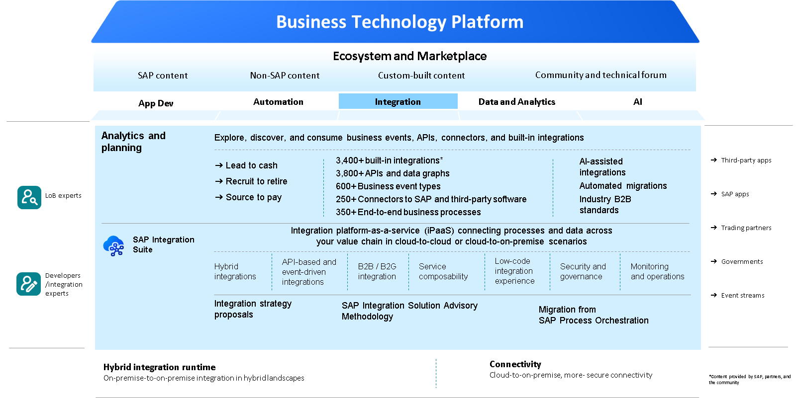
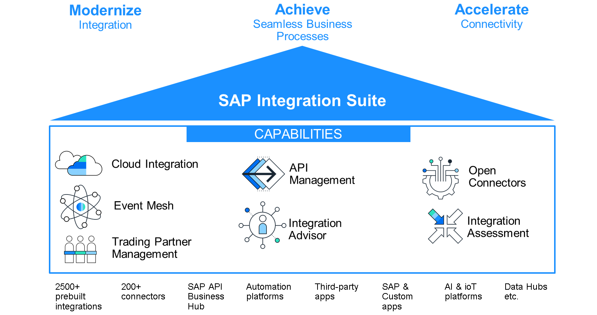
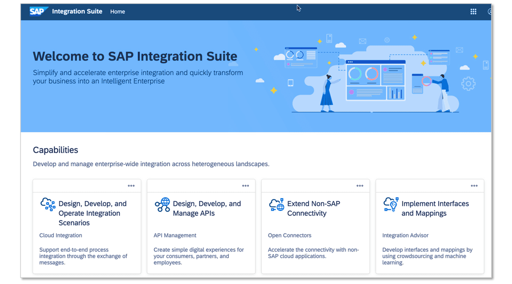
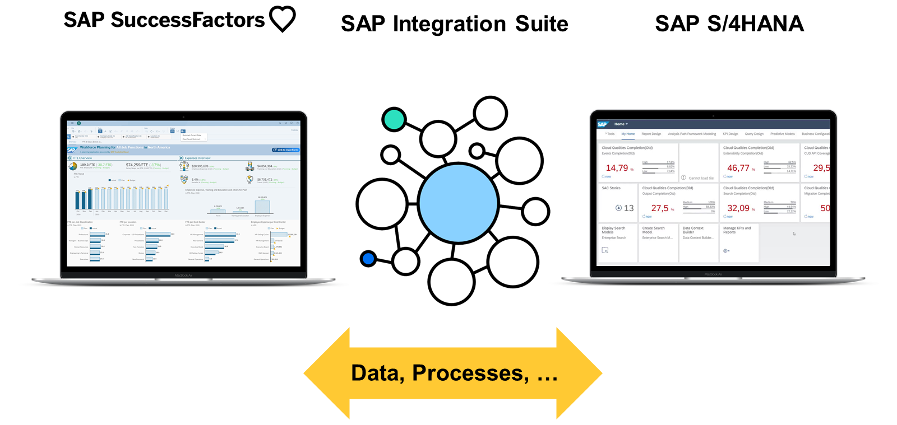

# ♠ 1 [ILLUSTRATING SAP INTEGRATION SUITE](link)

> :exclamation: Objectifs
>
> - [ ] Identify the capabilities of SAP Integration Suite.
>
> - [ ] Identify the potential use-cases for SAP Integration Suite.

## :closed_book: SAP INTEGRATION SUITE

Pour que votre entreprise intelligente et durable bénéficie d'un environnement informatique entièrement connecté, vous devez intégrer les solutions logicielles. Avec SAP Integration Suite, vous disposez d'une plateforme d'intégration en tant que service (iPaaS) qui vous permet d'intégrer en toute transparence des applications et processus sur site et dans le cloud avec des outils et du contenu pré-conçus gérés par SAP.

### SAP INTEGRATION SUITE

#### :small_red_triangle_down: Modernize integration and future-proof your integration strategy :

- Réduisez la complexité grâce au développement optimisé par l'IA et aux recommandations intégrées aux outils.

- Déployez en toute confiance et sécurité grâce à un environnement cloud natif géré par SAP.

- Activez les intégrations B2B assistées par l'IA grâce aux bibliothèques d'échange de données informatisées (EDI) et au cadre de reconnaissance les plus répandus.

#### :small_red_triangle_down: Achieve seamless business processes at scale :

- Créez et innovez vos processus en toute flexibilité grâce à l'intégration pilotée par API.

- Répondez plus rapidement aux besoins de vos clients, employés et partenaires grâce au traitement en temps réel.

- Intégrez des applications dans divers environnements et écosystèmes applicatifs.

#### :small_red_triangle_down: Accelerate connectivity of your business processes :

- Adoptez une approche systémique pour résoudre les problèmes d'intégration courants grâce à des conseils intégrés.

- Soutenez DevOps et simplifiez la gestion du cycle de vie des artefacts d'intégration.

- Simplifiez les intégrations SAP, tierces et e-gouvernement grâce à des milliers d'intégrations et de connecteurs prédéfinis.

Vous trouverez ici les dernières descriptions et informations sur la [suite d'intégration SAP](https://www.sap.com/products/integration-suite.html).

Vous pouvez consulter la [présentation de la solution ici](https://www.sap.com/products/technology-platform/integration-suite.html?pdf-asset=60fd26c5-e37c-0010-82c7-eda71af511fa&page=1).

### BUILT OF THE SAP BUSINESS TECHNOLOGY PLATFORM INTEGRATION SUITE

La suite SAP Integration Suite comprend un ensemble d'outils conçus pour simplifier l'intégration d'environnements hybrides, de grande envergure et hétérogènes.

Le service SAP Integration Suite sur SAP BTP propose quatre fonctionnalités principales :

#### :small_red_triangle_down: Cloud Integration :

- Intégration d'applications hybrides et cloud offrant une interface web intuitive avec des modèles intégrés prenant en charge les scénarios A2A et B2B/B2G pour SAP et non SAP.

- Technologie cloud avec une forte priorité en matière de sécurité et de disponibilité de l'infrastructure.

- Contenu d'intégration pré-packagé pour accélérer les projets d'intégration et gagner en productivité rapidement, avec possibilité d'extension pour inclure des exigences personnalisées.

- Capacité d'intégration aux réseaux d'entreprise au sein d'un vaste écosystème.

#### :small_red_triangle_down: API Management :

- Design your APIs based on open standards like Open API specification and OData.

- Develop your APIs by exposing and composing back-end interfaces from apps or middleware.

- Protect your APIs from security threats, manage traffic, and cache your data on the edge with 40+ in-built policies.

- Monitor and analyze your API usage, performance, and error handling.

- Engage with application developers and monetize your digital assets through APIs.

#### :small_red_triangle_down: Open Connectors :

- Connecteurs prêts à l'emploi pour plus de 170 applications non SAP.

- Sélectionnez les connecteurs dont vous avez besoin et authentifiez-vous auprès des fournisseurs.

- Créez vos propres connecteurs avec des fonctionnalités normalisées, comme l'authentification, la pagination, la gestion des erreurs et la recherche.

#### :small_red_triangle_down: Integration Advisor :

- Service de proposition avec approche d'apprentissage automatique.

- Apprentissages participatifs.

- Génération automatique de documentation et d'artefacts d'exécution.

- Collaboration communautaire pour la création et la maintenance d'interfaces d'intégration et de mappings sur mesure.

> Note
>
> SAP Integration Suite est un service multicloud géré par SAP qui offre la flexibilité d'exécuter les mêmes artefacts d'intégration dans plusieurs environnements. De plus, l'intégration est simplifiée grâce à la puissance de l'intelligence artificielle.

### LEARN MORE

Vous pouvez également utiliser la page d'aide pour des [informations supplémentaires](https://help.sap.com/viewer/product/SAP_CLOUD_PLATFORM_INTEGRATION_SUITE/sap.cp.integration.suite/en-US).

## :closed_book: SAP INTEGRATION SUITE EXAMPLE USE CASES

En tant qu'entreprise intelligente et durable, vous devez intégrer l'ensemble de vos applications et processus métier pour créer un environnement parfaitement intégré.

Pour combiner et intégrer ces solutions, vous pouvez utiliser SAP Integration Suite et ses scénarios prêts à l'emploi. Vous pouvez ainsi adapter votre environnement système à vos besoins.

De plus, vous pouvez utiliser les fonctionnalités de connecteurs ouverts de SAP Integration Suite pour intégrer des applications non SAP à cet environnement.

Pour en savoir plus sur les connecteurs ouverts, cliquez ici.

Pour en savoir plus sur SAP Integration Suite, consultez notre parcours de formation gratuit : Développer avec SAP Integration Suite.

## :closed_book: KEY TAKEWAYS OF THIS LESSON

SAP Integration Suite est un service de SAP BTP permettant d'intégrer vos processus métier et vos applications. Vous pouvez utiliser une intégration prête à l'emploi, des connecteurs ouverts ou des fonctionnalités d'intégration globales. Vous pouvez également utiliser l'intégration pilotée par l'IA pour simplifier le développement de scénarios d'intégration. SAP Integration Suite est la solution idéale pour tous vos scénarios d'intégration.
