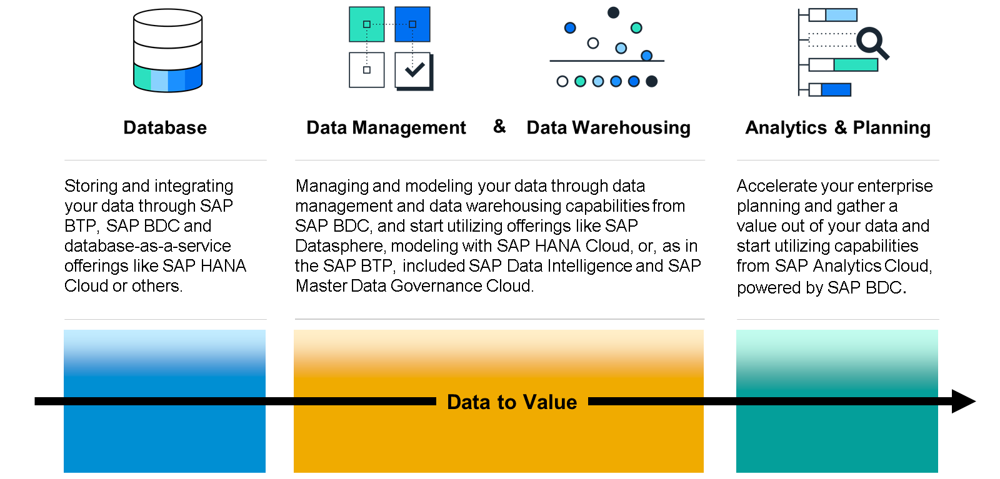

# ♠ 1 [ILLUSTRATING THE DATA-TO-VALUE CONCEPT](https://learning.sap.com/learning-journeys/discover-sap-business-technology-platform/illustrating-the-data-to-value-concept_d4870f17-b23d-4a3e-8219-2fb0985cf9c8)

> :exclamation: Objectifs
>
> - [ ] illustrate the data-to-value portfolio.

## :closed_book: INTRODUCTION TO DATA AND ANALYTICS

### BUSINESS INTRODUCTION

Votre entreprise a besoin d'une base de données fiable et performante pour créer des développements personnalisés, gérer les données à des fins d'analyse et étendre les capacités sur site grâce aux fonctionnalités du cloud. SAP HANA est la principale offre SAP pour ces cas d'usage. Aujourd'hui, les données sont plus importantes que jamais. Mais même les meilleures données collectées n'ont aucune valeur si elles ne sont pas exploitées.

Chez SAP, nous appelons « data-to-value » le processus visant à optimiser la valeur de vos données. Notre combinaison de capacités de données et d'analyse est essentielle à ce processus. Vous souhaitez analyser ou agréger vos données afin d'obtenir des informations utiles à une meilleure planification. Votre entreprise a besoin d'une solution d'entreposage de données et d'analyse pour créer des tableaux de bord, raconter des histoires et obtenir des informations plus approfondies.

## :closed_book: DATA TO VALUE

La plateforme technologique SAP Business offre une stratégie de persistance unique pour toutes les innovations axées sur les données, afin de les transformer en valeur. Votre entreprise dispose de plusieurs espaces de stockage de données. De plus, des cas d'utilisation requièrent des fonctionnalités de base de données. Or, les données n'ont aucune valeur si elles ne sont pas correctement stockées, intégrées, modélisées, partagées et analysées. La plateforme technologique SAP Business offre les éléments clés pour répondre à ce besoin, avec des fonctionnalités de stockage, de gestion, d'entreposage et d'analyse des données, ainsi que de planification d'entreprise, principalement via SAP Business Data Cloud. Elle inclut des technologies telles que SAP HANA Cloud Date Lake, SAP Datasphere et SAP Analytics Cloud.

### CONCEPT OF DATA TO VALUE

Commencez dès aujourd'hui à exploiter pleinement vos données. Vous augmenterez ainsi vos chances de croissance et d'adaptation grâce à une meilleure analyse et une planification optimisée, basées sur une intégration, une préparation et une modélisation efficaces des données avec les solutions de bases de données et de gestion des données SAP.

## :closed_book: ADVANTAGES OF SAP BUSINESS DATA CLOUD

Les organisations qui prennent des décisions basées sur les données sont aujourd'hui confrontées à trois défis majeurs :

1. Réaliser des activités complexes de gestion des données couvrant plusieurs systèmes et des environnements informatiques hautement distribués

2. Faciliter la collaboration entre les équipes d'analyse et de science des données

3. Connecter les analyses et les informations générées par l'IA pour obtenir des impacts significatifs

SAP Business Data Cloud a été conçu pour répondre à ces défis clés.

SAP centralise les données issues de sources SAP et non SAP dans une couche sémantique unifiée, ouvrant ainsi une nouvelle dimension d'analyse, d'analyse avancée et de capacités d'IA. En intégrant les données interentreprises, les entreprises obtiennent des informations exploitables pour harmoniser les processus transactionnels et stimuler la croissance grâce à l'IA. Les agents d'IA de SAP exploitent des données précises et riches en contexte, issues de systèmes SAP et non SAP, pour offrir une automatisation avancée, une collaboration inter-solutions fluide et une prise de décision innovante, permettant aux entreprises de s'adapter, d'innover et de prospérer à grande échelle. Chaque secteur de l'entreprise est profondément connecté, alimentant le monde numérique d'aujourd'hui.

Comme SAP BTP, SAP Business Data Cloud dispose également de son propre cockpit. Cependant, ce SAP Business Data Cloud Cockpit diffère dans ses fonctionnalités en fournissant des capacités spécifiques pour la configuration de SAP Business Data Cloud et pour la navigation et l'installation des Insight Apps.

#### :small_red_triangle_down: Out-of-the-box reporting :

SAP Business Data Cloud offre un reporting puissant et prêt à l'emploi avec Insight Apps, permettant d'obtenir des informations métier en un clic pour une prise de décision éclairée. Contrairement aux solutions traditionnelles, SAP gère intégralement tous les artefacts, objets et étapes de processus, garantissant ainsi une gestion et un provisionnement automatisés des données, ainsi que des informations métier prêtes à l'emploi.

#### :small_red_triangle_down: One solution for all data and analytics requirements :

SAP Business Data Cloud est une solution SaaS (Software as a Service) offrant les services de données et d'analyse nécessaires au monde moderne. Associée à SAP Business Technology Platform, qui fournit des services fondamentaux, SAP Business Data Cloud regroupe des solutions stratégiques telles que SAP HANA Cloud, SAP Datasphere et SAP Analytics Cloud, ainsi que leurs fonctionnalités, au sein d'une solution unique.

#### :small_red_triangle_down: Single solution for diverse audiences and use cases :

SAP Business Data Cloud offre des outils complets pour répondre aux besoins en données et en analyse, notamment le reporting, la modélisation pilotée par l'IA, la gestion des données et la planification. En combinant l'intégration manuelle et l'IA des données avec des fonctionnalités de reporting innovantes, SAP Business Data Cloud répond aux besoins variés des entreprises modernes.

#### :small_red_triangle_down: End-to-end data lifecycle managed by SAP :

SAP Business Data Cloud va au-delà de la gestion SaaS traditionnelle en intégrant, harmonisant et transformant les données métier des clients dans des applications SAP telles que SAP S/4HANA, SAP Customer Experience et SAP SuccessFactors. Pour garantir une utilisation fluide dans tous les scénarios et outils tiers, SAP traite ces données dans un environnement hyperscale avec nettoyage, harmonisation et enrichissement.

## :closed_book: KEY TAKEWAYS OF THIS LESSON

Commencez dès aujourd'hui à exploiter les fonctionnalités de SAP BTP pour valoriser vos données. Vous augmenterez ainsi vos chances de croissance et d'adaptation grâce à une meilleure analyse et une planification d'entreprise optimisée, basée sur une intégration, une préparation et une modélisation efficaces des données avec les bases de données, la gestion des données et les solutions d'analyse SAP.
