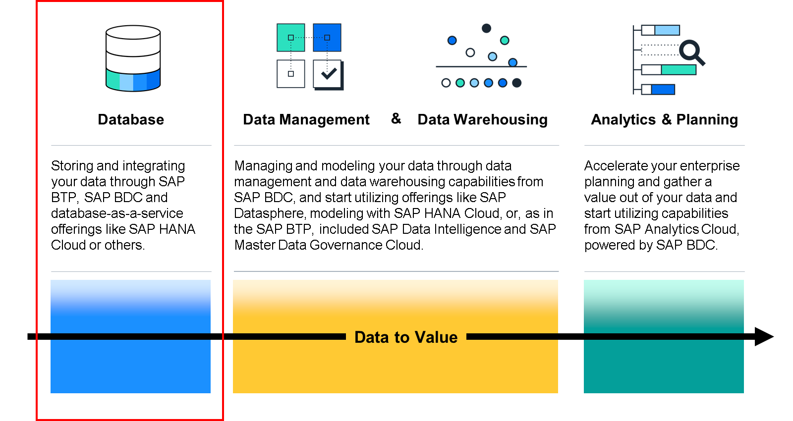
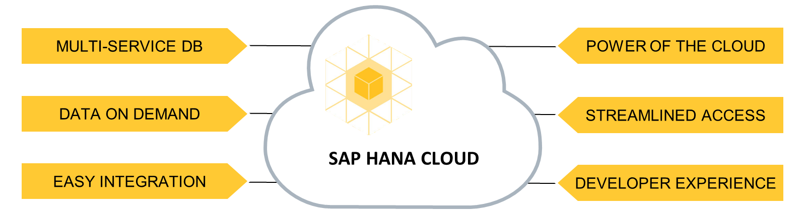
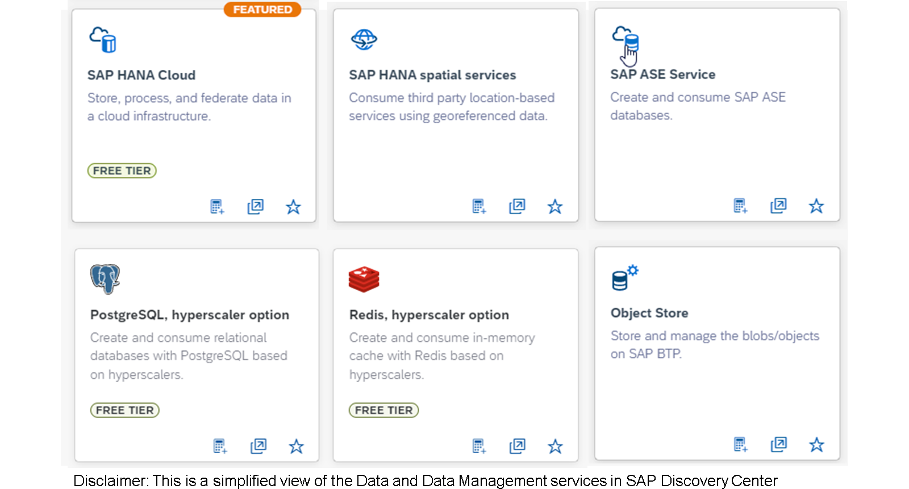

# ♠ 1 [DISCOVERING THE VALUE OF SAP HANA CLOUD AND OTHER DATABASE SERVICES](https://learning.sap.com/learning-journeys/discover-sap-business-technology-platform/discovering-the-value-of-sap-hana-cloud-and-other-database-services_e5c2f489-0cd3-452b-baa8-a06e396c7cba)

> :exclamation: Objectifs
>
> - [ ] Discover the value of SAP HANA Cloud.
>
> - [ ] Describe other SAP BTP database services.

## :closed_book: SAP HANA CLOUD

L'étape fondamentale du concept « Data to Value » consiste à stocker les données dans des systèmes de stockage tels que des bases de données. Le SAP BTP propose SAP HANA Cloud comme base de données stratégique de choix. Vous pouvez également enrichir votre SAP HANA Cloud avec des fonctionnalités de lac de données. Vous pouvez également utiliser des services comme SAP ASE as a service ou d'autres services comme un service de stockage d'objets. Cependant, restons concentrés sur SAP HANA Cloud.

### WHAT IS SAP HANA CLOUD?

SAP HANA Cloud est une base de données cloud multiniveaux en mémoire (DBaaS) entièrement gérée. En tant que socle de données cloud de SAP Business Technology Platform, SAP HANA Cloud intègre les données de toute l'entreprise, permettant ainsi une prise de décision plus rapide basée sur des données en temps réel. SAP HANA Cloud est l'un des quatre piliers de SAP Business Technology Platform et fournit des services de données permettant de gérer des volumes de données en constante augmentation de manière centralisée.

### SAP HANA CLOUD VALUE PROPOSITION

#### :small_red_triangle_down: Multi-Service Database :

Combinaison des qualités connues de SAP HANA telles que le traitement en mémoire, multi-modèle, hybride et analytique en temps réel avec des services à volume élevé et extrêmement axés sur les transactions.

#### :small_red_triangle_down: Data On Demand :

Toutes les données, quelle que soit leur taille, leur catégorie et leur complexité, sont à votre disposition à tout moment.

#### :small_red_triangle_down: Easy Integration :

Une couche d'accès unifiée pour simplifier le traitement des données tout en consolidant et en harmonisant l'intégration des données à vos applications intelligentes.

#### :small_red_triangle_down: Power Of The Cloud :

Les qualités du cloud telles que le faible coût total de possession, l'élasticité, les principes sans serveur, la haute disponibilité, la résilience et le comportement autonome.

#### :small_red_triangle_down: Streamlined Access :

Accès simplifié aux données, qui connecte toutes vos informations sans exiger que toutes les données soient chargées dans une solution de stockage unique.

#### :small_red_triangle_down: Developer Experience :

SAP HANA Cloud fournit un environnement de développement intégré dans lequel le développeur peut développer et modéliser des applications personnalisées.

### USE CASES FOR SAP HANA CLOUD

SAP HANA Cloud est au cœur de la stratégie de SAP visant à fournir une plateforme numérique de nouvelle génération capable d'alimenter les applications existantes et nouvelles, qu'elles soient sur site, dans le cloud ou hybrides. Ces applications peuvent être SAP ou non. SAP HANA Cloud peut être utilisé dans de nombreux scénarios informatiques différents. Examinons quelques exemples d'utilisation de SAP HANA Cloud :

- Fournir la base de données pour les applications de nouvelle génération qui nécessitent des performances ultra-rapides sur d'importants volumes de données à grande échelle ;

- Optimiser les entrepôts de données, notamment SAP Datasphere et les entrepôts de données personnalisés ; et optimiser les analyses, notamment SAP Analytics Cloud, en connectant et en coordonnant les données distribuées au sein d'un modèle de données unique et cohérent ;

- Étendre les capacités de stockage et de traitement des données des applications sur site, par exemple lors de l'intégration d'un grand nombre de nouveaux utilisateurs ;

- Étendre les fonctionnalités des applications SAP existantes grâce à des services cloud.

### LEARN MORE

Apprenez-en plus sur le provisionnement de [SAP HANA Cloud grâce à notre parcours d'apprentissage](https://learning.sap.com/learning-journeys/provision-and-administer-databases-in-sap-hana-cloud).

Pour en savoir plus sur SAP HANA Cloud, consultez la [page produit](https://www.sap.com/products/hana.html) ou le [SAP Discovery Center](https://discovery-center.cloud.sap/serviceCatalog/sap-hana-cloud?region=all).

## :closed_book: SAP BTP DATA SERVICES

Presque tous les types d'applications cloud peuvent être développés et exploités sur SAP Business Technology Platform. Outre l'utilisation de la puissante base de données in-memory SAP HANA, SAP Business Technology Platform permet également d'implémenter des fonctionnalités de données grâce à d'autres services tels qu'Object Store, Redis, l'option Hyperscaler ou PostgreSQL Service.

Pour découvrir tous les services existants en matière de bases de données et de gestion des données, cliquez [ici](https://discovery-center.cloud.sap/serviceCatalog?provider=all%C2%AEions=all&category=databaseanddatamanagement).

#### :small_red_triangle_down: Object Store :

Le service Object Store sur SAP BTP vous permet de stocker et de gérer des objets, ce qui implique leur création, leur chargement, leur téléchargement et leur suppression. Ce service est spécifique à la couche IaaS, comme Azure Blob Storage, Amazon Web Services et Google Cloud Platform.

#### :small_red_triangle_down: PostgreSQL, hyperscaler option :

PostgreSQL, option hyperscaler, fournit un service de base de données relationnelle managée basé sur les offres PostgreSQL natives de fournisseurs hyperscale comme AWS et Microsoft Azure. Grâce à ce service, vous pouvez provisionner et gérer des bases de données PostgreSQL sur des hyperscalers (AWS RDS PostgreSQL ou Azure Database for PostgreSQL) depuis SAP BTP et les lier à vos applications métier exécutées dans l'environnement Cloud Foundry.

#### :small_red_triangle_down: Redis on SAP BTP, hyperscaler option :

Redis sur SAP BTP (option hyperscaler) offre un service de stockage de données en mémoire géré, basé sur les offres Redis natives de fournisseurs hyperscale comme AWS et Microsoft Azure. Grâce à ce service, vous pouvez provisionner et gérer des instances de cache Redis sur des hyperscalers (AWS ElastiCache pour Redis ou Azure Cache pour Redis) depuis SAP BTP et les lier à vos applications métier exécutées dans notre environnement Cloud Foundry.

## :closed_book: KEY TAKEWAYS OF THIS LESSON

SAP HANA Cloud est une base de données cloud multiniveau en mémoire (DBaaS) entièrement gérée. Elle offre une plateforme numérique de nouvelle génération capable d'alimenter les applications existantes et nouvelles, sur site, dans le cloud ou en mode hybride. De plus, SAP Business Technology Platform inclut des fonctionnalités de stockage de données telles que l'Object Store, Redis, l'option hyperscaler ou le service PostgreSQL.
