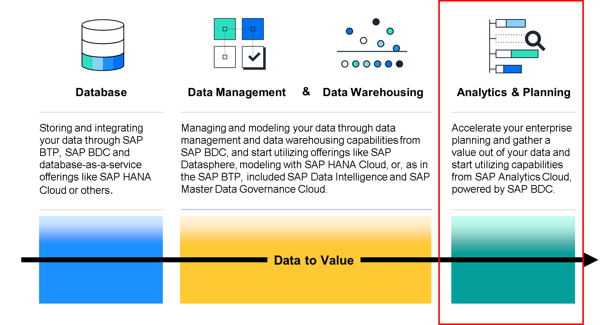
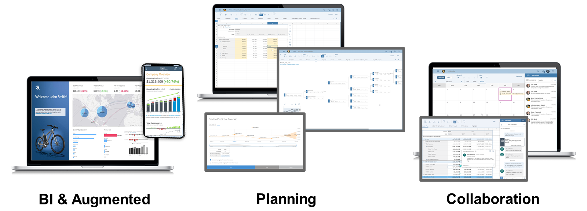

# ♠ 1 [DISCOVERING THE VALUE OF ENTERPRISE PLANNING AND ANALYTICS](https://learning.sap.com/learning-journeys/discover-sap-business-technology-platform/discovering-the-value-of-enterprise-planning-and-analytics_f7e31dca-3c31-4030-8355-1adcc7c7b355)

> :exclamation: Objectifs
>
> - [ ] identify the capability areas of SAP Analytics Cloud.

## :closed_book: SAP ANALYTICS CLOUD

La dernière phase de la valorisation des données consiste à exploiter les données préparées et gérées dans un logiciel d'analyse. Avec SAP Analytics Cloud, vous pouvez exploiter vos données pour obtenir des informations pertinentes et améliorer votre planification afin de prendre de meilleures décisions.

### THE ROLE OF SAP ANALYTICS CLOUD IN SAP BUSINESS DATA CLOUD

SAP Analytics Cloud est la solution front-end clé de SAP Business Data Cloud. Elle offre des fonctionnalités interactives de visualisation, de reporting et de planification des données. Son intégration permet aux utilisateurs d'exploiter les applications Insight standard, de créer des tableaux de bord personnalisés et de se connecter à diverses sources de données, notamment SAP Datasphere et Databricks. De plus, les connexions aux données en temps réel gérées par SAP garantissent un accès en temps réel sans stockage des données dans SAP Analytics Cloud.

### SAP ANALYTICS CLOUD FUNCTIONALITY

Au fil des ans, l'analyse des données a évolué : l'informatique réalisait la majeure partie des analyses, puis transmettait les résultats aux utilisateurs métier, puis les utilisait eux-mêmes pour analyser les données. SAP Analytics Cloud poursuit cette évolution en proposant une solution de business intelligence cloud en libre-service, avec planification intégrée et fonctionnalités étendues.

SAP Analytics Cloud connecte vos collaborateurs, vos informations et vos idées pour une prise de décision rapide et fiable. Vous pouvez même donner accès à du contenu analytique sur site, notamment à la suite SAP BusinessObjects Business Intelligence et à des solutions tierces. De plus, grâce au cloud, les utilisateurs n'ont besoin que d'un navigateur et d'un accès SAP Analytics Cloud approprié pour travailler avec SAP Analytics Cloud sur ordinateur ou appareil mobile.

Résumons les trois domaines de fonctionnalités suivants :

#### :small_red_triangle_down: BI & Augmented :

SAP Analytics Cloud propose actuellement plusieurs outils d'analyse, de reporting et de synthèse des données, comme les Analytics Hubs, la Digital Boardroom, Smart Insights, Smart Predict, et bien d'autres.

Grâce à des fonctionnalités d'analyse augmentée optimisées par l'intelligence artificielle et le machine learning, vous pouvez obtenir automatiquement des informations à tous les niveaux de détail. Accélérez votre croissance en identifiant automatiquement les facteurs clés des résultats passés pour simuler des scénarios futurs et prédire les résultats.

L'intégration à Microsoft Office ou Microsoft 365 est également possible.

#### :small_red_triangle_down: Planning :

Grâce aux fonctionnalités de planification de SAP Analytics Cloud, vous pouvez produire des plans, des budgets, des prévisions et des rapports en temps opportun, avec plus de rapidité et de précision. Automatisez vos prévisions avec les actions de données à tous les niveaux de vos plans pour gagner du temps et obtenir des résultats fiables grâce à l'analyse prédictive et au machine learning. Simulez plusieurs résultats avec les arbres de facteurs de valeur pour visualiser l'impact de vos facteurs de performance dans un environnement sandbox. Utilisez des versions privées pour collaborer avec vos équipes sur des analyses de simulation.

#### :small_red_triangle_down: Collaboration :

Les fonctionnalités de collaboration de SAP Analytics Cloud sont conçues pour faciliter et optimiser le travail en équipe, quel que soit l'emplacement de leurs membres.

Ces fonctionnalités incluent, par exemple, un chat contextuel, une simulation d'approbation des données, des notifications, etc.

> Plus d'informations sur SAP Analytics Cloud : Découvrir [SAP Analytics Cloud | SAP Learning](https://learning.sap.com/learning-journeys/exploring-sap-analytics-cloud)

## :closed_book: KEY TAKEWAYS OF THIS LESSON

La dernière phase de Data To Value concerne la planification d'entreprise et l'utilisation des données préparées. SAP Analytics Cloud présente la couche de consommation basée sur de puissantes fonctionnalités de narration, de visualisation, de prévision et de planification d'entreprise.
