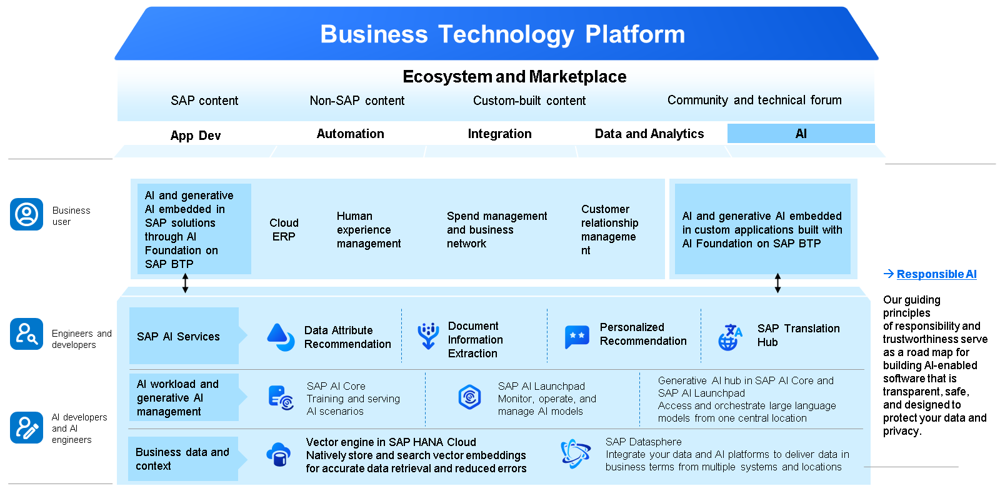
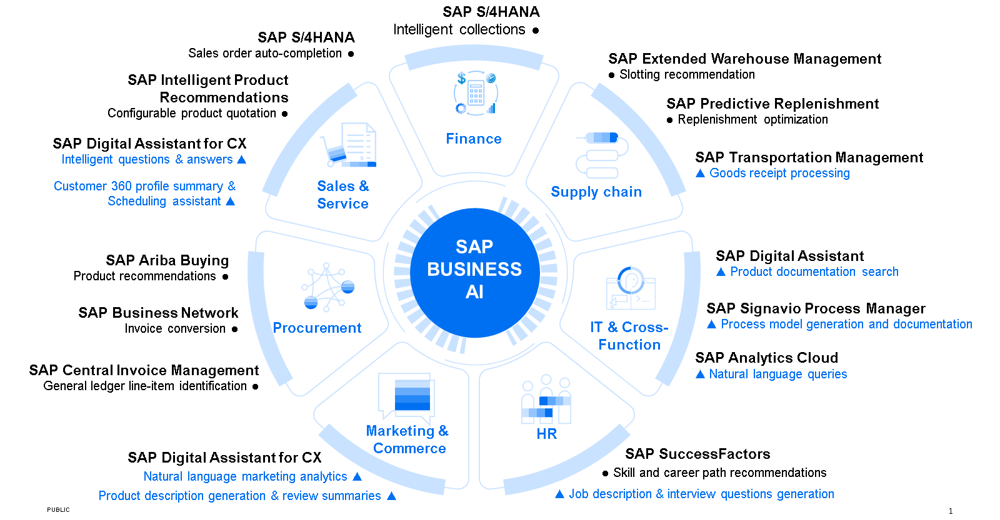

# ♠ 1 [DESCRIBING SAP BUSINESS AI](https://learning.sap.com/learning-journeys/discover-sap-business-technology-platform/describing-artificial-intelligence-ai-_f6c2ab8d-2fa1-45db-9895-ac84b635ced5)

> :exclamation: Objectifs
>
> - [ ] Describe Artificial Intelligence (AI) in scope of SAP BTP.
>
> - [ ] Analyze SAP Business AI.

## :closed_book: ARTIFICIAL INTELLIGENCE - INTRODUCTION

Vous pouvez exploiter l'intelligence artificielle grâce à des services s'exécutant sur SAP BTP et rendant vos projets plus innovants et flexibles pour résoudre des problèmes métier complexes. Vous exploitez une IA basée sur des normes d'éthique et de confidentialité des données de pointe, tout en maintenant une gouvernance et une gestion du cycle de vie complètes à l'échelle de votre organisation. SAP propose de nombreux produits intégrant l'intelligence artificielle. Il s'agit de processus et solutions métier intégrés à l'IA. Il existe également d'autres solutions logicielles autonomes utilisant l'intelligence artificielle :

#### :small_red_triangle_down: SAP AI Services :

Automatisez les processus métier pour enrichir l'expérience client en utilisant SAP AI Business Services.

#### :small_red_triangle_down: SAP AI Launchpad :

SAP AI Launchpad est une application SaaS (Software as a Service) multi-locataires de SAP Business Technology Platform. Clients et partenaires peuvent utiliser SAP AI Launchpad pour gérer des cas d'utilisation (scénarios) d'IA sur plusieurs instances d'environnements d'exécution d'IA (comme SAP AI Core).

#### :small_red_triangle_down: SAP AI Core :

SAP AI Core est un service de la plateforme technologique commerciale SAP conçu pour gérer l'exécution et les opérations de vos actifs d'IA.

#### :small_red_triangle_down: SAP HANA Cloud :

SAP HANA Cloud intègre plusieurs bibliothèques de machine learning, conçues et optimisées pour le traitement parallèle massif en mémoire. SAP HANA Cloud propose deux composants principaux utilisables pour le machine learning :

- PAL – Bibliothèque d'analyse prédictive

- APL – Bibliothèque prédictive automatisée

Le moteur vectoriel de SAP HANA Cloud optimise l'IA générative en utilisant la génération augmentée par récupération et en intégrant des vecteurs pour le contexte. Cela pourrait, par exemple, aider un détaillant à comprendre les habitudes d'achat de ses clients à partir de données de vente. Il affine les modèles de langage volumineux en obtenant des informations actualisées à partir d'une base de connaissances externe et offre un aperçu des processus génératifs. Il effectue également des recherches vectorielles et intègre ces résultats à d'autres opérations SQL.

#### :small_red_triangle_down: SAP Datasphere :

SAP Datasphere sert de plateforme centrale pour la collecte et le traitement de données provenant de sources diverses. Grâce à l'IA, non seulement le tri et l'analyse de ces données sont simplifiés, mais l'outil apprend également en permanence à anticiper les tendances, par exemple en anticipant les préférences des clients en fonction de leur comportement passé, ce qui permet de gagner un temps précieux.

> Apprenez-en plus sur SAP Datasphere dans cet article de [blog](https://blogs.sap.com/2021/09/28/using-machine-learning-capabilities-with-sap-hana-cloud/) ou dans la [documentation officielle](https://help.sap.com/docs/HANA_CLOUD/db19c7071e5f4101837e23f06e576495/502e458a260d4445810e6b9094c5b7e7.html?locale=en-US).

### LEARN MORE

Pour en savoir plus : [Intelligence artificielle](https://www.sap.com/products/artificial-intelligence.html)

Par ailleurs, SAP souhaite résoudre des problèmes métier complexes grâce à l'intelligence artificielle, de manière responsable et éthique. Pour en savoir plus, [cliquez ici](https://www.sap.com/germany/products/artificial-intelligence/ai-ethics.html).

## :closed_book: SAP BUSINESS IA

SAP propose plusieurs scénarios d'intégration de l'intelligence artificielle (IA) aux processus métier et aux solutions SAP existantes. Vous pouvez ainsi exploiter certains des avantages de SAP Business AI sans recourir à une solution SAP supplémentaire. Optimisez immédiatement chaque aspect de votre activité grâce à des informations, des recommandations et une automatisation optimisées par l'IA. Outre l'intégration de l'IA à ses opérations, SAP exploite les capacités de l'IA générative. En l'adaptant aux données et processus métier, des résultats généralement génériques peuvent être personnalisés pour répondre aux besoins spécifiques de l'entreprise. Ces améliorations, qui incluent par exemple la création de requêtes en langage naturel et la génération de descriptions de poste ou de modèles de processus, sont intégrées aux applications métier courantes. Ce développement s'inscrit dans la lignée des principes d'IA standard de SAP, l'humain conservant la maîtrise des informations générées.

Vous pouvez améliorer les quatre principaux processus métier d'une entreprise intelligente et durable grâce à des scénarios d'IA intégrés. Transformer votre processus de recrutement et de départ à la retraite avec SAP AI pour associer étroitement l'expérience collaborateur aux objectifs de votre organisation et optimiser toutes les activités liées au recrutement, au développement de carrière, aux frais de déplacement, à la fidélisation et au départ à la retraite peut être réalisé grâce à des fonctionnalités intégrées telles que :

- Analyse intelligente des effectifs dans SAP S/4HANA.

- Vérification intelligente des CV dans SAP Fieldglass.

- Recommandations d'apprentissage dans SAP SuccessFactors.

- Et plus encore.

Transformez votre processus de prospection avec l'IA SAP, du premier contact marketing au service après-vente, en passant par chaque étape intermédiaire. Améliorez toutes les activités liées au marketing, aux ventes, au service client, à l'exécution des commandes, à la prestation de services, à la facturation et à la comptabilité clients grâce à des fonctionnalités intégrées telles que :

- Prédictions de performance intelligentes dans SAP S/4HANA.

- Scoring des opportunités dans SAP Sales Cloud.

- Détection des intrusions par l'IA dans SAP Customer Data Cloud.

- Et plus encore.

Transformez votre processus de conception à l'exploitation grâce à SAP AI pour rationaliser la fabrication et renforcer la gestion du cycle de vie des produits (PLM). Avec SAP AI, vous pouvez améliorer toutes les activités liées à l'identification, l'acquisition, la conception, le prototypage et la mise hors service des produits ou services grâce à des fonctionnalités telles que :

- Prévisions précises des dates de livraison dans SAP S/4HANA Cloud ;

- Prévisions des émissions dans SAP S/4HANA Cloud ;

- Inspections visuelles dans SAP Digital Manufacturing Cloud ;

- et plus encore.

Transformez votre processus d'approvisionnement avec SAP AI pour gagner en visibilité et en transparence sur l'ensemble de la chaîne d'approvisionnement. Optimisez toutes les activités liées à la gestion des achats et des sourcings, y compris la planification, la gestion des dépenses, la contractualisation, les achats, le paiement des fournisseurs et la collaboration, grâce à des fonctions optimisées par l'IA telles que :

- Nouvelles recommandations fournisseurs dans SAP Ariba ;

- Analyse prédictive pour la consommation des contrats dans SAP S/4HANA Cloud ;

- Enrichissement automatisé des données dans SAP Ariba ;

- et plus encore.

### LEARN MORE

Comme vous pouvez le constater, le portefeuille actuel de solutions SAP propose de nombreuses fonctionnalités utilisant l'intelligence artificielle. Pour en savoir plus sur l'IA métier et les scénarios d'intégration de l'IA, cliquez ici : produits : [intelligence-artificielle](https://www.sap.com/products/artificial-intelligence.html)

[Explorer-le-portefeuille-d-IA-métier-de-sap](https://learning.sap.com/learning-journeys/exploring-the-sap-business-ai-portfolio-1)

## :closed_book: KEY TAKEWAYS OF THIS LESSON

La stratégie de SAP consiste à intégrer l'intelligence artificielle à ses produits et technologies existants. Vous pouvez par exemple utiliser des prédictions basées sur l'IA dans SAP Analytics Cloud. En tant qu'un des premiers utilisateurs potentiels de l'intelligence artificielle, vous pouvez vous démarquer de vos concurrents : l'utilisation de ces technologies et produits peut faire de vous un innovateur dans votre domaine.
