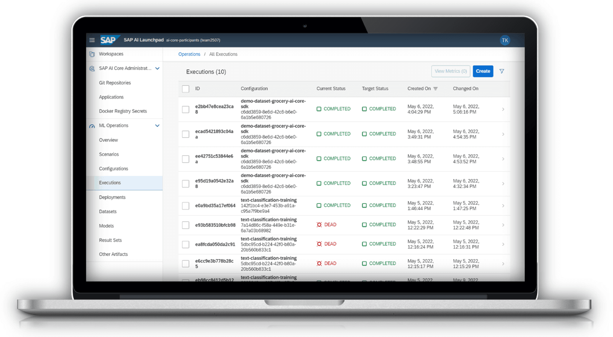

# ♠ 1 [DESCRIBING SAP AI CORE & SAP AI LAUNCHPAD](https://learning.sap.com/learning-journeys/discover-sap-business-technology-platform/describing-sap-ai-core-and-sap-ai-launchpad_bba91b98-2df6-419d-93ab-f2a4eb741224)

> :exclamation: Objectifs
>
> - [ ] Describe the SAP AI Core.
>
> - [ ] Describe the AI Launchpad.

## :closed_book: THE SAP AI CORE

SAP AI Core est l'environnement d'exécution SAP pour l'IA lourde. Il vous permet d'entraîner et de déployer vos modèles d'IA de manière rentable et à grande échelle. Bénéficiez de performances accélérées grâce à la prise en charge des GPU, tout en garantissant une rentabilité optimale grâce à un large choix de forfaits de stockage, de CPU et de GPU, ainsi qu'à la mise à l'échelle automatique et à la mise à l'échelle zéro intégrées.

De plus, vous bénéficiez de déploiements de modèles gérés par SAP qui vous épargnent la complexité de la gestion des déploiements et exposent simplement un point de terminaison d'API que vous pouvez intégrer et utiliser dans vos applications métier. Vous pouvez intégrer vos cas d'utilisation d'IA basés sur SAP AI Core via l'API IA unifiée.

L'API IA n'est pas un produit, mais une définition d'API unifiée implémentée par les environnements d'exécution d'IA, tels que SAP AI Core, et à laquelle les applications consommatrices peuvent se connecter. Grâce à cette définition d'API unifiée, vous bénéficiez d'une consommation unifiée dans vos applications métier, ainsi que d'opérations et d'une gestion unifiées dans SAP AI Launchpad.

### LEARN MORE

Pour en savoir plus sur SAP AI Core, consultez la [documentation officielle](https://help.sap.com/docs/AI_CORE?locale=en-US) ou le [SAP Discovery Center](https://discovery-center.cloud.sap/serviceCatalog/sap-ai-core/?service_plan=standard&region=all&commercialModel=cpea).

Le parcours d'apprentissage suivant aborde [SAP AI Core plus](https://learning.sap.com/learning-journeys/learning-how-to-use-the-sap-ai-core-service-on-sap-business-technology-platform) en détail.

## :closed_book: THE SAP AI LAUNCHPAD

SAP AI Launchpad est l'application centrale pour accéder à vos cas d'utilisation d'IA et les gérer. Connectez-vous à plusieurs environnements d'exécution via l'API IA unifiée et rationalisez la gestion du cycle de vie de vos cas d'utilisation dans SAP AI Launchpad. D'une part, vous bénéficiez de la centralisation de la gestion de votre cycle de vie d'IA dans un outil unique et, d'autre part, du cycle de vie unifié de l'IA dans l'API IA, sans avoir à connaître les détails spécifiques à chaque service.

De plus, vous pouvez surveiller en continu vos modèles dans SAP AI Launchpad et améliorer leurs performances grâce aux informations obtenues. Vous pouvez capturer les métriques de vos exécutions d'entraînement, les comparer entre les modèles et les visualiser sous forme de graphiques pour une compréhension plus approfondie. Cela vous permet d'identifier les configurations offrant des performances optimales.

### LEARN MORE

Apprenez-en plus sur SAP AI Launchpad dans la [documentation officielle](https://help.sap.com/docs/AI_LAUNCHPAD?locale=en-US) ou dans le [SAP Discovery Center](https://discovery-center.cloud.sap/serviceCatalog/sap-ai-launchpad/?service_plan=standard&region=all&commercialModel=cpea).

## :closed_book: KEY TAKEWAYS OF THIS LESSON

SAP vous offre tout le nécessaire pour développer vos propres applications en exploitant l'intelligence artificielle. SAP AI Core vous permet d'entraîner et de déployer vos propres modèles d'IA, et grâce à SAP AI Launchpad, vous pouvez facilement administrer et superviser tous vos cas d'utilisation d'IA. Votre entreprise réalise ainsi des économies grâce à la mise en œuvre de vos modèles basés sur l'IA, un gain de temps et une garantie de conformité et de gouvernance.
