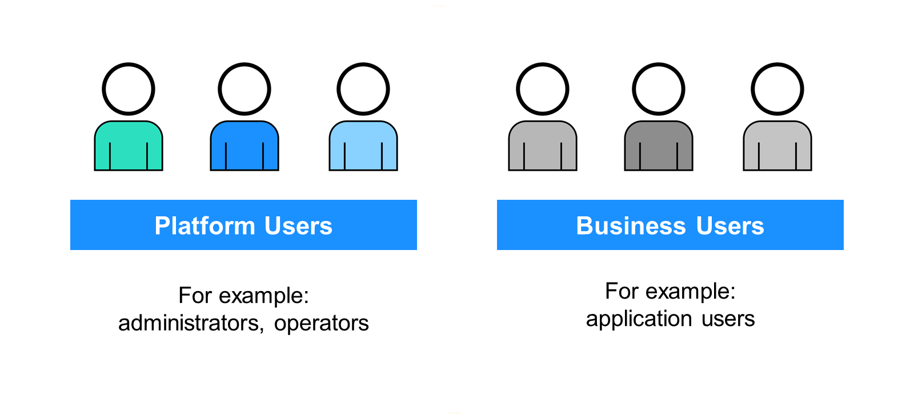
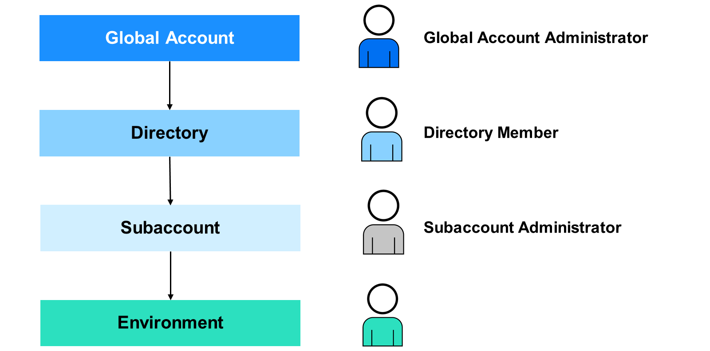
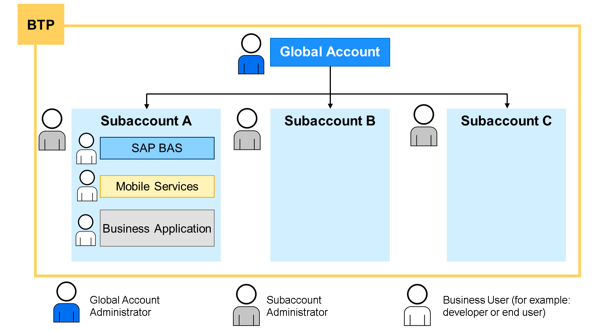
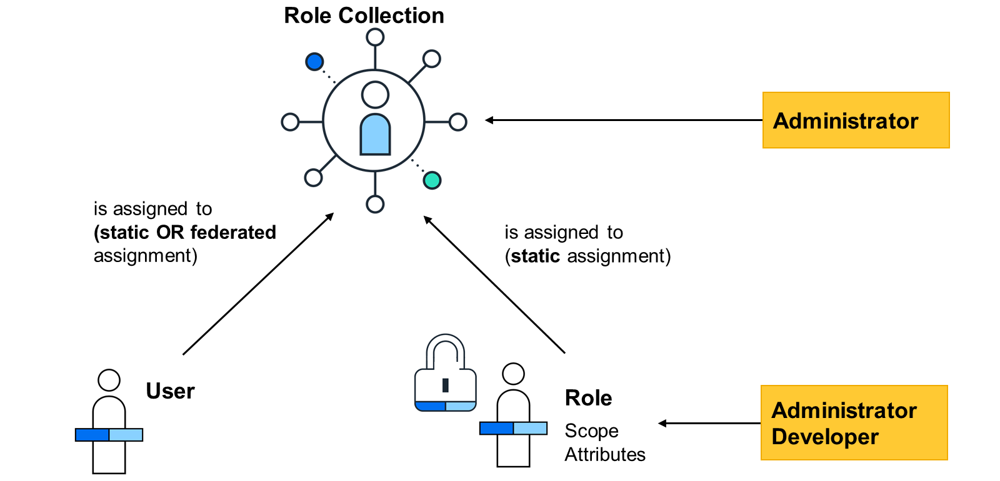

# ♠ 1 [ANALYSING USER AND AUTHORIZATION MANAGEMENT ON SAP BTP](https://learning.sap.com/learning-journeys/discover-sap-business-technology-platform/analyzing-user-and-authorization-management-on-sap-btp_d4e915e7-6a41-4bea-a17b-157566045563)

> :exclamation: Objectifs
>
> - [ ] Describe the user management on SAP BTP.
>
> - [ ] Describe the role and authorization management on SAP BTP.

## :closed_book: BUSINESS INTRODUCTION TO USER AND AUTHORIZATION MANAGEMENT

[Link Video](https://learning.sap.com/learning-journeys/discover-sap-business-technology-platform/analyzing-user-and-authorization-management-on-sap-btp_d4e915e7-6a41-4bea-a17b-157566045563)

Face à la complexité croissante des environnements informatiques, la sécurité devient un enjeu crucial. Votre entreprise doit gérer les utilisateurs des applications (utilisateurs métier) et de la plateforme (administrateurs, opérateurs, etc.). Vous souhaitez attribuer des rôles et des autorisations, et centraliser la gestion des identités avec SAP Cloud Identity Services. Toutes les API et interfaces utilisées ou intégrées doivent également être sécurisées.

### USER AND AUTHORIZATION MANAGEMENT ON SAP BTP

SAP BTP distingue :

- Les utilisateurs de la plateforme sont généralement des administrateurs ou des opérateurs (DevOps) qui utilisent des outils de gestion cloud et déploient, administrent et dépannent des services sur SAP BTP. Il s'agit généralement d'utilisateurs qui se connectent directement au cockpit SAP BTP et y travaillent. Il peut également s'agir de développeurs qui travaillent et utilisent des services dans les espaces Cloud Foundry.

- Les utilisateurs métier utilisent les applications métier déployées sur SAP BTP. Par exemple, les utilisateurs finaux d'une application personnalisée déployée ou les utilisateurs d'applications ou de services souscrits, tels que SAP Business Application Studio, sont des utilisateurs métier.

### PLATFORM USERS ON SAP BTP

SAP BTP est organisé en comptes globaux au plus haut niveau. Un compte global reflète un contrat avec SAP. Il peut être composé de plusieurs répertoires et/ou sous-comptes fournissant différentes applications et services aux utilisateurs. D'autres niveaux permettent une meilleure structuration et organisation du travail. Par exemple, si un compte global comporte trop de sous-comptes, vous pouvez créer des répertoires pour les structurer.

Les sous-comptes peuvent comporter jusqu'à trois environnements : Cloud Foundry, Kyma ou ABAP. Ces environnements permettent le développement et l'administration d'applications métier avec différentes approches et outils, selon votre choix. Bien entendu, au sein des environnements et de leur contenu, comme l'environnement d'exécution, les instances de service, etc., des utilisateurs sont également requis pour l'octroi des accès et des autorisations.

Tout utilisateur souhaitant utiliser les fonctionnalités de SAP BTP doit être affecté en tant qu'utilisateur aux autorisations spécifiques via des rôles. La gestion des utilisateurs s'effectue à tous les niveaux, du compte global aux environnements, en passant par les sous-comptes et les répertoires. À chaque niveau, un administrateur est requis pour gérer les ressources et les utilisateurs. La manière d'administrer présente quelques différences selon le niveau auquel vous vous trouvez.

### USER MANAGEMENT ON SAP BTP

Lorsqu'un client signe un contrat avec SAP, un utilisateur est créé au niveau du compte global. À ce niveau, les droits sont définis, attribuant des entités et des services, y compris les informations de facturation. L'administrateur du compte global peut initialement se connecter à SAP BTP pour gérer ces droits et créer des répertoires et des sous-comptes. Pour que plusieurs employés puissent administrer le compte global, l'administrateur doit créer d'autres utilisateurs au niveau du compte global et leur attribuer des autorisations d'administrateur.

En général, un compte global est composé de plusieurs sous-comptes. Lorsqu'un administrateur de compte global crée un sous-compte, il en devient automatiquement l'administrateur. Il peut gérer les droits, les abonnements aux services, créer d'autres utilisateurs au niveau du sous-compte et leur attribuer des rôles. Les administrateurs de sous-comptes disposent d'autorisations d'administration pour le sous-compte uniquement, et non pour le compte global.

Les administrateurs de sous-comptes créent également des utilisateurs métier. Les utilisateurs métier sont des consommateurs d'applications et de services fournis sur SAP BTP (par exemple : SAP Business Application Studio) ou d'applications métier (SaaS) créées à l'aide des outils et services fournis par SAP BTP. Ces utilisateurs ont accès à SAP BTP, mais ne peuvent effectuer aucune tâche administrative. Si un utilisateur métier n'utilise qu'une seule application sur SAP BTP, il n'a pas nécessairement besoin d'accéder au cockpit SAP BTP (c'est-à-dire au sous-compte), mais uniquement à l'application. Dans ce cas, l'administrateur du sous-compte crée l'utilisateur au niveau du sous-compte et lui attribue uniquement les autorisations d'application.

### LEARN MORE

Apprenez-en plus sur le [travail avec les utilisateurs dans SAP BTP dans la documentation officielle](https://help.sap.com/docs/BTP/65de2977205c403bbc107264b8eccf4b/2c91f88e60ea4677a076212085b42d02.html?locale=en-US).

## :closed_book: ROLES AND AUTHORIZATIONS

Pour utiliser les différentes fonctionnalités de SAP BTP, vous devez disposer d'une autorisation. Vous pouvez configurer les autorisations à l'aide de rôles et de collections de rôles.

### ROLE COLLECTIONS

Les collections de rôles sont constituées de rôles individuels combinant des autorisations pour les ressources et les services sur SAP BTP. Une collection de rôles peut comprendre un ou plusieurs rôles. Vous attribuez des collections de rôles uniquement aux utilisateurs, et non aux rôles individuels. Les rôles et leurs autorisations sont automatiquement attribués aux utilisateurs via l'attribution de collections de rôles. Les collections de rôles sont gérées séparément à chaque niveau SAP BTP. Les collections de rôles existant dans le compte global n'existent pas dans les sous-comptes. De même, les collections de rôles des sous-comptes ne sont pas disponibles dans le compte global.

SAP BTP propose déjà un ensemble prédéfini de collections de rôles pour les utilisateurs de la plateforme et des applications. Pour configurer l'accès administrateur des utilisateurs de la plateforme dans le compte global, les répertoires, les sous-comptes, etc., un administrateur SAP BTP d'un certain niveau attribue des collections de rôles prédéfinies aux autres utilisateurs de la plateforme.

Pour les utilisateurs d'applications pouvant être abonnées à SAP BTP, des collections de rôles prédéfinies sont également disponibles après l'abonnement à l'application. Il est également possible de créer des collections de rôles personnalisées contenant des rôles qui accordent des autorisations pour les applications personnalisées déployées sur SAP BTP.

### ROLES

Les rôles sont fournis par les services SAP BTP que vous utilisez et par les développeurs qui fournissent les modèles de rôles pour ces services. Une fois activés depuis le service, il est possible de personnaliser ces modèles de rôles. Dans de nombreux cas, cela n'est pas possible et vous devez utiliser les rôles fournis par le service pour les composer en collections de rôles et les attribuer aux utilisateurs. Il est également possible que les développeurs d'un service fournissent des modèles de collections de rôles, mais vous pouvez également créer vos propres collections de rôles.

### MORE INFORMATION FOR ASSIGNING ROLE COLLECTIONS

> Note
>
> All users of SAP BTP are stored in identity providers. How you assign users to their authorizations depends on the type of trust configuration with the identity provider. If you're using the default trust configuration with SAP ID service, you assign users directly to role collections. However, if you're using a custom identity provider, you can assign role collections to individual users directly, or you map role collections to user groups or other user attributes defined in the identity provider. This is called federation.

Le fournisseur d'identité personnalisé héberge des utilisateurs pouvant appartenir à des groupes. La fédération permet d'attribuer efficacement des collections de rôles à un ou plusieurs groupes d'utilisateurs. La collection de rôles contient toutes les autorisations nécessaires à ce groupe. Cette méthode permet de gagner du temps lors de l'ajout d'un nouvel utilisateur métier. Il suffit d'ajouter les utilisateurs à leurs groupes respectifs pour que les nouveaux utilisateurs métier obtiennent automatiquement toutes les autorisations incluses dans la collection de rôles.

### LEARN MORE

Pour plus d'informations, consultez la section [Attribution de collections de rôles](https://help.sap.com/viewer/65de2977205c403bbc107264b8eccf4b/Cloud/en-US/9e1bf57130ef466e8017eab298b40e5e.html).

## :closed_book: KEY TAKEWAYS OF THIS LESSON

SAP BTP intègre des fonctionnalités permettant de gérer les collections de rôles et de les attribuer aux utilisateurs de la plateforme ou aux utilisateurs métier qui consomment principalement les applications et services. Les utilisateurs de la plateforme SAP BTP doivent être gérés et attribués au niveau de l'architecture, avec des comptes globaux, des répertoires, des sous-comptes et des espaces.
