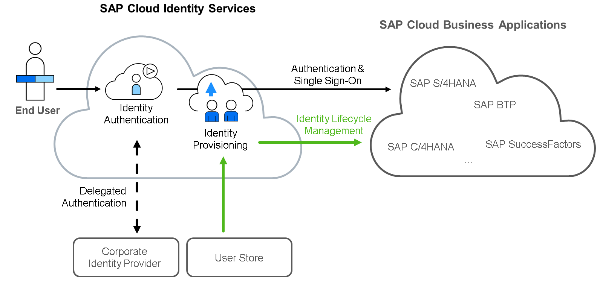
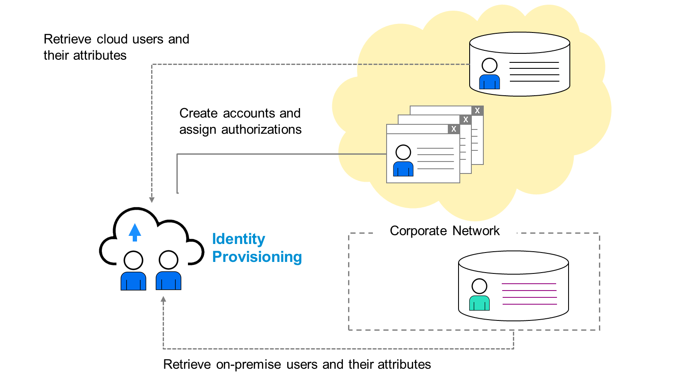
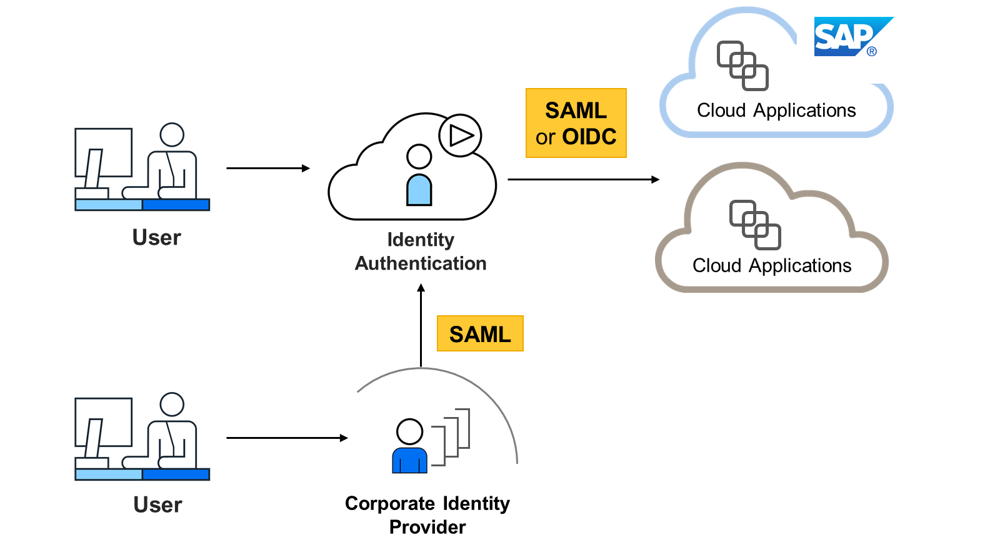

# ♠ 1 [ANALYZING SAP CLOUD IDENTITY SERVICES](https://learning.sap.com/learning-journeys/discover-sap-business-technology-platform/analyzing-sap-cloud-identity-services_b3e97772-7473-4634-9529-61a2e2d70338)

> :exclamation: Objectifs
>
> - [ ] Describe Identity Providers.
>
> - [ ] Analyze SAP Cloud Identity Services.

## :closed_book: IDENTITY PROVIDERS

Les applications et services de SAP BTP, et même le cockpit SAP BTP, ne stockent pas les informations utilisateur. Une redirection vers un fournisseur d'identité (IdP) est requise pour l'authentification. Ce concept permet de dissocier et de centraliser les fonctionnalités d'authentification des fonctionnalités applicatives et de la gestion des autorisations. SAP BTP offre la possibilité d'utiliser le service d'identification SAP ou des fournisseurs d'identité personnalisés de votre environnement informatique.

Le service d'identification SAP est le fournisseur d'identité par défaut de SAP BTP. Il s'agit d'un IdP public standard SAP préconfiguré (account.sap.com), partagé par tous les clients. Il dispose d'une connexion de confiance préconfigurée vers tous les sous-comptes SAP BTP. Le service d'identification SAP est entièrement géré et fourni par SAP. Vous ne pouvez créer qu'un utilisateur gratuit au sein de ce service. Le service d'identification SAP est également utilisé pour les sites SAP officiels, notamment la communauté des développeurs et partenaires SAP. C'est là que sont gérés les utilisateurs S, P et D.

Pour de nombreux clients, les utilisateurs peuvent être stockés dans un fournisseur d'identité d'entreprise. SAP recommande d'utiliser SAP Cloud Identity Services – Identity Authentication Service (IAS) comme hub.

Vous pouvez connecter IAS comme fournisseur d'identité personnalisé unique à SAP BTP. De plus, vous pouvez utiliser IAS pour intégrer les fournisseurs d'identité d'entreprise présents dans votre environnement informatique.

## :closed_book: SAP CLOUD IDENTITY SERVICES

SAP Cloud Identity Services comprend deux services : Authentification des identités et Provisionnement des identités. Le service d'Authentification des identités est principalement responsable de l'authentification et de l'authentification unique, tandis que le service de Provisionnement des identités gère le cycle de vie des identités, incluant les utilisateurs et les groupes (création, modification, suppression, etc.).

Pour plus d'informations sur [SAP Cloud Identity Services, cliquez ici](https://help.sap.com/docs/SAP_CLOUD_IDENTITY?locale=en-US) ou [ici](https://community.sap.com/topics/cloud-identity-services).

### SAP CLOUD IDENTITY SERVICES - IDENTITY PROVISIONING

Le service de provisionnement d'identités vous aide à provisionner des identités et leurs autorisations pour diverses applications métier, cloud et sur site. Il vous offre :

- Gérer les comptes utilisateurs et les autorisations ;

- Gestion des utilisateurs dans le cloud et sur site ;

- Gestion centralisée du cycle de vie des identités d'entreprise de bout en bout ;

- Administration rapide et efficace de l'intégration des utilisateurs.

- Et plus encore.

Pour en savoir plus sur SAP Cloud Identity Services - Provisionnement d'identités, cliquez ici.

### SAP CLOUD IDENTITY SERVICES - IDENTITY AUTHENTICATION

L'authentification d'identité offre un accès simple et sécurisé aux applications web grâce à diverses méthodes d'authentification, à tout moment et en tout lieu. Ce service, anciennement connu sous le nom de SAP Cloud ID Service, a pour mission de valider l'authentification entre les IdP et les applications elles-mêmes, en s'appuyant sur des normes ouvertes telles que SAML, SSO, etc.

> Note
>
> SAML
>
> Security Assertion Markup Language (SAML) est une norme de sécurité ouverte basée sur XML permettant l'échange de données d'authentification et d'autorisation entre des parties telles que les fournisseurs d'identité et les fournisseurs de services.
>
> SSO
>
> L'authentification unique (SSO) est un mécanisme permettant à l'utilisateur de se connecter à plusieurs systèmes avec un identifiant et un mot de passe uniques. Une authentification unique complète permet aux utilisateurs d'accéder à plusieurs systèmes en saisissant leurs identifiants une seule fois, par exemple au démarrage de l'ordinateur.

L'authentification d'identité vous offre :

#### :small_red_triangle_down: Secure and simple access through :

- Identity federation based on SAML 2.0.

- Web Single Sign-On SSO and desktop SSO.

- Social login and two-factor authentication.

- and more.

#### :small_red_triangle_down: User and access management :

- User administration and integration with on-premise user stores.

- User self-service, for example, password reset, registration, and user profile maintenance.

- Password and privacy policies.

- and more.

#### :small_red_triangle_down: IdP proxy features :

- Reuse of existing SSO infrastructure.

- Federation based on the SAML 2.0 standard.

- and more.

En savoir plus sur [SAP Cloud Identity Services - Authentification d'identité ici](https://help.sap.com/docs/IDENTITY_AUTHENTICATION?locale=en-US).

## :closed_book: KEY TAKEWAYS OF THIS LESSON

Les applications et services SAP BTP, et même le cockpit SAP BTP, ne stockent pas les informations utilisateur. Une redirection vers un fournisseur d'identité (IdP) est requise pour l'authentification. Le service d'identification SAP est le fournisseur d'identité par défaut de SAP BTP. Pour de nombreux clients, les utilisateurs peuvent être stockés chez un fournisseur d'identité d'entreprise. SAP recommande d'utiliser SAP Cloud Identity Services pour l'intégration. SAP Cloud Identity Services comprend deux services : Identity Authentication pour l'authentification et l'authentification unique, et Identity Provisioning pour la gestion du cycle de vie des identités.
