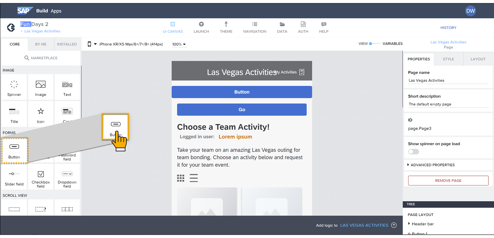
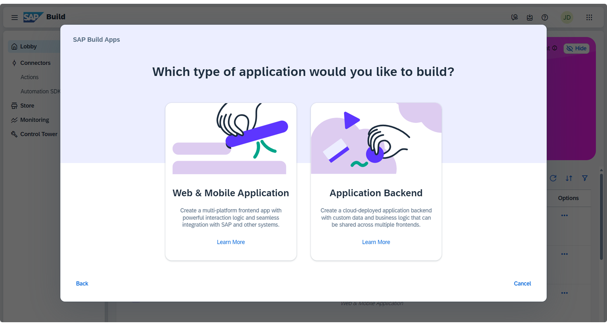
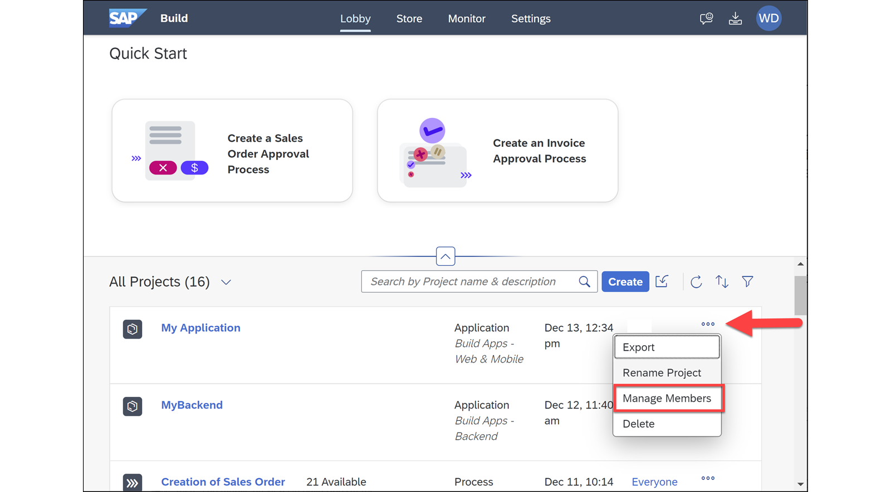

# ♠ 1 [PRESENTING SAP BUILD APPS AT A GLANCE](https://learning.sap.com/learning-journeys/compose-and-automate-with-sap-build-the-no-code-way/presenting-sap-build-apps-at-a-glance)

> :exclamation: Objectifs
>
> - [ ] Describe SAP Build apps

## :closed_book: SAP BUILD APPS

### INTRODUCTION

<video width="640" height="360" controls>
  <source src="./RESSOURCES/Presenting SAP Build Apps at a Glance.mp4" type="video/mp4">
  Votre navigateur ne supporte pas la vidéo.
</video>

Votre entreprise souhaite permettre aux utilisateurs professionnels, qui connaissent le mieux les processus quotidiens et comment les améliorer, de développer leurs propres extensions et applications SAP et de collaborer plus étroitement avec les professionnels de l'informatique dans le processus de développement.

### WHAT IS SAP BUILD APPS?

SAP Build Apps (anciennement SAP AppGyver) est une solution de développement visuel permettant de créer des applications d'entreprise sans code. Elle vous permet de :

- Créer des applications par glisser-déposer de composants prédéfinis, puis de les configurer selon vos besoins ;

- Se connecter à tous types de données back-end, y compris les systèmes SAP, via des destinations SAP BTP ;

- Créer une logique applicative, également par glisser-déposer de fonctions de flux et leur configuration.

SAP Build Apps est principalement utilisé pour concevoir des applications mobiles. Par défaut, le canevas sur lequel vous créez l'application a la forme d'un téléphone portable. Vous pouvez toutefois lui donner la forme de votre choix, ce qui vous permet également de concevoir des applications pour tablettes ou web.

Pour les développeurs ou les utilisateurs métier expérimentés en codage, SAP Build Apps permet également d'écrire de petits modules JavaScript lorsque de telles améliorations sont nécessaires.

### FRONT-ENDS VERSUS BACK-ENDS

Les applications peuvent être considérées comme composées de deux parties techniques :

- Le front-end, qui s'exécute sur la machine de l'utilisateur, généralement dans le navigateur ou dans une application sur son téléphone. Il gère ce que l'utilisateur voit et dispose de la logique permettant d'exécuter des actions en fonction de ses actions.

- Le back-end, qui est géré sur un serveur appelé par le front-end et qui contient les données de l'application, ainsi que la logique qui doit s'exécuter sur le serveur.

SAP Build Apps vous permet de créer des **Web & Mobile Applications** (interface utilisateur front-end et logique événementielle) et des **Application Back-ends** (données back-end et logique serveur).

Parfois, la totalité, voire la plupart, de vos données proviennent de SAP ou de systèmes externes, et toute la logique peut être gérée en amont. Mais il arrive souvent que votre application doive gérer ses propres données : données métier supplémentaires non stockées dans le système SAP, préférences utilisateur ou historique des actions des utilisateurs, pour ne citer que quelques exemples. Dans ce cas, vous pouvez créer votre propre back-end pour votre application.

