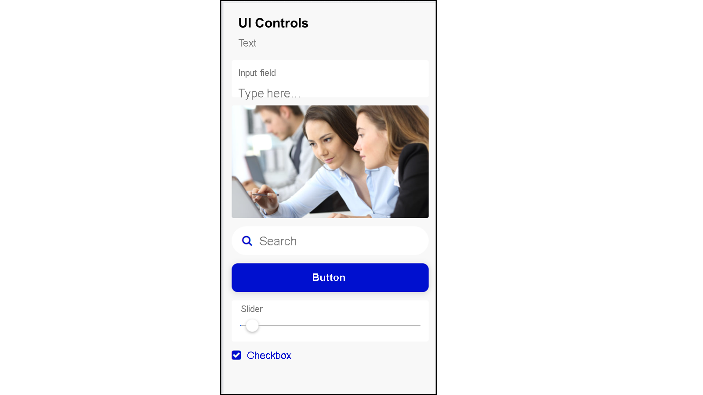

# ♠ 1 [CREATING APPLICATION USINGS SAP BUILD APPS](https://learning.sap.com/learning-journeys/compose-and-automate-with-sap-build-the-no-code-way/creating-applications-using-sap-build-apps)

> :exclamation: Objectifs
>
> - [ ] Identify the three parts of any application
>
> - [ ] Build the three parts of application

## :closed_book: THE THREE PARTS OF MOST APPS

La structure et la conception du développement d'applications ont évolué au fil des décennies pour créer un ensemble commun de domaines permettant de diviser le processus et le travail de création d'une application.

L'interface utilisateur (UI), la logique et les données sont les points les plus importants à prendre en compte lors de l'apprentissage de la création d'applications, puis lors de la planification de leur développement.

La vidéo suivante explique la structure et la conception du développement d'applications :

[Link Video](https://learning.sap.com/learning-journeys/compose-and-automate-with-sap-build-the-no-code-way/creating-applications-using-sap-build-apps)

## :closed_book: THE UI

Lors de la création de l'interface utilisateur, vous décidez comment l'utilisateur interagit avec l'application. Par exemple, il saisit des données, sélectionne des données dans une liste, affiche une liste hiérarchique de données, fait défiler une longue liste ou parcourt des pages de données, utilise des boutons radio ou des boutons bascule.

Vous pouvez également décider de l'organisation de ces composants sur la page ou de la présence de plusieurs pages.

Enfin, pour chaque composant ajouté à votre application, vous devez le configurer :

Quelle est sa taille, sa couleur ou sa position ?
D'où le composant obtiendra-t-il les données à afficher ? Par exemple, le texte d'un bouton peut être statique ou variable.

## :closed_book: DATA USAGE

Presque aucune application ne peut fonctionner sans une certaine quantité de données. Même un jeu, qui ne dispose souvent pas d'informations vitales stockées à long terme, doit conserver l'historique des utilisateurs et les classements. Pendant la partie, il doit suivre l'état actuel du jeu.

En particulier pour les applications que vous développez avec SAP Build Apps dans SAP BTP, vos données incluent celles des systèmes SAP. De plus, vous obtenez des informations provenant d'API publiques et externes, telles que la météo, les calendriers, les flux de médias sociaux, etc.

Dans l'application, vous devez spécifier les données à importer et fournir les informations de connexion pour ces données.

## :closed_book: USAGE OF THE LOGIC

Enfin, la logique détermine le comportement de l'application en fonction des modifications des données ou des actions de l'utilisateur.

L'emplacement central pour créer une logique se trouve dans le volet logique, où vous créez un flux d'actions déclenchées par un événement, par exemple :

- L'utilisateur clique sur un bouton.

- La valeur d'une variable change.

- Une page s'ouvre.

Pour les actions, SAP Build Apps fournit un ensemble de fonctions de flux qui exécutent des actions telles que :

- Afficher un message.

- Appeler une API pour récupérer des données.

- Ouvrir une page.

- Modifier la valeur d'une variable.

- Ouvrir l'appareil photo d'un appareil (ou toute autre action native du téléphone mobile).

### VISUAL CLOUD FUNCTIONS

La logique peut également être écrite sur le serveur. L'application front-end doit donc appeler le back-end pour exécuter la logique et renvoyer des données.

Créer la logique sur le serveur présente de nombreux avantages, notamment une sécurité accrue, la réutilisation du code et des performances accrues.

### SUMMARY

Les applications sont composées de trois parties : l'interface utilisateur (IU), la logique et les données. Vous pouvez envisager la conception de chacune de ces parties séparément lors de la conception de votre application et avant de commencer à la développer.
