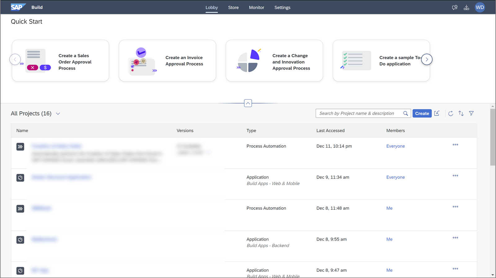
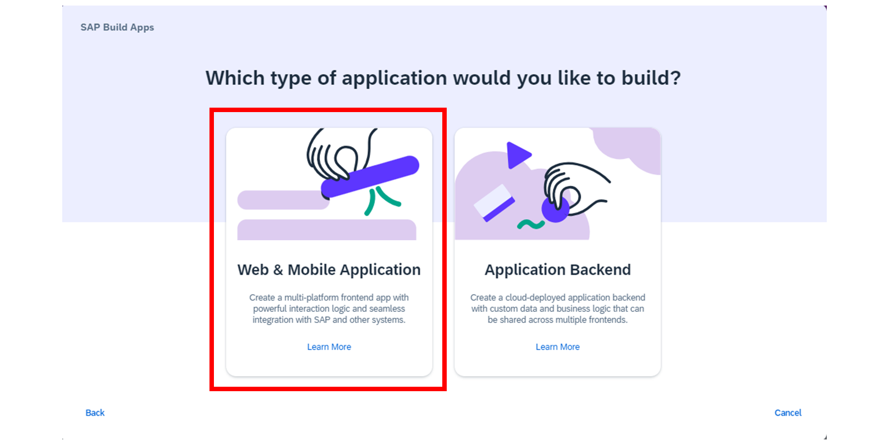
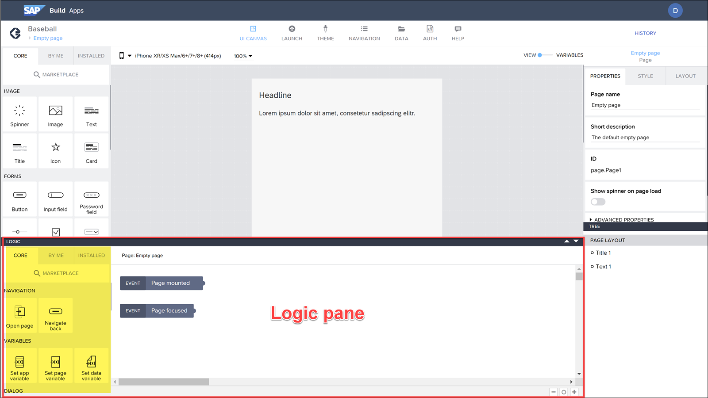
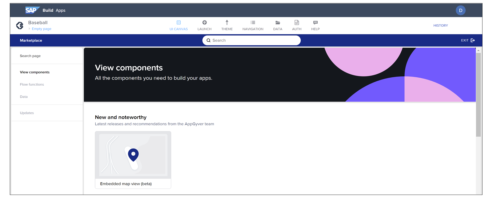
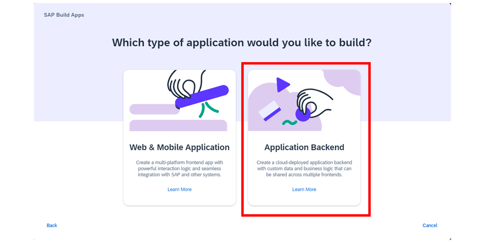
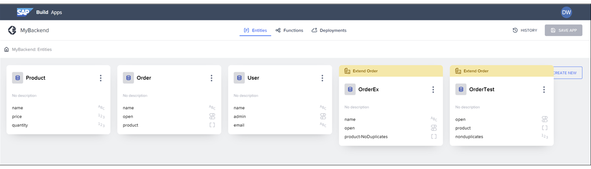

# ♠ 1 [TAKING A TOUR OF SAP BUILD APPS](https://learning.sap.com/learning-journeys/compose-and-automate-with-sap-build-the-no-code-way/taking-a-tour-of-sap-build-apps)

> :exclamation: Objectifs
>
> - [ ] Build the user interface and logic of your application front-end using SAP Build Apps
>
> - [ ] Explore the backend for your application in SAP Build Apps

## :closed_book: SAP BUILD APPS-APPLICATION

En règle générale, vous commencez par un lien vers le lobby SAP Build, où vous pouvez gérer tous vos projets, qu'il s'agisse de projets SAP Build Apps, SAP Build Process Automation ou SAP Build Work Zone.

Avec SAP Build Apps, vous pouvez créer deux types de projets :

- Une application ;

- Un backend, c'est-à-dire une base de données pour le stockage des données d'une application.

Commençons par l'outil SAP Build Apps pour créer le frontend d'une application. Plus tard dans cette leçon, nous explorerons l'outil de création de backends.

Lorsque vous choisissez « Créer », une fenêtre s'ouvre pour vous permettre de choisir le type de projet à créer. Pour créer une application, sélectionnez « Créer une application » → « Application Web et mobile ».

Après avoir saisi un nom pour l'application, vous obtenez la page d'accueil de SAP Build Apps pour l'application.

## :closed_book: TAKE A TOUR OF THE UI COMPONENT TOOLS, THE LOGIC PANE AND THE DATA TAB

Pour vous repérer, voici une vue de la page d'accueil d'une application (avec le volet logique en bas fermé) :

[Link Video](https://learning.sap.com/learning-journeys/compose-and-automate-with-sap-build-the-no-code-way/taking-a-tour-of-sap-build-apps)

### THE LOGIC PANE

Il existe également le panneau logique, où vous pouvez indiquer comment l'application réagit aux événements utilisateur et autres. Par défaut, il est fermé, mais vous pouvez l'ouvrir en cliquant sur le lien en bas du canevas.

Le panneau logique fonctionne comme un canevas, avec des widgets à gauche que vous pouvez glisser dans le panneau logique et connecter les uns aux autres. Ces widgets sont appelés fonctions de flux, car vous créez un flux d'actions, de l'événement déclencheur à toutes les fonctions de flux que vous y connectez.

### UI COMPONENT TOOLS

La zone des composants, à gauche de l'écran, contient tous les composants de l'interface utilisateur à afficher.

Elle comporte trois onglets :

#### :small_red_triangle_down: Core :

Contient environ 25 composants de base, tels que des boutons et des champs de saisie.

#### :small_red_triangle_down: Marketplace :

Contient de nombreux composants plus complexes que vous pouvez installer dans votre application. Choisissez Marketplace pour découvrir un univers complet de composants, tels que des boutons et des champs de saisie.

#### :small_red_triangle_down: Installed :

Affiche tous les composants que vous avez installés, à la fois les composants principaux et les composants Marketplace.

### QUICK TOUR OF SAP BUILD APPS

La vidéo suivante fournit une visite rapide de SAP Build Apps.

[Link Video](https://learning.sap.com/learning-journeys/compose-and-automate-with-sap-build-the-no-code-way/taking-a-tour-of-sap-build-apps)

## :closed_book: TBACKEND OF SAP BUILD APPS

SAP Build Apps vous permet de créer vos propres sources de données : vous pouvez concevoir des tables de données, appelées entités, et les alimenter avec des données. Ces sources de données peuvent ensuite être utilisées dans vos applications, au lieu de dépendre uniquement de données externes.

Lorsque vous choisissez « Créer » dans le menu SAP Build, vous pouvez également choisir « Créer une application » → « Backend d'application ».

L'interface utilisateur est divisée en trois parties principales, comme on peut le voir dans l'onglet en haut de la page :

Explications :

- Entités : Table de base de données contenant des données tabulaires.

- Fonctions : Actions permettant d'utiliser les données, mais aussi d'effectuer des calculs et de renvoyer des sous-ensembles de données en fonction des paramètres envoyés par l'application.

- Déploiements : Une fois les entités et les fonctions prêtes, vous devez les déployer. Une fois déployées, elles pourront être utilisées par vos applications.

Nous ne créerons pas de backend dans ce parcours d'apprentissage, mais sachez que vous pouvez facilement créer vos propres données et fonctions pour vos applications.

### SUMMARY

Vous avez effectué une visite de l'interface utilisateur de SAP Build Apps pour créer l'interface utilisateur et la logique du front-end de votre application.

## :closed_book: FURTHER READING ABOUT USING SAP BUILD APPS

Read more about using SAP Build Apps here:

- [SAP Build Apps Help](https://help.sap.com/docs/BUILD_APPS)

- [Tutorials](https://developers.sap.com/tutorial-navigator.html?tag=software-product%3Atechnology-platform%2Fsap-build%2Fsap-build-apps-enterprise-edition)
