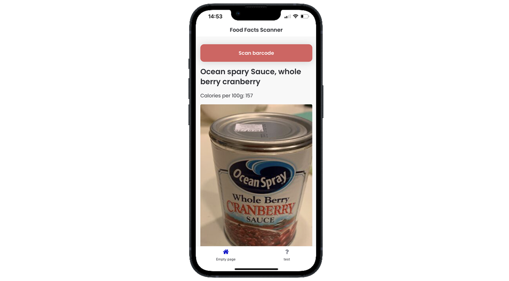

# ♠ 1 [CREATING A FIRST APPLICATION WITH SAP BUILD APPS](https://learning.sap.com/learning-journeys/compose-and-automate-with-sap-build-the-no-code-way/creating-a-first-application-with-sap-build-apps)

](link)

> :exclamation: Objectifs
>
> - [ ] Create your first app with SAP Build apps

## :closed_book: CREATE YOUR FIRST APP WITH SAP BUILD APPS

### BUSINESS SCENARIO

Vous allez créer une application qui vous permet de scanner le code-barres d'un produit alimentaire, puis d'appeler une API pour obtenir la teneur en calories, et enfin d'afficher le nom du produit et le nombre de calories.

### EXERCISE OPTIONS

Pour démarrer l'exercice, sélectionnez « Démarrer l'exercice » dans la figure ci-dessous.

Une fenêtre contextuelle s'ouvre. Vous disposez des options suivantes :

Démarrer : la simulation démarre. Suivez la simulation pour apprendre à créer un projet et les premières pages.
Ouvrir le document PDF : un PDF s'ouvre. En suivant les étapes décrites dans ce document, vous pouvez réaliser les exercices dans votre environnement système.

[Link Exercice](https://learnsap.enable-now.cloud.sap/pub/mmcp/index.html?show=project!PR_3B7D396E70C5C8B2:uebung)

[PDF](./RESSOURCES/hands_on.pdf)

### PREREQUISITES FOR THE LIVE ENVIRONMENT

- Vous pouvez créer votre propre abonnement SAP Build Apps sur votre sous-compte SAP BTP grâce à un booster. Si vous n'en possédez pas, vous trouverez ici des instructions pour [configurer rapidement un compte d'essai](https://developers.sap.com/tutorials/hcp-create-trial-account..html).

- Configurez l'application SAP Build Apps Preview sur [iOS](https://apps.apple.com/us/app/sap-appgyver-preview/id1585856868) ou [Android](https://play.google.com/store/apps/details?id=com.sap.appgyver.preview.release). Lorsque vous travaillez sur une application, celle-ci dispose d'un code QR que vous pouvez scanner depuis l'application Preview pour l'ouvrir sur votre téléphone. Pour plus d'informations, consultez la [documentation](https://help.sap.com/docs/build-apps/service-guide/web-app-preview).

### HOW TO OBTAIN SUPPORT

To get support during the exercises, add your question in our [SAP Learning Group](https://groups.community.sap.com/t5/sap-btp-learning/gh-p/SAP-BTP-Learning).

### TASK FLOW

In this exercise, you perform the following tasks:

- Create a new SAP Build Apps project.

- Create the user interface.

- Add logic to open the camera.

- Connect to Open Food Facts API.

- Fetch Data from API.

- Display Data from the API.
