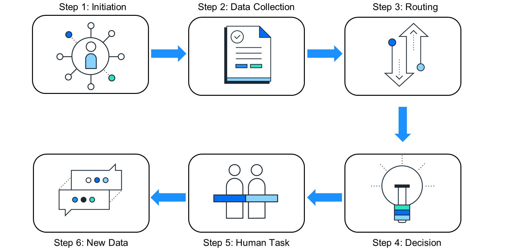
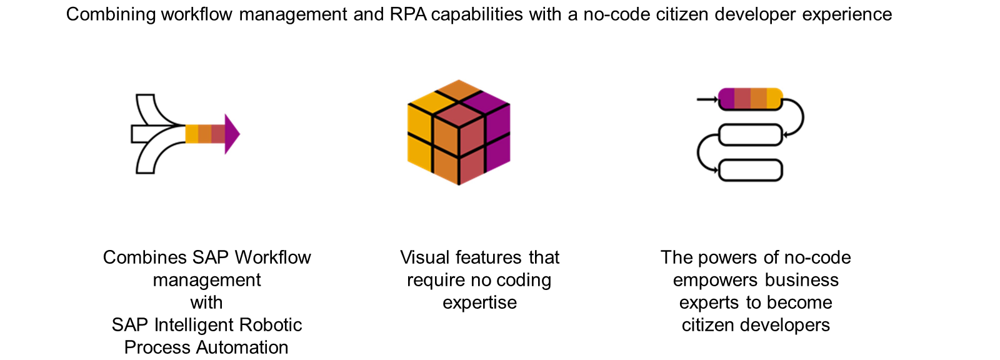
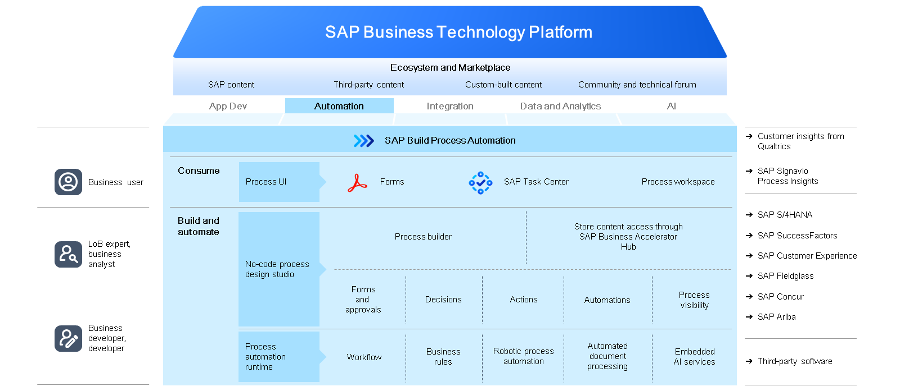

# ♠ 1 [INTRODUCING SAP BUILD PROCESS AUTOMATION](https://learning.sap.com/learning-journeys/compose-and-automate-with-sap-build-the-no-code-way/introducing-sap-build-process-automation)

> :exclamation: Objectifs
>
> - [ ] Outline the typical steps involved in a business process
>
> - [ ] Identify SAP Build Process Automation and its benefits

## :closed_book: TYPICAL STEPS OF A BUSINESS PROCESS

[Link Video](https://learning.sap.com/learning-journeys/compose-and-automate-with-sap-build-the-no-code-way/introducing-sap-build-process-automation)

Avant de commencer à créer vos solutions automatisées sans code, vous devez avoir des connaissances fondamentales sur les processus métier.

Un processus métier est un ensemble répétitif de tâches exécutées pour atteindre un objectif ou un résultat pour une entreprise. Il se compose d'une chaîne d'activités, d'événements et de décisions. Les étapes typiques d'un processus métier comprennent le lancement, la collecte de données, le routage, les décisions, les tâches humaines et les nouvelles données.

Les étapes typiques d'un processus métier sont les suivantes :

- Le processus doit être initié d'une manière ou d'une autre.

- Les données pertinentes doivent être collectées.

- Les participants au processus doivent être impliqués pour examiner les données et faire avancer le processus.

- Des décisions doivent être prises quant à la possibilité de mener à bien le processus.

- Les participants au processus peuvent avoir besoin de collecter davantage de données.

- De nouvelles informations peuvent devoir être prises en compte avant que le processus puisse se poursuivre.

- Finalement, le processus est terminé.

## :closed_book: WHAT IS SAP BUILD PROCESS AUTOMATION?

En tant que développeur citoyen en herbe, SAP Build Process Automation peut vous aider à développer des workflows et à automatiser vos tâches quotidiennes sans écrire de code. Cette solution combine les fonctionnalités de SAP Workflow Management et de SAP Intelligent Robotic Process Automation. Elle permet aux organisations et aux entreprises de gérer l'automatisation des workflows et des processus grâce à des fonctionnalités visuelles.

SAP Build Process Automation s'exécute sur SAP Business Technology Platform. Les développeurs peuvent ainsi travailler en toute confiance grâce à une plateforme multicloud fiable et performante, prenant en charge la sécurité, les autorisations, la gouvernance et la surveillance.

Des outils low-code et no-code permettent aux utilisateurs métier d'automatiser leurs workflows et processus par simple glisser-déposer. Les développeurs professionnels peuvent utiliser des outils visuels et du contenu prédéfini pour obtenir des résultats plus rapidement et répondre aux nouvelles exigences avec plus d'agilité. Ils peuvent également utiliser des outils de développement pour créer des workflows et des automatisations complets, prêts à être intégrés dans leurs projets et processus.

## :closed_book: BENEFITS OF SAP BUILD PROCESS AUTOMATION

Des processus bien gérés améliorent la communication entre les personnes et les services. Précision, rapidité et efficacité constituent des avantages considérables. Cela permet d'éliminer la confusion et la frustration quotidiennes et de responsabiliser davantage l'équipe. Plutôt que de blâmer un processus pour les retards ou les échecs, les membres de l'équipe peuvent assumer davantage de responsabilités et se concentrer sur leurs objectifs. SAP Build Process Automation soutient ces processus performants avec les avantages suivants :

- Un moyen plus rapide et plus simple de créer des workflows et d'adopter l'automatisation ;

- Une capacité accrue à adapter, améliorer et innover rapidement les processus métier ;

- Une simplification de l'automatisation des processus grâce à une expérience développeur unifiée ;

- Un meilleur retour sur investissement des applications SAP.

### SUMMARY

SAP Build Process Automation permet aux utilisateurs professionnels d'automatiser les processus et les tâches de workflow sans écrire de code.

## :closed_book: FURTHER READING ABOUT SAP BUILD PROCESS AUTOMATION

Here you can find more information about SAP Build Process Automation: [SAP Build Process Automation](https://www.sap.com/products/technology-platform/process-automation.html)
