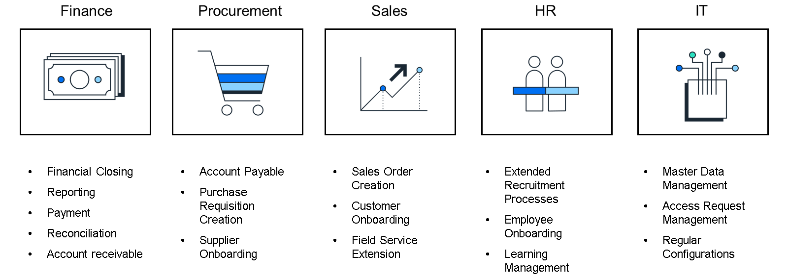

# ♠ 1 [LEVERAGE SAP BUILD PROCESS AUTOMATION TO AUTOMATE PROCESSES](https://learning.sap.com/learning-journeys/compose-and-automate-with-sap-build-the-no-code-way/leveraging-sap-build-process-automation-to-automate-processes)

> :exclamation: Objectifs
>
> - [ ] Assess ideal scenarios for process automation
>
> - [ ] Review the product capabilities of robotic process automation
>
> - [ ] Explore the SAP Build Process Automation product

## :closed_book: IDEAL SCENARIO FOR SAP BUILD PROCESS AUTOMATION

Vous pouvez créer, adapter, améliorer et innover de nombreux types de processus métier avec une assistance informatique minimale. Par exemple :

- Automatiser les tâches manuelles et répétitives, comme le copier-coller de données dans une feuille de calcul.

- Numériser les processus manuels et semi-automatisés, comme l'approbation des dépenses d'investissement.

- Automatiser les processus à volume élevé d'étapes. Pensez à la saisie des données des commandes clients.

- Agréger automatiquement les données de plusieurs systèmes et mettre à jour les enregistrements d'achat.

- Élargir et adapter les flux standards de vos applications métier (SAP ou non, sur site ou dans le cloud), par exemple en ajoutant plusieurs niveaux d'approbation pour une commande client.

- Automatiser les workflows inter-applications de bout en bout qui couvrent plusieurs systèmes (par exemple, votre ERP et vos systèmes de ressources humaines (RH)) dans les processus d'intégration des employés.

Sachez que 99 des 100 plus grandes entreprises mondiales sont clientes de SAP. Des soins de santé aux télécommunications, des clients de divers secteurs bénéficient des fonctionnalités de SAP Build Process Automation.

## :closed_book: THE PRODUCT CAPABILITIES OF SAP BUILD PROCESS AUTOMATION

SAP Build Process Automation offre les fonctionnalités produit suivantes :

- Création visuelle de workflows pour automatiser les tâches et simplifier la prise de décision.

- Exploitation d'une gestion unifiée des workflows avec SAP Intelligent Robotic Process Automation.

- Démarrage rapide de projets grâce à des packages de contenu prédéfinis basés sur des cas d'utilisation de bonnes pratiques.

- Intégration transparente avec d'autres applications.

- Développement en toute confiance sans risque de shadow IT.

SAP Build Process Automation offre une nouvelle expérience utilisateur pour les développeurs citoyens grâce à des fonctionnalités telles que le générateur de processus ou le générateur de formulaires. Toutes les fonctionnalités avancées de gestion des workflows, telles que les règles métier, la visibilité des processus, la flexibilité des processus et l'IA, sont également disponibles. Vous pouvez enrichir votre automatisation grâce à des fonctionnalités d'automatisation robotisée des processus intégrées. Des artefacts réutilisables, tels que des robots et des composants de workflow, sont prêts à l'emploi. Les développeurs citoyens disposent d'un centre de tâches et d'une plateforme de lancement pour contrôler leurs applications et leur automatisation. Enfin, l'intégration entre SAP Signavio et SAP Build Process Automation permet de déclencher et d'exécuter automatiquement plus de 135 recommandations d'amélioration des processus personnalisées pour une optimisation continue du suivi des processus.

## :closed_book: THE SAP BUILD PROCESS AUTOMATION PRODUCT

Avant qu'un exercice n'ait lieu dans la partie suivante, nous examinerons de plus près SAP Build Process Automation et sa structure de base.

[Link Video](https://learning.sap.com/learning-journeys/compose-and-automate-with-sap-build-the-no-code-way/leveraging-sap-build-process-automation-to-automate-processes)

Dans le hall d'entrée de SAP Build Process Automation, vous pouvez créer, gérer et déployer des processus métier et des projets d'action encapsulant des API sous forme d'actions dans vos scénarios métier. Vous pouvez utiliser la vue Liste des projets de SAP Build Process Automation dans le hall d'entrée pour consulter les projets existants ou en créer de nouveaux. Actualisez, réorganisez, filtrez par type ou par collaborateurs, et effectuez des actions telles que la publication, la validation et le partage.

Depuis le hall d'entrée, vous pouvez ouvrir n'importe quel projet et exploiter ses fonctionnalités, notamment :

- Connecteurs : pour créer, gérer et déployer des actions, et trouver les packages SDK disponibles ;

- Boutique : avec du contenu d'automatisation des processus prédéfini ;

- Surveillance : pour gérer l'automatisation et les événements ;

- Tour de contrôle : pour consulter les détails des projets déployés et configurer les agents ;

- Ma boîte de réception : pour traiter les tâches depuis un ordinateur ou un appareil mobile.

### SUMMARY

SAP Build Process Automation vous accompagne dans divers scénarios d'utilisation. Grâce à ses nombreuses fonctionnalités, il vous permet d'améliorer l'efficacité et l'agilité de votre entreprise en toute confiance. Proposer des outils d'automatisation des processus sans code permet aux utilisateurs métier de simplifier et de créer des workflows.

## :closed_book: FURTHER READING ABOUT SAP BUILD PROCESS AUTOMATION

Read more about SAP Build Process Automation here: [SAP Build Process Automation](https://www.sap.com/products/technology-platform/process-automation.html)
