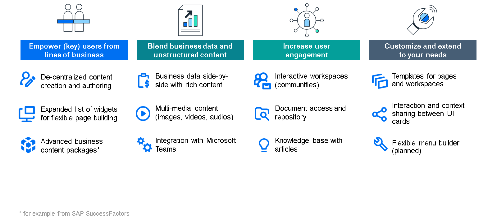

# ♠ 1 [GETTING STARTED WITH SAP BUILD WORK ZONE](https://learning.sap.com/learning-journeys/compose-and-automate-with-sap-build-the-no-code-way/getting-started-with-sap-build-work-zone)

> :exclamation: Objectifs
>
> - [ ] Identify the key aspects of SAP Build Work Zone editions

## :closed_book: OVERVIEW OF SAP BUILD WORK ZONE EDITIONS

[Link Video](https://learning.sap.com/learning-journeys/compose-and-automate-with-sap-build-the-no-code-way/getting-started-with-sap-build-work-zone)

Les deux éditions du produit sont connectées aux autres piliers du portefeuille SAP Build ainsi qu'à l'environnement SAP BTP global, comme par exemple SAP Integration Suite.

> Note
>
> À la date de publication de ce cours, la mise à niveau de SAP Build Work Zone Standard vers l'édition avancée n'est pas encore disponible. Certaines fonctionnalités de l'édition standard ne sont pas encore disponibles dans l'édition avancée, bien qu'elles fassent partie de la feuille de route du produit.

### SAP BUILD WORK ZONE, ADVANCED EDITION

En examinant de plus près les fonctionnalités de l'édition avancée, quatre catégories principales se démarquent de l'édition standard :

- Autonomiser les utilisateurs (clés) de tous les secteurs d'activité ;

- Combiner données métier et contenu non structuré ;

- Améliorer l'engagement des utilisateurs ;

- Personnaliser et étendre l'offre selon vos besoins.

La figure explique les principaux points forts de l'édition standard.

### SUMMARY

SAP Build Work Zone est disponible en deux éditions : standard et avancée. L'édition avancée offre davantage de fonctionnalités, telles que de puissants outils de création de pages et de contenu, des espaces de travail interactifs et la possibilité de fusionner des données métier avec des informations structurées et non structurées.

## :closed_book: FURTHER READING ABOUT GETTING STARTED WITH SAP BUILD WORK ZONE

Read more about getting started with SAP Build Work Zone here: [SAP Build Work Zone](https://www.sap.com/germany/products/technology-platform/workzone.html)
