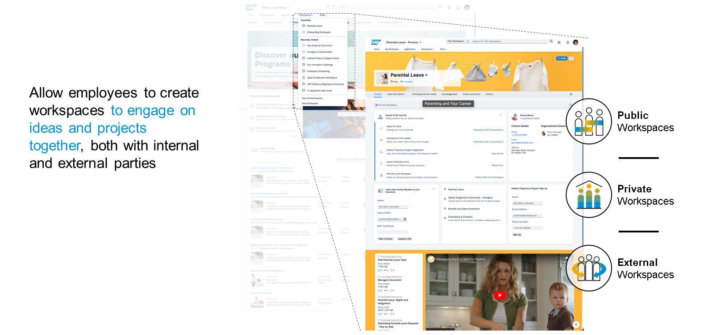

# ♠ 1 [EXPLIANING THE KEY PRODUCT CAPABILITIES OF SAP BUILD WORK ZONE](https://learning.sap.com/learning-journeys/compose-and-automate-with-sap-build-the-no-code-way/explaining-the-key-product-capabilities-of-sap-build-work-zone)

> :exclamation: Objectifs
>
> - [ ] Explain the integration scenarios of SAP Build Work Zone
>
> - [ ] Identify the key aspects of workspaces and their capabilities

## :closed_book: INTEGRATION SCENARIO AND PATTERNS

Après avoir exploré le positionnement global du produit et les cas d'utilisation, les capacités d'intégration seront le premier aspect examiné plus en détail, car elles sont essentielles à l'obtention d'un point d'entrée SAP unifié, comme indiqué dans les leçons précédentes. Cela inclut l'intégration d'applications métier SAP et tierces dans SAP Build Work Zone et inversement. Globalement, les scénarios d'intégration couvrant à la fois les applications métier SAP et tierces, dans le cloud et sur site, peuvent être classés selon les domaines suivants :

### OTHER PURPOSES

Outre les différentes approches techniques et fonctionnelles pour la réalisation d'un scénario d'intégration donné, elles répondent à d'autres objectifs. Globalement, elles couvrent un ou plusieurs des aspects suivants :

- Permettre l'accès à une application complète ou à des parties pertinentes de celle-ci dans l'expérience SAP Build Work Zone ;

- Connexion à d'autres services SAP (souvent SAP BTP) pour créer un point d'entrée central ;

- Connecter SAP Build Work Zone à d'autres solutions disponibles dans l'environnement informatique, par exemple, dans le domaine des référentiels de documents existants ;

- Exposer les données SAP Build Work Zone via des interfaces sécurisées à un système externe, par exemple pour prendre en charge des scénarios de gamification ou d'analyse avancée, via des mécanismes « push » et « pull ».

- Intégration aux processus métier spécifiques où les fonctionnalités de SAP Build Work Zone contribuent à enrichir l'expérience utilisateur globale.

## :closed_book: WORKSPACES

Les espaces de travail sont un élément essentiel de SAP Build Work Zone, en particulier de l'édition avancée. Vous pouvez enrichir votre espace de travail de nombreuses fonctionnalités, notamment une conception de page flexible pour faciliter votre travail, rassembler des données et des bonnes pratiques, et faciliter la communication et l'interaction avec vos collègues et vos équipes.

Seul un administrateur ou un membre de l'espace de travail peut créer et gérer l'espace de travail en y ajoutant du contenu, utiliser des outils de planification pour planifier et coordonner des projets, ajouter des applications métier, des cartes, des widgets, etc. Ils peuvent également créer des articles de blog, des pages wiki et des liens. Pour collaborer avec d'autres utilisateurs dans un espace de travail, il faut en devenir membre. Les membres d'un espace de travail peuvent communiquer entre eux via le flux ou les forums de l'espace de travail et utiliser les pages de l'espace de travail pour partager des informations et du contenu.

Bien que les fonctionnalités disponibles varient selon l'espace de travail, quatre types d'espaces de travail déterminent l'expérience globale dans SAP Build Work Zone :

Bien que les fonctionnalités activées varient selon l'espace de travail, il existe quatre types d'espaces de travail qui déterminent l'expérience globale dans SAP Build Work Zone :

### MY WORKSPACE

### WORKPAGE SECTION

Jusqu'à présent, vous avez découvert les différents types d'espaces de travail et leur rôle clé dans SAP Build Work Zone. Examinons maintenant en détail les différents types de pages de l'espace de travail qui contribuent à créer une expérience utilisateur attrayante. Ces types de pages sont utilisables dans tous les types d'espaces de travail, qu'ils soient publics, privés ou externes.

La page de travail est le visage de tout espace de travail et utilise l'expérience de conception de page sans code pour ajouter du contenu commercial et non structuré (Web) via différents widgets.

### WORKSPACE WORKPAGES

Elle est conçue par la personne qui a créé l'espace de travail, plus connue sous le nom d'administrateur. Il s'agit de la page d'accueil par défaut de l'espace de travail. Elle permet d'afficher le contenu et le flux de l'espace de travail, partagés uniquement par ses membres.

> Note
>
> Une fois créé, d'autres membres de cet espace de travail peuvent être désignés comme administrateurs.

### MY WORPSPACE WORKPAGE

Tous les utilisateurs internes de SAP Build Work Zone peuvent concevoir leur propre espace de travail. Ils peuvent y inclure les applications et les outils dont ils ont besoin au quotidien. Le contenu créé ici ne peut être ni partagé ni consulté par d'autres utilisateurs.

Cette fonctionnalité sera expliquée plus en détail dans la prochaine leçon dédiée.

### FEED UPDATES SECTION

Lorsque l'interaction utilisateur est essentielle, la section de mise à jour du flux peut être activée pour afficher une vue chronologique des commentaires, publications et autres actions des utilisateurs dans un espace de travail. Les membres de l'espace peuvent partager des documents, des articles de blog, des vidéos et des photos, ainsi que s'adresser aux autres membres de l'espace avec @mention ou inclure des tags dans un flux pour aider les autres membres à retrouver leurs publications. Les éléments de flux peuvent également être créés en dehors de l'espace de travail et s'affichent dans le flux de l'entreprise et dans le flux d'accueil des utilisateurs si cette option est activée.

#### :small_red_triangle_down: Membership Section :

La section adhésion permet de gérer l'accès à l'espace de travail, par exemple, d'inviter de nouveaux membres ou d'accorder des droits d'administrateur pour l'espace de travail.

#### :small_red_triangle_down: Recommendations Section :

Pour offrir aux utilisateurs un moyen simple de parcourir le contenu tendance ou recommandé dans l'espace de travail, la section des recommandations couvre tout le monde.

#### :small_red_triangle_down: Sub Workspaces Section :

Si les espaces de travail, avec leurs différentes sections et la possibilité de créer différentes pages de présentation, offrent déjà d'excellentes méthodes de structuration du contenu, la création d'espaces de travail imbriqués, appelés sous-espaces de travail, offre une flexibilité accrue. Un niveau de sous-espaces de travail est pris en charge, avec un contrôle indépendant des membres, du contenu et des fonctionnalités.

### WORKSPACES

### CONTENT SECTION

Qu'il s'agisse de stocker des informations détaillées sur un processus métier, de publier des tutoriels vidéo ou simplement de partager une présentation, la section « Contenu » offre les fonctionnalités nécessaires à la structuration et à la gestion du contenu au sein d'un espace de travail. Le contenu est facilement référencé depuis cette section sur votre page d'aperçu, notamment via le widget de contenu.

#### :small_red_triangle_down: Events Section :

Le calendrier de l'espace de travail permet d'afficher les événements du mois en cours ou de partager les détails des webinaires à venir. Les membres peuvent faire défiler le calendrier ou changer d'affichage (semaine, jour ou liste), définir le fuseau horaire et le premier jour de la semaine, et créer ou importer de nouveaux événements.

#### :small_red_triangle_down: Knowledge Base Section :

La section Base de connaissances permet aux membres de l'espace de travail de créer et de stocker des articles. Contrairement à la section Contenu, qui se concentre davantage sur le téléchargement de contenus créés hors de SAP Build Work Zone, la base de connaissances propose une méthode de partage des connaissances avec les membres de votre espace de travail basée sur des formulaires. Si cette fonctionnalité est désactivée après la publication des articles de la base de connaissances, ceux-ci n'apparaîtront plus dans l'espace de travail.

### FORUM SECTION

Contrairement à la section de flux, la section de forum d'un espace de travail prend en charge une approche structurée et plus détaillée de l'interaction avec l'utilisateur, par exemple pour créer des pages de questions et réponses ou pour discuter d'une idée ou d'un sujet.

### TASK SECTION

Une fonctionnalité de gestion collaborative des tâches est fournie dans l'espace de travail pour répertorier les tâches en cours, en retard et terminées, comme lors de la planification d'un nouvel événement client et bien plus encore.

### KNOWLEDGE BASE

### WORKPAGES

Comme souligné dans la leçon précédente, les pages de travail jouent un rôle important dans SAP Build Work Zone, car elles combinent les différents artefacts de contenu pour une expérience utilisateur attrayante. Elles sont utilisées dans les espaces de travail, ainsi que sur une ou plusieurs pages d'accueil par défaut à l'ouverture de SAP Build Work Zone. Elles sont disponibles comme premier élément de menu dans la barre de navigation supérieure et ne peuvent actuellement pas être masquées.

Toutes les pages de travail des différents scénarios du produit partagent les mêmes options de mise en page en grille et un puissant éditeur WYSIWYG (What You See Is What You Get). La conception de pages de travail ne nécessite aucune connaissance approfondie en programmation ni en informatique. Il s'agit d'une activité que les utilisateurs finaux ou les développeurs peuvent réaliser. Pour prendre en charge les parties prenantes et les scénarios externes, tels que les fournisseurs ou les clients, les espaces de travail et les pages d'accueil peuvent également être mis à disposition en externe. Dans ce cas également, les mêmes fonctionnalités de page de travail sont utilisées.

L'éditeur de pages de travail propose un riche catalogue de widgets, proposant les différents éléments à ajouter à la mise en page en grille. Il peut s'agir d'une combinaison de widgets prêts à l'emploi, d'applications métier intégrées (tuiles) et de cartes d'intégration d'interface utilisateur SAP personnalisées.

### SUMMARY

SAP Build Work Zone est une plateforme permettant l'intégration d'applications métier SAP et tierces, dans le cloud comme sur site. Il existe différentes catégories de scénarios d'intégration, notamment les applications métier, les services centraux, les API et webhooks, le contenu et la collaboration, SAP SuccessFactors et la chaîne logistique numérique. Ces scénarios d'intégration servent à divers objectifs, notamment l'accès à des applications complètes ou à des parties pertinentes de SAP Build Work Zone, la connexion à d'autres services SAP, la connexion de SAP Build Work Zone à d'autres solutions du paysage informatique, l'exposition des données de SAP Build Work Zone à des systèmes externes et l'intégration aux processus métier.

Les espaces de travail sont une fonctionnalité clé de SAP Build Work Zone, en particulier dans l'édition avancée. Il existe quatre types d'espaces de travail : publics, privés, externes et personnels. Les espaces de travail publics sont visibles et accessibles par tous les utilisateurs de l'entreprise disposant d'un accès complet, tandis que les espaces de travail privés sont réservés aux personnes invitées. Les administrateurs et les membres de l'espace de travail peuvent ajouter du contenu, des applications professionnelles et d'autres fonctionnalités à l'espace de travail et peuvent communiquer entre eux à l'aide du flux de l'espace de travail ou des forums.

### FURTHER READING ABOUT KEY PRODUCT CAPABILITIES OF SAP BUILD WORK ZONE

Read more about SAP Build Work Zone here: [SAP Build Work Zone](https://www.sap.com/germany/products/technology-platform/workzone.html)
