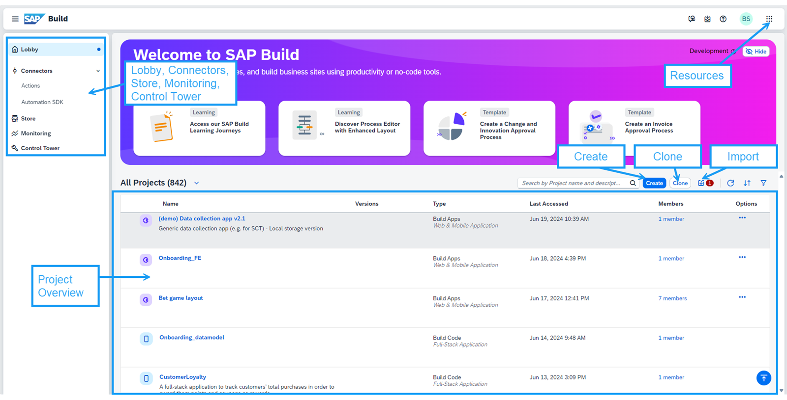
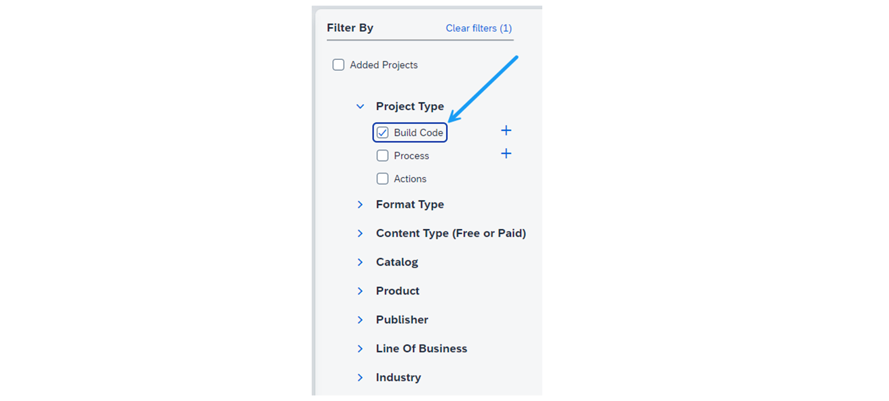
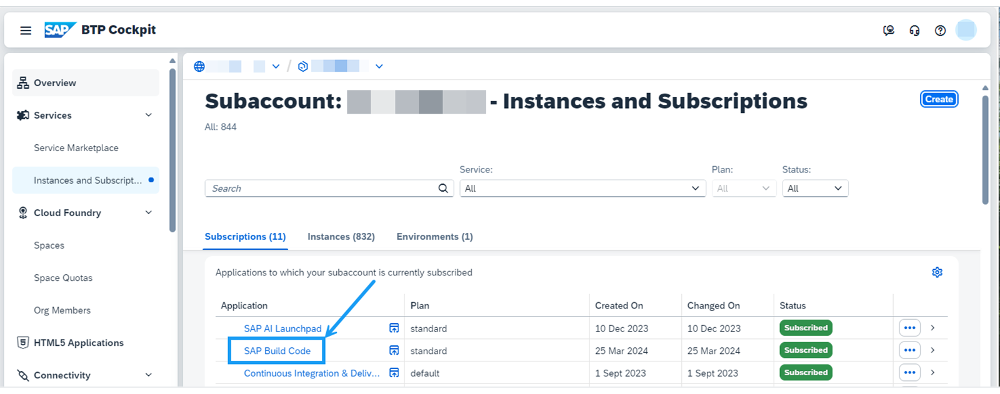

# ♠ 1 [EXPLORING THE SAP BUILD LOBBY](https://learning.sap.com/learning-journeys/creating-applications-and-extensions-using-sap-build-code/exploring-the-sap-build-lobby)

> :exclamation: Objectifs
>
> - [ ] Explore the SAP Build Lobby

## :closed_book: THE SAP BUILD LOBBY

### WHAT IS THE SAP BUILD LOBBY?

Le SAP Build Lobby est la page d'accueil centrale de tous les projets de la SAP Build Suite. Il vous offre une vue d'ensemble de vos projets, vous permet de créer de nouveaux projets, de gérer les projets existants et d'accéder à diverses fonctionnalités et ressources. Depuis le SAP Build Lobby, vous pouvez utiliser des composants créés avec SAP Build Code, SAP Build Apps, SAP Build Process Automation et SAP Build Work Zone.

### KEY FEATURES OF THE SAP BUILD LOBBY

Le lobby SAP Build vous offre les fonctionnalités clés suivantes :

- Aperçu des projets : Le lobby affiche la liste de tous vos projets, des types suivants : SAP Build Code, SAP Build Apps, SAP Build Process Automation et SAP Build Work Zone. Vous pouvez filtrer et trier la liste pour trouver rapidement des projets spécifiques. Pour chaque projet, plusieurs actions sont disponibles : publier un projet, le publier dans une bibliothèque, l'exporter, le renommer, le supprimer, l'enregistrer comme nouveau projet et gérer les membres. Pour une meilleure vue d'ensemble, vous pouvez filtrer et trier les entrées de la liste.

- Créer des projets : En cliquant sur Créer, vous pouvez créer de nouveaux projets.

- Cloner des projets existants : En cliquant sur Cloner, vous pouvez cloner des projets existants depuis un dépôt Git.

- Importer des projets : En cliquant sur Importer, vous pouvez créer de nouveaux projets en les important depuis votre système local.

Outre le lobby SAP Build, vous pouvez également accéder aux éléments suivants depuis la page d'accueil de SAP Build :

- Ressources : En haut à droite de l'écran, vous trouverez l'icône permettant de changer de produit et d'accéder à des ressources supplémentaires. Cela inclut des liens vers le cockpit SAP BTP, le gestionnaire d'espace de développement, la feuille de route et des ressources d'aide.

- Connecteurs : Vous pouvez créer et gérer des actions pour communiquer avec des systèmes externes. Sous « Automation SDK », vous trouverez une liste des différents SDK d'automatisation.

- Boutique : Vous trouverez ici du contenu prédéfini, créé et organisé par SAP et ses partenaires agréés. Cela comprend des modèles et du contenu prêt à l'emploi. Vous pouvez filtrer les projets SAP Build Code dans la boutique en sélectionnant « Build Code » dans le filtre « Type de projet ».

- Moniteur : Le moniteur affiche des informations sur vos processus, comme ceux démarrés et leur statut.

- Tour de contrôle : Vous y trouverez la configuration de votre locataire, de votre back-end et de votre agent, ainsi qu'une liste de vos clés API.

### ACCESS THE SAP BUILD LOBBY

Ce parcours d'apprentissage comprend également une unité sur la configuration de l'environnement. Une fois cette étape terminée, accédez à votre cockpit SAP BTP. Sous Services → Instances et abonnements, vous trouverez la liste de vos abonnements. Si vous disposez des autorisations appropriées, l'entrée « Code de build SAP » s'affiche. En cliquant sur ce lien, vous accéderez au lobby SAP Build.

### SUMMARY

Dans cette leçon, nous nous sommes concentrés sur le SAP Build Lobby, une plateforme centrale conçue pour rationaliser et simplifier la gestion des projets SAP Build. Il sert de passerelle pour la création de nouveaux projets, offre une vue d'ensemble organisée des projets existants et facilite l'accès aux ressources et aux paramètres. Le SAP Build Lobby fait partie intégrante de l'environnement SAP Build Code et améliore l'expérience utilisateur en rendant la gestion de projet plus efficace et accessible.
