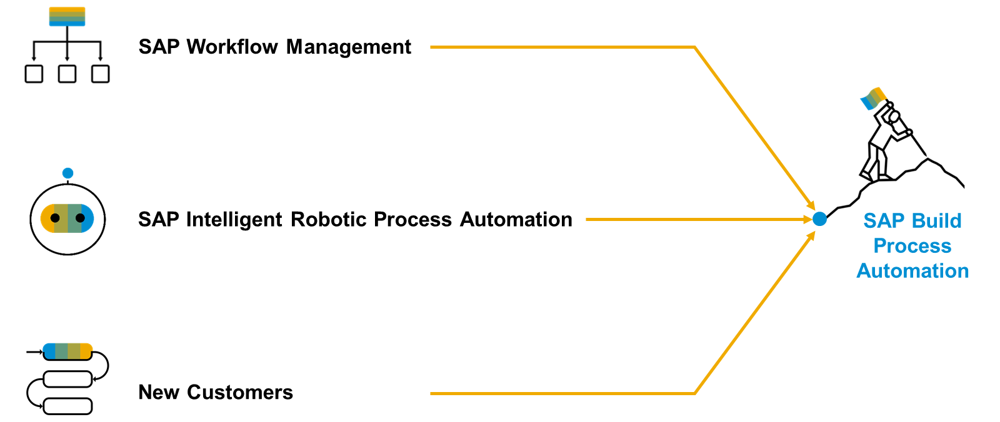

# ♠ 1 [DESCRIBING THE PATH TO SAP BUILD PROCESS AUTOMATION](https://learning.sap.com/learning-journeys/create-processes-and-automations-with-sap-build-process-automation/describing-the-path-to-sap-build-process-automation_b937f72a-1d68-4203-8c88-e5e03c210aa7)

> :exclamation: Objectifs
>
> - [ ] Choose the correct path for SAP Build Process Automation based on customer’s starting point

## :closed_book: THE PATH TO SAP BUILD PROCESS AUTOMATION

SAP Build Process Automation est une solution issue des anciens produits SAP autonomes SAP Workflow Management et SAP Intelligent Robotic Process Automation. Elle offre une nouvelle expérience de développeur citoyen, absente de ces deux produits. Si vous ou votre entreprise avez déjà utilisé SAP Workflow Management ou SAP Intelligent Robotic Process Automation, vous recherchez une solution intégrée. Heureusement, SAP Build Process Automation est entièrement compatible avec tous les artefacts de workflow et d'automatisation que vous avez créés.

[Link Video](https://learning.sap.com/learning-journeys/create-processes-and-automations-with-sap-build-process-automation/describing-the-path-to-sap-build-process-automation_b937f72a-1d68-4203-8c88-e5e03c210aa7)

---

## :closed_book: TITLE 2

### TITLE 3

#### :small_red_triangle_down: Title 4 :

---

> #### :bookmark: [Definition](link Lexicon)
>
> Definition

---

→
