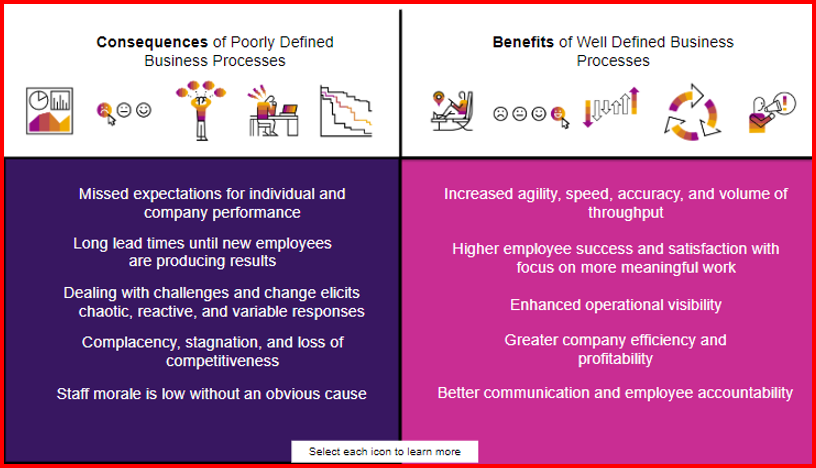

# ♠ 1 [MANAGING BUSINESS PROCESSES WITH BUSINESS PROCESS MANAGEMENT SOFTWARE](https://learning.sap.com/learning-journeys/create-processes-and-automations-with-sap-build-process-automation/managing-business-processes-with-business-process-management-software_a821bfc8-6a73-4c1b-9000-98e8d9bd1680)

> :exclamation: Objectifs
>
> - [ ] Outline the need for Business Process Management Software by evaluating consequences of poorly defined and benefits of well-defined business processes
>
> - [ ] Define Business Process Management by applying its six stages
>
> - [ ] Convince a colleague of the benefits of Business Process Management
>
> - [ ] Plan a business process implementation leveraging core elements of a BPM system

## :closed_book: WHY BUSINESS NEED BUSINESS PROCESS MANAGEMENT SOFTWARE?

Tout d'abord, expliquons pourquoi les entreprises ont besoin d'un logiciel de gestion des processus métier (BPMS) comme SAP Build Process Automation. Dans une entreprise gérant des milliers de processus, il peut être difficile pour la direction d'identifier les dysfonctionnements. En fin de compte, tout dépend de la qualité de la définition et de l'exécution des processus métier. Un logiciel de gestion des processus métier vous aide à structurer les nombreux processus de votre entreprise. Il permet d'éviter tout chaos potentiel et de définir et gérer clairement les processus. Examinons les conséquences de processus métier mal définis pour votre entreprise et les avantages qu'ils offrent.

### GETTING STARTED WITH NO-CODE BUSINESS PROCESS AUTOMATION

#### :small_red_triangle_down: Proorly and well designed processes :

#### :small_red_triangle_down: Comparing good versus bad business processes :

- Des processus bien gérés améliorent la communication entre les personnes et les services. Précision, rapidité et efficacité sont des atouts majeurs. Cela permet d'éliminer la confusion et la frustration quotidiennes et de responsabiliser davantage l'équipe. Plutôt que de blâmer un processus pour les retards ou les échecs, les membres de l'équipe peuvent assumer davantage de responsabilités et se concentrer sur leurs objectifs.

- Cependant, tous les processus ne sont pas bons. Même mal conçus, des processus défaillants peuvent exister au sein de votre organisation. Même s'ils peuvent fonctionner correctement, ce sont eux qui peuvent engendrer les problèmes les plus importants, tant pour vous que pour l'ensemble de votre organisation.

## :closed_book: WHAT IS BUSINESS PROCESS MANAGEMENT?

La gestion des processus métier (BPM) est une approche permettant d'identifier, d'analyser, de mesurer et d'améliorer les processus d'une organisation. La BPM ne doit pas être considérée comme un simple logiciel de plus, mais plutôt comme un moyen d'atteindre l'excellence opérationnelle. Elle permet à l'entreprise de fonctionner plus rapidement, plus efficacement et à moindre coût.

Cela s'effectue grâce au cycle de vie du BPM, qui comprend six étapes qu'une entreprise doit franchir pour atteindre l'excellence opérationnelle. Passons en revue ces six étapes :

## :closed_book: BENEFITS OF BUSINESS PROCESS MANAGEMENT

La gestion du cycle de vie des processus métier avec le BPM présente plusieurs avantages :

- Visibilité accrue sur l'activité organisationnelle et contrôle des tâches clés ;

- Capacité à identifier et à résoudre les goulots d'étranglement ou les blocages, permettant ainsi de gagner du temps et de réduire les coûts ;

- Amélioration de la communication et de la collaboration au sein de l'entreprise, permettant aux équipes de se concentrer sur les tâches importantes ;

- Agilité grâce à l'adaptabilité de processus transparents et bien documentés ;

- Aide l'entreprise à viser l'efficacité organisationnelle.

En résumé, le BPM est une discipline vaste qui prend en compte l'ensemble des personnes, des informations, des systèmes et autres éléments qui génèrent des résultats en soutien à une stratégie d'entreprise. Il aide les entreprises qui gèrent un grand nombre de processus à identifier les dysfonctionnements et à accroître la transparence opérationnelle.

## :closed_book: ELEMENT OF A BPM SYSTEM

Maintenant que vous connaissez le BPM et ses avantages, voyons comment les logiciels peuvent propulser ces avancées. L'efficacité est l'un des facteurs les plus importants. Un BPMS offre aux employés un ensemble d'outils standardisés pour gérer les processus et accélérer la détection des problèmes. Dans une entreprise gérant des milliers de processus, il peut être difficile pour la direction d'identifier les dysfonctionnements. Dans ce cas, un BPMS améliore l'efficacité. Une identification plus rapide des pannes et des processus se traduit par des temps de réponse et des correctifs plus rapides. Cela favorise l'agilité organisationnelle, un avantage concurrentiel. Cela permet également de définir et de mettre en œuvre des solutions au moment opportun. Enfin, un BPMS renforce le travail d'équipe de deux manières principales. Premièrement, la collaboration entre les services devient plus facile, plus automatique et nécessite moins de tâches administratives. Deuxièmement, il libère les employés des tâches fastidieuses qui peuvent être prises en charge par la technologie, leur permettant ainsi de consacrer plus de temps aux échanges personnels et à la collaboration créative. Les éléments suivants facilitent un système BPM :

