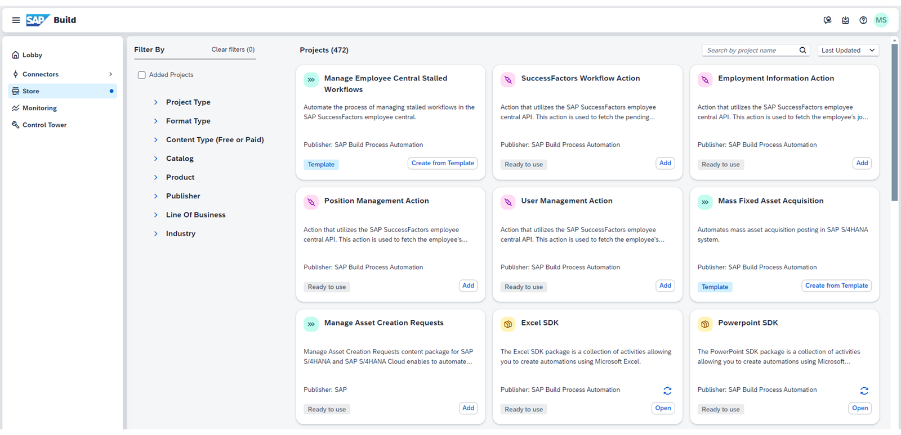

# ♠ 1 [ACTIVATING PROCESS AUTOMATION CONTENT](https://learning.sap.com/learning-journeys/create-processes-and-automations-with-sap-build-process-automation/activating-process-automation-content_c9a67d2c-3b58-4288-8e5b-ccb71ca81010)

> :exclamation: Objectifs
>
> - [ ] Locate and activate process automation content from the SAP Build Process Automation Store

## :closed_book: THE STORE FOR PROCESS AUTOMATION CONTENT

Le Store est un composant central de SAP Build Process Automation. Il propose du contenu préconfiguré, créé et organisé par SAP, et utilisable gratuitement. Ce contenu peut contenir des packages préconfigurés et directement utilisables, notamment des modèles d'automatisation, des workflows, des processus, des tableaux de bord de visibilité des processus, des formulaires et des actions.

[Link Video](https://learning.sap.com/learning-journeys/create-processes-and-automations-with-sap-build-process-automation/activating-process-automation-content_c9a67d2c-3b58-4288-8e5b-ccb71ca81010)

## :closed_book: ACTIVATE PROCESS AUTOMATION CONTENT

### BUSINESS SCENARIO

Un service de votre entreprise crée régulièrement des documents Microsoft Excel contenant des données sur les biens et matériaux dont il a besoin. Pour déclencher le processus d'achat, des demandes d'achat doivent être créées dans le système SAP S/4HANA de l'entreprise. L'analyse de la liste Excel, ligne par ligne, et la création manuelle de demandes d'achat pour chaque produit requis étant fastidieuses, vous, en tant que développeur de processus métier (citoyen), êtes chargé de mettre en œuvre une automatisation qui crée automatiquement les demandes d'achat requises à partir de la liste. Cette automatisation permettra à vos collègues de gagner un temps précieux. Avant de commencer à créer l'automatisation de A à Z, parcourez la boutique SAP Build Process Automation. Heureusement, un contenu d'automatisation des tâches adapté est déjà disponible sous forme de modèle dans la boutique. Simplifiez-vous la vie : il vous suffit d'activer le contenu et de l'ajuster en fonction de vos besoins spécifiques.

### TASK FLOW

Dans cet exercice, vous effectuerez les étapes suivantes :

- Recherchez le contenu d'automatisation des tâches requis dans le SAP Build Process Automation Store.

- Ouvrez le contenu d'automatisation des tâches importé.

- Créez un projet à partir du modèle d'automatisation des tâches.

- Téléchargez le fichier de projet SAP Build Process Automation exporté.

### EXERCISE OPTIONS

Pour démarrer l'exercice, sélectionnez « Démarrer l'exercice » dans la figure ci-dessous.

Une fenêtre contextuelle s'ouvre. Vous disposez des options suivantes :

- Choisir « Démarrer » : la simulation démarre. Suivez la simulation pour apprendre à activer le contenu d'automatisation des processus.

- Choisir « Ouvrir un document PDF » : un PDF s'ouvre. En suivant les étapes décrites dans ce document, vous pouvez réaliser l'exercice dans votre environnement système.

[Exercise](https://learnsap.enable-now.cloud.sap/pub/mmcp/index.html?show=project!PR_4E1599AFEA576295:uebung)

[PDF](./RESSOURCES/hands_on.pdf)
