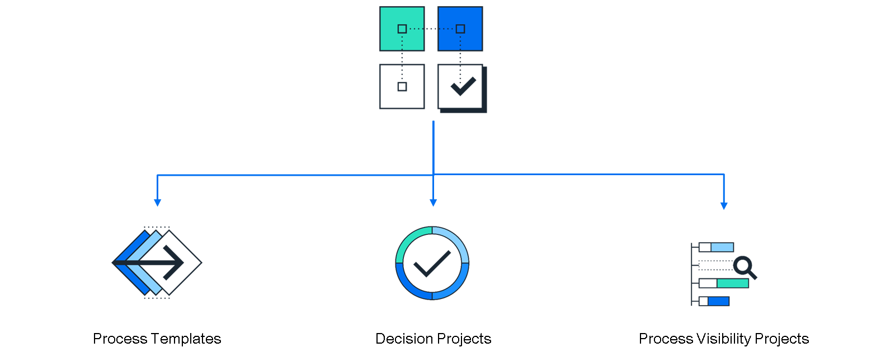
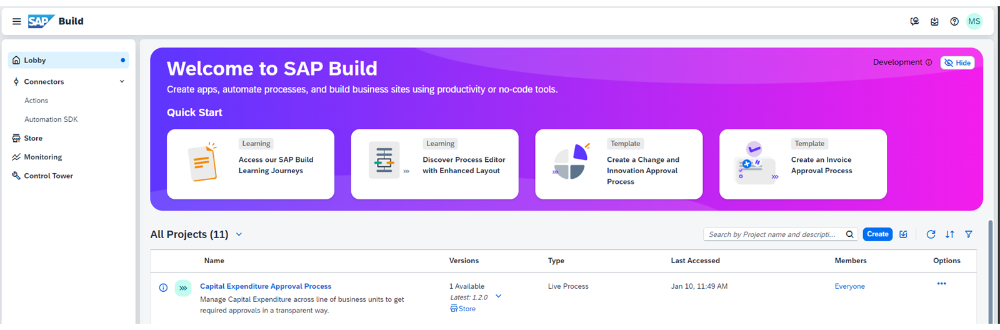
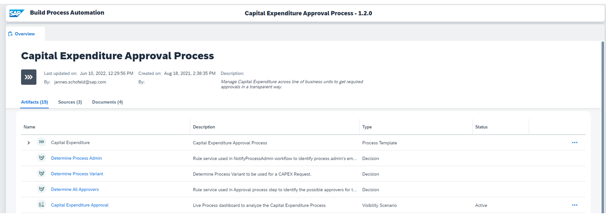
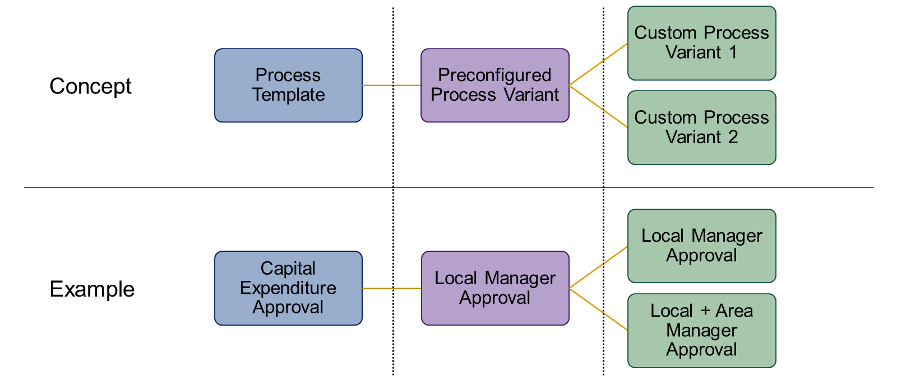

# ♠ 1 [OUTLINED THE CONCEPT OF PROCESS VARIANTS IN LIVE PROCESS CONTENT](https://learning.sap.com/learning-journeys/create-processes-and-automations-with-sap-build-process-automation/outlining-the-concept-of-process-variants-in-live-process-content_d4e1edfb-7086-4165-bada-1619c19964b5)

> :exclamation: Objectifs
>
> - [ ] Outline the concept of Process Variants in Live Process Content

## :closed_book: PROCESS VARIANTS IN LIVE PROCESS CONTENT

[Link Video](https://learning.sap.com/learning-journeys/create-processes-and-automations-with-sap-build-process-automation/outlining-the-concept-of-process-variants-in-live-process-content_d4e1edfb-7086-4165-bada-1619c19964b5)

Comme pour le contenu d'automatisation des processus, l'importation de contenu de processus en direct implique l'importation de modèles qui doivent être adaptés ultérieurement à vos besoins spécifiques. En général, vous récupérez un modèle de processus, un projet de décisions et un projet de visibilité des processus. Ces artefacts peuvent être complétés par des éléments supplémentaires, tels que des applications SAP Cloud Application Programming Model. Chacun de ces types d'artefacts peut être adapté à vos besoins.

Une fois un processus en direct ajouté depuis la boutique, il apparaîtra dans l'aperçu de vos projets. De là, vous pourrez y accéder.

Au sein du processus, vous pouvez visualiser tous les artefacts disponibles. Il comprend généralement un modèle de processus, des décisions et un scénario de visibilité.

#### :small_red_triangle_down: Process Template :

- Il se compose d'étapes de processus et d'une variante de processus préconfigurée, qui représente un processus minimum viable.

- Il peut être utilisé pour configurer autant de variantes de processus que nécessaire. Les variantes de processus représentent des cas d'utilisation individuels d'un processus (par exemple, lorsque le montant total de la demande est inférieur à 10 000 euros, une seule approbation est requise, tandis que lorsque le montant total de la demande est supérieur à 10 000 euros, deux approbations sont requises). (Ces détails seront bientôt expliqués.)

#### :small_red_triangle_down: Decision :

- Contient des règles métier pertinentes pour le flux de processus. Par exemple, « Déterminer la variante de processus » contient une règle qui détermine la variante de processus à exécuter, en fonction des données de la demande (par exemple, variante de processus 1 lorsque le montant total de la demande est inférieur à 10 000 euros, variante de processus 2 lorsque le montant total de la demande est supérieur à 10 000 euros).

- Configurable en fonction des besoins métier.

#### :small_red_triangle_down: Visibility Scenario :

- Contient un scénario de visibilité de processus préconfiguré pour le modèle de processus sous-jacent.

- Peut être ajusté en fonction des besoins métier.

La liste déroulante du modèle de processus affiche toutes les variantes de processus existantes. Elles sont accessibles par sélection.

Un éditeur sans code vous permet de configurer les variantes de processus à partir du modèle de processus.

Un modèle de processus se compose d'étapes et d'une variante préconfigurée, qui représente un processus minimum viable. Les étapes fournies permettent de configurer des variantes personnalisées à partir de la variante préconfigurée.

Le processus d'approbation des dépenses d'investissement, par exemple, contient une variante préconfigurée avec une seule étape d'approbation pour un responsable local. Grâce aux étapes fournies, il est possible de configurer des variantes personnalisées contenant des étapes d'approbation supplémentaires.

### PROCESS VARIANTS - CONCEPT

[Link Video](https://learning.sap.com/learning-journeys/create-processes-and-automations-with-sap-build-process-automation/outlining-the-concept-of-process-variants-in-live-process-content_d4e1edfb-7086-4165-bada-1619c19964b5)

Un modèle de processus livré contient des étapes et une variante de processus préconfigurée. Les étapes constituent des blocs de construction assemblables de manière modulaire pour former un processus. Chaque étape peut être soumise à des contraintes. Ces contraintes spécifient le nombre minimal et maximal d'occurrences d'une étape au sein d'une variante. De plus, la position d'une étape au sein d'une variante peut être soumise à des contraintes. Ainsi, certaines étapes ne peuvent être placées qu'au début ou à la fin d'un processus.

Un nombre illimité de variantes peuvent être configurées selon les conditions spécifiées. Les modèles de processus et la configuration des variantes de processus offrent aux experts en processus métier un cadre leur permettant de s'adapter avec souplesse à l'évolution des besoins métier, sans code. De plus, cela masque la complexité des processus sous-jacents. Ceux-ci peuvent contenir de nombreuses étapes, conditions ou contrôles de flux, visibles dans les variantes de processus modulaires.

Les étapes disponibles peuvent être ajoutées à la variante de processus par glisser-déposer. Une fois votre variante de processus terminée, vous devez l'enregistrer et l'activer.

Les étapes disponibles peuvent être ajoutées à la variante de processus par glisser-déposer. Une fois votre variante de processus terminée, enregistrez-la et activez-la.
