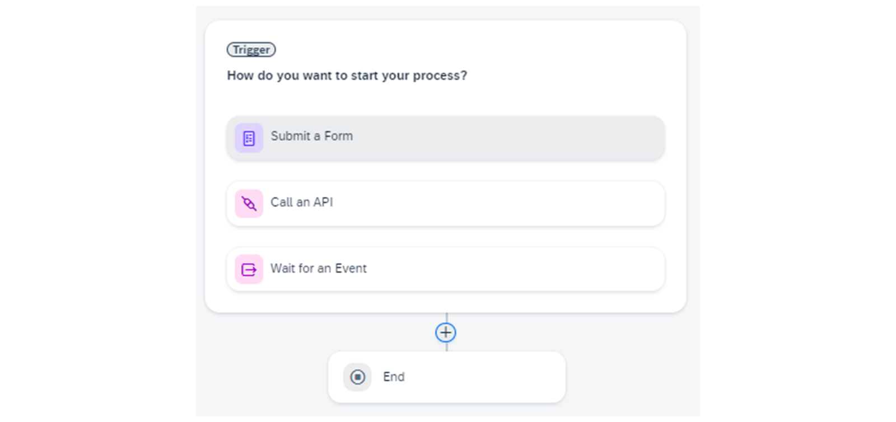
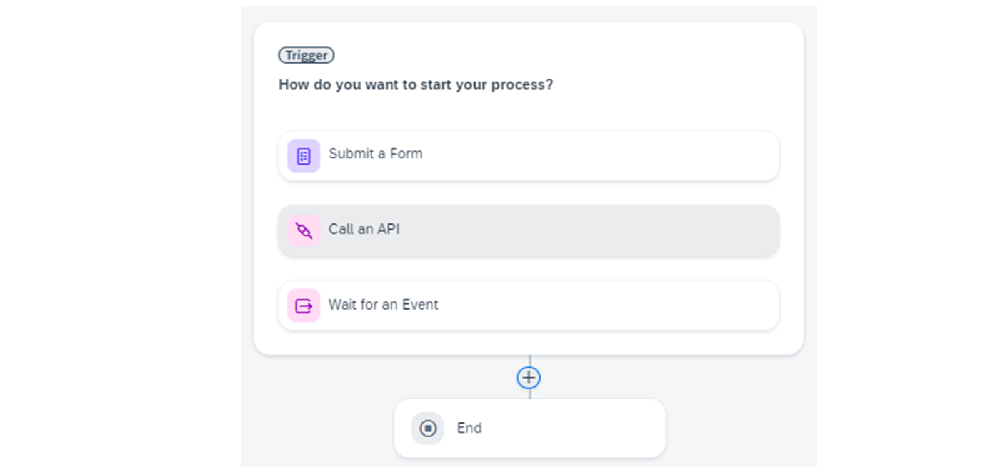
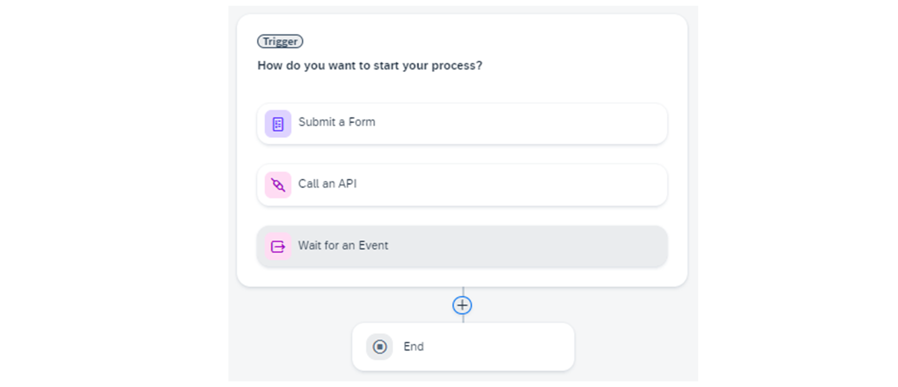

# ♠ 1 [DIGITALIZING USER INTERACTIONS WITH FORMS](https://learning.sap.com/learning-journeys/create-processes-and-automations-with-sap-build-process-automation/digitalizing-user-interactions-with-forms_d0e78947-8cff-45f0-9b85-d82c1ed0394e)

> :exclamation: Objectifs
>
> - [ ] Add interactive forms in the process you are building
>
> - [ ] Define different forms for triggers, approvals, and notifications

## :closed_book: DIGITALIZE USER INTERACTIONS WITH FORMS

Vous avez probablement constaté que de nombreuses tâches dans votre environnement professionnel, telles que les révisions, les approbations et les validations, sont encore attribuées aux employés par courrier électronique ou par courrier électronique. Ces tâches sont essentielles à tout processus métier, mais elles sont inefficaces et lentes.

Les formulaires sont un moyen courant de rationaliser ces activités. Une fois créé, vous pouvez l'utiliser pour déclencher un processus ou ajouter une étape d'approbation.

Examinons le formulaire déclencheur. Il constitue le point de départ de votre processus métier.

Vous pouvez définir trois types de déclencheurs :

- Un déclencheur d'événement dans SAP Business Process Automation (SBPA) vous permet d'automatiser et de déclencher diverses actions en fonction des événements de vos processus métier. Le déclencheur d'événement intègre et écoute les événements back-end émis par un système source externe, et réagit à ces événements en déclenchant des artefacts tels que des processus et des automatisations.

- Utiliser un formulaire comme déclencheur de processus vous permet d'utiliser un lien direct vers le formulaire publié pour démarrer. Alternativement, vous pouvez intégrer le déclencheur de démarrage dans une tuile dans l'édition SAP Workzone avec les paramètres donnés :

  

- En utilisant un appel d'API comme déclencheur de processus, vous pouvez démarrer votre processus métier via un appel d'API. Pour ce faire, vous devez définir les paramètres d'entrée requis et les réutiliser, par exemple, comme champs de saisie :

  

- Grâce à un déclencheur d'événement dans SAP Business Process Automation (SBPA), vous pouvez automatiser et déclencher diverses actions en fonction des événements de vos processus métier. Le déclencheur d'événement intègre et écoute les événements back-end émis par un système source externe, et réagit à ces événements en déclenchant des artefacts tels que des processus et des automatisations.

  

> Après avoir défini votre formulaire déclencheur, ajoutez des formulaires d'approbation à votre processus métier grâce à la fonctionnalité glisser-déposer de l'outil de création de formulaires. Les formulaires d'approbation servent à collecter et à partager des informations. Ainsi, vous simplifiez et accélèrez les processus d'approbation des utilisateurs métier. Les formulaires d'approbation offrent automatiquement le choix d'approuver ou de rejeter la demande, avec notification correspondante.

Vous disposez de différentes options pour configurer les formulaires d'approbation et ajouter des informations supplémentaires :

- Utilisez des mises en page telles que des titres et des champs de saisie tels que du texte, une liste déroulante, une case à cocher, un numéro, une date, un choix, un téléchargement/une pièce jointe de fichier\*, et plus encore.

  

- Configurer les champs en lecture seule ou obligatoires et leur format :

  

- Définissez quelques détails supplémentaires tels que les informations générales, les entrées et les sorties :

  

## :closed_book: CREATE A FORM TO TRIGGER A BUSINESS PROCESS

### BUSINESS SCENARIO

La première étape du développement de votre processus métier consiste à créer un formulaire déclencheur qui servira de point de départ au processus. Pour cela, utilisez l'outil de création de processus.

Pour en savoir plus sur la création d'un formulaire déclencheur, suivez ce tutoriel interactif.

### TASK FLOW

Dans cet exercice, vous effectuerez les étapes suivantes :

- Concevoir le formulaire avec la mise en page disponible.

- Ajouter d'autres objets au formulaire déclencheur.

- Utiliser le formulaire déclencheur pour les configurations internes.

- Pour en savoir plus sur la création d'un formulaire pour déclencher un processus métier, suivez ce tutoriel interactif.

### EXERCISE OPTIONS

Pour démarrer l'exercice, sélectionnez « Démarrer l'exercice » dans la figure ci-dessous.

Une fenêtre contextuelle s'ouvre. Vous disposez des options suivantes :

- Choisir « Démarrer » : la simulation démarre. Suivez la simulation pour apprendre à activer le contenu d'automatisation des processus.

- Choisir « Ouvrir un document PDF » : un PDF s'ouvre. En suivant les étapes décrites dans ce document, vous pouvez réaliser l'exercice dans votre environnement système.

[Exercise](https://learnsap.enable-now.cloud.sap/pub/mmcp/index.html?show=project!PR_D0287EB30D5C81A1:uebung)

[PDF](<./RESSOURCES/hands_on%20(1).pdf>)

### STEPS

1. Créez un formulaire pour déclencher un processus métier.

2. Choisissez Ajouter un déclencheur.

3. Choisissez Soumettre un formulaire.

4. Choisissez Formulaire vierge.

5. Dans le champ Nom, saisissez Formulaire de traitement de commande.

6. Dans le champ Description, saisissez Formulaire de collecte des détails de la commande.

7. Choisissez Créer.

8. Choisissez Déclencher le formulaire de traitement de commande.

9. Choisissez Plus d'options (l'icône avec trois points).

10. Choisissez Ouvrir l'éditeur.

11. Choisissez Titre 1.

12. Choisissez Paragraphe.

13. Dans le champ Titre, saisissez Formulaire de demande d'approbation de commande.

14. Dans le champ Paragraphe, saisissez Veuillez fournir les informations nécessaires concernant votre commande et la soumettre pour approbation.

15. Choisissez Texte.

16. Dans le champ Texte, saisissez Nom du client.

17. Sélectionnez Obligatoire.

18. Choisissez Texte.

19. Dans le champ Texte, saisissez Numéro de commande.

20. Sélectionnez Obligatoire.

21. Choisissez Numéro.

22. Dans le champ Numéro, saisissez Montant de la commande.

23. Sélectionnez Obligatoire.

24. Choisissez Date.

25. Dans le champ Texte, saisissez la date de commande.

26. Sélectionnez « Obligatoire ».

27. Choisissez « Texte ».

    a. Dans le champ Texte, saisissez le pays de livraison.

    b. Sélectionnez « Obligatoire ».

    c. Choisissez « Date ».

    d. Dans le champ Texte, saisissez la date de livraison prévue.

    e. Sélectionnez « Obligatoire ».

    f. Choisissez « Titre 2 ».

    g. Dans le champ Titre, saisissez « Veuillez appuyer sur Soumettre ».

    h. Choisissez « Enregistrer ».

### RESULT

Vous avez maintenant créé avec succès un formulaire pour déclencher un processus métier.

## :closed_book: CREATE AND CONFIGURE AN APPROVAL FORM

### BUSINESS SCENARIO

Dans cet exercice, vous allez créer et configurer un formulaire d'approbation. Les formulaires d'approbation sont utilisés pour simplifier et accélérer les processus d'approbation des utilisateurs métier.

Les formulaires d'approbation peuvent inclure non seulement des approbations, mais aussi des rejets, dans le cadre du traitement des commandes, des factures ou de l'intégration des employés. Vous pouvez modéliser ces formulaires d'approbation grâce au générateur de formulaires intégré à l'outil de création de processus. Ces formulaires seront ensuite convertis en tâches, dans le cadre d'un workflow automatisé qui apparaîtra dans la boîte de réception des utilisateurs métier autorisés.

### EXERCISE OPTIONS

Pour démarrer l'exercice, sélectionnez « Démarrer l'exercice » dans la figure ci-dessous.

Une fenêtre contextuelle s'ouvre. Vous disposez des options suivantes :

- Choisir « Démarrer » : la simulation démarre. Suivez la simulation pour apprendre à activer le contenu d'automatisation des processus.

- Choisir « Ouvrir un document PDF » : un PDF s'ouvre. En suivant les étapes décrites dans ce document, vous pouvez réaliser l'exercice dans votre environnement système.

[Exercise](https://learnsap.enable-now.cloud.sap/pub/mmcp/index.html?show=project!PR_363648D29A80029A:uebung)

[PDF](<./RESSOURCES/hands_on%20(2).pdf>)

### STEPS

1. Créez et configurez un formulaire d'approbation.

2. Dans l'onglet Traitement des commandes, choisissez Approbation.

3. Choisissez Approbation vierge.

4. Cette option apparaît sous « Créer une nouvelle approbation ».

5. Dans le champ Nom, saisissez « Formulaire d'approbation ».

6. Dans le champ Description, saisissez « Formulaire d'approbation ou de rejet de la commande client ».

7. Choisissez « Créer ».

8. Choisissez « Plus d'options » (icône à trois points).

9. Dans la liste « Plus d'options », sélectionnez « Ouvrir l'éditeur ».

10. Choisissez « Titre » (à gauche de l'écran).

11. Dans le champ « Nouveau titre », saisissez « Approuver la commande client ».

12. Choisissez « Paragraphe ».

13. Dans le champ « Nouveau paragraphe », saisissez « Une nouvelle commande a été reçue ».

14. Vérifiez et confirmez si les exigences peuvent être satisfaites.

15. Choisissez « Paragraphe ».

16. Dans le champ « Nouveau paragraphe », saisissez « Détails de la commande client ».

17. Choisissez « Texte ».

18. Dans le champ « Nouveau texte », saisissez « Nom du client ».

19. Sélectionnez « Lecture seule ».

20. Cette case à cocher se trouve dans la zone de configuration, en bas à droite de l'interface.

21. Choisissez « Texte » (symbole T) dans la barre à gauche de l'écran.

22. Dans le champ « Nouveau texte », saisissez le numéro de commande.

23. Sélectionnez « Lecture seule ».

24. Cette case à cocher se trouve dans la zone de configuration, en bas à droite de l'interface.

25. Choisissez « Nouveau numéro ».

26. Dans le champ « Nouveau numéro », saisissez le montant de la commande.

27. Sélectionnez « Lecture seule ».

28. Choisissez « Nouvelle date ».

29. Dans le champ « Nouvelle date », saisissez « Date de livraison de la commande ».

30. Sélectionnez « Lecture seule ».

31. Vous trouverez cette case à cocher dans le panneau « Date de livraison de la commande », à droite de l'interface.

32. Choisissez « Paragraphe ».

33. Dans le champ « Nouveau paragraphe », saisissez « Lettre de confirmation du fournisseur ».

34. Choisissez « Case à cocher ».

35. Dans le champ « Case à cocher », saisissez « Je reconnais avoir reçu votre commande et la traiterai en fonction des disponibilités ».

36. Choisissez « Zone de texte ».

37. Sélectionnez la barre de défilement pour faire défiler vers le bas.

38. Dans le champ « Texte », saisissez « Message à l'acheteur ».

39. Choisissez « Titre ».

40. Dans le champ « Nouveau titre », saisissez « Veuillez approuver ou rejeter le formulaire d'approbation ».

41. Choisissez « Enregistrer ».

42. Choisissez « Traitement des commandes ».

43. Choisissez « Formulaire d'approbation ».

44. Dans le champ « Objet », saisissez « Vérifier et approuver la commande ».

45. Choisissez « Numéro de commande ».

46. Dans le champ « Objet », saisissez « De ».

47. Choisissez « Nom du client ».

48. Sélectionnez la barre de défilement pour faire défiler vers le bas.

49. Dans le champ « Objet », saisissez « Société ».

50. Sélectionnez la barre de défilement pour faire défiler vers le bas.

51. Choisissez Utilisateurs.

52. Choisissez Processus démarré par.

53. Sélectionnez la barre de défilement pour faire défiler vers le bas.

54. Ouvrez la liste Choisir le type de date d'échéance.

55. Sélectionnez Durée statique.

56. Sélectionnez la barre de défilement pour faire défiler vers le bas.

57. Dans le champ « Une fois la tâche créée, elle est due dans ou le », saisissez 2.

58. Choisissez Entrées.

59. Dans le formulaire d'approbation, choisissez Nom du client.

60. Dans le volet Contenu du processus, choisissez Nom du client.

61. Sélectionnez la barre de défilement pour faire défiler vers le bas.

62. Dans le formulaire d'approbation, choisissez Montant de la commande.

63. Dans le volet Contenu du processus, choisissez Montant de la commande.

64. Dans le formulaire d'approbation, choisissez Date de livraison de la commande.

65. Dans le volet Contenu du processus, choisissez Date de livraison prévue.

66. Dans le formulaire d'approbation, choisissez Numéro de commande.

67. Dans le volet Contenu du processus, choisissez Numéro de commande.

68. Sélectionnez Enregistrer.

### RESULT

Vous avez maintenant créé et configuré avec succès un formulaire d’approbation.

## :closed_book: CREATE AND CONFIGURE A FORM NOTIFICATIONS

### EXERCISE OPTIONS

Pour démarrer l'exercice, sélectionnez « Démarrer l'exercice » dans la figure ci-dessous.

Une fenêtre contextuelle s'ouvre. Vous disposez des options suivantes :

- Choisir « Démarrer » : la simulation démarre. Suivez la simulation pour apprendre à activer le contenu d'automatisation des processus.

- Choisir « Ouvrir un document PDF » : un PDF s'ouvre. En suivant les étapes décrites dans ce document, vous pouvez réaliser l'exercice dans votre environnement système.

[Exercise](https://learnsap.enable-now.cloud.sap/pub/mmcp/index.html?show=project!PR_A1FD82FE70EBC6A6:uebung)

[PDF](<./RESSOURCES/hands_on%20(3).pdf>)

### STEPS

1. Créez et configurez un formulaire de notifications.

2. Choisissez Ajouter une étape de processus.

3. Choisissez Formulaire.

4. Choisissez Formulaire vierge.

5. Dans le champ Nom, saisissez « Formulaire de confirmation de commande ».

6. Dans le champ Description, saisissez « Notification de à » pour indiquer si la commande est approuvée.

7. Choisissez Créer.

8. Dans « Formulaire de confirmation de commande », sélectionnez la liste « Plus de groupes » (icône à trois points).

9. Dans la liste, sélectionnez « Ouvrir l'éditeur ».

10. Dans le panneau latéral de gauche, sélectionnez « Titre ».

11. Dans le champ « Nouveau titre », saisissez « Confirmation de commande ».

12. Choisissez « Paragraphe ».

13. Dans le champ « Nouveau paragraphe », saisissez « Votre commande a été reçue et acceptée pour livraison ». Nous vous enverrons les détails dès son expédition. Vous trouverez les détails de votre commande ci-dessous. Veuillez vérifier votre demande :

14. Choisissez l'icône « Texte » dans le panneau latéral de gauche.

15. Dans le champ « Nouveau texte », saisissez « Message du fournisseur ».

16. Choisissez « Paragraphe ».

17. Dans le champ « Nouveau paragraphe », saisissez les détails de votre commande :

18. Choisissez Texte.

19. Dans le champ « Nouveau texte », saisissez le numéro de commande.

20. Sélectionnez Lecture seule.

21. Sélectionnez la barre de défilement pour faire défiler vers le bas.

22. Choisissez Nouveau numéro.

23. Dans le champ « Nouveau numéro », saisissez le montant de la commande.

24. Sélectionnez Lecture seule.

25. Choisissez Date.

26. Dans le champ « Nouvelle date », saisissez la date de livraison prévue.

27. Sélectionnez Lecture seule.

28. Choisissez Titre.

29. Dans le champ « Nouveau titre », saisissez « Veuillez appuyer sur Soumettre ».

30. Choisissez Enregistrer.

31. Choisissez Traitement de la commande.

32. Choisissez Formulaire de confirmation de commande.

33. Dans le champ « Objet », saisissez « Votre commande a bien été reçue ».

34. Choisissez Numéro de commande.

35. Sélectionnez la barre de défilement pour faire défiler vers le bas.

36. Dans le formulaire de confirmation de commande et la section « Destinataires », sélectionnez « Utilisateurs ».

37. Dans le volet « Contenu du processus », sélectionnez « Processus démarré par ».

38. Dans le formulaire de confirmation de commande, sélectionnez « Entrées ».

39. Dans l'onglet « Entrées » qui apparaît, sélectionnez « Date de livraison prévue ».

40. Pour développer le volet « Formulaire de traitement des commandes (Déclencheur) », sélectionnez la flèche.

41. Dans le volet « Contenu du processus », sélectionnez « Date de livraison prévue ».

42. Dans le formulaire de confirmation de commande, sélectionnez « Montant de la commande ».

43. Dans le volet « Contenu du processus », sélectionnez « Montant de la commande ».

44. Dans le formulaire de confirmation de commande, sélectionnez « Numéro de commande ».

45. Dans le volet « Contenu du processus », sélectionnez « Numéro de commande ».

46. Dans le formulaire de confirmation de commande, sélectionnez « Message du fournisseur ».

47. Dans le volet « Contenu du processus », sélectionnez « Message à l'acheteur ».

48. Sélectionnez « Enregistrer ».

49. Sélectionnez l'onglet « Aperçu » (en haut de l'écran).

50. Sélectionnez « Plus de groupes » (icône à trois points près du formulaire de confirmation de commande).

51. Sélectionnez « Dupliquer ».

52. Dans le champ Nom, saisissez « Formulaire de rejet de commande ».

53. Sélectionnez « Dupliquer ».

54. Dans le champ « Formulaire de rejet de commande », saisissez « Rejet de commande ».

55. Choisissez « Paragraphe ».

56. Dans le champ « Nouveau paragraphe », saisissez « Nous sommes désolés de vous informer que votre commande ne peut être acceptée. Nous regrettons tout inconvénient causé par le refus de la commande ». Vous trouverez ci-dessous le motif du refus et les détails de votre commande. Veuillez confirmer votre demande.

57. Sélectionnez la barre de défilement pour faire défiler vers le bas.

58. Dans le champ, saisissez « Veuillez appuyer sur le bouton Soumettre pour confirmer le statut de la commande ».

59. Sélectionnez « Enregistrer ».

60. Sélectionnez « Traitement de la commande ».

61. Sélectionnez « Ajouter une étape du processus ».

62. Sélectionnez « Formulaire ».

63. Sélectionnez « Formulaire de rejet de commande ».

64. Dans le champ « Objet », saisissez « Votre commande est refusée par le fournisseur ».

65. Choisissez « Numéro de commande ».

66. Sélectionnez la barre de défilement pour faire défiler vers le bas.

67. Ouvrez la liste des priorités.

68. Sélectionnez « Élevée ».

69. Sélectionnez Utilisateurs.

70. Sélectionnez Processus démarré par.

71. Sélectionnez Entrées.

72. Dans le formulaire de rejet de commande, sélectionnez Date de livraison prévue.

73. Pour développer le volet Formulaire de traitement des commandes (Déclencheur), sélectionnez la flèche.

74. Dans le volet Contenu du processus, sélectionnez Date de livraison prévue.

75. Dans le formulaire de rejet de commande, sélectionnez Message du fournisseur.

76. Dans le volet Contenu du processus, sélectionnez Message à l'acheteur :

77. Dans le formulaire de rejet de commande, sélectionnez Montant de la commande.

78. Dans le volet Contenu du processus, sélectionnez Montant de la commande.

79. Dans le formulaire de rejet de commande, sélectionnez Numéro de commande.

80. Dans le volet Contenu du processus, sélectionnez Numéro de commande.

81. Sélectionnez Enregistrer.

82. Sélectionnez Fermer le panneau latéral.

### RESULT

Vous avez maintenant créé et configuré avec succès un formulaire pour les notifications.
