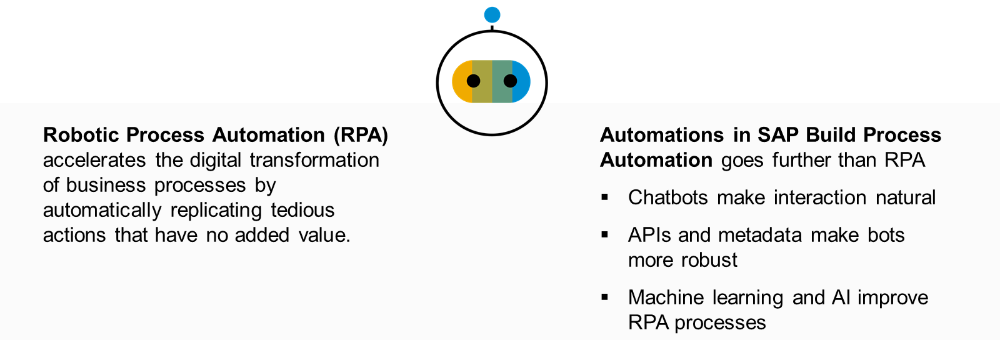

# ♠ 1 [IDENTIYING THE NEED FOR AUTOMATIONS](https://learning.sap.com/learning-journeys/create-processes-and-automations-with-sap-build-process-automation/identifying-the-need-for-automations_c90c6ee5-01c8-4c2f-bae6-377306fb48ce)

> :exclamation: Objectifs
>
> - [ ] Identify the need for automation in business processes

## :closed_book: WHAT MAKES AUTOMATIONS IN SAP BUILD PROCESS AUTOMATION SPECIAL?

Découvrons ensemble ce que sont les automatisations dans SAP Build Process Automation et comment elles se produisent.

L'automatisation robotisée des processus (RPA) accélère la transformation numérique des processus métier en répliquant automatiquement les actions fastidieuses à faible valeur ajoutée.

En intégrant les chatbots, en utilisant des API plutôt que de simples éléments d'interface utilisateur, et en combinant le Machine Learning (ML) et l'IA, nous pouvons propulser la RPA à un niveau supérieur. Et le voyage ne fait que commencer.

## :closed_book: FROM MANUAL TASKS TO AUTOMATION

Au début du siècle dernier, pendant la révolution industrielle, notamment dans les industries textile et automobile, on trouvait de grands entrepôts où de nombreux employés effectuaient d'innombrables tâches manuelles. Ces derniers effectuaient les mêmes tâches à l'infini, souvent des centaines, voire des milliers de fois par jour.

Progressivement, des chaînes d'automatisation ont fait leur apparition et les robots ont fait leur apparition. Les robots ont libéré les humains de tâches pénibles. Ils ont maîtrisé les tâches qui leur étaient assignées, augmentant ainsi considérablement la production.

À l'avènement des technologies de l'information, l'automatisation n'était pas envisagée au départ. Les applications étaient créées par les services informatiques pour un usage spécifique. Personne n'imaginait un poste de travail comme un ensemble de fenêtres et d'applications. Chaque application fonctionnait bien, mais qu'en était-il des liens entre elles ?

Aujourd'hui, la plupart des processus nécessitent de passer d'une application à une autre. Certes, il est possible de développer des API ou des services web spécifiquement pour gérer l'interaction entre certaines applications. Cependant, une application manque souvent de toutes les API ou services appropriés. Par conséquent, les utilisateurs passent d'innombrables heures à cliquer, naviguer, copier et coller, souvent lassés par la nature répétitive de ces tâches.

En général, les utilisateurs préfèrent consacrer leur temps au service client plutôt qu'à des tâches répétitives et fastidieuses.

## :closed_book: BUSINESS VALUE OF AUTOMATIONS

La valeur commerciale apportée par l’automatisation dans SAP Build Process Automation peut être décrite selon quatre perspectives différentes.

