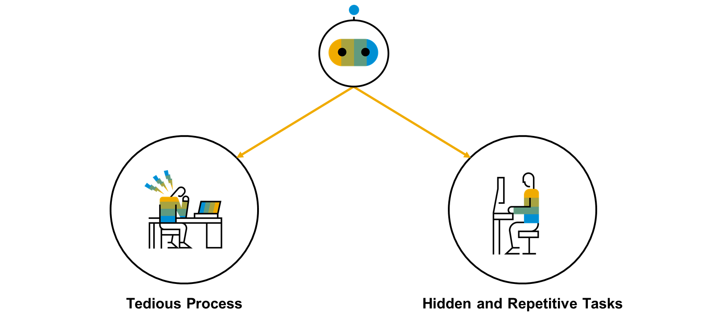
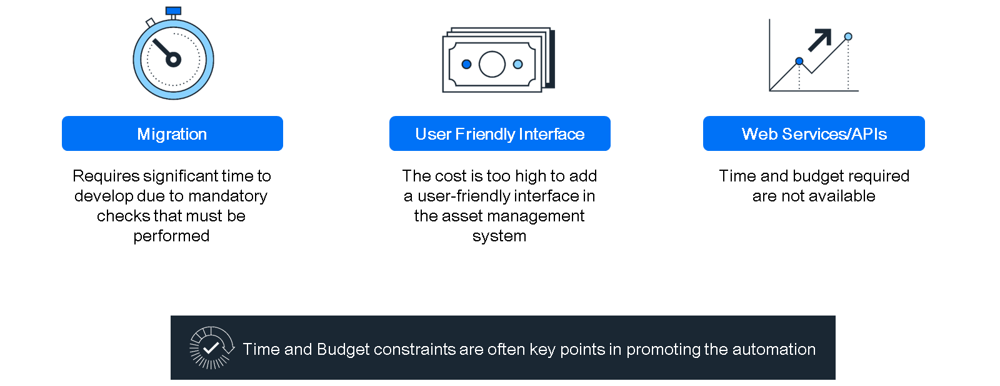
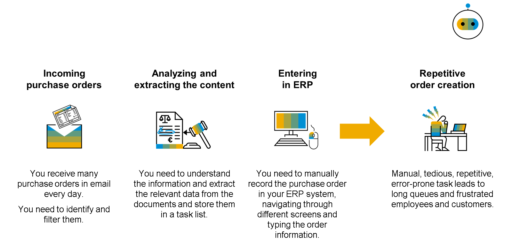
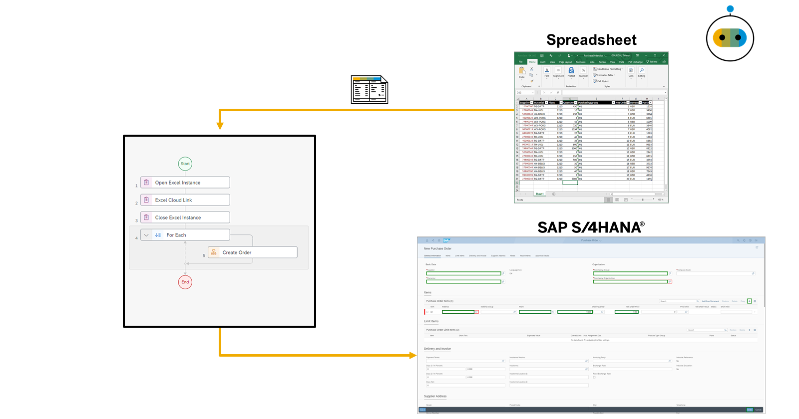

# ♠ 1 [EVALUATING AUTOMATION USE CASES](https://learning.sap.com/learning-journeys/create-processes-and-automations-with-sap-build-process-automation/evaluating-automation-use-cases_bea7b479-f776-419e-8b90-2f3ecf036e08)

> :exclamation: Objectifs
>
> - [ ] Evaluate use cases and determine when to build an automation for a customer’s business process

## :closed_book: TYPICAL USE CASES FOR AUTOMATIONS

Examinons quelques cas d'utilisation couverts par les automatisations dans SAP Build Process Automation. Parmi ceux-ci :

- Extraire des données à l'aide de différents connecteurs et les intégrer à un système financier

- Rechercher des numéros de facture dans d'innombrables instances ERP

- Se connecter à plusieurs instances SAP ERP Central Component, collecter les demandes d'achat et les distribuer aux services partagés

Les automatisations dans SAP Build Process Automation visent à optimiser l'efficacité des tâches. Par exemple, lors des pics d'activité, elles peuvent réduire les erreurs commises par le personnel, soumis à la pression de devoir saisir des quantités importantes d'informations dans un délai court.

[Animated Course](https://learning.sap.com/learning-journeys/create-processes-and-automations-with-sap-build-process-automation/evaluating-automation-use-cases_bea7b479-f776-419e-8b90-2f3ecf036e08)

## :closed_book: USE CASE TYPOLOGY

Au cours d'une journée de travail, les utilisateurs ignorent souvent toutes les tâches simples qu'ils effectuent. Les tâches cachées se perdent dans leur travail quotidien. On pense de prime abord qu'il suffit d'automatiser les tâches ennuyeuses. Cependant, il faut également considérer les tâches courtes et cachées, dont le potentiel d'automatisation est plus faible (environ 50 %). Ces tâches peuvent être effectuées, par exemple, 40 fois par jour ou plus. Si, par exemple, 50 personnes effectuent la même tâche, le potentiel de gain de temps est nettement supérieur à celui des tâches ennuyeuses, estimé à environ 12 équivalents temps plein.

## :closed_book: USE CASE EXAMPLE WITH AND WITHOUT AUTOMATION

[Link Video](https://learning.sap.com/learning-journeys/create-processes-and-automations-with-sap-build-process-automation/evaluating-automation-use-cases_bea7b479-f776-419e-8b90-2f3ecf036e08)

## :closed_book: USE CASE CONSTRAINTS

Prenons un autre exemple. Un système de gestion d'actifs est en place, avec ses écrans correspondants.

Les services web ou les API sont une bonne idée, mais leur développement nécessite un temps considérable en raison de toutes les vérifications obligatoires à effectuer. La migration est également envisageable, mais elle n'est pas envisageable pour le moment, faute de temps et de budget.

Les contraintes de temps et de budget sont souvent des points clés pour promouvoir l'utilisation de robots :

- L'ajout d'une interface conviviale au système de gestion d'actifs est trop coûteux.

- Pas le temps d'ajouter un service web entre les deux applications.

- Pas le temps de procéder à la migration. Elle est prévue, mais dans quelques années.

## :closed_book: MANUAL PURCHASE ORDER CREATION

Voici une description du processus typique de création d'un bon de commande (BC).

Le service Achats reçoit quotidiennement des bons de commande par e-mail. Un premier filtrage est nécessaire pour diverses raisons. Une fois le filtrage effectué, l'équipe doit identifier les produits, la quantité, le client, etc.

Si vous n'avez qu'un seul produit à vendre, c'est simple. La liste est définie et vous pouvez saisir les données dans votre système. Lancez la transaction correspondante, parcourez les écrans, vérifiez tous les champs obligatoires, etc., et vous avez peut-être terminé.

Cependant, l'équipe doit répéter ces opérations à maintes reprises, souvent pour de nombreux produits différents.

## :closed_book: AUTOMATED PURCHASE ORDER CREATION

Dans cette approche, un robot lit d'abord la feuille de calcul. Ligne après ligne, il copie toutes les valeurs des champs dans la transaction correspondante de votre système SAP ERP préféré.

Une fois en place, ce robot travaille en continu pour aider l'équipe. La figure suivante illustre comment l'automatisation peut gérer ce processus.

## :closed_book: USE CASE CRITERIA

Nous allons ici résumer les critères d'utilisation des automatisations dans SAP Build Process Automation.

Il existe quatre critères principaux :

[Animated Course](https://learning.sap.com/learning-journeys/create-processes-and-automations-with-sap-build-process-automation/evaluating-automation-use-cases_bea7b479-f776-419e-8b90-2f3ecf036e08)

Vous pouvez imaginer de nombreux cas d'utilisation intéressants pour les automatisations dans SAP Build Process Automation.

Soyez créatifs et écoutez les utilisateurs finaux qui créent des processus au quotidien. Les possibilités sont infinies. Ceci conclut cette leçon.
