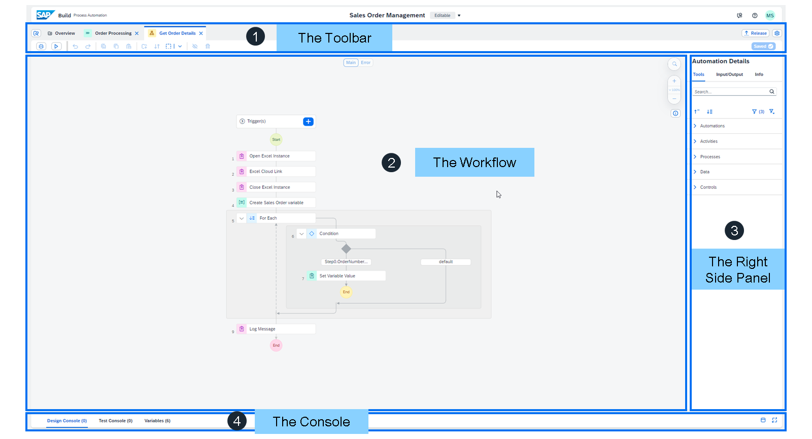

# ♠ 1 [BOOSTING THE SALES ORDER MANAGEMENT PROCESS WITH AN AUTOMATION](link)

> :exclamation: Objectifs
>
> - [ ] Explain how bots are executed
>
> - [ ] Review the Automation Editor
>
> - [ ] Prepare the Excel file with sales order details
>
> - [ ] Create and edit the automation
>
> - [ ] Map the right order using a loop with conditions
>
> - [ ] Finalize, test, simplify, release, and deploy the automation

## :closed_book: INTRODUCTION: BOOSTING BUSINESS PROCESSES WITH AUTOMATION

[Link Video](https://learning.sap.com/learning-journeys/create-processes-and-automations-with-sap-build-process-automation/boosting-the-sales-order-management-process-with-an-automation_d01370b2-c68a-4997-baea-d4c178d8eb2d)

Pourquoi utiliser les automatisations ? Elles peuvent accélérer votre processus et réduire les erreurs potentielles liées au transfert manuel des données.

Maintenant que vous maîtrisez les bases de la configuration de votre processus, il est temps de simplifier votre formulaire de déclenchement en réduisant le nombre de champs de saisie.

Vous utiliserez l'automatisation robotisée des processus (RPA) pour extraire les données d'un fichier Excel contenant les détails de la commande client.

Vous apprendrez ensuite à mapper les entrées et les sorties des différents artefacts en fonction des modifications du processus. Enfin, vous utiliserez l'agent de bureau pour exécuter votre processus.

> Note
>
> L'agent Desktop ne fonctionne pas sur un Mac. Pour suivre cette partie de la leçon, vous devrez utiliser un ordinateur Windows ou un Mac exécutant un bureau virtuel avec Windows. Consultez les prérequis de l'unité 1 pour plus d'informations.

L'automatisation des tâches peut s'exécuter de deux manières :

#### :small_red_triangle_down: Unattended mode :

Les robots travaillent de manière autonome, sous la seule supervision humaine ; aucune intervention humaine n'est nécessaire dans la partie du processus exécutée par la RPA.

#### :small_red_triangle_down: Attended mode :

Le mode avec surveillance permet aux robots de collaborer avec des humains pour les assister.

## :closed_book: THE AUTOMATION EDITOR

[Link Video](https://learning.sap.com/learning-journeys/create-processes-and-automations-with-sap-build-process-automation/boosting-the-sales-order-management-process-with-an-automation_d01370b2-c68a-4997-baea-d4c178d8eb2d)

Sélectionnez chaque marqueur pour en savoir plus.

L'éditeur d'automatisation de SAP Build Process Automation est composé de quatre parties principales :

#### :small_red_triangle_down: Toolbar :

Permet d'effectuer des actions simples comme annuler, rétablir, supprimer une étape, enregistrer votre automatisation ou même la tester.

#### :small_red_triangle_down: Workflow :

Affiche la liste des étapes de votre automatisation.

#### :small_red_triangle_down: Right-side Panel :

Ajoute des étapes à votre automatisation. Vous pouvez y ajouter des activités, des données ou différents contrôles.

#### :small_red_triangle_down: Console :

Accédez à la console de conception et de test pour consulter les différentes erreurs, avertissements et informations de votre automatisation lors de sa conception ou de ses tests. Vous avez également accès aux variables de l'automatisation.

## :closed_book: PREPARE THE EXCEL FILE WITH SALES ORDER DETAILS

### BUSINESS SCENARIO

SAP Build Process Automation s'intègre nativement à plusieurs produits Microsoft Office, dont Outlook et le SDK Excel. Cet exercice vous apprendra à utiliser des fichiers Excel dans vos automatisations.

Pour concevoir votre automatisation, vous aurez besoin d'un fichier Excel contenant les données des commandes clients. Vous pouvez le créer vous-même à l'aide de l'exemple ci-dessous.

> Note
>
> Dans cet exercice, vous allez créer un fichier Excel contenant les données des commandes clients. Vous pouvez le créer manuellement (voir tâche 1) ou télécharger le fichier préparé (voir tâche 2).

### TASK 1: ALTERNATIVE 1: PREPARE THE EXCEL FILE WITH SALES ORDER DETAILS

[Exercise](https://learning.sap.com/learning-journeys/create-processes-and-automations-with-sap-build-process-automation/boosting-the-sales-order-management-process-with-an-automation_d01370b2-c68a-4997-baea-d4c178d8eb2d)

### TASK 2: ALTERNATIVE 2: DOWNLOAD THE FILE

[Exercise](https://learning.sap.com/learning-journeys/create-processes-and-automations-with-sap-build-process-automation/boosting-the-sales-order-management-process-with-an-automation_d01370b2-c68a-4997-baea-d4c178d8eb2d)

## :closed_book: CREATION AND EDITION OF AN AUTOMATION

En guise de préparation pour l’exercice suivant, regardez la vidéo suivante sur la création de l’automatisation.

[Link Video](https://learning.sap.com/learning-journeys/create-processes-and-automations-with-sap-build-process-automation/boosting-the-sales-order-management-process-with-an-automation_d01370b2-c68a-4997-baea-d4c178d8eb2d)

## :closed_book: CREATE AND EDIT THE AUTOMATION

### BUSINESS SCENARIO

Maintenant que votre fichier Excel est prêt, créons l'automatisation. Pour cela, ouvrez le processus dans le Générateur de processus et ajoutez une nouvelle automatisation entre le formulaire de déclenchement et le formulaire d'approbation. Vous créerez l'automatisation, modifierez ses détails et associerez les variables du fichier Excel aux données de la commande client. Vous utiliserez ensuite une boucle pour vérifier que le résultat des saisies est correct.

Pour en savoir plus sur la création et la modification de l'automatisation, suivez ce tutoriel interactif.

### TASK FLOW

Dans cet exercice, vous effectuerez les étapes suivantes :

- Ajouter une nouvelle automatisation au processus.

- Définir les variables d’environnement du projet.

- Ajouter des activités Excel.

- Mapper les données Excel.

- Fermer l’instance Excel.

- Ajouter des paramètres d’entrée et de sortie.

- Créer une variable.

### EXERCISE OPTIONS

Pour démarrer l'exercice, sélectionnez « Démarrer l'exercice » dans la figure ci-dessous.

Une fenêtre contextuelle s'ouvre. Vous disposez des options suivantes :

Choisir « Démarrer » : la simulation démarre. Suivez la simulation pour apprendre à créer et modifier l'automatisation.
Choisir « Ouvrir un document PDF » : un PDF s'ouvre. En suivant les étapes décrites dans ce document, vous pouvez réaliser l'exercice dans votre environnement système.

[Exercise](https://learnsap.enable-now.cloud.sap/pub/mmcp/index.html?show=project!PR_D1366796546A5FA0:uebung)

[PDF](./RESSOURCES/hands_on.pdf)

[Steps](https://learning.sap.com/learning-journeys/create-processes-and-automations-with-sap-build-process-automation/boosting-the-sales-order-management-process-with-an-automation_d01370b2-c68a-4997-baea-d4c178d8eb2d)

## :closed_book: MAPPING THE ORDER USING A LOOP WITH CONDITIONS

[Link Video](https://learning.sap.com/learning-journeys/create-processes-and-automations-with-sap-build-process-automation/boosting-the-sales-order-management-process-with-an-automation_d01370b2-c68a-4997-baea-d4c178d8eb2d)

## :closed_book: MAP THE ORDER USING A LOOP WITH CONDITIONS

[Exercise](https://learnsap.enable-now.cloud.sap/pub/mmcp/index.html?show=project!PR_D1366796546A5FA0:uebung)

## :closed_book: FINALIZE, TEST AND SIMPLIFY THE AUTOMATION

[Exercise](https://learnsap.enable-now.cloud.sap/pub/mmcp/index.html?show=project!PR_D1366796546A5FA0:uebung)
