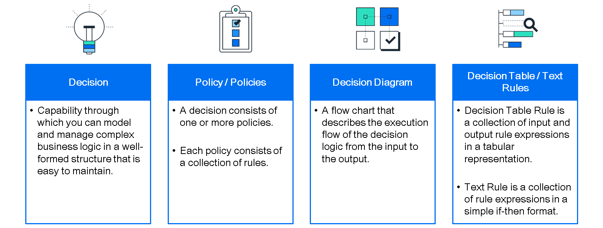

# ♠ 1 [IMPROVING THE SALES ORDER MANAGEMENT PROCESS WITH DECISION LOGIC](https://learning.sap.com/learning-journeys/create-processes-and-automations-with-sap-build-process-automation/improving-the-sales-order-management-process-with-decision-logic_e13b26bd-9ba6-48ba-a7f0-d8879c1bb14f)

> :exclamation: Objectifs
>
> - [ ] Create and configure decision logic in the process
>
> - [ ] Update an existing process

## :closed_book: INTRODUCTION: IMPROVING THE PROCESS WITH DECISION LOGIC

Vous allez maintenant apprendre à créer et configurer une décision. Une décision est composée d'une ou plusieurs politiques. Chaque politique est composée d'un ensemble de règles. Ces règles permettent d'automatiser les étapes décisionnelles d'un processus métier. Après avoir créé une décision (politique), vous définissez votre logique métier en y ajoutant des règles.

Pour en savoir plus sur les décisions et les règles, regardez la vidéo suivante :

[Link Video](https://learning.sap.com/learning-journeys/create-processes-and-automations-with-sap-build-process-automation/improving-the-sales-order-management-process-with-decision-logic_e13b26bd-9ba6-48ba-a7f0-d8879c1bb14f)

Voici un exercice. Visionnez la vidéo suivante pour vous préparer : Créer et configurer la logique de décision dans le processus.

[Link Video](https://learning.sap.com/learning-journeys/create-processes-and-automations-with-sap-build-process-automation/improving-the-sales-order-management-process-with-decision-logic_e13b26bd-9ba6-48ba-a7f0-d8879c1bb14f)

## :closed_book: CREATE AND CONFIGURE DECISION LOGIC IN THE PROCESS

### BUSINESS SCENARIO

Les processus métier nécessitent généralement différents approbateurs en fonction des données réelles du processus. Les approbateurs ne doivent pas être codés en dur dans les étapes d'approbation, mais calculés dynamiquement à chaque exécution du processus. De plus, dans certaines situations, une approbation humaine peut ne pas être nécessaire, mais le processus doit être approuvé automatiquement. Les décisions et la logique décisionnelle sont parfaitement adaptées à ce type de situations. Dans ce qui suit, vous créerez une logique décisionnelle qui approuvera automatiquement une commande client lorsque son montant est inférieur à un certain seuil.

Créez une décision pour déterminer les approbateurs autorisés à approuver les commandes client selon des règles complexes.

Pour en savoir plus sur la création et la configuration de la logique décisionnelle dans le processus, suivez ce tutoriel.

### EXERCISE OPTIONS

Pour démarrer l'exercice, sélectionnez « Démarrer l'exercice » dans la figure ci-dessous.

Une fenêtre contextuelle s'ouvre. Vous disposez des options suivantes :

Choisir « Démarrer » : la simulation démarre. Suivez la simulation pour apprendre à créer et configurer la logique de décision.
Choisir « Ouvrir un document PDF » : un PDF s'ouvre. En suivant les étapes décrites dans ce document, vous pouvez réaliser l'exercice dans votre environnement système.

[Exercise](https://learnsap.enable-now.cloud.sap/pub/mmcp/index.html?show=project!PR_5A87EC453DFB6883:uebung)

[PDF](./RESSOURCES/hands_on.pdf)

[Steps](https://learning.sap.com/learning-journeys/create-processes-and-automations-with-sap-build-process-automation/improving-the-sales-order-management-process-with-decision-logic_e13b26bd-9ba6-48ba-a7f0-d8879c1bb14f)

## :closed_book: INCLUDE THE DECISION LOGIC IN THE PROCESS

### BUSINESS SCENARIO

Lorsque les approbateurs sont déterminés automatiquement par la logique de décision dans le processus, cela doit également se refléter dans les tâches d'approbation suivantes. Les destinataires des tâches d'approbation doivent être basés sur le contenu/les variables résultant de l'étape d'exécution de la décision.

Vous allez maintenant adapter une dernière fois le processus métier pour automatiser entièrement la sélection des approbateurs en faisant correspondre les destinataires du formulaire d'approbation à ceux renvoyés par la table de décision.

Pour en savoir plus sur l'intégration de la logique de décision dans le processus, suivez ce tutoriel interactif.

### EXERCISE OPTIONS

Pour démarrer l'exercice, sélectionnez « Démarrer l'exercice » dans la figure ci-dessous.

Une fenêtre contextuelle s'ouvre. Vous disposez des options suivantes :

Choisir « Démarrer » : la simulation démarre. Suivez la simulation pour apprendre à créer et configurer la logique de décision.
Choisir « Ouvrir un document PDF » : un PDF s'ouvre. En suivant les étapes décrites dans ce document, vous pouvez réaliser l'exercice dans votre environnement système.

[Exercise](https://learnsap.enable-now.cloud.sap/pub/mmcp/index.html?show=project!PR_13BB5FF1AE86A8C:uebung)

[PDF](<./RESSOURCES/hands_on%20(1).pdf>)

## :closed_book: RUN THE PROCESS INCLUDING AUTOMATION AND DECISION

### BUSINESS SCENARIO

Vous avez mis à jour votre processus métier avec une automatisation et une logique de décision supplémentaire. Vous avez précédemment vérifié que le processus fonctionnait correctement. Vous devez maintenant le valider à nouveau, car des modifications importantes ont été apportées. Il est nécessaire de libérer et de déployer à nouveau le processus, puis de l'exécuter pour validation.

Exécutez le processus métier avec une surveillance complète des instances de workflow et des tâches d'automatisation.

Pour en savoir plus sur l'exécution du processus, y compris l'automatisation et la prise de décision, suivez ce tutoriel.

### PREREQUISITES

Avant de publier et de déployer votre processus métier, assurez-vous d'avoir défini les paramètres de gestion des agents requis pour exécuter le processus avec une automatisation.

Une fois les paramètres de gestion des agents définis, vous pouvez publier et déployer le projet de processus métier pour exécuter le processus.

### EXERCISE OPTIONS

Pour démarrer l'exercice, sélectionnez « Démarrer l'exercice » dans la figure ci-dessous.

Une fenêtre contextuelle s'ouvre. Vous disposez des options suivantes :

Choisir « Démarrer » : la simulation démarre. Suivez la simulation pour apprendre à créer et configurer la logique de décision.
Choisir « Ouvrir un document PDF » : un PDF s'ouvre. En suivant les étapes décrites dans ce document, vous pouvez réaliser l'exercice dans votre environnement système.

[Exercise](https://learnsap.enable-now.cloud.sap/pub/mmcp/index.html?show=project!PR_12C71F13613E5884:uebung)

[PDF](<./RESSOURCES/hands_on%20(2).pdf>)

[Steps](https://learning.sap.com/learning-journeys/create-processes-and-automations-with-sap-build-process-automation/improving-the-sales-order-management-process-with-decision-logic_e13b26bd-9ba6-48ba-a7f0-d8879c1bb14f)
