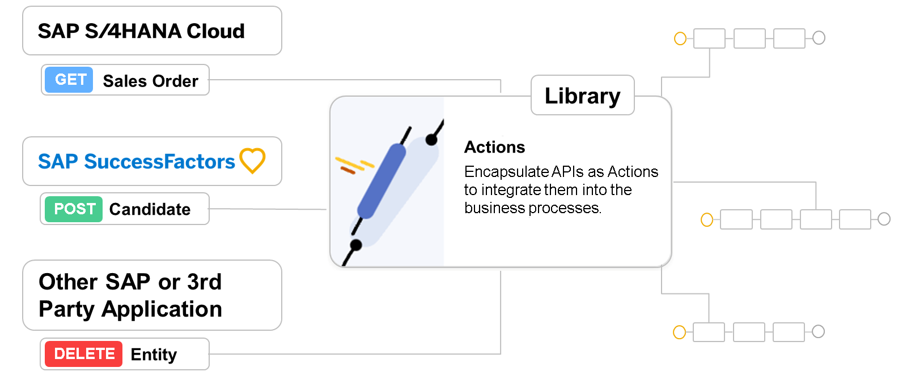

# ♠ 1 [ENCAPSULATING THE APIS OF REMOTE SYSTEMS USING ACTIONS PROJECTS](https://learning.sap.com/learning-journeys/create-processes-and-automations-with-sap-build-process-automation/encapsulating-the-apis-of-remote-systems-using-actions-projects_d102638b-94d7-4c2e-9547-bb344e9aa9de)

> :exclamation: Objectifs
>
> - [ ] Encapsulate remote systems APIs using actions projects

## :closed_book: ENCAPSULATION OF REMOTE SYSTEMS APIS USING ACTIONS PROJECTS

Comme de nombreux processus métier s'étendent sur une multitude de systèmes et d'applications différents, un système de gestion des processus métier (SGP) doit pouvoir interagir avec ces systèmes et applications. Dans SAP Build Process Automation, l'intégration est réalisée grâce à des actions. Les interfaces de programmation d'applications (API) des systèmes source et cible avec lesquelles interagir sont encapsulées sous forme d'actions au sein de projets d'actions. Ces projets d'actions sont ensuite stockés dans une bibliothèque de projets d'actions et peuvent ainsi être intégrés aux processus métier. Cette approche offre plusieurs avantages par rapport à l'intégration directe des API au processus concerné :

- L'API est abstraite. Le développeur de processus n'a pas besoin de connaître précisément les détails techniques de l'API.

- Les API peuvent être adaptées aux besoins des développeurs de processus, en exposant uniquement les points de terminaison et les données nécessaires ou utilisables en toute sécurité par les développeurs de processus.

- Les actions peuvent être configurées une fois, puis réutilisées dans différents projets de processus métier.

- Les projets d'actions permettent la gestion des versions, facilitant ainsi la gestion des changements d'exigences de processus ou de versions d'API.

Comme les actions s'appuient sur la norme OpenAPI Specification (https://spec.openapis.org/oas/v3.1.0#openapi-specification) pour la définition des API, elles ne se limitent pas aux API des systèmes SAP, mais offrent la possibilité d'intégrer toute API décrite ou susceptible d'être décrite dans la spécification OpenAPI. De nombreuses définitions d'API, notamment pour les solutions SAP, sont disponibles sur le SAP Business Accelerator Hub.

> Note
>
> Vous trouverez des informations supplémentaires sur les API, en particulier sur les API SAP Build Process Automation, et sur la manière d'interagir avec elles à un niveau plus technique dans l'unité Intégration des API de SAP Build Process Automation.

### ACTIONS EDITOR

L'éditeur d'actions vous permet de composer plusieurs actions à partir d'une API sous-jacente dans un projet d'actions. Notez qu'il n'est pas nécessaire d'inclure tous les paramètres possibles d'un point de terminaison d'API dans les actions respectives, ni d'inclure tous les champs de corps de réponse disponibles dans la réponse fournie par l'action. Ainsi, seules les informations pertinentes pour le processus métier peuvent être incluses.

Une fois vos actions définies, le projet doit être publié dans une version, puis dans la bibliothèque d'actions.

Une fois les API encapsulées dans un projet Actions et publiées dans la bibliothèque, leur ajout en tant qu'action à un processus est très simple. Sélectionnez le type d'étape Actions correspondant et parcourez la bibliothèque Actions. Sélectionnez l'action requise dans votre processus, puis cliquez sur Ajouter. Une fois l'étape Action incluse dans votre processus, assurez-vous de définir ses paramètres :

- Destination variable : une variable de processus qui contiendra le nom de destination technique SAP BTP à utiliser pour accéder à l'API sous-jacente lors de l'exécution du processus. Cette variable peut être renseignée avec un nom de destination lors du déploiement du processus.

- Inputs : mappage du contenu du processus à tous les paramètres requis par l'action pour être exécutée (par exemple, le numéro de commande client, lors de la récupération d'une entrée de commande client depuis un système SAP S/4HANA).

- Outputs : aperçu du résultat de l'appel d'Actions, tel que défini dans l'action concernée.

## :closed_book: ENCAPSULATE REMOTE SYSTEMS APIS USING ACTIONS PROJECTS

### BUSINESS SCENARIO

Vous et vos collègues développez un processus qui doit lire les données des commandes clients depuis votre système SAP S/4HANA et, ultérieurement, les réécrire dans le système. Vous êtes maintenant confronté au défi d'interagir avec ce système SAP S/4HANA. Pour résoudre ce problème, SAP Build Process Automation propose la fonctionnalité des projets Actions. Vous allez définir tous les points de terminaison de l'API des commandes clients SAP S/4HANA à utiliser dans le processus, en tant qu'actions dans un projet Actions. Cette procédure peut également être décrite comme une encapsulation des API, car vous créez un wrapper uniquement autour des points de terminaison d'API spécifiquement requis. En publiant le projet Actions, les actions seront disponibles dans une bibliothèque Actions pour être utilisées dans vos processus.

Pour en savoir plus sur l'encapsulation des API de systèmes distants à l'aide de projets Actions, suivez ce tutoriel.

### EXERCISE OPTIONS

Pour démarrer l'exercice, sélectionnez « Démarrer l'exercice » dans la figure ci-dessous.

Une fenêtre contextuelle s'ouvre. Vous disposez des options suivantes :

Choisir « Démarrer » : la simulation démarre. Suivez la simulation pour apprendre à créer et configurer la logique de décision.
Choisir « Ouvrir un document PDF » : un PDF s'ouvre. En suivant les étapes décrites dans ce document, vous pouvez réaliser l'exercice dans votre environnement système.

[Exercise](https://learnsap.enable-now.cloud.sap/pub/mmcp/index.html?show=project!PR_D68196BA5765FCA3:uebung)

[PDF](<./RESSOURCES/hands_on%20(3).pdf>)

[Steps](https://learning.sap.com/learning-journeys/create-processes-and-automations-with-sap-build-process-automation/encapsulating-the-apis-of-remote-systems-using-actions-projects_d102638b-94d7-4c2e-9547-bb344e9aa9de)

### TASK 1: TEST ACTIONS

[Exercise](https://learnsap.enable-now.cloud.sap/pub/mmcp/index.html?show=project!PR_C561B8C0BB2490B2:uebung)

[PDF](<./RESSOURCES/hands_on%20(4).pdf>)

[Steps](https://learning.sap.com/learning-journeys/create-processes-and-automations-with-sap-build-process-automation/encapsulating-the-apis-of-remote-systems-using-actions-projects_d102638b-94d7-4c2e-9547-bb344e9aa9de)
