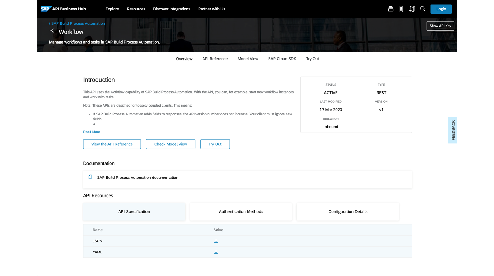

# ♠ 1 [LEVERAGE SAP BUILD PROCESS AUTOMATION APIS](https://learning.sap.com/learning-journeys/create-processes-and-automations-with-sap-build-process-automation/leveraging-sap-build-process-automation-apis_f3a73b24-9cdb-4549-bf53-c21edb63a1f0)

> :exclamation: Objectifs
>
> - [ ] Leverage the SAP Build Process Automation Application Programming Interfaces

## :closed_book: SAP BUILD PROCESS AUTOMATION APPLICATION PROGRAMMING INTERFACES

### WHAT ARE REST APIS?

Naturellement, la plupart des applications et services basés et exécutés dans le cloud s'appuient sur des API REST :

#### :small_red_triangle_down: REST (= Representational state transfer) :

est un style architectural qui définit certaines directives et contraintes pour la conception de composants web. Il met particulièrement l'accent sur l'interaction et la communication entre ces composants.

#### :small_red_triangle_down: APIs (= Application Programming Interfaces) :

définissent comment les composants peuvent être contactés par d'autres composants afin de déclencher certaines fonctionnalités.

> Les utilisateurs finaux n'accèdent généralement pas directement aux API REST des applications et services cloud. Ils utilisent généralement une application dotée d'une interface utilisateur graphique (GUI) et composent les informations pertinentes à partir d'autres applications et composants cloud, grâce aux API REST. Ainsi, les API REST sont invisibles pour l'utilisateur final. Cependant, la situation peut être différente pour les développeurs ou les administrateurs, qui peuvent souhaiter utiliser ou tester des fonctionnalités non disponibles dans une application dotée d'une interface utilisateur graphique.

Au cours du processus de développement, le développeur peut avoir besoin de tester ou de simuler les fonctionnalités individuelles de certains composants, indépendamment d'autres composants pertinents pour le système ou l'architecture globale. Par exemple, le développeur travaille sur un nouveau processus d'approbation des demandes d'absence. Dans un scénario productif, le processus est censé être déclenché par une application développée par une autre équipe. L'application appellera une API REST de SAP Build Process Automation afin de déclencher le processus d'approbation des absences. L'application n'étant pas encore existante, le développeur souhaite déclencher l'API REST manuellement pendant le développement à des fins de test. Pour ce faire, il peut utiliser un client REST.

Un client REST est un outil qui simplifie la communication technique avec les API REST. Il fournit une interface aux protocoles de communication techniques requis, tels que HTTPS, et facilite leur utilisation.

Un autre rôle susceptible d'intéresser les clients REST dans le contexte de SAP Build Process Automation est celui d'opérateur ou d'administrateur. Ce rôle administre, traite et peut être amené à effectuer des tâches ponctuelles, comme des tâches de nettoyage. De nombreuses fonctions d'administration et d'exploitation de SAP Build Process Automation sont disponibles via les applications « Surveiller les instances de processus et de workflow » et « Gérer les processus et les workflows », mais certaines fonctions ne sont accessibles que via l'API REST.

### DISCOVERING SAP BUILD PROCESS AUTOMATIONS APIS IN SAP BUSINESS ACCELERATOR HUB

En accédant au [SAP API Business Hub](https://api.sap.com/) (lien bientôt remplacé) et en recherchant le produit SAP Build Process Automation, vous trouverez le package d'API correspondant. Vous trouverez ci-dessous les différentes API qu'il contient, ainsi qu'un exemple d'utilisation de chacune d'elles.

#### :small_red_triangle_down: Automation Execution :

Créez une application permettant de lancer des automatisations spécifiques d'un simple clic.

#### :small_red_triangle_down: Automation Monitoring :

Récupérez les journaux des automatisations passées et administrez-les dans un autre outil.

#### :small_red_triangle_down: Decisions :

Exécutez un service de règles à l'aide d'un client REST pour vérifier qu'il produit les résultats escomptés.

#### :small_red_triangle_down: Inbox :

Créez une application Boîte de réception personnalisée, dont l'apparence diffère de l'application standard My Inbox fournie par SAP. Ce cas d'utilisation nécessite également l'API Processus et Workflows.

#### :small_red_triangle_down: Workflows :

Permettez à une autre application de déclencher de nouvelles instances de processus ou de workflow.

#### :small_red_triangle_down: Visibility Scenarios :

Gagnez en visibilité sur les processus ou les workflows des systèmes non SAP en envoyant les événements de processus au service SAP Build Process Automation.

#### :small_red_triangle_down: Visibility Workspace :

Obtenez un aperçu des scénarios de visibilité auxquels un utilisateur spécifique a accès.

### FINDING AN ENDPOINT TO USE

Imaginons que vous souhaitiez savoir comment déclencher un nouveau processus ou une nouvelle instance de workflow à l'aide des API SAP Build Process Automation.

Dans le package API SAP Build Process Automation, sélectionnez l'API REST Workflows. Vous obtiendrez une présentation et une description de l'API REST.

Sélectionnez Référence API afin de voir les détails des différents points de terminaison API qu'elle fournit.

Vous pouvez maintenant consulter les détails du point de terminaison concerné. Cette vue est particulièrement importante car elle fournit également des informations sur les rôles ou les portées requis pour exécuter l'API, ainsi que sur les paramètres requis lors de l'appel de l'API. Dans l'exercice suivant, vous découvrirez les étapes exactes requises pour utiliser une API SAP Build Process Automation.

