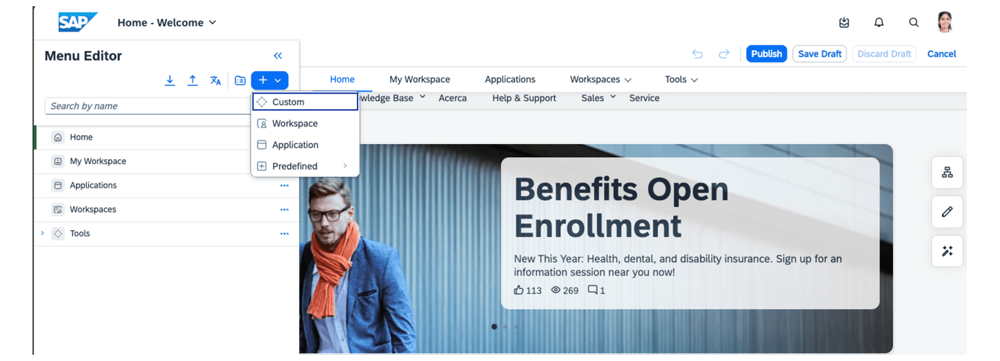
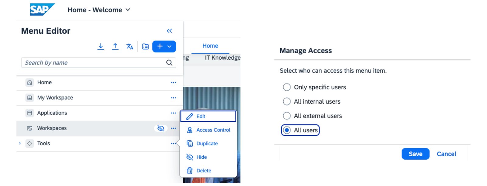
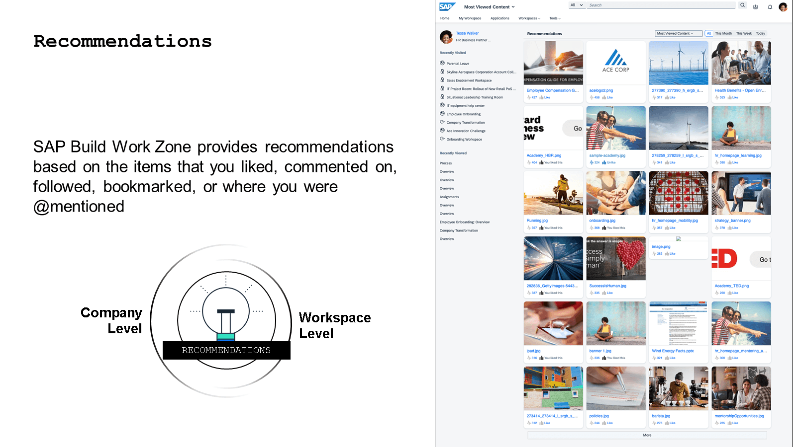
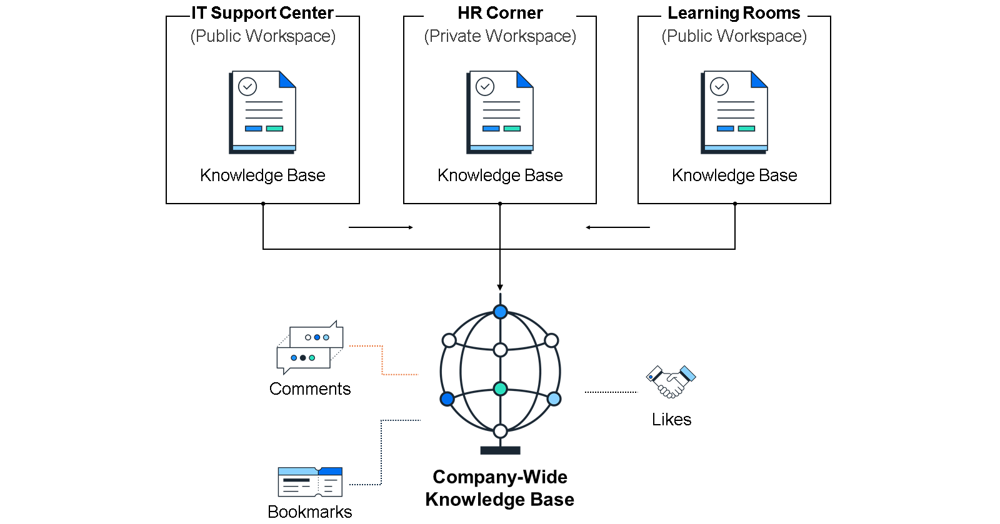
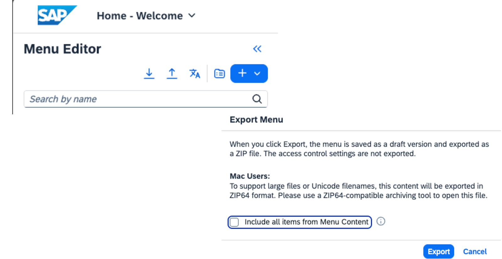

# ♠ 1 [MASTERING THE SITE MENU](https://learning.sap.com/learning-journeys/designing-sap-build-work-zone/mastering-the-site-menu)

> :exclamation: Objectifs
>
> - [ ] Configure and customize the Site Menu to create a seamless, role-specific, and intuitive user experience.
>
> - [ ] Add, organize, and manage menu items, tailoring the navigation to meet the needs of different user groups.
>
> - [ ] Leverage sections available via the menu, such as knowledge base and recommendations, to enhance user engagement.

## :closed_book: THE SITE MENU

Dans cette leçon, nous nous plongeons au cœur de la navigation dans SAP Build Work Zone : le menu du site. Ce dernier n'est pas seulement un outil de navigation ; c'est la passerelle par laquelle les utilisateurs accèdent à la vaste gamme de fonctionnalités, d'applications et de ressources disponibles sur la plateforme. Comprendre comment configurer, personnaliser et gérer le menu du site est essentiel pour les administrateurs souhaitant créer un espace de travail numérique convivial et efficace. Cette leçon couvrira tous les aspects, des bases de la configuration du menu du site à l'ajout de contenu et au transfert des configurations de menu entre les systèmes.

### UNDERSTANDING THE SITE MENU

Le menu du site de SAP Build Work Zone, édition avancée, constitue l'outil principal de navigation des utilisateurs. Il est conçu pour offrir un accès rapide aux espaces de travail, applications et autres ressources. Un menu du site bien organisé améliore l'expérience utilisateur en rendant la navigation intuitive et en réduisant le temps de recherche.

### CONFIGURING THE SITE MENU

La configuration du menu du site comprend plusieurs étapes clés :

- Accès à la configuration du menu du site : Les administrateurs de l'entreprise peuvent accéder au panneau de configuration du menu du site depuis SAP Build Work Zone. Ils peuvent y consulter la structure actuelle du menu et y apporter les modifications nécessaires.

- Modification des éléments du menu : Les administrateurs peuvent ajouter, supprimer ou réorganiser les éléments du menu. Chaque élément peut être configuré pour renvoyer vers différents types de contenu, tels que des applications, des espaces de travail ou des URL externes.

- Définition des autorisations : Il est possible de définir des autorisations d'accès pour chaque élément du menu, garantissant ainsi que les utilisateurs ne voient que le contenu correspondant à leurs rôles et niveaux d'accès.

> Note
>
> La section « Accueil » prédéfinie du menu est répertoriée séparément et est également disponible immédiatement. Elle regroupe les anciennes pages d'accueil (désormais pages de travail) des espaces utilisateurs internes et externes de l'entreprise et des autres espaces administratifs, notamment lors d'une migration depuis SAP Jam, où ces concepts de pages d'accueil sont toujours utilisés. Si vous souhaitez une page d'accueil différente, vous pouvez également désactiver « Accueil » dans le menu du site et le remplacer par un autre contenu, comme une page de travail créée dans la zone de contenu du menu du site.

## :closed_book: UTILIZING THE DIFFERENT MENU ITEM TYPES

Comprendre les différents types d'éléments de menu est essentiel pour créer un menu de site efficace et convivial. Parmi ces types, les éléments personnalisés, d'espace de travail, d'application et prédéfinis jouent un rôle essentiel dans l'adaptation de l'expérience de navigation aux besoins spécifiques des différents groupes d'utilisateurs. Voici une présentation détaillée de chacun de ces types d'éléments de menu :

#### :small_red_triangle_down: Custom :

- Description : Les éléments de menu personnalisés sont conçus pour offrir une grande flexibilité, permettant aux administrateurs de créer des liens vers un large éventail de contenus, à l'intérieur comme à l'extérieur de l'environnement SAP Build Work Zone. Ce type peut être configuré pour rediriger les utilisateurs vers des URL personnalisées ou des pages de travail directement stockées dans le contenu du menu du site.

- Utilisation optimale : Les éléments personnalisés sont idéaux pour intégrer des ressources uniques, telles que des pages de travail intranet d'entreprise, des applications personnalisées ou des pages de travail informatives spécifiques qui ne correspondent pas aux catégories standard d'applications ou d'espaces de travail.

#### :small_red_triangle_down: Workspace :

- Description : Les éléments du menu Espace de travail renvoient directement vers des espaces de travail spécifiques dans SAP Build Work Zone. Les espaces de travail sont des espaces collaboratifs pouvant contenir diverses applications, informations et outils collaboratifs adaptés à des processus métier, des projets ou des activités d'équipe spécifiques.

- Utilisation optimale : Les éléments Espace de travail sont particulièrement adaptés pour offrir un accès rapide à ces environnements collaboratifs, permettant aux utilisateurs de naviguer facilement vers leurs zones de projet, leurs ressources départementales ou tout autre espace de travail spécifique à un groupe. Ce type d'espace améliore la collaboration et la productivité en centralisant l'accès aux ressources associées.

#### :small_red_triangle_down: Application :

Description : Les éléments du menu d'application servent de liens directs vers les applications individuelles de SAP Build Work Zone. Il peut s'agir d'applications SAP standard, de solutions personnalisées ou d'applications tierces intégrées à la plateforme.

Utilisation optimale : Les éléments d'application sont essentiels pour garantir aux utilisateurs un accès rapide et facile aux outils dont ils ont besoin pour effectuer leurs tâches quotidiennes. Ils simplifient l'expérience utilisateur en réduisant les étapes nécessaires au lancement des applications fréquemment utilisées, ce qui en fait un élément clé d'un menu de site efficace.

#### :small_red_triangle_down: Predefined Menu Items :

- Description : Les éléments de menu prédéfinis sont des liens générés par le système qui pointent vers les fonctionnalités ou services SAP Build Work Zone les plus utilisés. Ces éléments sont automatiquement inclus dans le menu du site afin de garantir un accès uniforme aux fonctionnalités essentielles de la plateforme, notamment les recommandations ou la base de connaissances inter-espaces de travail.

- Utilisation optimale : Les éléments prédéfinis sont idéaux pour garantir à tous les utilisateurs un accès uniforme aux fonctionnalités clés de SAP Build Work Zone, comme la base de connaissances ou le menu déroulant des espaces de travail. Ils contribuent à maintenir une structure de navigation standardisée sur l'ensemble de la plateforme, facilitant ainsi l'accès aux services et paramètres courants.

## :closed_book: RECOMMENDATIONS AND KNOWLEDGE BASE

La fonctionnalité « Recommandations » de SAP Build Work Zone propose des suggestions de contenu personnalisées en fonction des interactions des utilisateurs, telles que les mentions « J'aime », les commentaires, les abonnements, les favoris et les @mentions. Cet outil gère une liste des contenus les plus consultés, mis en avant ou appréciés, adaptée à chaque utilisateur.

- **Workspace Level** : Dans un espace de travail, accédez à la page « Recommandations » pour afficher le contenu recommandé, le plus consulté, mis en avant ou apprécié. Vous pouvez filtrer ces recommandations par échéance, par exemple « ce mois-ci », « cette semaine » ou « aujourd'hui ».

- **Company Level** : Au niveau de l'entreprise, la fonctionnalité « Recommandations » répertorie le contenu en fonction du nombre de vues, des mentions « J'aime », des notes les plus élevées ou du statut de mise en avant. Elle est accessible depuis le menu du site, sous Outils > Recommandations.

La fonctionnalité Base de connaissances de SAP Build Work Zone permet aux membres de l'espace de travail de créer, de catégoriser et de partager des articles sur divers sujets tels que des idées, des processus et des solutions à des problèmes courants.

#### :small_red_triangle_down: Workspace Level :

Si cette option est activée, la page Base de connaissances affiche tous les articles créés dans l'espace de travail. Les membres peuvent créer des articles à l'aide de modèles, d'un éditeur de texte enrichi pour les images, les liens et les vidéos, et les classer par catégories pour un filtrage simplifié. Les brouillons peuvent être enregistrés et les articles publiés avec des autorisations et des paramètres spécifiques, notamment la publication différée et les dates d'expiration. Les articles publiés peuvent être étiquetés, aimés, ajoutés à leurs favoris et commentés. Les administrateurs de l'espace de travail peuvent créer et gérer des modèles d'articles, déplacer des articles entre les espaces de travail et activer ou désactiver la fonctionnalité Base de connaissances dans les paramètres de l'espace de travail.

#### :small_red_triangle_down: Company-Wide Knowledge Base :

Si cette option est activée par l'administrateur de l'entreprise, les utilisateurs peuvent accéder aux articles de tous les espaces de travail publics et de tous les espaces de travail dont ils sont membres via le menu du site sous Outils → Base de connaissances.

Depuis le menu du site, les administrateurs peuvent activer la base de connaissances et les fonctionnalités de recommandation à l'échelle de l'entreprise, et décider où placer ces entrées dans le menu général.

La capture d'écran ci-dessus illustre l'accès aux recommandations et à la base de connaissances via le menu du site.

### TRANSPORTING SITE MENU CONFIGURATIONS

Le transfert des configurations du menu du site est essentiel pour assurer la cohérence entre différents environnements (par exemple, d'un environnement de développement à un environnement de production). Le processus comprend :

- **Exporting the Configuration** : Utilisez la fonctionnalité de transfert du gestionnaire de site pour exporter la configuration actuelle du menu du site. Cela générera un fichier contenant tous les paramètres et structures du menu.

- **Importing to another System** : Dans le système cible, importez le fichier de configuration via l'écran de configuration du menu du site. Cela appliquera tous les paramètres du menu du système source au système cible, garantissant ainsi une expérience utilisateur cohérente entre les environnements.

### BEST PRACTICES FOR SITE MENU MANAGEMENT

- **Keep It Simple** : Privilégiez une structure de menu de site facile à comprendre et à parcourir. Une complexité excessive peut submerger les utilisateurs et les empêcher de trouver ce dont ils ont besoin.

- **Regularly Review and Update** : Votre menu de site doit évoluer en fonction des besoins de votre organisation. Revoyez régulièrement la structure et le contenu du menu pour vous assurer qu'ils restent pertinents et utiles.

- **Engage Users for Feedback** : Les retours des utilisateurs sont précieux pour optimiser le menu de site. Interagissez avec eux pour comprendre leurs besoins et leurs préférences et ajustez le menu en conséquence.
