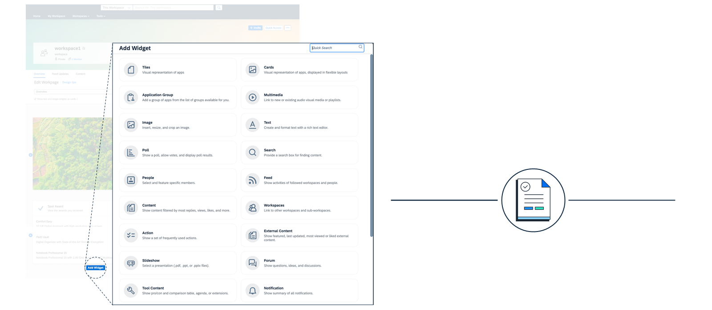

# ♠ 1 [MANAGING WORSPACE](https://learning.sap.com/learning-journeys/designing-sap-build-work-zone/managing-workpages)

> :exclamation: Objectifs
>
> - [ ] Create, customize, and manage Workpages to provide users with interactive pages tailored to their needs.
>
> - [ ] Utilize Workpages to host a variety of content, including applications, widgets, and UI cards, enhancing the digital workspace's effectiveness.

## :closed_book: WORKPAGES

Les pages de travail sont des pages hautement personnalisables qui constituent des environnements dynamiques permettant aux utilisateurs d'interagir avec diverses applications, informations et outils. Conçues pour offrir une expérience utilisateur personnalisée, elles permettent l'intégration de contenus variés via des widgets et des cartes. Accessibles directement depuis le menu du site ou les espaces de travail, les pages de travail offrent une interface flexible et interactive permettant aux utilisateurs d'effectuer leurs tâches efficacement.

### KEY FEATURES OF WORKPAGES

- **Customizable Layout** : Les créateurs peuvent concevoir la mise en page de leurs pages de travail et choisir la meilleure organisation du contenu pour répondre aux besoins de leurs utilisateurs. Les pages de travail sont présentées sous forme de grille, composée de sections, chacune pouvant comporter jusqu'à six colonnes pour ajouter du contenu.

- **Integration of Widgets and Cards** : Les pages de travail peuvent héberger divers widgets et cartes d'intégration d'interface utilisateur, permettant l'affichage de contenu riche et interactif.

## :closed_book: CONTENT OF WORKPAGES

Informations sur le catalogue de widgets :

- Utilisez des tuiles, des cartes et des widgets pour organiser la mise en page de vos pages, quel que soit l'objectif et la complexité : page d'accueil de l'entreprise, pages d'informations sur les services (par exemple, informatique, RH, installations), campagnes marketing, espaces de collaboration d'équipe, etc.

- Profitez de divers widgets et cartes standard et prêts à l'emploi : pages wiki, sondages, contenu multimédia, texte simple, tâches, flux, événements.

### CREATING AND MANAGING WORKPAGES

Créer une page de travail implique de sélectionner une mise en page de base, de nommer la page, puis d'ajouter et de configurer des widgets et des cartes pour enrichir la page. Les administrateurs peuvent définir des autorisations pour contrôler l'accès à chaque page de travail, garantissant ainsi que seuls les utilisateurs concernés peuvent consulter ou modifier le contenu.

L'éditeur de pages de travail vous permet de :

- Créez et modifiez des pages grâce à un éditeur intégré riche et visuel, simple d'utilisation grâce au glisser-déposer.

- Configurez des traductions, suivez les modifications et les versions, et modifiez la mise en page en ajoutant des tuiles, des cartes et des widgets.

- Modifiez et visualisez le résultat immédiatement, sans compétences en développement.
