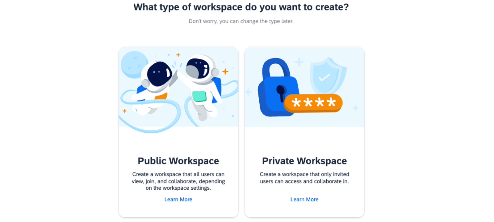
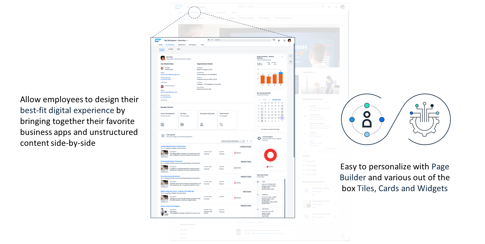
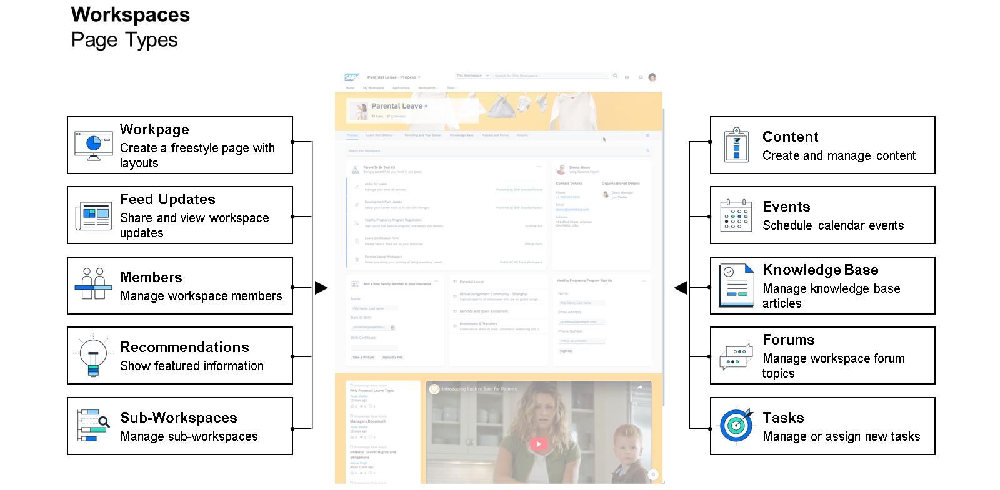
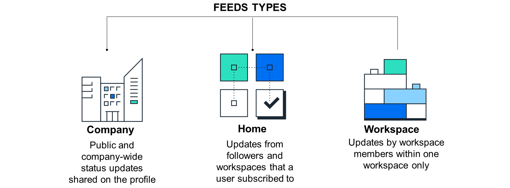
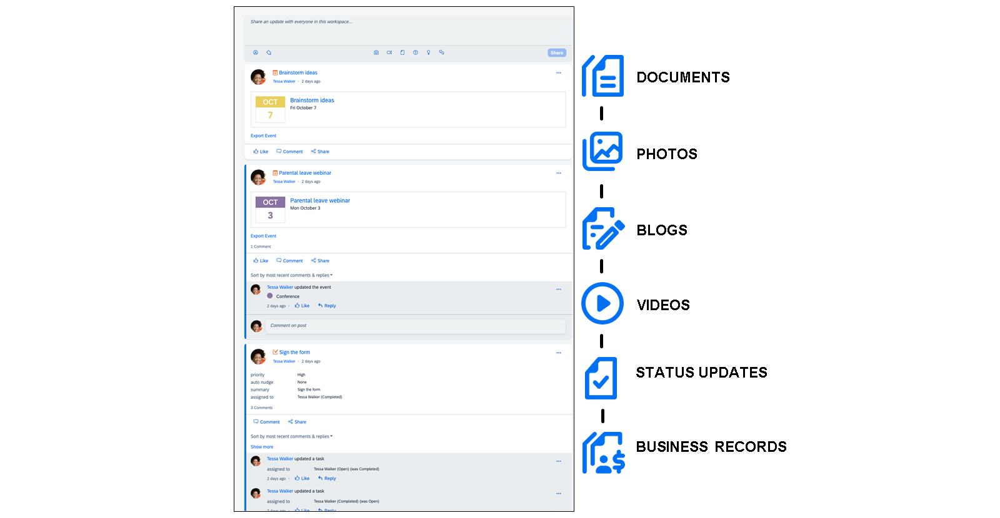
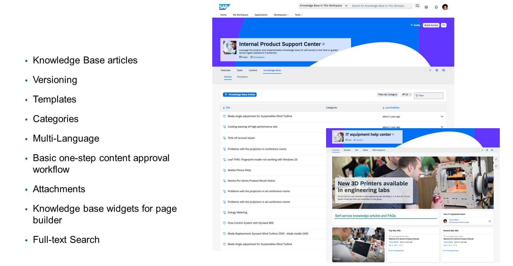
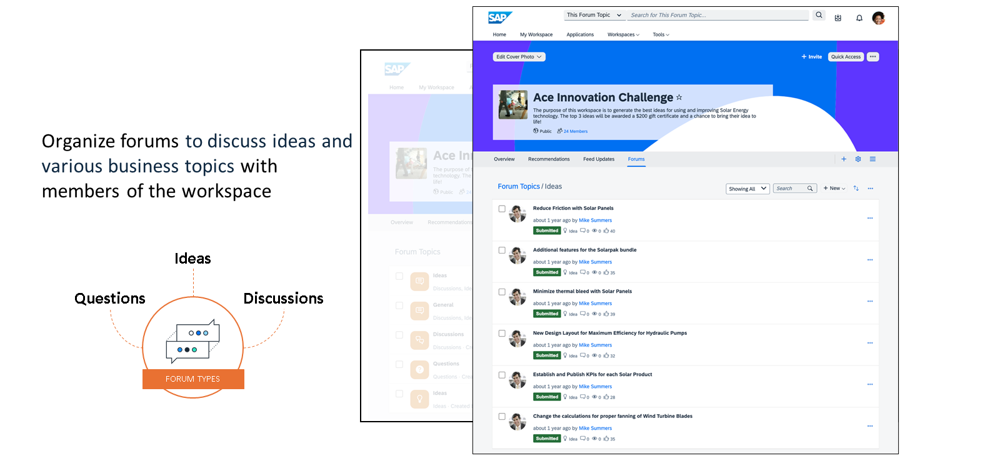
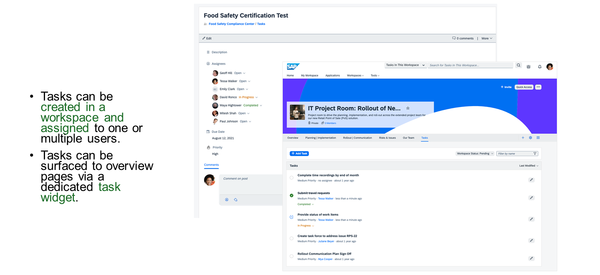

# ♠ 1 [WORKING WITH WORSPACES](https://learning.sap.com/learning-journeys/designing-sap-build-work-zone/working-with-workspaces)

> :exclamation: Objectifs
>
> - [ ] Create and manage workspaces, including setting up workspace templates and managing access permissions.
>
> - [ ] Integrate content and applications into workspaces to facilitate collaboration and productivity among team members

## :closed_book: WORSPACES

Les espaces de travail font partie intégrante de SAP Build Work Zone. Ils constituent des environnements collaboratifs qui améliorent considérablement la productivité et la synergie au sein des équipes. Ils offrent une conception flexible et intègrent divers outils et applications pour rationaliser les processus de travail, collecter des données et partager les meilleures pratiques. Ils permettent une communication et une interaction fluides entre collègues et équipes, favorisant ainsi un environnement de travail connecté et efficace.

### CREATING AND MANAGING WORSPACES

La création d'espaces de travail peut être autorisée pour tous les utilisateurs internes ou réservée aux administrateurs. La gestion des espaces de travail est ensuite accessible à tous les utilisateurs internes désignés comme administrateurs.

Les espaces de travail ont de nombreuses fonctions et permettent aux membres comme aux administrateurs de :

- **Add Content** : intégrer divers types de contenu pour soutenir les processus de travail ;

- **Use Planning Tools** : utiliser des outils pour la planification et la coordination de projets ;

- **Integrate Applications** : ajouter des applications métier, des cartes et des widgets pour des fonctionnalités améliorées ;

- **Publish Communication** : créer des articles de blog, des pages wiki et des liens pour le partage d'informations.

Pour participer activement et contribuer à un espace de travail, il faut devenir membre. Au sein de ces espaces de travail, les membres peuvent communiquer via des flux ou des forums et utiliser des pages de travail pour diffuser des informations et du contenu. L'accès au contenu des espaces de travail peut également être autorisé aux « non-membres » si nécessaire, notamment si l'espace de travail est de nature moins collaborative, par exemple en l'utilisant comme référentiel pour les documents RH en libre-service.

Pour simplifier la configuration d'un nouvel espace de travail, SAP Build Work Zone propose des modèles d'espace de travail. Ces modèles fournissent un espace de travail complet avec du contenu d'espace réservé et une structure prédéfinie, optimisée pour des scénarios métier spécifiques.

### CREATING WORSPACES USING TEMPLATES

Les membres ont la possibilité de créer des espaces de travail (publics ou privés) en sélectionnant des modèles prédéfinis ou en commençant sans modèle. Cette flexibilité permet de créer des espaces de travail adaptés à leurs besoins et objectifs spécifiques.

### CUSTOM TEMPLATES

Pour des besoins plus spécifiques, les administrateurs d'espaces de travail peuvent créer des modèles personnalisés via la console d'administration. Cette option permet de créer des espaces de travail uniques, adaptés à des processus métier spécifiques ou à des besoins de collaboration. Les packages de contenu, qui seront abordés plus en détail plus loin dans ce cours, peuvent également inclure ces modèles personnalisés.

### TYPES OF WORSPACES IN SAP BUILD WORK ZONE

SAP Build Work Zone offre un environnement de collaboration flexible, proposant deux principaux types d'espaces de travail : publics et privés. Chaque type est conçu pour répondre à différents niveaux d'accessibilité et de découverte, garantissant une collaboration adaptable aux besoins de l'organisation, qu'elle implique des utilisateurs internes ou externes.

### WORKSPACE TYPES IN SAP BUILD WORK ZONE ARE:

#### :small_red_triangle_down: My Workspace :

- **Explanation** : Espace de travail personnel visible et accessible par vous seul. Vous ne pouvez pas y inviter d'autres personnes.

- **Use Case** : Organisez votre espace de travail personnalisé et adapté à vos besoins quotidiens.

#### :small_red_triangle_down: Public Workspace :

- **Explanation** : Espaces de travail accessibles aux non-membres et éventuellement en lecture seule.

- **Use Case** : Partager des informations à l'échelle de l'entreprise en organisant des espaces de formation (salles), un espace dédié à la direction, un centre de support informatique, etc.

#### :small_red_triangle_down: Private Workspace :

- **Explanation** : Espaces de travail que vous ne pouvez rejoindre et consulter que si vous y avez été invité ou affecté.

- **Use Case** : Interagissez avec des collaborateurs internes et externes sur des projets, par exemple des projets informatiques, des campagnes marketing, des salles de réunion, etc.

### WHAT TYPE OF WORSPACE DO YOU WANT TO CREATE?

### PUBLIC WORKSPACES

- **Accessibility** : Les espaces de travail publics peuvent être rendus accessibles aux utilisateurs internes et externes, et non plus seulement aux utilisateurs disposant d'un accès complet au sein de l'entreprise. Cette ouverture permet une collaboration plus large, permettant d'inclure des partenaires ou des clients dans des projets ou des discussions spécifiques.

- **Discovery** : Ces espaces de travail et leur contenu sont accessibles via l'outil de recherche globale ou en parcourant le référentiel des espaces de travail, ce qui facilite l'accès des utilisateurs autorisés.

- **Note** : Lorsque des espaces de travail publics sont ouverts à des utilisateurs externes, SAP Build Work Zone affiche un avertissement dédié sur tous les écrans de l'espace de travail. Cela rappelle constamment l'accessibilité de l'espace de travail aux utilisateurs externes à l'organisation, contribuant ainsi à la sensibilisation et à la gestion appropriée du partage d'informations sensibles.

### DETAILS ABOUT PRIVATE WORKSPACES

- **Accessibility** : L’accès aux espaces de travail privés se fait uniquement sur invitation ou par affectation à une liste d’utilisateurs, garantissant ainsi l’exclusivité de l’accès à un groupe restreint de membres, qu’ils soient internes ou externes à l’organisation. Cette restriction est essentielle pour préserver la confidentialité des projets ou des discussions sensibles.

- **Discovery** : Les espaces de travail privés ne sont pas visibles dans les résultats de recherche globaux ni dans le référentiel des espaces de travail pour les non-membres, préservant ainsi leur confidentialité. Cependant, les administrateurs d’espaces de travail ont la possibilité d’activer la découverte, permettant ainsi de contrôler la visibilité du titre et de la description de l’espace de travail.

- **Note** : Comme pour les espaces de travail publics, lorsque des utilisateurs externes se voient accorder l’accès à un espace de travail privé, un avertissement dédié s’affiche clairement. Cette fonctionnalité souligne l’importance de la discrétion et d’une gestion rigoureuse de l’accès à ces zones exclusives, garantissant que tous les participants sont conscients du caractère restreint et sensible de l’espace de travail.

### MY WORKSPACE

Outre la distinction entre espaces de travail publics et privés, les éditions avancées de SAP Build Work Zone proposent également une fonctionnalité personnalisée appelée « Mon espace de travail ». Cet espace unique est conçu comme un tableau de bord personnel pour chaque utilisateur, offrant un emplacement centralisé pour gérer et accéder à des tâches, applications et contenus personnalisés, adaptés à son travail et à ses préférences.

« MY WORKSPACE » est un espace dédié à l'utilisateur, automatiquement accessible à tous les utilisateurs de SAP Build Work Zone. Il offre un environnement personnalisable où les utilisateurs peuvent ajouter, organiser et accéder aux outils et informations les plus pertinents pour leurs activités et projets quotidiens. Cet espace de travail personnalisé améliore la productivité en réduisant le temps et les efforts nécessaires pour naviguer dans les différentes sections de la plateforme afin de trouver les ressources nécessaires.

### CONCLUSION

La classification des espaces de travail en catégories publiques et privées dans SAP Build Work Zone permet aux organisations de gérer efficacement la collaboration, en équilibrant ouverture et confidentialité selon les besoins du projet. La conception de la plateforme, conçue pour accueillir des utilisateurs internes et externes, et des avertissements clairs en cas d'intervention d'utilisateurs externes, garantissent que toute collaboration au sein de SAP Build Work Zone se déroule avec un niveau de sécurité et de sensibilisation approprié.

## :closed_book: WORSPACE FEATURES

Outre les pages de travail comme élément central de la structuration et de la conception du contenu d'un espace de travail, il existe également de nombreuses autres fonctionnalités qui peuvent être activées en option par un administrateur d'espace de travail.

### FEED UPDATES SECTION

La Feed Updates Section est essentielle pour les espaces de travail où l'interaction des utilisateurs et la disponibilité des mises à jour sont cruciales. Cette fonctionnalité offre une vue chronologique des commentaires, publications et autres actions des utilisateurs, favorisant ainsi une communauté active et engagée au sein de l'espace de travail. C'est un excellent outil pour tenir les membres informés et encourager un dialogue continu.

### MEMBERSHIP SECTION

La gestion des accès à l'espace de travail est simplifiée grâce à la section Adhésions. Les administrateurs peuvent inviter de nouveaux membres, accorder des droits d'administrateur et superviser les adhésions à l'espace de travail. Cette fonctionnalité garantit un contrôle rigoureux de l'accès à l'espace de travail, en adéquation avec les besoins du projet et en garantissant la sécurité.

### RECOMMENDATIONS SECTION

Pour améliorer l'engagement des utilisateurs et la découverte de contenu, la section Recommandations met en avant les contenus tendance ou recommandés dans l'espace de travail. Cette fonctionnalité permet aux utilisateurs d'explorer des informations et des ressources pertinentes, améliorant ainsi leur expérience et leur base de connaissances.

### SUB-WORKSPACES SECTION

Pour les projets complexes nécessitant des niveaux d'organisation supplémentaires, la section Sous-espaces de travail permet la création d'espaces de travail imbriqués. Cette fonctionnalité prend en charge un niveau de sous-espaces de travail, chacun disposant d'une appartenance, d'un contenu et d'un contrôle des fonctionnalités indépendants, offrant une flexibilité inégalée dans la structuration du contenu et la gestion des accès. Pour accéder à un sous-espace de travail, l'utilisateur doit toutefois être membre de l'espace de travail principal.

### CONTENT SECTION

La section Contenu est essentielle pour organiser et gérer des informations détaillées, des vidéos pédagogiques, des présentations, etc. Elle permet la création de dossiers pour regrouper et organiser le contenu, et permet le téléchargement groupé de contenu via des fichiers ZIP. Des dossiers privés peuvent être créés pour le partage exclusif de contenu, ce qui en fait un outil polyvalent de gestion de contenu au sein de l'espace de travail. Le contenu s'intègre parfaitement aux pages de travail grâce au widget de contenu, facilitant ainsi l'accès et la consultation.

### EVENTS SECTION

La section Événements améliore la collaboration dans l'espace de travail en proposant un calendrier des événements en cours et à venir, tels que des webinaires ou des réunions. Les membres peuvent personnaliser leur affichage (jour, semaine, liste), définir des préférences comme le fuseau horaire et le premier jour de la semaine, et ajouter ou importer des événements, ce qui en fait un outil précieux pour la planification et la coordination des événements.

### KNOWLEDGE BASE SECTION

Pour les espaces de travail axés sur le partage des connaissances, la section Base de connaissances permet aux membres de créer et de stocker des articles. Cette approche de création de contenu basée sur des formulaires la distingue de la section Contenu, plus axée sur le téléchargement, en offrant un moyen structuré de diffuser les connaissances au sein de l'espace de travail. Si cette option est désactivée, les articles précédemment publiés ne seront plus visibles, garantissant ainsi la pertinence et l'exactitude du contenu.

### FORUM SECTION

Offrant une plateforme plus structurée pour des discussions approfondies, la section Forum permet la création de pages de questions-réponses et de discussions sur des idées ou des sujets. Conçue pour des interactions approfondies, elle complète la section Mises à jour du fil d'actualité, plus dynamique, en offrant un espace pour des discussions plus approfondies et ciblées.

Pour échanger des idées avec les membres de votre espace de travail, leur poser des questions et trouver des solutions ensemble, vous pouvez utiliser les forums. Ils structurent vos échanges d'idées et constituent une base de connaissances où vous pouvez consulter ultérieurement les sujets déjà abordés ou les questions auxquelles vous avez déjà répondu.

Il existe différents types de forums pour différents objectifs. L'administrateur de votre espace de travail définit les types de forums suivants qui sont activés pour l'espace de travail :

- Questions

- Idées

- Discussions

### TASK SECTION

La section Tâches introduit la gestion collaborative des tâches dans l'espace de travail, répertoriant les tâches en cours, en retard et terminées. Cette fonctionnalité est précieuse pour la planification de projet, l'organisation d'événements et le suivi de l'avancement, garantissant que tous les membres sont informés et coordonnés sur les tâches à accomplir. Les tâches de l'espace de travail peuvent également être accessibles dans SAP Task Center si l'intégration est configurée.

