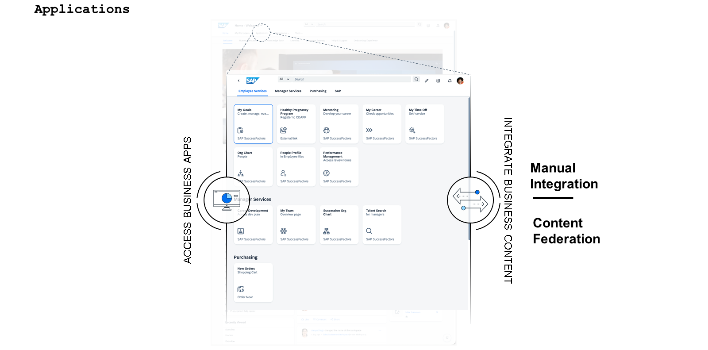

# ♠ 1 [INTEGRATIONG APPLICATIONS](https://learning.sap.com/learning-journeys/designing-sap-build-work-zone/integrating-applications)

> :exclamation: Objectifs
>
> - [ ] Explain the two main approaches to integrating applications into SAP Build Work Zone: Manual Integration and Content Federation via Content Providers
>
> - [ ] Integrate, manage, and deploy applications within SAP Build Work Zone, enhancing the functionality and efficiency of workspaces and workpages

## :closed_book: MANUAL INTEGRATION AND CONTENT FEDERATION

Les applications constituent un autre composant essentiel de SAP Build Work Zone, améliorant la fonctionnalité et l'efficacité des espaces de travail et des pages de travail. L'intégration des applications à l'environnement SAP Build Work Zone offre une expérience utilisateur fluide et un accès à une large gamme d'outils et de services directement depuis la plateforme. Les applications peuvent être ajoutées au menu du site, sous forme de vignettes ou de groupes de vignettes dans les pages de travail, ou accessibles via le menu dédié « Applications ».

Cette leçon couvre deux approches principales de l’intégration d’applications : l’intégration manuelle et la fédération de contenu via des fournisseurs de contenu.

### MANUAL INTEGRATION OF APPLICATIONS

L'intégration manuelle consiste à ajouter des applications directement dans le gestionnaire de contenu SAP Build Work Zone. Ce processus s'adapte à différents types d'applications, notamment les applications personnalisées, les services tiers et les applications SAP standard.

### STEP FOR MANUAL INTEGRATION

- Sélection de l'application : Identifiez l'application que vous souhaitez intégrer. Il peut s'agir d'un outil interne, d'une application tierce ou de toute ressource web améliorant votre espace de travail.

- Configuration : Configurez les paramètres de l'application pour garantir sa compatibilité avec SAP Build Work Zone. Cela peut impliquer la configuration de l'authentification unique (SSO), la définition de l'URL de l'application et la configuration des paramètres nécessaires à son fonctionnement sur la plateforme.

- Ajout à SAP Build Work Zone : Une fois configurée, l'application peut être ajoutée à la plateforme via le Gestionnaire de site. C'est ici que vous spécifiez les modalités d'accès à l'application.

- Tests et validation : Après avoir ajouté l'application, effectuez des tests approfondis pour vous assurer qu'elle fonctionne correctement. Cela comprend la vérification des autorisations d'accès, le test des points d'intégration et la vérification des performances de l'application répondant aux besoins des utilisateurs.

## :closed_book: BUSINESS CONTENT ADMINISTRATION

### CONTENT FEDERATION VIA CONTENT PROVIDERS

La fédération de contenu permet à SAP Build Work Zone d'intégrer un large éventail de contenus provenant de sources diverses, les rendant ainsi accessibles au sein de l'écosystème de la plateforme. Cette approche s'appuie sur les fournisseurs de contenu et les systèmes externes proposant des applications, des informations et des services s'intégrant parfaitement à SAP Build Work Zone.

### IMPLEMENTING CONTENT FEDERATION

- Identification des fournisseurs de contenu : Déterminez les systèmes ou services externes que vous souhaitez intégrer en tant que fournisseurs de contenu.

- Configuration : Configurez la connexion entre SAP Build Work Zone et le fournisseur de contenu. Cela implique la configuration de l'authentification, la définition des droits d'accès et la sécurisation des échanges de données entre les systèmes.

- Intégration de contenu : Une fois le fournisseur de contenu connecté, vous pouvez intégrer son contenu dans SAP Build Work Zone.

- Tests et validation : Après avoir ajouté l'application, effectuez des tests approfondis pour vous assurer qu'elle fonctionne correctement. Cela comprend la vérification des autorisations d'accès, le test des points d'intégration et la vérification des performances de l'application en fonction des besoins des utilisateurs.

### BUSINESS CONTENT ADMINISTRATION: INTEGRATIUNG BUSINESS CONTENT

Le fournisseur de contenu expose le contenu (par exemple, des applications ou des rôles) depuis un système back-end cloud ou sur site pour le rendre disponible dans SAP Build Work Zone. Les packages de contenu peuvent également être utilisés pour déployer des artefacts de contenu, tels que des cartes d'intégration d'interface utilisateur.

### THERE ARE THREE INTEGRATION SCENARIOS:

#### :small_red_triangle_down: Content Federation :

Le scénario de fédération se compose d'une étape d'exposition de contenu, qui est effectuée côté fournisseur de contenu, et d'une étape de consommation de contenu, qui est effectuée sur SAP Build Work Zone.

#### :small_red_triangle_down: Content Package :

Les packages de contenu contiennent des éléments tels que des cartes UI5. Un package de contenu est créé dans SAP Business Application Studio, livré sous forme de fichier ZIP et déployé dans SAP Build Work Zone.

#### :small_red_triangle_down: Manual Integration :

Les packages de contenu contiennent des éléments tels que des cartes UI5. Un package de contenu est créé dans SAP Business Application Studio, livré sous forme de fichier ZIP et déployé dans SAP Build Work Zone.

> Les applications intégrées manuellement et fédérées sont accessibles aux utilisateurs via des pages de travail (widgets d'application et de groupe d'applications ou liens directs dans les images, les textes, etc.), des liens directs dans le menu du site ou via l'option de menu prédéfinie « Applications ». Il est important d'organiser et de catégoriser efficacement ce contenu afin que les utilisateurs puissent facilement trouver et utiliser les ressources dont ils ont besoin, en conjonction avec les autres contenus disponibles sur SAP Build Work Zone.
