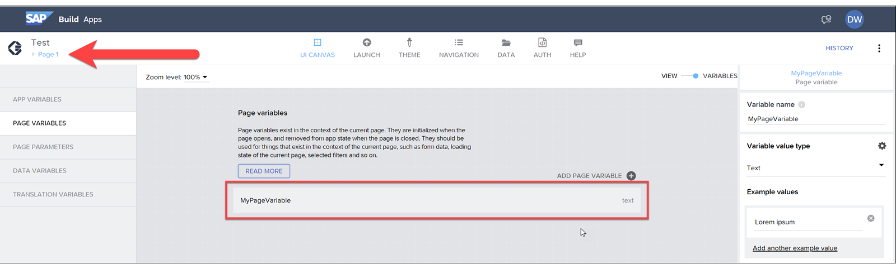
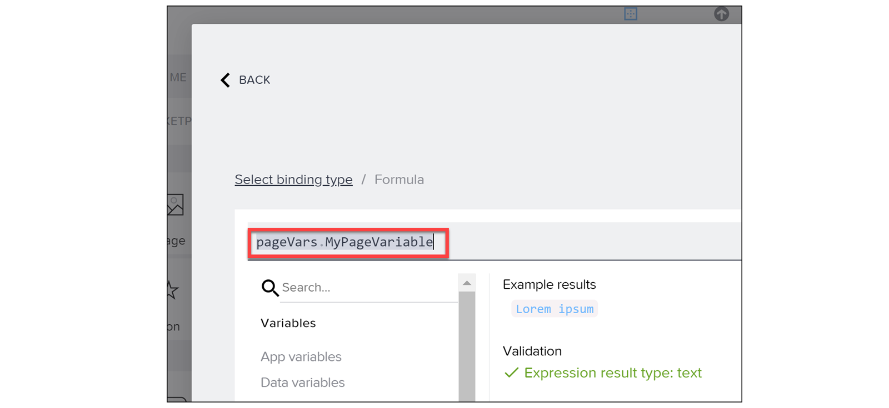
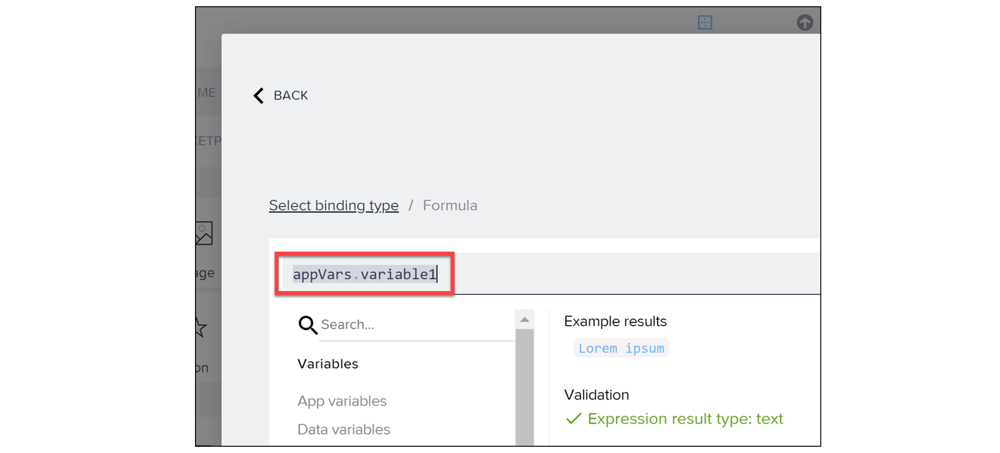

# ♠ 1 [USING APP AND PAGE VARIABLES](https://learning.sap.com/learning-journeys/develop-apps-with-sap-build-apps-using-drag-and-drop-simplicity/using-app-and-page-variables_aba96b58-dda2-4d38-aef0-bb86373e7d12)

> :exclamation: Objectifs
>
> - [ ] Differentiate between app and page variables.
>
> - [ ] Create an app and page variables.

## :closed_book: USES FOR APP AND PAGE VARIABLES

Lorsqu'un utilisateur exécute une application et interagit avec elle, celle-ci génère des données qui n'ont peut-être pas besoin d'être stockées ou modifiées dans un service back-end, mais qui doivent être disponibles pendant l'exécution de l'application.

Voici quelques exemples de données qu'un utilisateur pourrait souhaiter voir apparaître dans l'application :

- Adresse e-mail de l'utilisateur actuel ;

- Paramètres de l'utilisateur actuel, comme la musique de fond ;

- Statut, par exemple, son niveau dans le jeu ;

- Localisation actuelle.

Voici des exemples de données qu'un utilisateur pourrait souhaiter uniquement pour une page spécifique :

- Termes de recherche pour une recherche ;

- Page actuelle lors de la navigation dans les enregistrements de données ;

- Heure actuelle pour une page avec chronomètre ;

- Indicateur de désactivation d'un champ.

## :closed_book: PAGE VARIABLES

Si vous définissez une variable de page sur une page, cette variable ne sera PAS disponible sur une deuxième page, ni dans la zone Variables, ni disponible pour être liée aux composants de l'interface utilisateur.

Cette variable ne sera PAS disponible sur une deuxième page, ni dans la zone Variables, ni disponible pour être liée aux composants de l'interface utilisateur :

Bien que vous puissiez conserver toutes vos variables comme des variables d'application, il est plus facile de maintenir votre application en définissant des variables uniquement là où elles sont nécessaires.

Une fois une variable définie, vous pouvez la lier à une propriété de composant.

Par exemple, nous avons ici une interface de recherche, et le champ de saisie est lié à la variable de page MyPageVariable. Une fois que l'utilisateur saisit un terme de recherche et choisit « Rechercher », vous pouvez définir une logique pour utiliser la valeur de la variable et effectuer une recherche.

## :closed_book: PAGE VARIABLE CREATION

Lisez la vidéo pour apprendre à créer une variable de page et d’application.

[Link Video](https://learning.sap.com/learning-journeys/develop-apps-with-sap-build-apps-using-drag-and-drop-simplicity/using-app-and-page-variables_aba96b58-dda2-4d38-aef0-bb86373e7d12)

## :closed_book: APP VARIABLE CREATION

Scénario d'entreprise : Imaginez une application qui vous permet de demander des congés. Vous devez maintenant fournir un court texte expliquant pourquoi vous en avez besoin.

Lancez la vidéo pour découvrir comment créer une variable de page et d'application.

[Link Video](https://learning.sap.com/learning-journeys/develop-apps-with-sap-build-apps-using-drag-and-drop-simplicity/using-app-and-page-variables_aba96b58-dda2-4d38-aef0-bb86373e7d12)

> Note
>
> Les valeurs d'exemple seront utilisées dans l'interface utilisateur pendant que vous la concevez afin que vous puissiez voir des exemples de données.

> Note
>
> Notez que lors de la création de noms de variables, certains éléments tels que les espaces et la ponctuation ne sont pas autorisés. Ils doivent contenir uniquement des lettres ou des chiffres.

Vous avez maintenant créé une variable App.

## :closed_book: SCOPE OF VARIABLES

Les variables de page existent dans le contexte d'une seule page. Si vous accédez à une autre page pour la concevoir, vous ne verrez pas les variables des autres pages. De plus, la valeur est réinitialisée chaque fois que vous accédez à une page et utilisez la fonction de retour en arrière pour revenir à la page d'origine, car la page entière est supprimée.

Les variables d'application sont disponibles dans les formules utilisant l'espace de noms `pageVars`.

Les variables d'application existent dans le contexte global de l'application. Elles ne sont réinitialisées que lors de la première ouverture ou de la fermeture puis de la réouverture de l'application.

Les variables d'application sont disponibles dans les formules utilisant l'espace de noms `appVars`.

## :closed_book: CREATE APP AND PAGE VARIABLES FOR THE TEAM APP

### BUSINESS SCENARIO

Pour l'utilisation de fonctions ultérieures, les variables de page et d'application seront créées et ajustées dans cette simulation.

### EXERCISE OPTIONS

Pour démarrer l'exercice, sélectionnez « Démarrer l'exercice » dans la figure ci-dessous.

Une fenêtre contextuelle s'ouvre. Vous disposez des options suivantes :

- Démarrer : la simulation démarre. Suivez-la pour apprendre à créer les variables d'application et de page.

- Ouvrir le document PDF : un PDF s'ouvre. En suivant les étapes décrites dans ce document, vous pouvez réaliser les exercices dans votre propre environnement système.

[Link Exercise](https://learnsap.enable-now.cloud.sap/pub/mmcp/index.html?show=project!PR_C0F7BAB4CCD02A80:uebung)
