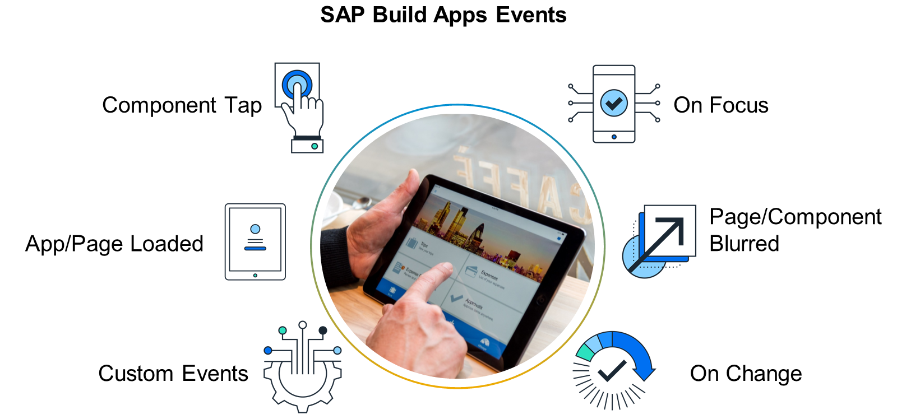

# ♠ 1 [EXPLAING LOGIC FOUNDATIONS](https://learning.sap.com/learning-journeys/develop-apps-with-sap-build-apps-using-drag-and-drop-simplicity/explaining-logic-foundations-_e42988b5-e6c2-4e8f-a267-8923a3fd9466)

> :exclamation: Objectifs
>
> - [ ] Explain Functions.
>
> - [ ] Describe Events.

## :closed_book: FUNCTIONS

Les flux, la logique et les algorithmes sont d'autres fonctionnalités importantes de SAP Build Apps. La logique guide le comportement d'une application lorsqu'un utilisateur interagit avec elle, et les algorithmes exécutent les calculs qui la sous-tendent. Pour mieux comprendre la logique, examinons plus en détail les fonctions. Les fonctions sont présentes dans presque toutes les applications et sont particulièrement utiles pour résoudre des tâches et des problèmes. Lorsqu'un événement se produit, une fonction lance une opération qui traite une ou plusieurs entrées et renvoie une sortie.

La logique repose fondamentalement sur des règles métier définies pour produire un résultat, et leurs exigences doivent être bien comprises lors du processus de planification. Les règles métier sont les modes de fonctionnement spécifiques à votre entreprise et sont étroitement liées aux exigences logicielles.

Prenons l'exemple d'une personne dont la taille et le poids sont saisis, puis dont l'IMC est calculé et renvoyé. L'IMC est ensuite transmis et s'affiche dans une fenêtre d'information. Cela crée des applications SAP Build sans écrire une seule ligne de code et fait la distinction entre les deux types de fonctions différents, qui, comme dans cet exemple, peuvent être utilisés ensemble pour créer une logique d'application complète :

- Fonctions de flux

  L'onglet Logique propose différentes catégories de fonctions de flux. Elles permettent d'effectuer des actions visuellement placées et combinées dans une séquence. Par exemple, les fonctions de flux peuvent stocker et récupérer des données ou activer des composants matériels. Vous pouvez utiliser des nœuds d'entrée et de sortie pour connecter des fonctions de flux logique.

- Fonctions de formule

  Les fonctions de formulaire traitent les données afin de pouvoir, par exemple, filtrer et trier des textes, modifier des valeurs avec des opérateurs et des formules mathématiques, ou encore obtenir des informations des capteurs de l'appareil et les transmettre à la sortie. Pour ce faire, elles utilisent une puissante bibliothèque contenant plus de 500 formules prêtes à l'emploi.

Le potentiel de l'application logique réside notamment dans la combinaison des fonctions de flux et de formulaire. SAP Build Apps peut ainsi utiliser une logique simple ou complexe avec d'innombrables options applicatives. L'utilisation de flux logiques confère aux événements une signification importante. Ils sont nécessaires au déclenchement de la logique. Définir la logique de votre application consiste à appliquer toutes les règles et exigences nécessaires à son bon fonctionnement. C'est l'un des aspects les plus longs et complexes du processus de développement d'une application.

## :closed_book: EVENTS

Lors de l'exécution d'une logique, on pense à l'appui sur un bouton dans le cas d'un déclencheur, notamment au vu des exemples évoqués précédemment. Appuyer sur un bouton ou un autre composant est un exemple d'événement pouvant déclencher l'exécution de diverses fonctions/actions. Cependant, les événements ne se limitent pas au clic d'un utilisateur sur un bouton. Le système peut également les activer de plusieurs manières, avec différents types de scénarios de démarrage.

### EVENTS IN SAP BUILD APPS

| **EVENTS**                                                                                                                                                                                                                                                                                                          |                                                                                                                                                                                                                                                                                 |
| ------------------------------------------------------------------------------------------------------------------------------------------------------------------------------------------------------------------------------------------------------------------------------------------------------------------- | ------------------------------------------------------------------------------------------------------------------------------------------------------------------------------------------------------------------------------------------------------------------------------- |
| App loaded: This event is available when the app has finished loading. For example, a welcome message can be shown to the user, or necessary configurations can be set.                                                                                                                                             | Page mounted: This event is available when the app has finished loading and rendering. This can also be used to trigger a logic to render dynamically customized content and initialize components. This is shown in the exercise: Generate the Data of a Colleague With OData. |
| Component onFocus/Component onChange: OnFocus occurs, for example, when a certain component is selected or activated, which expects an action or input, as with the selection of an input field. The onChange event is triggered when, for example, the value in the input field changes or a checkbox is selected. | Page focused: The event occurs when a page is focused, for example, opened using the navigation or logic components or navigated back to as the active page.                                                                                                                    |
| Component onBlur: Contrary to the focus, this triggers an action when it is dropped again, as with the active change to another component.                                                                                                                                                                          | Page blurred: Contrary to the focus, this triggers an action when it is dropped again, as with the active change to another page.                                                                                                                                               |
| Component tap: This event is triggered by choosing a component and is possible for all components.                                                                                                                                                                                                                  | Page nav bar item clicked: This is triggered by choosing the navigation header bar with various buttons and icons for navigation.                                                                                                                                               |
