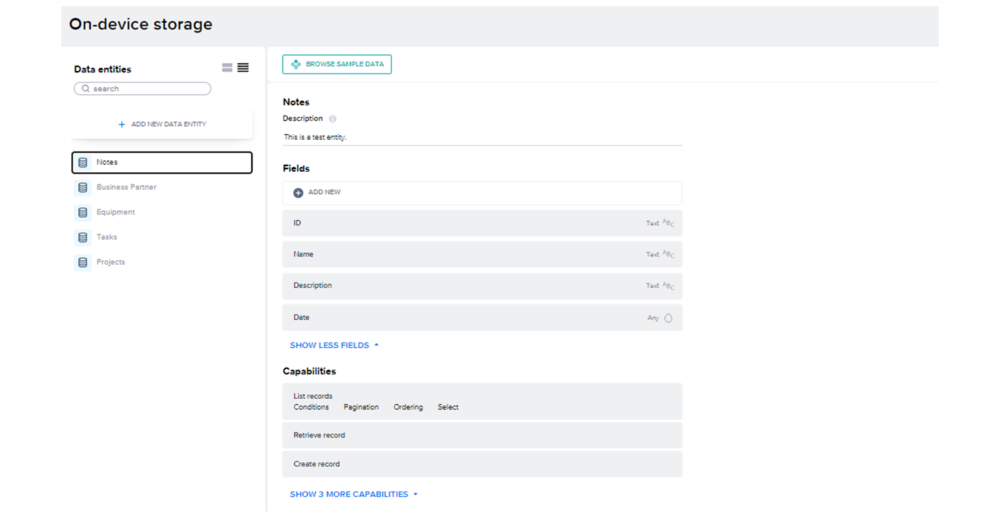
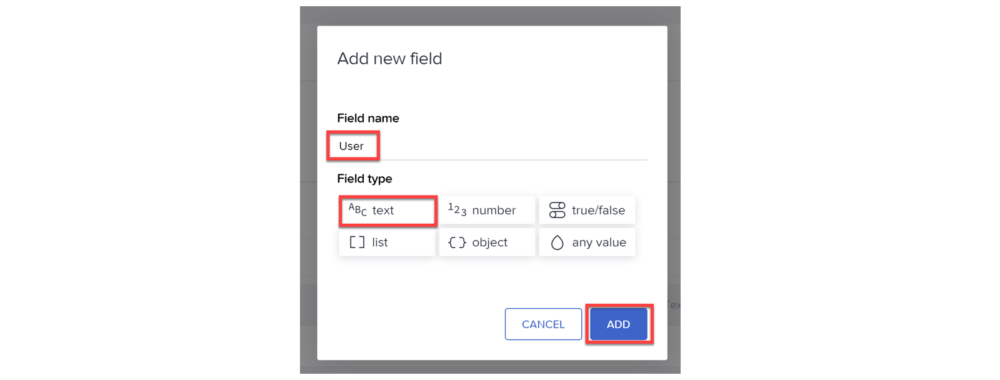

# ♠ 1 [USING ON-DEVICE RESOURCES](https://learning.sap.com/learning-journeys/develop-apps-with-sap-build-apps-using-drag-and-drop-simplicity/using-on-device-resources_ca2da55f-903e-468d-8bdd-0cdac36b159e)

> :exclamation: Objectifs
>
> - [ ] Describe the purpose of on-device storage.
>
> - [ ] Create an on-device storage entity and access it from an app.

## :closed_book: PURPOSE OF ON-DEVICE STORAGE

Le stockage sur l'appareil vous permet de stocker des informations spécifiques à l'utilisateur actuel, sans avoir à les partager avec d'autres utilisateurs. Ces informations sont accessibles hors ligne, sans nécessiter l'appel d'un système back-end via Internet.

Voici quelques exemples de données pouvant être stockées sur l'appareil :

- Paramètres/préférences personnels de l'application ;

- Données temporaires non prêtes à être envoyées à une source de données back-end ;

- Données permettant l'utilisation hors ligne de l'application ;

- Données relatives uniquement à l'utilisateur actuel.

Les données sont stockées soit sur l'appareil (pour les applications mobiles), soit dans le navigateur (pour les applications web). Cependant, il est important de garder à l'esprit que les données ne sont accessibles qu'à l'utilisateur actuel, car elles sont stockées uniquement sur son appareil.

## :closed_book: CREATE ON-DEVICE STORAGE

### BUSINESS SCENARIO

Créez une table pour stocker une liste de préférences pour l'utilisateur actuel.

### STEP

1. Créez une table pour stocker la liste des préférences de l'utilisateur actuel.

2. Dans un nouveau projet SAP Build Apps, ouvrez l'onglet Données.

3. Accédez à « Stockage sur l'appareil » et sélectionnez « Créer une entité de données ».

4. Dans le champ Nom, saisissez « Préférences » (le nom de l'entité de données) et sélectionnez « Ajouter ».

Un écran permettant de définir les champs de l'entité s'ouvre.

5. Ajoutez les champs suivants :

- Utilisateur

- Couleur

- Taille de police

6. Pour chaque champ, sélectionnez « Ajouter ».

7. Saisissez le nom, définissez le type de données du champ sur Texte et choisissez Ajouter.

8. Choisissez Enregistrer (en haut à droite).

## :closed_book: CREATE A TRACKER WITH ON-DEVICE STORAGE

### BUSINESS SCENARIO

Dans cette simulation, le stockage sur l'appareil est utilisé pour activer la fonction de suivi de santé de l'écran d'accueil. Ici, les valeurs des icônes sont transférées et stockées en cliquant sur le bouton et s'affichent par date sur une page séparée.

### EXERCISE OPTIONS

Pour démarrer l'exercice, sélectionnez « Démarrer l'exercice » dans la figure ci-dessous.

Une fenêtre contextuelle s'ouvre. Vous disposez des options suivantes :

- Démarrer : la simulation démarre. Suivez-la pour apprendre à créer les variables d'application et de page.

- Ouvrir le document PDF : un PDF s'ouvre. En suivant les étapes décrites dans ce document, vous pouvez réaliser les exercices dans votre propre environnement système.

[Link Exercise](https://learnsap.enable-now.cloud.sap/pub/mmcp/index.html?show=project!PR_6F8501283E8105A4:uebung)
