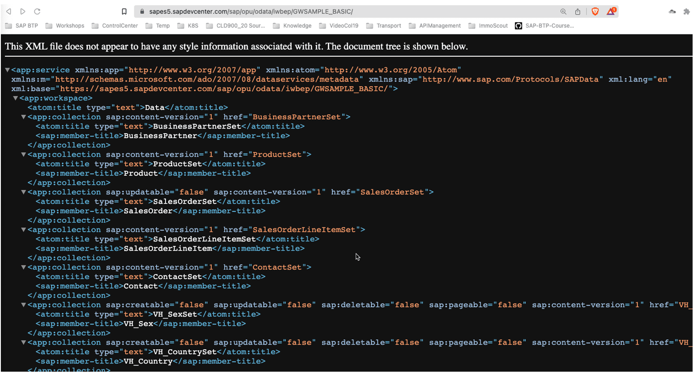
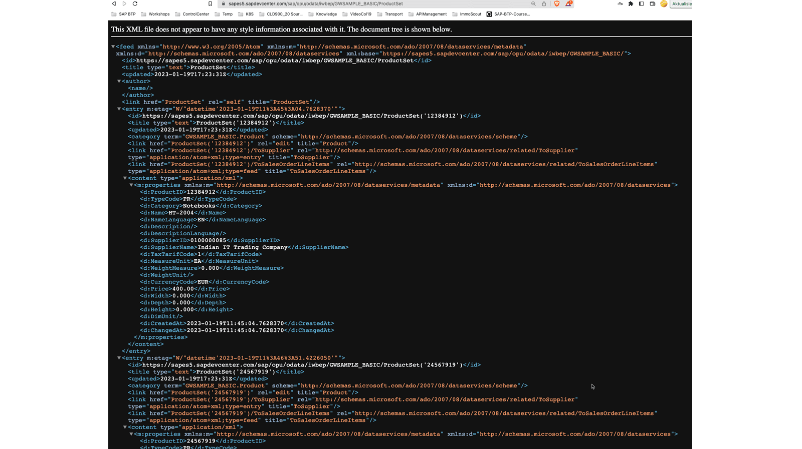
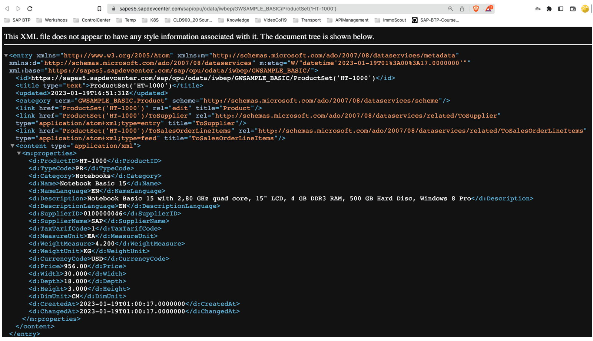
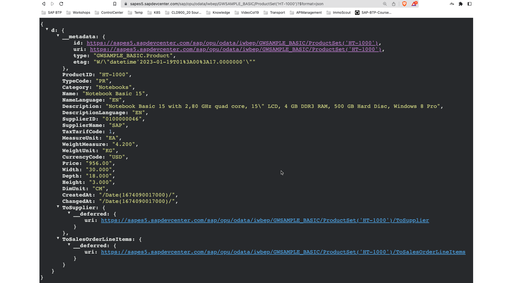
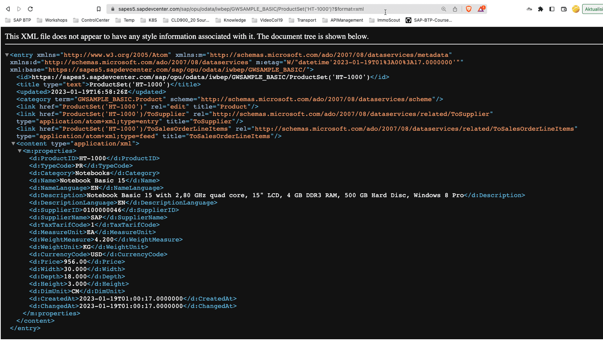
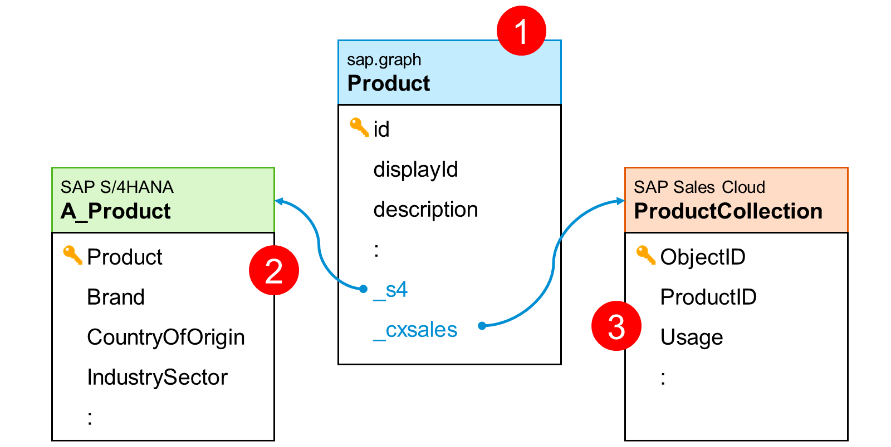

# ♠ 6 [USING COMMON APIS](https://learning.sap.com/learning-journeys/developing-with-sap-integration-suite/introducing-rest_fb9a2610-c990-4e0c-9140-0802b642019e)

> :exclamation: Objectifs
>
> - [ ] Be able to use API used in SAP

## :closed_book: INTRODUCING TO REST

### WHAT IS REST?

> #### :bookmark: [REST](../☼%20UNIT%200%20-%20Lexicon/♠%20API.md)
>
> Généralement, **REST** décrit une interface machine à machine. Dans le développement Web, REST permet au contenu d'être **rendered** (restitué) lorsqu'il est **requested** (demandé), souvent appelé **Dynamic Content** (contenu dynamique). **RESTful Dynamic Content** utilise le **server-side rendering** (rendu côté serveur) pour générer un website et envoyer le contenu au **web browser** (navigateur Web) demandeur, qui interprète le code du serveur et **renders** (affiche) la page dans le web browser de l'utilisateur.

### ARCHITECTURAL PROPERTIES

#### :small_red_triangle_down: **The constraints of the REST architectural style affect the following architectural properties** :

- _Performance in component interactions_, which can be the dominant factor in user-perceived performance and network efficiency

- _Scalability_ allowing the support of large numbers of components and interactions among components

- _Simplicity_ of a uniform interface

- _Modifiability of components_ to meet changing needs (even while the application is running)

- _Visibility of communication_ between components by service agents

- _Portability of components_ by moving program code with the data

- _Reliability in the resistance to failure_ at the system level in the presence of failures within components, connectors, or data

### ARCHITECTURAL CONSTRAINTS

#### :small_red_triangle_down: The REST architectural style defines the following six guiding constraints :

- _Client–server architecture_

- _Stateless_

- _Cache-ability_

- _Layered system_

- _Code on demand_ (optional)

- _Uniform interface_

### REALIZATION AS A WEB API

#### :small_red_triangle_down: Web service APIs that adhere to the REST architectural constraints and properties are called RESTful APIs. HTTP-based RESTful APIs are defined with the following aspects :

- _Une URL de base_, telle que http://api.example.com/

- _Standard HTTP methods_ (par exemple : GET, POST, PUT et DELETE)

- _Media type that defines state transition data elements_ (for example, Atom, microformats, application/vnd.collection+json). The current representation tells the client how to compose requests for transitions to all the next available application states

### SOURCES

De nombreuses informations peuvent être trouvées sur Internet sous forme de textes, vidéos, podcasts, etc. sur REST. Il existe également divers livres sur ce sujet sous différents angles :

- [Transfert d'état représentatif](https://en.wikipedia.org/wiki/Representational_state_transfer)

- [Services REST dans ABAP](https://developers4sap.blog/rest-services-in-abap/)

### SUMMARY

> Une **web API RESTful** est créée avec le **REST software architecture style** (style d'architecture logicielle REST). L'interface doit correspondre à la fois aux propriétés architecturales et aux contraintes. Il en résulte une implémentation qui, en plus d'un **URI de base**, utilise des **standard HTTP methods** et prend en charge de **nombreux types de médias**. Cela place les **web API RESTful** au cœur d’une [API First Approach](../☼%20UNIT%200%20-%20Lexicon/♠%20API%20First%20Approach.md) (architecture).

## :closed_book: INTRODUCING TO ODATA

### WHAT IS ODATA?

> #### :bookmark: [OData]()
>
> En informatique, **Open Data Protocol** (OData) est un **open protocol** qui permet la **création** et la **consommation** d'**API RESTful** **interrogeables** et **interopérables** de manière simple et standard. OData s'appuie sur **HTTP**, **AtomPub** et **JSON** en utilisant des **URI** pour adresser et accéder aux **data feed resources** (ressources de flux de données). Il permet d'accéder aux informations à partir de diverses sources, y compris (mais sans s'y limiter) des bases de données relationnelles et des systèmes de fichiers.

### ARCHITECTURAL CONSTRAINTS

#### :small_red_triangle_down: **The following constraints must be fulfilled** :

- _Resource identification_

- _Fixed documents_

- _The service document_

- _The metadata document_

- _Dynamic resources_

- _Resource operation_

- _Querying_

- _Resource representation_

### EXPLENATIONS ABOUT THE CONSTRAINTS

#### :small_red_triangle_down: **Resource identification** :

**OData** utilise des **URL** pour identifier les **ressources**. Nous utilisons l'URL de base suivante avec :

    https://sapes5.sapdevcenter.com/sap/opu/odata/iwbep/GWSAMPLE_BASIC/

#### :small_red_triangle_down: **Fixed documents** :

- Les ressources fixes suivantes peuvent être trouvées :

  - _The service document_

    Le document de service répertorie les **entity sets** (collections), les **fonctions** et les **singletons**[^1] qui peuvent être récupérés. Les clients peuvent utiliser le document de service pour naviguer dans le modèle de manière hypermédia (hypermedia-driven fashion). Le document de service est accessible directement avec l'URL de base : https://sapes5.sapdevcenter.com/sap/opu/odata/iwbep/GWSAMPLE_BASIC/. Vous trouverez ci-dessous un exemple tiré d’un exercice ultérieur.

    

  - _The metadata document_

    Le document de metadata décrit les **types**, **sets**, **fonctions** et **actions** compris par l'**OData service**. Les clients peuvent utiliser le document de metadata pour comprendre comment interroger et interagir avec les **entities** du service.

    Le document de metadata est disponible à l'adresse : https://sapes5.sapdevcenter.com/sap/opu/odata/iwbep/GWSAMPLE_BASIC/$metadata.

    

#### :small_red_triangle_down: **Dynamic resources** :

Les URL des ressources dynamiques peuvent être **computed** (calculées) à partir des **hypermedia information** (informations hypermédia) contenues dans les **service and metadata documents**. Le **data feed** (flux de données) de la **ProductSet collection** contient également des liens vers d'autres **entities**. L'URL est la suivante : https://sapes5.sapdevcenter.com/sap/opu/odata/iwbep/GWSAMPLE_BASIC/ProductSet

#### :small_red_triangle_down: **Resource operation** :

**OData** utilise les verbes **HTTP** pour indiquer les opérations sur les ressources. Il s’agit d’un aspect **REST**, comme nous l’avons déjà vu.

#### :small_red_triangle_down: **Querying** :

Les **URL** demandées à partir d'un **OData endpoint**[^2] peuvent inclure des **query options** (options de requête). Le protocole OData spécifie diverses **system query options** que les **endpoints**[^2] peuvent accepter. Elles peuvent être utilisées pour **filter**, **order**, **map** ou **paginate** des données. Dans ce qui suit, seul le produit portant le numéro de produit HT-1000 est récupéré. L'URL est : https://sapes5.sapdevcenter.com/sap/opu/odata/iwbep/GWSAMPLE_BASIC/ProductSet('HT-1000')

#### :small_red_triangle_down: **Resource representation** :

**OData** utilise différents **formats** pour représenter les **data** et le **data model**. Dans la **version 4.0** du OData protocol, le **format JSON** est la norme pour représenter les data, le **format Atom** étant encore au stade de spécification du comité. Pour représenter le data model, le **Common Schema Definition Language** (**CSDL**) est utilisé, qui définit une représentation **XML** de l'**entity data model** exposé par les **OData services**.

- _JSON_

  L'URL est : https://sapes5.sapdevcenter.com/sap/opu/odata/iwbep/GWSAMPLE_BASIC/ProductSet('HT-1000')?$format=json

  

- _XML_

  L'URL est : https://sapes5.sapdevcenter.com/sap/opu/odata/iwbep/GWSAMPLE_BASIC/ProductSet('HT-1000')?$format=xml

  

### TUTORIAL: LEARN ABOUT ODATA FUNDAMENTALS

#### :small_red_triangle_down: There is a fantastic tutorial [Learn about OData Fundamentals](https://developers.sap.com/tutorials/odata-01-intro-origins.html) with the following topics :

- Where _OData_ came from and why it’s designed the way that it is.

- What the standard _OData operations_ are and how they relate to HTTP.

- What the _public Northwind OData service_ has to offer.

- What _OData service documents_ and _metadata documents_ describe.

- The _basics of OData entity types_, _sets_, and _relationships_.

Il est recommandé de suivre ce didacticiel pour vous familiariser pleinement avec les OData chez SAP.

### SUMMARY

> Le **protocole OData** décrit une **RESTful Web API**. Outre les principes **REST**, il offre également d’autres avantages bénéfiques dans le milieu professionnel. L'**interface** elle-même **fournit** deux meta documents : un **service document** et un **meta document**. Ceci **décrit** de manière exhaustive **l’interface**. La fonction la plus efficace est la possibilité de **filtrer**, **rechercher** et exécuter des fonctions telles que $**count** via des **query parameters** sur l'interface. La représentation s'effectue soit en **XML**, soit en **JSON**.

## :closed_book: EXPLORE THE APIS FROM THE SAP GATEWAY DEMO SYSTEM

- [Exercices](https://learning.sap.com/learning-journeys/developing-with-sap-integration-suite/introducing-rest_fb9a2610-c990-4e0c-9140-0802b642019e?userlogin=true)

## :closed_book: SAP GRAPH

### WHAT IS SAP GRAPH?

> #### :bookmark: [SAP Graph]()
>
> SAP Graph est une **unified API** pour SAP, utilisant des **modern open standards** (normes ouvertes modernes) comme **OData v4**. SAP Graph est une connexion à vos données d'entreprise. SAP Graph introduit une nouvelle API unifiée pour accéder à toutes les données d'entreprise sous la forme d'un **single, semantically connected, Business Data Graph**.

En résumé :

- SAP Graph is based on _OData v4_

- Any _SAP backend_ can be used as a _data supplier_

- There are already _fully implemented APIs_ at: https://api.sap.com/graph.

- You can _create your own APIs_ with different procedures

### SAP GRAPH IS A DATA GRAPH

Data Graphs supporte les **Queries** qui explore les **données** et les **relations**.

#### :small_red_triangle_down: **A data graph represents entities (data objects) as nodes of a graph** :

- Les _entities_ sont regroupées dans des _namespaces_.

- Les _fields_ d'une _entity_ sont appelés _attributes_.

#### :small_red_triangle_down: Edges represent semantic relations :

- Entre un _root-node_ (nœud racine) et ses _sub-nodes_ (sous-nœuds) : une _composition_.

- Entre _independent nodes_ : une _association_.

### SAMPLE DATA GRAPH

Une **API SAP Graph** avec le nom product, utilisant le **namespaces sap.graph** est liée aux **product entities** de **SAP S/4HANA\*** (n° 2) et de **SAP Sales Cloud** (n° 3). La nouvelle [APIs](../☼%20UNIT%200%20-%20Lexicon/♠%20API.md) offre ainsi une vue étendue des **product data** stockées dans différents systèmes SAP.

### DEVELOPPING SAP GRAPH APIS

Il existe deux options pour créer une **API SAP Graph**. Vous pouvez créer des [APIs](../☼%20UNIT%200%20-%20Lexicon/♠%20API.md) directement via une implementation avec le module **SAP Graph** dans **Node.js**. Sous **Source**, vous trouverez 26 didacticiels vidéo qui montrent en détail toutes les étapes de développement. Une deuxième approche issue du domaine du **low code** est proposée via **SAP API Management**.

### RESOURCES

- Blogs: [SAP Graph Multi-Part Tutorial: Information Map](https://blogs.sap.com/2021/06/08/sap-graph-multi-part-tutorial-information-map/)

- SAP Graph Community: [Graph](https://community.sap.com/topics/graph)

### SUMMARY

> **SAP Graph** est une [API](../☼%20UNIT%200%20-%20Lexicon/♠%20API.md) basée sur **OData v4** qui connecte des **entities** de différentes **sources** dans une seule [API](../☼%20UNIT%200%20-%20Lexicon/♠%20API.md). Par exemple, les **product data** de divers systèmes SAP, tels que **SAP S/4HANA**, **Sales Cloud** et autres, sont proposées dans une seule [API](../☼%20UNIT%200%20-%20Lexicon/♠%20API.md)s. Il existe déjà des **API SAP Graph standard** pour diverses **entities**. Les **API SAP Graph** peuvent être **programmées** avec **Node.js** ainsi que créées via **SAP API Management** en mode low code.

---

[^1]: Un singleton est un modèle de conception (design pattern) utilisé en programmation pour garantir qu’une classe n’a qu’une seule instance dans tout le programme. Cela signifie qu’une fois une instance créée, toutes les références à cette classe utiliseront la même instance, au lieu d’en créer une nouvelle.
[^2]: Un endpoint (ou point de terminaison en français) est une URL spécifique d'une API (Application Programming Interface) qui permet à un client (comme une application ou un navigateur) de communiquer avec un serveur pour effectuer des actions ou récupérer des données. Par exemple : GET https://api.example.com/users (Endpoint pour récupérer la liste des utilisateurs), POST https://api.example.com/users (Endpoint pour créer un nouvel utilisateur).
